# Observability 整体架构

**本文回答**：qs-server 的可观测性入口如何覆盖 HTTP/gRPC、Redis、Resilience、Event、Security、Runtime 和 Integrations；metrics、healthz、pprof、logging、audit、governance endpoint 各自负责什么；为什么 observability 不应变成一个“包罗万象的运维动作层”。

---

## 30 秒结论

| 能力 | 当前职责 |
| ---- | -------- |
| Metrics | 用 Prometheus 指标表达 cache、resilience、runtime 等系统状态和 outcome |
| Healthz | GenericAPIServer `/healthz` 返回基础存活状态，并在 Run 时自 ping 检查 router 已启动 |
| Pprof | GenericAPIServer 在 enableProfiling 时注册 `/debug/pprof` |
| Logging | 用 component-base log/logger 记录结构化上下文、启动、外部调用、错误、降级 |
| Audit | 用于安全/管理/服务间访问等高价值操作的追踪，不等同普通业务日志 |
| GovernanceEndpoint | 暴露只读 runtime/status/hotset/backlog 等状态；manual action 必须有边界 |
| Module-local Observability | Redis/Event/Resilience/Security 等模块各自保留细节排障文档 |

一句话概括：

> **Observability 是“状态可见 + 行为可解释 + 排障有入口”，不是“所有治理动作都可以暴露成 endpoint”。**

---

## 1. 总体架构图

```mermaid
flowchart TB
    subgraph Entry["Runtime Entry"]
        http["HTTP GenericAPIServer"]
        grpc["gRPC Server"]
        worker["Worker"]
        collection["Collection Server"]
    end

    subgraph Signals["Signals"]
        metrics["Metrics"]
        health["Healthz / Readyz"]
        pprof["Pprof"]
        logs["Structured Logs"]
        audit["Audit Logs"]
        gov["Governance Endpoint"]
    end

    subgraph Planes["Infrastructure Planes"]
        redis["Redis Plane"]
        resilience["Resilience Plane"]
        event["Event System"]
        security["Security Plane"]
        runtime["Runtime Composition"]
        integrations["External Integrations"]
    end

    http --> metrics
    http --> health
    http --> pprof
    http --> logs
    grpc --> logs
    grpc --> audit
    worker --> metrics
    worker --> logs
    collection --> metrics
    collection --> logs

    redis --> metrics
    redis --> gov
    resilience --> metrics
    resilience --> gov
    event --> metrics
    event --> logs
    security --> audit
    runtime --> logs
    integrations --> logs
```



---

## 2. Observability 分层

| 层 | 负责 | 示例 |
| -- | ---- | ---- |
| Runtime endpoint | 暴露 HTTP 观测入口 | `/healthz`、`/metrics`、`/debug/pprof` |
| Metrics | 趋势与告警 | cache hit/miss、resilience outcome、backpressure in-flight |
| Status / Governance | 当前状态快照 | Redis family status、resilience snapshot、hotset |
| Logs | 请求/任务/错误上下文 | component/action/error/result |
| Audit | 安全与管理行为追踪 | service access、admin operation、capability-sensitive action |
| Runbook | 从现象到入口 | 429、Redis degraded、permission denied、CPU high |

---

## 3. GenericAPIServer 通用入口

GenericAPIServer 安装：

| 配置 | 行为 |
| ---- | ---- |
| Healthz | 注册 `/healthz` |
| EnableMetrics | 使用 gin-prometheus 挂载 metrics |
| EnableProfiling | 注册 `/debug/pprof` |
| Version | 注册 `/version` |
| Middlewares | RequestID、Context、自定义 middleware |

默认 Config 中：

- Healthz=true。
- EnableProfiling=true。
- EnableMetrics=true。
- Mode=gin.ReleaseMode。

---

## 4. Metrics 当前主要来源

### 4.1 Redis / Cache / Lock / Warmup

`cachegovernance/observability` 定义：

- `qs_cache_get_total`。
- `qs_cache_write_total`。
- `qs_cache_operation_duration_seconds`。
- `qs_cache_payload_bytes`。
- `qs_cache_family_available`。
- `qs_cache_family_degraded_total`。
- `qs_runtime_component_ready`。
- `qs_cache_warmup_duration_seconds`。
- `qs_cache_hotset_size`。
- `qs_query_cache_version_total`。
- `qs_cache_lock_acquire_total`。
- `qs_cache_lock_release_total`。
- `qs_cache_lock_degraded_total`。

### 4.2 Resilience

`resilienceplane` 定义：

- `qs_resilience_decision_total`。
- `qs_resilience_queue_depth`。
- `qs_resilience_queue_status_total`。
- `qs_resilience_backpressure_inflight`。
- `qs_resilience_backpressure_wait_duration_seconds`。

### 4.3 HTTP

gin-prometheus 会挂载 Gin HTTP 指标。它属于框架级入口，不替代业务维度指标。

---

## 5. Healthz 与 Readiness

当前明确实现的通用 health endpoint 是：

```text
GET /healthz
```

返回：

```json
{"status":"ok"}
```

并且 GenericAPIServer Run 在启动后会自 ping `/healthz`，10 秒内未成功则返回错误。

注意：

- `/healthz` 当前偏 liveness/router-ready。
- 各模块的 Redis family status、resilience ready 等属于 governance/status，而不等同 `/healthz`。
- 是否要新增 `/readyz` 或 dependency readiness，需要独立设计。

---

## 6. Pprof

当 EnableProfiling=true：

```text
/debug/pprof
/debug/pprof/profile
/debug/pprof/heap
/debug/pprof/goroutine
/debug/pprof/block
/debug/pprof/mutex
```

用于排查：

- CPU high。
- goroutine leak。
- memory growth。
- lock contention。
- blocking operations。

生产使用必须受控，避免把 pprof 暴露到公网。

---

## 7. Logging

日志应包含：

- component。
- action。
- request_id。
- resource。
- result/outcome。
- error。
- duration。
- count/size 等低风险字段。

不要记录：

- token。
- appSecret。
- Authorization header。
- access key secret。
- raw JWT。
- password。
- openid 大量列表。
- 用户敏感量表答案。

---

## 8. Audit

Audit 用于回答：

```text
谁在什么时候，对哪个高价值资源，做了什么操作，结果如何？
```

典型场景：

- 管理端权限变更。
- service-to-service gRPC 访问。
- capability-sensitive operation。
- manual warmup / repair complete。
- ACL 拒绝/允许。
- 安全配置变更。

Audit 不替代普通业务日志，也不应该记录完整敏感 payload。

---

## 9. Governance Endpoint

Governance endpoint 应优先只读：

- runtime snapshot。
- Redis family status。
- cache warmup status。
- hotset top。
- resilience status。
- event backlog summary。
- health/degraded reason。

有 action 的治理端点必须受控：

- manual warmup。
- repair complete。
- retry/replay。
- clear/repair/release。

这些 action 不能混进普通 status endpoint。

---

## 10. 设计原则

1. 低基数指标，详细上下文进日志。
2. Healthz 轻量，不做重依赖检查。
3. Pprof 只用于受控排障。
4. Audit 面向高价值操作。
5. Governance endpoint 默认只读。
6. 各模块保留细节观测文档，observability 只收口统一规范。
7. 新观测能力必须补测试和文档。

---

## 11. 常见误区

### 11.1 “有 /healthz 就代表系统完全可用”

不一定。当前 `/healthz` 只说明 HTTP router 可响应。Redis/DB/IAM degraded 要看 governance/status。

### 11.2 “所有字段都可以做 metrics label”

错误。业务 ID、高基数字段、敏感字段不能进入 label。

### 11.3 “Pprof 可以长期公网打开”

不应该。pprof 可能暴露运行时敏感信息和性能成本。

### 11.4 “Audit 就是普通日志”

不是。Audit 面向可追责操作，应更稳定、更受控、更少敏感 payload。

### 11.5 “Governance endpoint 可以顺手做修复”

不应默认如此。只读和 action 必须分开。

---

## 12. Verify

```bash
go test ./internal/pkg/server
go test ./internal/pkg/cachegovernance/observability
go test ./internal/pkg/resilienceplane
```
