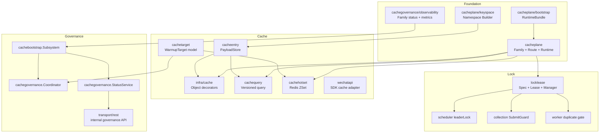
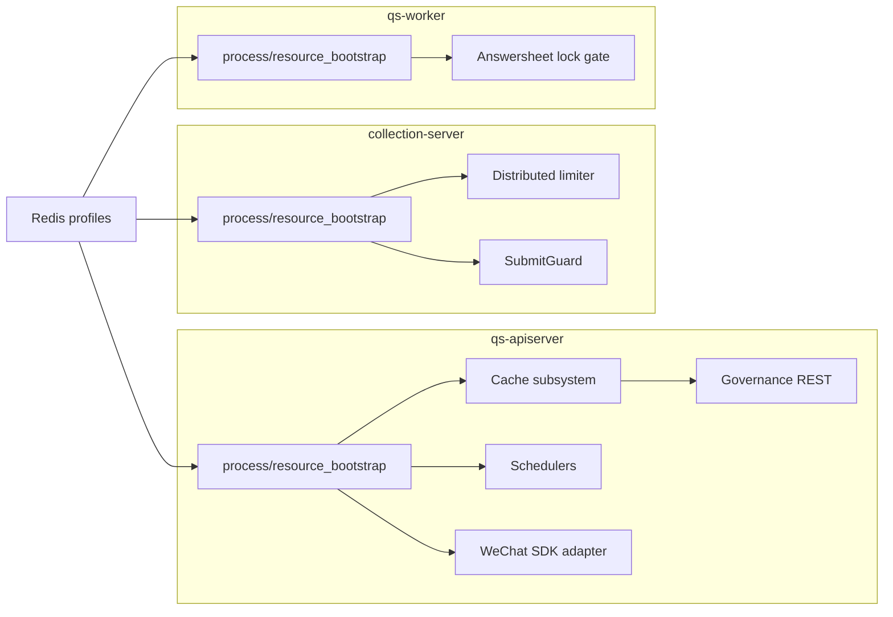
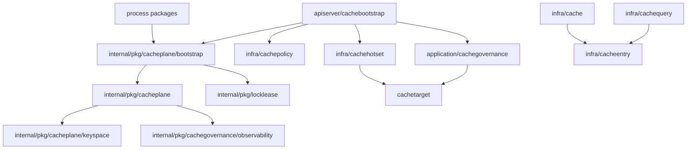

# Redis 整体架构

**本文回答**：`qs-server` 为什么把 Redis 分成 Foundation、Cache、Lock、Governance 四层，三进程分别使用哪些能力，当前包边界和设计模式是什么。

## 30 秒结论

| 层 | 核心职责 | 当前代码 |
| -- | -------- | -------- |
| Foundation | family、profile、namespace、runtime bundle | [cacheplane](../../../internal/pkg/cacheplane)、[cacheplane/bootstrap](../../../internal/pkg/cacheplane/bootstrap)、[cacheplane/keyspace](../../../internal/pkg/cacheplane/keyspace) |
| Cache | apiserver 读侧缓存、payload、query、hotset、SDK adapter | [cachebootstrap](../../../internal/apiserver/cachebootstrap)、[infra/cache*](../../../internal/apiserver/infra) |
| Lock | 三进程共享 Redis lease primitive | [locklease](../../../internal/pkg/locklease) |
| Governance | family 状态、manual warmup、hotset、repair complete | [cachegovernance](../../../internal/apiserver/application/cachegovernance)、[cachegovernance/observability](../../../internal/pkg/cachegovernance/observability) |

## 四层架构图

## 三进程 Redis 角色图

| 进程 | 使用 family | 不承担 |
| ---- | ----------- | ------ |
| `qs-apiserver` | `static_meta/object_view/query_result/meta_hotset/sdk_token/lock_lease` | 不把 Redis 当主数据源 |
| `collection-server` | `ops_runtime/lock_lease` | 不做领域读缓存 |
| `qs-worker` | `lock_lease` | 不做 object/query cache，不做 Redis 统计增量写入 |

## 包依赖图

## 设计模式视角

| 模式 | 当前落点 | 解决的问题 |
| ---- | -------- | ---------- |
| Facade / Composition Root | `cachebootstrap.Subsystem` | 把 runtime、policy、hotset、lock、governance 装配收口 |
| Adapter | `cacheentry.PayloadStore`、SDK cache adapter | 隔离 Redis entry 细节或第三方 SDK 接口 |
| Decorator | object repository cache | 不改 repository 接口增加缓存能力 |
| Template Method / Function Object | `ReadThroughRunner` | 固化 hit/miss/load/writeback 流程 |
| Versioned Key | `cachequery` | query/list 通过 bump token 失效 |
| Lease | `locklease` | 短期排他、选主、重复抑制 |

## Verify

- family 定义以 [cacheplane/catalog.go](../../../internal/pkg/cacheplane/catalog.go) 为准。
- 三进程 runtime 装配以各自 `process/resource_bootstrap.go` 为准。
- cache 子系统以 [cachebootstrap/subsystem.go](../../../internal/apiserver/cachebootstrap/subsystem.go) 为准。
- lock 语义以 [locklease/lease.go](../../../internal/pkg/locklease/lease.go) 和 [locklease/redisadapter/doc.go](../../../internal/pkg/locklease/redisadapter/doc.go) 为准。
