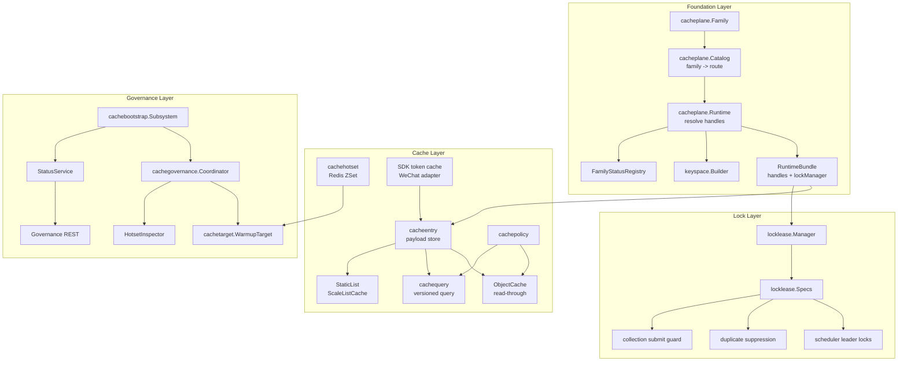
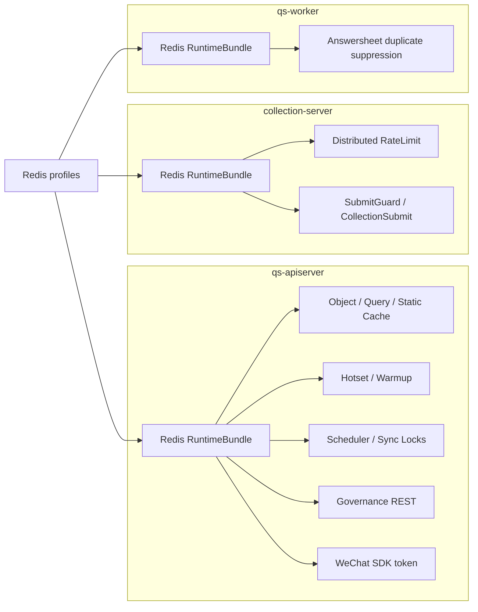
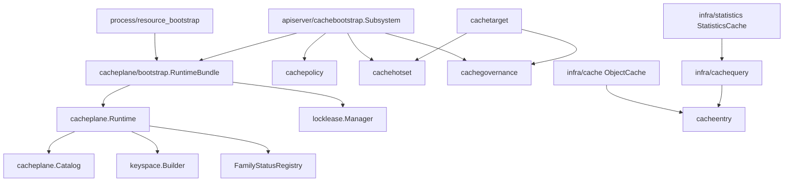

# Redis 整体架构

**本文回答**：qs-server 为什么把 Redis 能力拆成 Foundation、Cache、Lock、Governance 四层；`cacheplane` family/profile/namespace 如何统一三进程 Redis runtime；apiserver、collection-server、worker 分别使用哪些 Redis 能力；cache、query cache、hotset、locklease、governance 和观测之间如何协作。

---

## 30 秒结论

| 层 | 负责 | 典型代码 |
| -- | ---- | -------- |
| Foundation | family、profile、namespace、runtime handle、fallback/degraded、status registry | `cacheplane`、`cacheplane/bootstrap`、`keyspace` |
| Cache | object cache、query cache、static list、hotset、SDK token cache、payload store、cache policy | `cachebootstrap`、`infra/cache*`、`cachetarget` |
| Lock | Redis lease lock、scheduler leader、幂等、重复抑制、串行化任务 | `locklease`、`locklease/redisadapter` |
| Governance | family status、hotset inspector、startup/sync/repair/manual warmup、治理状态接口 | `cachegovernance`、`cachegovernance/observability` |

| 维度 | 结论 |
| ---- | ---- |
| Redis 定位 | Redis 是 qs-server 的**非结构化运行时能力底座**，承接 cache、query result、hotset、SDK token、lock lease、governance，不承接业务主事实 |
| Family 模型 | 当前定义 9 个 family：default、static_meta、object_view、query_result、meta_hotset、business_rank、sdk_token、lock_lease、ops_runtime |
| 三进程角色 | apiserver 使用 cache/query/hotset/lock/governance；collection-server 使用 rate limit/submit guard/lock；worker 使用 locklease duplicate suppression |
| Fallback | family 可路由命名 Redis profile，也可配置 fallback default；不可用时进入 degraded |
| Keyspace | family 级 namespace builder 统一生成 key，避免手写裸 key |
| Lock specs | 内置 answersheet_processing、plan_scheduler_leader、statistics_sync_leader、statistics_sync、behavior_pending_reconcile、collection_submit |
| Governance 边界 | governance 可做 warmup/status/hotset，不修改业务主状态 |
| 关键原则 | Redis cache/lock 可以提升性能和并发稳定性，但不能替代 MySQL/Mongo/ReadModel 的事实源 |

一句话概括：

> **Redis 在 qs-server 中不是“一个工具库”，而是被建模成可路由、可观测、可降级、可治理的运行时 plane。**

---

## 1. 为什么 Redis 需要分层建模

qs-server 不是简单地“用 Redis 存几个 key”。它使用 Redis 承接多类语义完全不同的能力：

```text
静态元数据缓存
领域对象读缓存
查询结果缓存
热点目标 hotset
微信 SDK token cache
分布式锁
scheduler leader election
答卷提交幂等
worker duplicate suppression
cache warmup governance
family status
```

如果把这些都混在一个 Redis client 里，会出现：

| 问题 | 后果 |
| ---- | ---- |
| 所有 key 混一个 namespace | 冲突、排障困难 |
| cache 和 lock 共用同一语义 | TTL、可用性和降级策略混乱 |
| 无 family 状态 | 不知道哪个 Redis 能力 degraded |
| 无 warmup target | 只能手工刷新缓存 |
| 无 hotset | 不知道哪些查询/对象值得预热 |
| 无 profile 路由 | 无法把 lock/cache/query 分配到不同 Redis profile |
| 无治理边界 | cache warmup、repair、manual action 无法审计和控制 |

因此项目抽象出了 Redis 四层架构。

---

## 2. 四层架构图



---

## 3. Foundation Layer

Foundation 层负责 Redis runtime 的统一建模。

### 3.1 Family

`cacheplane.Family` 表示逻辑 Redis workload。

当前 family：

| Family | 语义 |
| ------ | ---- |
| `default` | 默认 Redis route |
| `static_meta` | 静态元数据缓存 |
| `object_view` | 领域对象视图缓存 |
| `query_result` | 查询结果缓存 |
| `meta_hotset` | hotset / version token / 元信息 |
| `business_rank` | 业务排行类能力预留 |
| `sdk_token` | 第三方 SDK token |
| `lock_lease` | 分布式锁 |
| `ops_runtime` | 运维/运行时控制类能力 |

### 3.2 Route

每个 family 的 route 包含：

| 字段 | 说明 |
| ---- | ---- |
| `RedisProfile` | 命名 Redis profile |
| `NamespaceSuffix` | family namespace 后缀 |
| `AllowFallbackDefault` | profile 缺失时是否 fallback default |
| `AllowWarmup` | 是否允许 warmup |

### 3.3 Runtime Handle

`cacheplane.Handle` 是 family 被 resolve 后的运行时视图：

| 字段 | 说明 |
| ---- | ---- |
| Family | family name |
| Profile | Redis profile |
| Namespace | key namespace |
| Builder | family-scoped key builder |
| Client | Redis client |
| AllowWarmup | 是否允许预热 |
| Configured | 是否配置 |
| Available | 是否可用 |
| Degraded | 是否降级 |
| Mode | default / named_profile / fallback_default / degraded |
| LastError | 最近错误 |

### 3.4 Fallback / Degraded

如果：

- resolver nil。
- profile missing。
- profile unavailable。
- client 获取失败。

runtime 会把 handle 标记为 degraded，并写入 FamilyStatusRegistry。

如果 route 允许 fallback default，则 profile missing 时会尝试默认 Redis client，成功则 mode = fallback_default。

---

## 4. Cache Layer

Cache 层负责读侧加速和 SDK token cache。

### 4.1 ObjectCache

ObjectCache 适合：

- Scale detail。
- Questionnaire detail。
- Assessment detail。
- Testee detail。
- Plan detail。

典型能力：

```text
read-through
negative cache
compression
singleflight
TTL jitter
cache policy
```

### 4.2 QueryCache

QueryCache 适合：

- statistics overview。
- plan/statistics query。
- 高频 dashboard。
- 可版本化失效的查询结果。

典型能力：

```text
version token
versioned payload key
TTL
cache miss fallback read model
hotset recording
warmup target
```

### 4.3 StaticList

StaticList 适合：

- Scale list。
- Questionnaire list。
- 静态元数据列表。

它通常需要版本化失效和 warmup。

### 4.4 Hotset

Hotset 用 Redis sorted set 记录：

```text
哪些 object/query target 近期访问频繁
```

它是治理输入，不是业务事实。

### 4.5 SDK Token Cache

SDK cache 适合：

- WeChat access token。
- external SDK token。
- 短 TTL 外部凭据。

它属于 integration adapter 的运行时缓存，不应混入业务主事实。

---

## 5. Lock Layer

Lock 层基于 `locklease`。

### 5.1 内置 Lock Specs

| Spec | 说明 | 默认 TTL |
| ---- | ---- | -------- |
| `AnswersheetProcessing` | worker 答卷事件重复处理抑制 | 5 min |
| `PlanSchedulerLeader` | apiserver 计划调度器 leader lock | 50 sec |
| `StatisticsSyncLeader` | 统计同步调度器 leader lock | 30 min |
| `StatisticsSync` | 单个统计同步任务串行化 | 30 min |
| `BehaviorPendingReconcile` | behavior pending reconcile 串行化 | 30 sec |
| `CollectionSubmit` | collection-server 答卷提交幂等/进行中抑制 | 5 min |

### 5.2 Lock 的使用场景

| 场景 | 使用 |
| ---- | ---- |
| worker 处理 answersheet.submitted | duplicate suppression |
| plan scheduler 多实例 | leader election |
| statistics sync 多实例 | leader election + task lock |
| behavior pending reconcile | serial execution |
| collection submit | submit guard |

### 5.3 Lock 不是什么

Lock 不是：

- 数据库事务。
- exactly-once 保证。
- 业务状态真值。
- 永久占用资源。
- 可替代唯一索引。

Lock 只是短期 lease primitive。业务正确性仍要由状态机、唯一约束和幂等兜底。

---

## 6. Governance Layer

Governance 层由 apiserver cache subsystem 组合。

### 6.1 cachebootstrap.Subsystem

`Subsystem` 收口：

| 能力 | 字段 |
| ---- | ---- |
| runtime | `cacheplane.Runtime` |
| handles | family handles |
| policy | `PolicyCatalog` |
| observer | `ComponentObserver` |
| hotset | `HotsetRecorder / Inspector` |
| lock | `LockManager` |
| warmup | `cachegovernance.Coordinator` |
| status | `cachegovernance.StatusService` |

### 6.2 BindGovernance

`BindGovernance` 在业务 warmup callback 就绪后装配 coordinator。

它绑定：

- ListPublishedScaleCodes。
- ListPublishedQuestionnaireCodes。
- LookupScaleQuestionnaireCode。
- WarmScale。
- WarmQuestionnaire。
- WarmScaleList。
- WarmStatsOverview。
- WarmStatsSystem。
- WarmStatsQuestionnaire。
- WarmStatsPlan。

这说明治理层只是调用业务 warmup function，不直接知道业务 repository 细节。

### 6.3 StatusService

StatusService 汇总：

- family status。
- hotset inspector。
- warmup coordinator state。

用于治理入口展示。

### 6.4 Governance 边界

允许：

- startup warmup。
- statistics sync 后 warmup。
- repair complete 后 warmup。
- manual warmup。
- hotset status。
- family status。

不允许：

- 修改业务主状态。
- 手工改缓存为真值。
- 动态改变 Redis route。
- 直接释放业务锁。
- 绕过 repository 写数据。

---

## 7. 三进程 Redis 角色



### 7.1 qs-apiserver

使用：

- static_meta。
- object_view。
- query_result。
- meta_hotset。
- sdk_token。
- lock_lease。
- governance status。

不应：

- 把 Redis 当业务主数据库。
- 用 Redis 代替 MySQL/Mongo read model。
- 在 cache 中写不可重建统计事实。

### 7.2 collection-server

使用：

- ops_runtime。
- lock_lease。
- distributed limiter。
- SubmitGuard。

不应：

- 做领域 object/query cache。
- 持有 apiserver cache governance。
- 直接写业务主模型。

### 7.3 qs-worker

使用：

- lock_lease。
- answersheet duplicate suppression。
- 可能依赖 lock key builder。

不应：

- 做 object/query cache。
- 做 Redis 统计增量写入。
- 把 Redis lock 当 exactly-once。

---

## 8. 包依赖关系



依赖原则：

```text
process 装配 runtime
runtime 提供 family handle
cache/lock/governance 消费 handle
业务服务只拿明确的 cache/lock port
```

---

## 9. Redis 与其它基础设施的边界

| 能力 | Redis 角色 | 非 Redis 真值 |
| ---- | ---------- | ------------- |
| ObjectCache | 读优化 | MySQL/Mongo repository |
| QueryCache | 读优化 | Statistics read model |
| Hotset | 热点治理信号 | 业务优先级 |
| LockLease | 短期排他 | DB 事务/唯一约束 |
| SDK token | 外部凭据缓存 | 第三方平台 |
| SubmitGuard | 进行中/重复抑制 | AnswerSheet durable submit |
| Governance status | 运行时状态快照 | 业务主事实 |
| Warmup | 预热缓存 | 不修业务数据 |

---

## 10. Degraded 语义

Redis family 可能 degraded，但不同能力的降级策略不同。

| 能力 | Degraded 后常见策略 |
| ---- | ------------------- |
| ObjectCache | bypass cache，回源 repository |
| QueryCache | bypass cache，回源 read model |
| Hotset | 不记录热点，warmup 减弱 |
| LockLease | 视场景 degraded-open 或跳过任务 |
| Scheduler leader | lock 不可用时不启动或跳过 tick |
| SubmitGuard | 根据 collection 策略处理 |
| SDK token cache | 回源第三方或失败 |
| Governance status | 标记 degraded |

核心原则：

> degraded 是可观测状态，不代表所有业务必须失败。每个 family 的降级策略要按业务风险单独定义。

---

## 11. 设计模式

| 模式 | 当前实现 | 解决问题 |
| ---- | -------- | -------- |
| Runtime Facade | RuntimeBundle | 三进程统一 Redis 输出 |
| Catalog / Route | cacheplane.Catalog | family -> profile/namespace |
| Handle | cacheplane.Handle | family 运行时状态 |
| Key Builder | keyspace.Builder | namespace-safe key |
| Decorator | ObjectCache repository decorator | 不改 repository 接口增加缓存 |
| Read-through | ObjectCache | hit/miss/load/writeback 固化 |
| Versioned Key | QueryCache | query result 版本化失效 |
| Sorted Set Hotset | cachehotset | 热点发现 |
| Lease | locklease | 短期排他和选主 |
| Coordinator | cachegovernance | warmup/governance 收口 |
| Observer | cachegovernance observability | family/cache/warmup 状态可见 |

---

## 12. 设计取舍

| 设计 | 收益 | 代价 |
| ---- | ---- | ---- |
| Family 模型 | 不同 Redis workload 边界清楚 | 配置和文档复杂度增加 |
| profile 路由 | 可分离 lock/cache/query | 需要 runtime resolver |
| namespace builder | key 不乱 | 新能力要补 key 方法 |
| fallback default | 开发/部署更宽容 | 需要明确 degraded/fallback 语义 |
| object/query/hotset 分层 | 缓存语义清晰 | 包较多 |
| locklease 统一 | 选主/幂等/重复抑制一致 | 不能误当 exactly-once |
| governance coordinator | 预热和状态统一 | 必须防止治理动作越权 |
| Redis 不做主事实 | 数据边界清楚 | cache miss 必须有回源路径 |

---

## 13. 常见误区

### 13.1 “Redis 是一个全局 client”

不是。qs-server 把 Redis 按 family/profile/namespace 建模，不同 workload 有不同降级和治理策略。

### 13.2 “Cache hit 就是事实正确”

错误。cache 是读优化，事实源在 MySQL/Mongo/ReadModel。

### 13.3 “Redis lock 能保证 exactly-once”

不能。Redis lock 是短期 lease，业务幂等还需要唯一约束、状态机或 checkpoint。

### 13.4 “Hotset 代表业务优先级”

不一定。hotset 代表近期访问热点，不代表业务价值最高。

### 13.5 “Warmup 可以修数据”

不能。warmup 只是预热 cache，不修业务事实或 read model。

### 13.6 “Redis degraded 就必须服务失败”

不一定。object/query cache degraded 可以 bypass；lock degraded 可能跳过任务或 degraded-open，取决于业务风险。

---

## 14. 排障入口

| 现象 | 优先看 |
| ---- | ------ |
| cache miss 高 | ObjectCache / QueryCache / keyspace / TTL |
| 缓存数据旧 | version token / invalidation / warmup / read model |
| hotset 为空 | HotsetRecorder / meta_hotset family / suppress context |
| warmup 不执行 | Coordinator / allow warmup / target scope |
| lock 抢不到 | locklease spec / TTL / owner / stale |
| scheduler 不运行 | leader lock / FamilyLock availability |
| submit 重复 | collection_submit / answersheet idempotency |
| worker 重复处理 | answersheet_processing lock / handler idempotency |
| Redis unavailable | family status / profile status / fallback / degraded |

---

## 15. 修改 Redis 能力前的判断

新增 Redis 能力前先问：

| 问题 | 影响 |
| ---- | ---- |
| 这是 cache、query cache、hotset、lock、SDK token 还是 governance？ | 决定落点 |
| 是否已有 family 可承载？ | 决定是否新增 family |
| 是否需要独立 profile？ | 影响 route |
| 是否允许 fallback default？ | 影响 degraded 语义 |
| 是否允许 warmup？ | 影响 governance |
| key 是否有 namespace builder？ | 避免裸 key |
| cache miss 是否有回源路径？ | 决定可靠性 |
| lock 失败后怎么处理？ | degraded-open / fail-closed / skip |
| 是否需要 metrics/status？ | 观测必备 |
| 是否可能成为业务事实源？ | 如果是，应该改设计 |

详细流程见：

- [09-新增Redis能力SOP.md](./09-新增Redis能力SOP.md)

---

## 16. 代码锚点

### Foundation

- Family catalog：[../../../internal/pkg/cacheplane/catalog.go](../../../internal/pkg/cacheplane/catalog.go)
- Runtime：[../../../internal/pkg/cacheplane/runtime.go](../../../internal/pkg/cacheplane/runtime.go)
- Runtime bootstrap：[../../../internal/pkg/cacheplane/bootstrap/runtime.go](../../../internal/pkg/cacheplane/bootstrap/runtime.go)
- Keyspace：[../../../internal/pkg/cacheplane/keyspace/](../../../internal/pkg/cacheplane/keyspace/)

### Cache / Governance

- Apiserver cache subsystem：[../../../internal/apiserver/cachebootstrap/subsystem.go](../../../internal/apiserver/cachebootstrap/subsystem.go)
- Cache policy：[../../../internal/apiserver/infra/cachepolicy/](../../../internal/apiserver/infra/cachepolicy/)
- Cache entry：[../../../internal/apiserver/infra/cacheentry/](../../../internal/apiserver/infra/cacheentry/)
- Cache query：[../../../internal/apiserver/infra/cachequery/](../../../internal/apiserver/infra/cachequery/)
- Cache hotset：[../../../internal/apiserver/infra/cachehotset/](../../../internal/apiserver/infra/cachehotset/)
- Cache target：[../../../internal/apiserver/cachetarget/](../../../internal/apiserver/cachetarget/)
- Cache governance：[../../../internal/apiserver/application/cachegovernance/](../../../internal/apiserver/application/cachegovernance/)

### Lock

- Lock specs：[../../../internal/pkg/locklease/lease.go](../../../internal/pkg/locklease/lease.go)
- Redis lock adapter：[../../../internal/pkg/locklease/redisadapter/](../../../internal/pkg/locklease/redisadapter/)

---

## 17. Verify

```bash
go test ./internal/pkg/cacheplane
go test ./internal/pkg/cacheplane/bootstrap
go test ./internal/pkg/cacheplane/keyspace
go test ./internal/pkg/locklease
go test ./internal/pkg/locklease/redisadapter
```

Cache / governance：

```bash
go test ./internal/apiserver/cachebootstrap
go test ./internal/apiserver/infra/cacheentry
go test ./internal/apiserver/infra/cachequery
go test ./internal/apiserver/infra/cachehotset
go test ./internal/apiserver/application/cachegovernance
go test ./internal/apiserver/cachetarget
```

如果修改三进程 resource bootstrap：

```bash
go test ./internal/apiserver/process
go test ./internal/collection-server/process
go test ./internal/worker/process
```

如果修改文档：

```bash
make docs-hygiene
git diff --check
```

---

## 18. 下一跳

| 目标 | 文档 |
| ---- | ---- |
| 运行时与 Family | [01-运行时与Family模型.md](./01-运行时与Family模型.md) |
| Cache 层总览 | [02-Cache层总览.md](./02-Cache层总览.md) |
| ObjectCache | [03-ObjectCache主路径.md](./03-ObjectCache主路径.md) |
| QueryCache 与 StaticList | [04-QueryCache与StaticList.md](./04-QueryCache与StaticList.md) |
| Hotset 与 WarmupTarget | [05-Hotset与WarmupTarget模型.md](./05-Hotset与WarmupTarget模型.md) |
| Redis 分布式锁 | [06-Redis分布式锁层.md](./06-Redis分布式锁层.md) |
| 缓存治理 | [07-缓存治理层.md](./07-缓存治理层.md) |
| 观测降级排障 | [08-观测降级与排障.md](./08-观测降级与排障.md) |
| 新增 Redis 能力 | [09-新增Redis能力SOP.md](./09-新增Redis能力SOP.md) |
