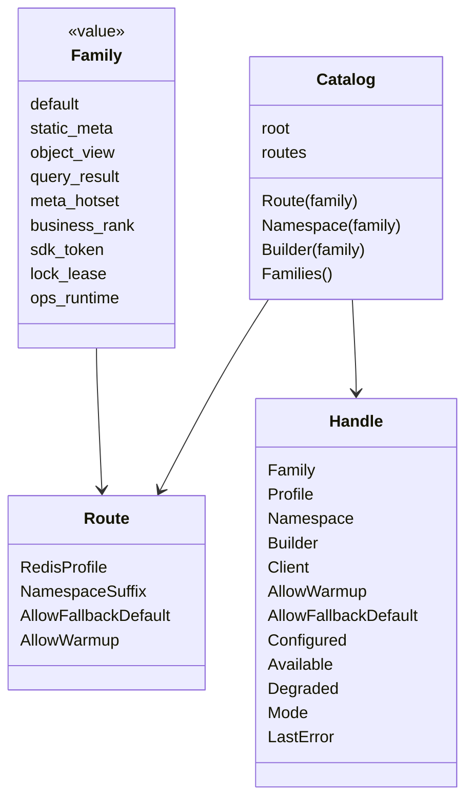
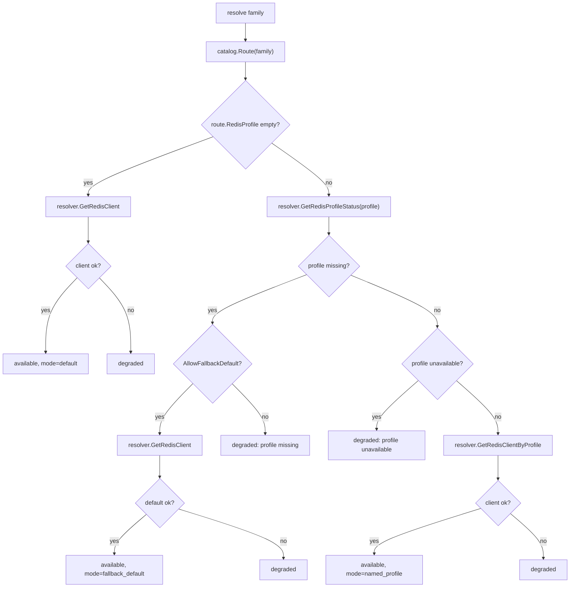

# Redis 运行时与 Family 模型

**本文回答**：qs-server 如何用 Redis family、profile、route、namespace、Runtime、Handle、RuntimeBundle 建模 Redis 运行时；三进程如何通过同一套 runtime 获得 Redis client、key builder 和 lock manager；fallback default 与 degraded 状态分别意味着什么；为什么业务代码不应直接选择 Redis profile 或拼 key 前缀。

---

## 30 秒结论

| 概念 | 结论 |
| ---- | ---- |
| Family | 逻辑 Redis workload，例如 `static_meta`、`object_view`、`query_result`、`lock_lease` |
| Profile | 物理 Redis 配置名，可将不同 family 路由到不同 Redis 实例 |
| Route | family 到 profile/namespace/fallback/warmup 的路由配置 |
| Namespace | family-scoped key 前缀，由 root namespace + namespace suffix 组合 |
| Runtime | 根据 catalog 和 resolver 解析 family handle，并缓存到进程生命周期 |
| Handle | family 的运行时视图，包含 client、builder、profile、namespace、available、degraded、mode |
| RuntimeBundle | 进程本地 Redis 输出，包含 Runtime、handles、FamilyStatusRegistry、LockManager |
| Fallback | profile missing 且允许 fallback 时，尝试使用 default Redis client |
| Degraded | profile 缺失且不可 fallback、profile 不可用、resolver nil、client 获取失败等都会 degraded |
| 业务边界 | 业务服务应消费明确的 cache/lock port 或 family builder，不应直接拼 Redis key/profile |

一句话概括：

> **Family 模型把“一个 Redis”拆成多个有独立语义、命名空间、profile、降级和治理能力的逻辑运行时。**

---

## 1. 为什么需要 Family 模型

Redis 在 qs-server 中承担多种不同语义：

```text
static metadata cache
object cache
query result cache
hotset
SDK token cache
distributed lock
ops runtime
```

这些能力的要求不同：

| 能力 | 关注点 |
| ---- | ------ |
| ObjectCache | TTL、负缓存、压缩、singleflight |
| QueryCache | version token、查询结果、热点预热 |
| Hotset | sorted set、TopN、治理 |
| SDK token | 第三方凭据 TTL |
| LockLease | 原子加锁、TTL、owner、release |
| OpsRuntime | 限流、提交保护、运行时状态 |

如果它们全都直接使用一个 Redis client 和手写 key，就会无法回答：

- 这个 key 属于哪个能力？
- 这个能力是否允许降级？
- 是否可以 warmup？
- Redis profile 不存在时是否 fallback？
- 这个 family 当前是否可用？
- 这个 key 是否会和其它模块冲突？

Family 模型就是为了解决这些问题。

---

## 2. Family / Profile / Namespace 模型



### 2.1 Family

`cacheplane.Family` 当前定义：

| Family | 语义 |
| ------ | ---- |
| `default` | 默认 Redis route |
| `static_meta` | 静态/半静态元数据 |
| `object_view` | 领域对象视图 |
| `query_result` | 查询结果 |
| `meta_hotset` | version token、hotset、治理元数据 |
| `business_rank` | 业务排行/排名类预留 |
| `sdk_token` | SDK token / ticket |
| `lock_lease` | 分布式锁 |
| `ops_runtime` | 运维/运行时保护能力 |

### 2.2 Profile

Profile 是物理 Redis 配置名。

例如可以有：

```text
default
cache_redis
lock_redis
ops_redis
```

family 可以指定 profile：

```text
query_result -> cache_redis
lock_lease   -> lock_redis
ops_runtime  -> ops_redis
```

### 2.3 Namespace

Namespace 是 key 前缀，由：

```text
root namespace + namespace suffix
```

组合得到。

例如：

```text
root = qs:prod
suffix = query
namespace = qs:prod:query
```

---

## 3. Route

`cacheplane.Route` 包含：

| 字段 | 说明 |
| ---- | ---- |
| `RedisProfile` | family 对应的命名 profile |
| `NamespaceSuffix` | family namespace 后缀 |
| `AllowFallbackDefault` | profile missing 时是否允许使用 default Redis |
| `AllowWarmup` | 是否允许治理层 warmup |

### 3.1 AllowFallbackDefault

如果 family 指定了 profile，但 profile 缺失：

| AllowFallbackDefault | 结果 |
| -------------------- | ---- |
| true | 尝试使用 default Redis，mode = fallback_default |
| false | family degraded |

这允许 dev/test 或轻量部署中少配 Redis profile，但 production 应谨慎使用 fallback。

### 3.2 AllowWarmup

AllowWarmup 控制治理层是否可以对该 family 执行 warmup。

例如：

- static_meta 允许 warmup。
- query_result 可允许 warmup。
- lock_lease 不应 warmup。
- ops_runtime 通常不 warmup。

---

## 4. Catalog

`cacheplane.Catalog` 存储：

```text
root namespace
family -> route
```

### 4.1 NewCatalog

`NewCatalog(rootNamespace, routes)` 会：

1. 初始化 root namespace。
2. 设置 default route。
3. 合并显式 routes。

### 4.2 Route(family)

如果 family 存在，返回对应 route；如果不存在，返回 default route。

### 4.3 Namespace(family)

会调用：

```text
keyspace.ComposeNamespace(root, route.NamespaceSuffix)
```

生成 family namespace。

### 4.4 Builder(family)

返回绑定 family namespace 的 `keyspace.Builder`。

### 4.5 Families()

返回所有显式配置的 family，排除 default，并按稳定顺序排序。

---

## 5. RedisRuntimeOptions

`RedisRuntimeOptions` 是运行时配置入口：

```go
type RedisRuntimeOptions struct {
    Namespace string
    Families map[string]*RedisRuntimeFamilyRoute
}
```

family route 配置：

```go
type RedisRuntimeFamilyRoute struct {
    RedisProfile         string
    NamespaceSuffix      string
    AllowFallbackDefault *bool
    AllowWarmup          *bool
}
```

### 5.1 配置边界

命令行 flag 只暴露：

```text
--redis_runtime.namespace
```

family 级路由走配置文件，不走命令行 flag。这避免运行时通过 flags 传一堆复杂 family route。

### 5.2 CatalogFromOptions

`CatalogFromOptions(runtimeOpts, defaults)` 会：

1. 读取 root namespace。
2. 拷贝组件默认 routes。
3. 对配置中的 family overrides 逐项覆盖：
   - RedisProfile。
   - NamespaceSuffix。
   - AllowFallbackDefault。
   - AllowWarmup。
4. 构造 Catalog。

### 5.3 ValidateRuntimeOptions

校验：

- family 名必须在 knownFamilies 中。
- redis_profile 如果配置了且不允许 fallback，则必须存在于 redis_profiles。

这可以在启动前发现拼错 family 或 profile 引用错误。

---

## 6. Runtime

`cacheplane.Runtime` 负责把 Catalog + Resolver 解析成 family handles。

核心字段：

| 字段 | 说明 |
| ---- | ---- |
| component | 进程组件名 |
| resolver | Redis profile resolver |
| catalog | family route catalog |
| status | FamilyStatusRegistry |
| handles | family -> Handle 缓存 |

### 6.1 Resolver

Resolver 需要提供：

| 方法 | 说明 |
| ---- | ---- |
| `GetRedisClient()` | default Redis client |
| `GetRedisClientByProfile(profile)` | 命名 profile client |
| `GetRedisProfileStatus(profile)` | profile 状态 |

### 6.2 Handle(family)

`Runtime.Handle(ctx, family)` 会：

1. 先查进程内 handle cache。
2. 未命中则 resolve。
3. resolve 后缓存到 `handles`。
4. 更新 family status。

注意：handle 在进程生命周期内 memoize。因此修改 Redis 配置通常需要重启进程才会重新 resolve。

### 6.3 ResolveAll

`ResolveAll(ctx)` 会遍历 catalog 中所有显式 family，并 resolve handle。

RuntimeBundle 构建时会调用它，提前得到所有 handles。

---

## 7. Handle 解析规则



### 7.1 Mode

常见 mode：

| Mode | 语义 |
| ---- | ---- |
| default | 使用 default Redis |
| named_profile | 使用命名 Redis profile |
| fallback_default | profile 缺失时 fallback default |
| degraded | 当前 family 不可用 |

### 7.2 Degraded 原因

| 原因 | 说明 |
| ---- | ---- |
| resolver nil | 没有 Redis resolver |
| default client nil/error | default Redis 不可用 |
| profile missing + no fallback | 配置缺失 |
| profile unavailable | 命名 Redis profile 不可用 |
| GetRedisClientByProfile error | 获取命名 client 失败 |

---

## 8. RuntimeBundle

`cacheplane/bootstrap.RuntimeBundle` 是三进程共享 Redis runtime 输出。

包含：

| 字段 | 说明 |
| ---- | ---- |
| Component | 组件名 |
| StatusRegistry | family status registry |
| Runtime | cacheplane runtime |
| Handles | family handles |
| LockManager | locklease manager |

### 8.1 BuildRuntime

`BuildRuntime(ctx, opts)` 会：

1. 创建 FamilyStatusRegistry。
2. 创建 cacheplane.Runtime。
3. ResolveAll。
4. 确定 lockName，默认 `lock_lease`。
5. 使用 `FamilyLock` handle 创建 locklease manager。
6. 返回 RuntimeBundle。

### 8.2 RuntimeBundle 方法

| 方法 | 说明 |
| ---- | ---- |
| `Handle(family)` | 返回 family handle |
| `Client(family)` | 返回 family Redis client |
| `Builder(family)` | 返回 family key builder |

### 8.3 LockManager

LockManager 基于：

```text
FamilyLock handle
```

创建。也就是说所有 locklease 能力共享 `lock_lease` family 的 Redis client 和 namespace。

---

## 9. Keyspace Builder

业务代码不应该手写 Redis key 前缀，而应使用 `keyspace.Builder`。

### 9.1 Builder 绑定 namespace

`Catalog.Builder(family)` 会返回绑定 family namespace 的 builder。

例如：

```text
FamilyQuery -> namespace qs:prod:query
Builder.BuildQueryVersionKey(...)
```

### 9.2 常见 key builder

| 方法 | 用途 |
| ---- | ---- |
| `BuildScaleKey` | Scale detail |
| `BuildScaleListKey` | Scale list |
| `BuildQuestionnaireKey` | Questionnaire |
| `BuildPublishedQuestionnaireKey` | Published questionnaire |
| `BuildAssessmentDetailKey` | Assessment detail |
| `BuildAssessmentListKey` | Assessment list |
| `BuildQueryVersionKey` | query version token |
| `BuildVersionedQueryKey` | versioned query payload |
| `BuildTesteeInfoKey` | Testee info |
| `BuildPlanInfoKey` | Plan info |
| `BuildStatsQueryKey` | Statistics query |
| `BuildWarmupHotsetKey` | hotset |
| `BuildAnswerSheetProcessingLockKey` | worker answersheet lock |
| `BuildLockKey` | generic locklease key |
| `BuildWeChatCacheKey` | WeChat SDK cache |

### 9.3 为什么不用裸 key

不用裸 key 的原因：

- 避免 namespace 冲突。
- 支持 family 独立 namespace。
- 便于治理和排障。
- 支持多环境隔离。
- 避免不同进程 key 约定漂移。

---

## 10. 三进程 Runtime 装配

### 10.1 apiserver

apiserver 使用最多 Redis family：

```text
static_meta
object_view
query_result
meta_hotset
sdk_token
lock_lease
```

主要用途：

- Scale/Questionnaire/Object cache。
- Statistics QueryCache。
- Hotset/WarmupTarget。
- WeChat SDK token。
- Plan scheduler lock。
- Statistics sync lock。
- Behavior pending reconcile lock。
- Cache governance status。

### 10.2 collection-server

collection-server 主要使用：

```text
ops_runtime
lock_lease
```

用途：

- distributed rate limiter。
- submit guard。
- collection submit lock。
- runtime guard。

它不做 apiserver 领域对象读缓存。

### 10.3 worker

worker 主要使用：

```text
lock_lease
```

用途：

- `answersheet_processing` duplicate suppression。
- worker handler 的短期重复处理保护。

它不做 object/query cache。

---

## 11. Family Status

Runtime 每次 resolve handle 时会更新 `FamilyStatusRegistry`。

状态包括：

| 字段 | 说明 |
| ---- | ---- |
| component | 进程名 |
| family | family name |
| profile | profile name |
| namespace | namespace |
| allow_warmup | 是否允许 warmup |
| configured | 是否配置 |
| available | 是否可用 |
| degraded | 是否降级 |
| mode | default / named / fallback / degraded |
| last_error | 最近错误 |

### 11.1 状态用途

Family status 用于：

- governance endpoint。
- 降级排障。
- 判断 warmup 是否可执行。
- 判断 lock/cache 是否可用。
- 发现 Redis profile 配置错误。

---

## 12. Fallback 与降级策略

### 12.1 Fallback 是配置能力

Fallback 只解决：

```text
profile missing 时是否允许使用 default Redis
```

它不解决：

- default Redis 也不可用。
- Redis 网络故障。
- Redis 命令失败。
- 业务是否可以继续。

### 12.2 Degraded 是运行时状态

Degraded 表示：

```text
该 family 当前不可用或非预期路径运行。
```

但不同调用方可以有不同策略：

| 能力 | Degraded 策略 |
| ---- | ------------- |
| ObjectCache | bypass，回源 repository |
| QueryCache | bypass，回源 read model |
| Hotset | 不记录热点 |
| LockLease | fail-closed / degraded-open / skip，按场景 |
| Scheduler leader | 通常不启动或跳过 |
| SubmitGuard | 按 collection 策略 |
| SDK token | 回源第三方或失败 |

---

## 13. Runtime 模型不负责什么

Runtime 不负责：

- 定义 cache TTL。
- 定义 object cache 策略。
- 定义 lock spec。
- 执行 warmup。
- 判断业务是否可以降级。
- 发 metrics 之外的业务告警。
- 管理 Redis server。
- 动态修改 profile。

它只负责：

```text
family -> handle
handle -> client/builder/status
```

---

## 14. 设计模式与实现意图

| 模式 | 当前实现 | 意图 |
| ---- | -------- | ---- |
| Catalog | `cacheplane.Catalog` | family route 集中管理 |
| Runtime Handle | `cacheplane.Handle` | family 运行时视图 |
| Resolver | Redis profile resolver | 隔离物理 Redis 配置 |
| Runtime Facade | RuntimeBundle | 三进程统一拿 Redis 能力 |
| Key Builder | keyspace.Builder | 统一 key 生成 |
| Status Registry | FamilyStatusRegistry | family 可观测 |
| Fallback Strategy | AllowFallbackDefault | 配置缺失时降级运行 |
| Named Profile | RedisProfile | 支持多 Redis 实例分工 |

---

## 15. 设计取舍

| 设计 | 收益 | 代价 |
| ---- | ---- | ---- |
| family 模型 | 语义清楚、可观测 | 配置复杂 |
| named profile | 可拆分不同 Redis workload | 运维配置更多 |
| fallback default | 开发部署更容易 | 生产需防止静默混用 |
| namespace suffix | key 隔离 | 必须统一使用 builder |
| handle memoize | 性能好、状态稳定 | 配置变更需重启 |
| family status | 排障清楚 | 需要治理界面读取 |
| RuntimeBundle | 三进程统一 | 装配要严谨 |

---

## 16. 常见误区

### 16.1 “Redis client 可直接到处传”

不建议。应该通过 family handle/明确 port 获取对应能力。

### 16.2 “Namespace 只是可有可无的前缀”

不是。namespace 是多环境、多 family、治理和排障的基础。

### 16.3 “fallback default 总是好事”

不一定。生产中 fallback 可能隐藏配置错误，让 lock/cache 混到同一个 Redis。

### 16.4 “degraded 就表示服务必须失败”

不一定。cache degraded 可 bypass，lock degraded 要按业务风险处理。

### 16.5 “业务代码可以手写 Redis key”

不应。应该走 keyspace.Builder，保证 namespace 与格式一致。

### 16.6 “family 等于业务模块”

不是。family 是 Redis workload，不是业务 bounded context。

---

## 17. 排障路径

### 17.1 family degraded

检查：

1. Redis resolver 是否存在。
2. family route 是否配置。
3. profile 是否存在。
4. profile 状态是否 unavailable。
5. AllowFallbackDefault 是否开启。
6. default Redis 是否可用。
7. namespace 是否正确。
8. family status last_error。

### 17.2 key 找不到

检查：

1. 使用了哪个 family builder。
2. namespace 是否变化。
3. key builder 方法是否正确。
4. 是否用了裸 key。
5. profile 是否 fallback 到 default。
6. 读写是否在不同 namespace。

### 17.3 lock 不生效

检查：

1. lock_lease family 是否 available。
2. BuildLockKey 是否使用正确 namespace。
3. lock spec name。
4. TTL 是否太短。
5. owner identity。
6. 是否多个进程使用不同 namespace。

### 17.4 warmup 不执行

检查：

1. family AllowWarmup。
2. warmup config enable。
3. runtime family status。
4. target scope 是否正确。
5. coordinator 是否绑定 callbacks。

---

## 18. 修改指南

### 18.1 新增 family

必须：

1. 在 `cacheplane.Family` 定义常量。
2. 加入组件 default routes。
3. 更新 known families 校验。
4. 定义 namespace suffix。
5. 判断是否允许 fallback。
6. 判断是否允许 warmup。
7. 更新 docs。
8. 补 runtime/options tests。

### 18.2 修改 profile route

必须：

1. 更新配置文件。
2. 确认 redis_profiles 中存在 profile。
3. 决定 fallback 行为。
4. 检查 family status。
5. 检查 key namespace。
6. 检查生产是否需要数据迁移或双读。

### 18.3 新增 key builder

必须：

1. 在 keyspace builder 增加方法。
2. 定义 key 格式。
3. 使用 family namespace。
4. 补 tests。
5. 更新对应能力文档。

---

## 19. 代码锚点

- Family catalog：[../../../internal/pkg/cacheplane/catalog.go](../../../internal/pkg/cacheplane/catalog.go)
- Runtime options：[../../../internal/pkg/options/redis_runtime_options.go](../../../internal/pkg/options/redis_runtime_options.go)
- CatalogFromOptions：[../../../internal/pkg/cacheplane/options.go](../../../internal/pkg/cacheplane/options.go)
- Runtime：[../../../internal/pkg/cacheplane/runtime.go](../../../internal/pkg/cacheplane/runtime.go)
- Runtime bootstrap：[../../../internal/pkg/cacheplane/bootstrap/runtime.go](../../../internal/pkg/cacheplane/bootstrap/runtime.go)
- Keyspace builder：[../../../internal/pkg/cacheplane/keyspace/builder.go](../../../internal/pkg/cacheplane/keyspace/builder.go)
- Lock specs：[../../../internal/pkg/locklease/lease.go](../../../internal/pkg/locklease/lease.go)

---

## 20. Verify

```bash
go test ./internal/pkg/cacheplane
go test ./internal/pkg/cacheplane/bootstrap
go test ./internal/pkg/cacheplane/keyspace
go test ./internal/pkg/options
go test ./internal/pkg/locklease
```

如果修改三进程装配：

```bash
go test ./internal/apiserver/process
go test ./internal/collection-server/process
go test ./internal/worker/process
```

如果修改文档：

```bash
make docs-hygiene
git diff --check
```

---

## 21. 下一跳

| 目标 | 文档 |
| ---- | ---- |
| Cache 层总览 | [02-Cache层总览.md](./02-Cache层总览.md) |
| ObjectCache 主路径 | [03-ObjectCache主路径.md](./03-ObjectCache主路径.md) |
| QueryCache 与 StaticList | [04-QueryCache与StaticList.md](./04-QueryCache与StaticList.md) |
| Hotset 与 WarmupTarget | [05-Hotset与WarmupTarget模型.md](./05-Hotset与WarmupTarget模型.md) |
| Redis 分布式锁 | [06-Redis分布式锁层.md](./06-Redis分布式锁层.md) |
| 回看整体架构 | [00-整体架构.md](./00-整体架构.md) |
