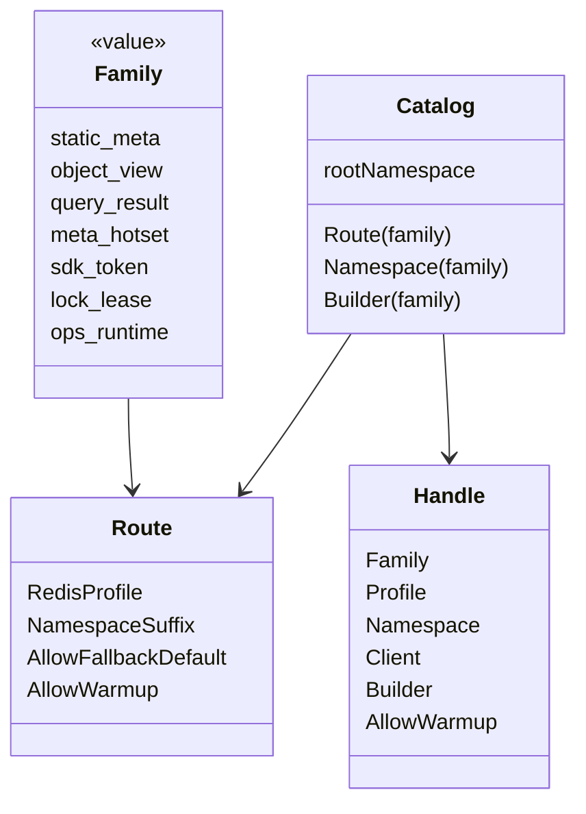
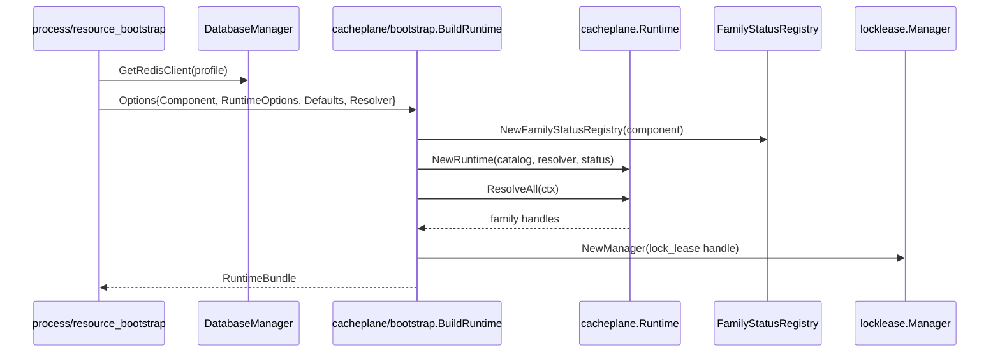
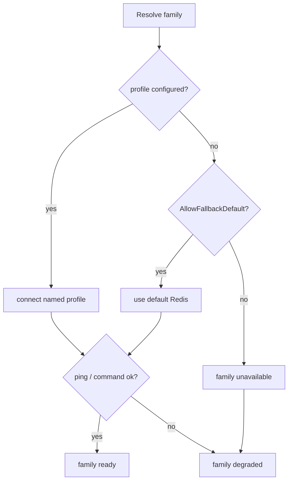

# Redis 运行时与 Family 模型

**本文回答**：Redis family、profile、namespace、fallback 如何建模，三进程如何从配置构建 runtime bundle，业务模块为什么不应直接拼 Redis client 和 key 前缀。

## 30 秒结论

| 概念 | 说明 | 代码 |
| ---- | ---- | ---- |
| Family | 逻辑 Redis workload，如 `static_meta`、`lock_lease` | [cacheplane/catalog.go](../../../internal/pkg/cacheplane/catalog.go) |
| Profile | 物理 Redis 配置名，如 `static_cache`、`lock_cache` | `configs/*.yaml` |
| Namespace | family-scoped key 前缀 | [cacheplane/keyspace/builder.go](../../../internal/pkg/cacheplane/keyspace/builder.go) |
| RuntimeBundle | 进程内 family handles + lock manager + status registry | [cacheplane/bootstrap/runtime.go](../../../internal/pkg/cacheplane/bootstrap/runtime.go) |
| Fallback | family profile 不可用时是否允许回退 default Redis | [options/redis_runtime_options.go](../../../internal/pkg/options/redis_runtime_options.go) |

## Family / Profile / Namespace 模型

## Runtime 构建时序

## Family 清单

| Family | 默认用途 | 使用进程 |
| ------ | -------- | -------- |
| `static_meta` | 静态/半静态缓存 | apiserver |
| `object_view` | 单对象视图缓存 | apiserver |
| `query_result` | 查询/列表/统计查询缓存 | apiserver |
| `meta_hotset` | version token、hotset、warmup 元数据 | apiserver |
| `sdk_token` | 微信 SDK token / ticket | apiserver |
| `lock_lease` | lease lock | apiserver、collection-server、worker |
| `ops_runtime` | 限流、submit guard 操作性 Redis | collection-server |

## 三进程装配差异

| 进程 | 装配入口 | 默认 family |
| ---- | -------- | ----------- |
| apiserver | [internal/apiserver/process/resource_bootstrap.go](../../../internal/apiserver/process/resource_bootstrap.go) | cache + lock families |
| collection-server | [internal/collection-server/process/resource_bootstrap.go](../../../internal/collection-server/process/resource_bootstrap.go) | `ops_runtime`、`lock_lease` |
| worker | [internal/worker/process/resource_bootstrap.go](../../../internal/worker/process/resource_bootstrap.go) | `lock_lease` |

## Fallback 与 degraded

## 设计边界

- 业务代码不要直接选择 profile。
- 业务代码不要拼接 root namespace。
- Cache 和 Lock 都依赖同一 family runtime，但语义彼此独立。
- family degraded 不等于进程必须退出；是否降级继续由调用方语义决定。

## Verify

- 配置结构：[internal/pkg/options/redis_runtime_options.go](../../../internal/pkg/options/redis_runtime_options.go)
- apiserver 默认 family：[internal/apiserver/options/options.go](../../../internal/apiserver/options/options.go)
- collection 默认 family：[internal/collection-server/process/resource_bootstrap.go](../../../internal/collection-server/process/resource_bootstrap.go)
- worker 默认 family：[internal/worker/process/resource_bootstrap.go](../../../internal/worker/process/resource_bootstrap.go)
