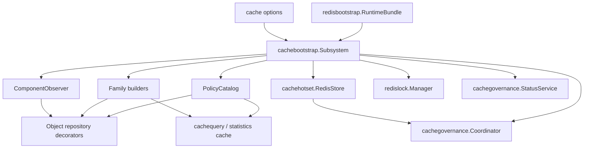
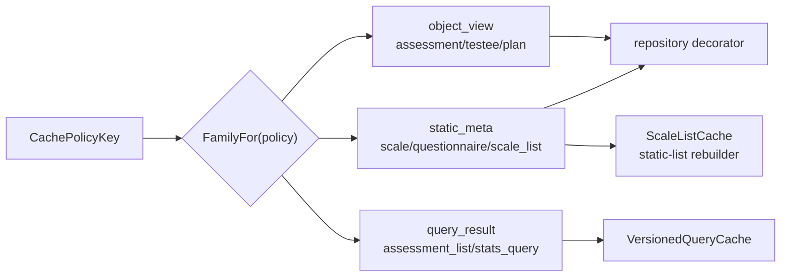

# Cache 层总览

**本文回答**：apiserver Cache 层如何由 `cachebootstrap.Subsystem` 装配，object cache、query cache、static-list cache、hotset 和 SDK adapter 如何分流，新增缓存前应该先做哪些判断。

## 30 秒结论

| 能力 | 当前包 | 说明 |
| ---- | ------ | ---- |
| 组合根 | [cachebootstrap](../../../internal/apiserver/cachebootstrap) | 收口 runtime、policy、hotset、lock、governance |
| object cache | [infra/cache](../../../internal/apiserver/infra/cache) | repository decorator + read-through |
| entry payload | [infra/cacheentry](../../../internal/apiserver/infra/cacheentry) | Redis payload get/set/delete/compress/metrics |
| query cache | [infra/cachequery](../../../internal/apiserver/infra/cachequery) | version token、versioned key、local hot cache |
| static-list | [application/scale/global_list_cache.go](../../../internal/apiserver/application/scale/global_list_cache.go) | application-level list rebuilder |
| hotset target | [cachetarget](../../../internal/apiserver/cachetarget)、[cachehotset](../../../internal/apiserver/infra/cachehotset) | warmup target 和热点排行 |

## Cache composition root

## Cache policy 分流

## Cache 形态选择

| 场景 | 首选形态 | 不推荐 |
| ---- | -------- | ------ |
| 按稳定 ID/code 读取单对象 | object repository decorator | 在 handler 里手写 Redis |
| 高基数查询或列表 | version token + versioned key | 扫描删 query key |
| 全局发布列表快照 | static-list rebuilder | 强行套 repository decorator |
| 可治理预热目标 | `cachetarget.WarmupTarget` + coordinator | 用裸字符串跨层传递 |
| 第三方 SDK token | SDK adapter | 并入业务 object cache |

## 当前边界

- Cache 层只在 apiserver 完整存在。
- collection-server 和 worker 不复用 apiserver object/query cache。
- `infra/cache` 现在只表示 object repository cache 包。
- query/list 能力在 `infra/cachequery`，hotset store 在 `infra/cachehotset`。
- governance target 模型在 `cachetarget`，不是 infra cache 的内部类型。

## Verify

- 子系统装配：[cachebootstrap/subsystem.go](../../../internal/apiserver/cachebootstrap/subsystem.go)
- policy 映射：[infra/cachepolicy/catalog.go](../../../internal/apiserver/infra/cachepolicy/catalog.go)
- object cache contract：[infra/cache/object_cache_contract_test.go](../../../internal/apiserver/infra/cache/object_cache_contract_test.go)
- query cache contract：[infra/cachequery/versioned_query_cache_test.go](../../../internal/apiserver/infra/cachequery/versioned_query_cache_test.go)
