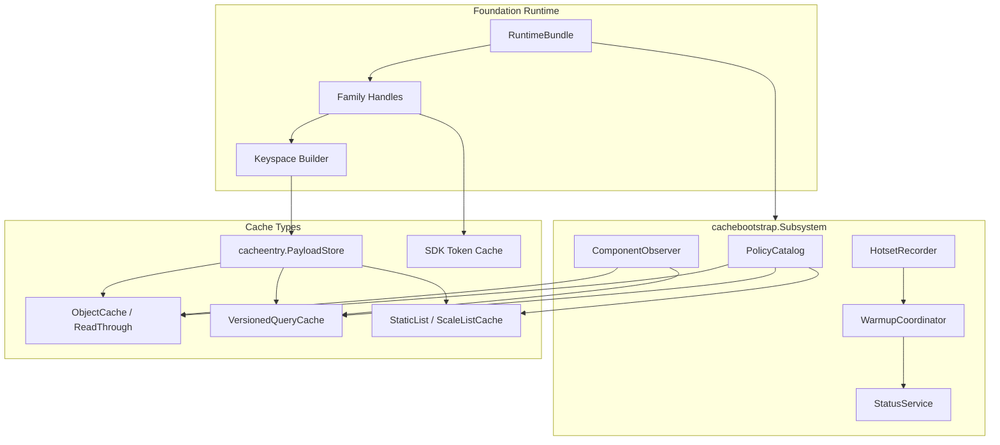
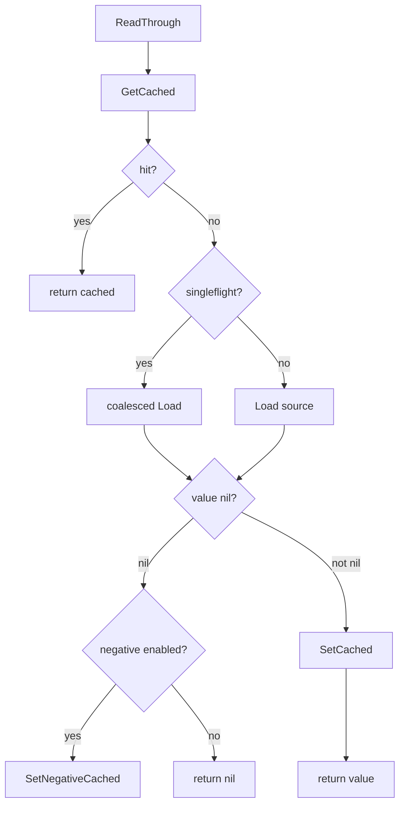

# Cache 层总览

**本文回答**：qs-server 的 Redis Cache 层由哪些能力组成；ObjectCache、QueryCache、StaticList、Hotset、SDK token cache、PayloadStore、CachePolicy 如何分工；为什么 cache 层只在 apiserver 完整存在；新增缓存前应该如何判断使用 object、query、static-list、hotset 还是 SDK cache。

---

## 30 秒结论

| 能力 | 负责什么 | 典型包 |
| ---- | -------- | ------ |
| Composition Root | 收口 runtime、policy、observer、hotset、lock、governance | `apiserver/cachebootstrap` |
| CachePolicy | 对象级 TTL、negative cache、compression、singleflight、jitter 策略 | `infra/cachepolicy` |
| PayloadStore | Redis payload get/set/delete/exists，配合 compression/metrics | `infra/cacheentry` |
| ObjectCache | 单对象 read-through cache，适合 scale/questionnaire/assessment/testee/plan | `infra/cache` |
| QueryCache | version token + versioned payload key，适合列表/统计查询结果 | `infra/cachequery` |
| StaticList | 发布列表快照，例如 ScaleListCache | application-level list rebuilder |
| Hotset | 记录近期访问热点，服务治理和 warmup | `infra/cachehotset` + `cachetarget` |
| SDK Cache | 第三方 SDK token/ticket 缓存 | `infra/wechatapi` adapter |
| Governance | startup/sync/repair/manual warmup 与 status | `application/cachegovernance` |

| 维度 | 结论 |
| ---- | ---- |
| apiserver 独有 | 完整 Cache 层主要存在于 apiserver；collection-server/worker 不复用 object/query cache |
| family 分流 | static/object/query/meta/sdk 分别落到不同 Redis family |
| 策略继承 | CachePolicy 支持 family default + policy override |
| ObjectCache 主路径 | cache hit -> miss -> singleflight source load -> positive/negative writeback |
| QueryCache 主路径 | version key -> versioned data key -> local hot cache / Redis payload |
| Hotset 边界 | hotset 是治理信号，不是业务优先级和事实源 |
| Cache 真值边界 | cache miss 必须能回源；cache hit 不代表业务事实最新 |
| 新增原则 | 先判断缓存形态，再确定 family、key、policy、失效、warmup、观测和降级策略 |

一句话概括：

> **Cache 层不是一个 Redis get/set 工具包，而是一组有策略、分流、观测、治理和回源边界的读优化机制。**

---

## 1. Cache 层解决什么问题

qs-server 中有大量读请求具有重复性：

```text
Scale detail
Questionnaire detail
Published questionnaire
Assessment detail
Testee info
Plan info
Assessment list
Statistics overview
Scale list
WeChat token
```

如果每次都回源 MySQL/Mongo/第三方服务，会导致：

- 查询延迟高。
- DB 压力大。
- 外部 SDK token 重复请求。
- 高峰期看板回源。
- 列表/统计查询重复计算。
- 冷启动或发布后体验不稳定。

Cache 层用不同缓存形态解决不同问题：

| 问题 | 缓存形态 |
| ---- | -------- |
| 单对象稳定读取 | ObjectCache |
| 查询/列表结果 | QueryCache |
| 全局发布列表 | StaticList |
| 热点发现 | Hotset |
| 第三方 token | SDK Cache |
| 缓存预热 | Governance Warmup |

---

## 2. Cache 层总图



---

## 3. cachebootstrap.Subsystem

apiserver cache 子系统的组合根是 `cachebootstrap.Subsystem`。

它收口：

| 字段 | 说明 |
| ---- | ---- |
| component | 组件名 |
| cacheConfig | cache 配置 |
| statusRegistry | family status |
| runtime | cacheplane runtime |
| handles | family handles |
| policyCatalog | cache policy |
| observer | component observer |
| hotsetRecorder | hotset 写入 |
| hotsetInspector | hotset 读取 |
| lockManager | Redis lock manager |
| warmupCoordinator | cache governance |
| statusService | cache governance status |

### 3.1 Subsystem 的价值

它避免每个业务模块自己组装：

```text
Redis client
key builder
policy
observer
hotset
lock
warmup
status
```

业务模块只应拿到明确的 cache/repository decorator/port。

### 3.2 BindGovernance

`BindGovernance` 在业务 warmup callback 准备好后装配：

- WarmScale。
- WarmQuestionnaire。
- WarmScaleList。
- WarmStatsOverview。
- WarmStatsSystem。
- WarmStatsQuestionnaire。
- WarmStatsPlan。

这说明治理层不直接访问 repository，而是调用应用层提供的 warm function。

---

## 4. CachePolicy

CachePolicy 定义对象级缓存策略。

### 4.1 CachePolicyKey

当前策略 key：

| Key | Family |
| --- | ------ |
| `scale` | static |
| `scale_list` | static |
| `questionnaire` | static |
| `assessment_detail` | object |
| `assessment_list` | query |
| `testee` | object |
| `plan` | object |
| `stats_query` | query |

### 4.2 策略字段

| 字段 | 说明 |
| ---- | ---- |
| TTL | 正向缓存 TTL |
| NegativeTTL | 负缓存 TTL |
| Negative | 是否启用 negative cache |
| Compress | 是否压缩 payload |
| Singleflight | 是否启用单飞 |
| JitterRatio | TTL 抖动比例 |

### 4.3 三态开关

`PolicySwitch` 支持：

```text
inherit
enabled
disabled
```

这允许：

```text
family default
  + policy override
```

合并最终策略。

### 4.4 FamilyFor

`FamilyFor(policy)` 定义 policy 与 cache family 的映射：

```text
scale / scale_list / questionnaire -> static
assessment_detail / testee / plan -> object
assessment_list / stats_query -> query
```

---

## 5. PayloadStore / RedisCache

`cacheentry.RedisCache` 是最小 Redis payload 操作：

| 方法 | 说明 |
| ---- | ---- |
| `Get` | Redis GET，redis.Nil 转 `ErrCacheNotFound` |
| `Set` | Redis SET key value ttl |
| `Delete` | Redis DEL |
| `Exists` | Redis EXISTS |

`PayloadStore` 在其上叠加：

- policy key。
- compression/decompression。
- payload size metrics。
- error handling。

### 5.1 为什么需要 payload 层

ObjectCache 和 QueryCache 都需要存 payload，但语义不同。

PayloadStore 统一处理：

```text
bytes
compression
ttl
metrics
cache not found
```

ObjectCache / QueryCache 再决定：

```text
key 怎么构造
value 怎么 marshal
miss 后怎么回源
如何失效
是否 versioned
```

---

## 6. ObjectCache

ObjectCache 适合按稳定 ID/code 读取单个对象。

### 6.1 典型对象

| 对象 | Policy |
| ---- | ------ |
| Scale detail | `scale` |
| Questionnaire | `questionnaire` |
| Assessment detail | `assessment_detail` |
| Testee info | `testee` |
| Plan info | `plan` |

### 6.2 Read-through 主路径

`ReadThrough` 固化：

1. GetCached。
2. hit 返回。
3. miss 进入 Load。
4. 如启用 singleflight，按 policy/cache key 合并并发回源。
5. Load 返回 nil 时可写 negative cache。
6. Load 返回 value 时写 positive cache。
7. 记录 get/source_load/set duration 和 hit/miss/write outcome。
8. 写回可同步或异步。



### 6.3 ObjectCache 不适合

| 场景 | 更适合 |
| ---- | ------ |
| 高基数组合查询 | QueryCache |
| 全局发布列表 | StaticList |
| 热点排行 | Hotset |
| 写入型主数据 | MySQL/Mongo |
| 需要精确实时 | 直接回源或短 TTL |

---

## 7. QueryCache

QueryCache 适合缓存查询/列表/统计结果。

### 7.1 VersionedQueryCache

它包含：

| 字段 | 说明 |
| ---- | ---- |
| version | VersionTokenStore |
| policy | CachePolicy |
| key | CachePolicyKey |
| ttl | 默认 TTL |
| memory | local hot cache |
| observer | family observer |
| payload | PayloadStore |

### 7.2 QueryCache 主路径

```text
versionKey
  -> current version
  -> build versioned data key
  -> local hot cache
  -> Redis payload
  -> unmarshal response
```

Set 时：

```text
current version
  -> build versioned data key
  -> marshal response
  -> local hot cache
  -> Redis payload
```

Invalidate 时：

```text
versionStore.Bump(versionKey)
```

### 7.3 为什么使用 versioned key

它避免扫描删除一堆 query key。

旧数据不需要立即删除，只要 version 递增，新查询就会读新 key。

适合：

- assessment list。
- statistics query。
- dashboard overview。
- 组合查询结果。

---

## 8. StaticList

StaticList 适合全局发布列表快照，例如：

```text
ScaleListCache
Published Questionnaire List
```

它不是普通单对象 ObjectCache。

### 8.1 适用场景

| 特征 | 说明 |
| ---- | ---- |
| 列表规模可控 | 不适合无限列表 |
| 更新频率低 | 发布/下线时失效 |
| 查询频率高 | 前端经常展示 |
| 可预热 | startup warmup 或发布后 warmup |
| 可版本化 | list version token |

### 8.2 不适合

- 用户私有分页列表。
- 高基数筛选。
- 动态搜索。
- 实时强一致列表。

这些更适合 QueryCache 或直接 DB/read model 查询。

---

## 9. Hotset

Hotset 是治理层输入，不是业务数据。

### 9.1 它记录什么

Hotset 记录：

```text
某类 warmup target 被访问的热度
```

例如：

- hot scale code。
- hot questionnaire code。
- hot stats overview org+preset。
- hot plan stats target。

### 9.2 它不代表什么

Hotset 不代表：

- 业务优先级最高。
- 统计事实。
- 推荐结果。
- 权限结果。
- 排名业务。

它只服务：

- warmup target selection。
- governance status。
- cache optimization。

---

## 10. SDK Token Cache

SDK token cache 适合第三方 adapter，例如 WeChat。

### 10.1 特点

| 特点 | 说明 |
| ---- | ---- |
| TTL 强依赖外部平台 | token 过期时间由第三方决定 |
| 失败影响外部调用 | cache miss 可能回源第三方 |
| 不属于业务 object | 不应放入 object_view family |
| keyspace 独立 | 使用 sdk_token family |
| 安全性更敏感 | 注意 token 不应进入日志 |

### 10.2 与业务缓存区别

| 业务 ObjectCache | SDK Token Cache |
| ---------------- | --------------- |
| 回源 MySQL/Mongo | 回源第三方 |
| payload 是业务对象 | payload 是凭据/token |
| 可由业务事件失效 | 按 TTL/平台失效 |
| 可 warmup | 通常不需要或谨慎 |

---

## 11. Cache 形态选择

| 场景 | 首选形态 | 不推荐 |
| ---- | -------- | ------ |
| 按 ID/code 取单对象 | ObjectCache | 手写 Redis get/set |
| 查询/列表结果 | QueryCache | 扫描删除 query key |
| 全局发布列表 | StaticList | 强套 ObjectCache |
| 高频统计 overview | QueryCache + Hotset | 实时扫主表 |
| 热点治理 | Hotset | 用业务表记录热点 |
| 第三方 token | SDK Cache | 放入业务 object cache |
| 幂等/重复抑制 | LockLease | 用 ObjectCache 模拟锁 |
| 排行榜 | business_rank family 或专用模型 | 混入 hotset |

---

## 12. Cache 与三进程边界

### 12.1 apiserver

完整 Cache 层在 apiserver：

- ObjectCache。
- QueryCache。
- StaticList。
- Hotset。
- SDK Cache。
- Governance。
- Warmup。

### 12.2 collection-server

collection-server 不使用 apiserver ObjectCache / QueryCache。

它使用 Redis 的重点是：

- rate limit。
- SubmitGuard。
- lock lease。
- ops runtime。

### 12.3 worker

worker 不使用 ObjectCache / QueryCache。

它主要使用：

- answersheet_processing lock。
- duplicate suppression。
- locklease。

不要为了方便在 worker 里接 apiserver object cache。worker 应通过 internal gRPC 回到 apiserver。

---

## 13. Cache 与事实源边界

| Cache 类型 | 事实源 |
| ---------- | ------ |
| Scale ObjectCache | Mongo/Scale repository |
| Questionnaire ObjectCache | Mongo/Questionnaire repository |
| Assessment ObjectCache | MySQL/Evaluation repository |
| Testee ObjectCache | MySQL/Actor repository |
| Plan ObjectCache | MySQL/Plan repository |
| Statistics QueryCache | Statistics ReadModel |
| ScaleList StaticList | Scale repository / application list builder |
| SDK Token Cache | WeChat / external platform |
| Hotset | 访问行为，不是业务事实 |

原则：

```text
cache miss 必须能回源；
cache hit 可以过期；
cache 不能成为唯一事实源。
```

---

## 14. Cache 失效边界

不同 cache 失效方式不同。

| 类型 | 失效方式 |
| ---- | -------- |
| ObjectCache | delete key / TTL / event-driven invalidation |
| QueryCache | bump version token / TTL |
| StaticList | bump list version / rebuild list |
| Hotset | ZSet aging / topN cap |
| SDK Token | TTL / platform expiration |
| Negative Cache | negative TTL |

### 14.1 不要扫描删 key

对于 query/list，优先使用 version token，而不是扫描：

```text
KEYS stats:*
DEL ...
```

扫描删除风险：

- 阻塞 Redis。
- 误删。
- 多 namespace 难控。
- 高并发下不一致。

---

## 15. Cache 观测

Cache 层应记录：

| 指标 | 说明 |
| ---- | ---- |
| get hit/miss/error | cache 读结果 |
| write ok/error | cache 写结果 |
| operation duration | get/set/source_load 耗时 |
| payload size | 压缩前后大小 |
| family success/failure | Redis family 可用性 |
| warmup outcome | 预热结果 |
| hotset topN | 热点目标 |

观测 label 应保持低基数，不要放 raw key。

---

## 16. Degraded 行为

| 能力 | Degraded 行为 |
| ---- | ------------- |
| ObjectCache | cache error -> miss -> 回源 |
| QueryCache | cache error -> miss -> 回源 read model |
| StaticList | 回源或返回业务默认 |
| Hotset | 不记录热点，不影响主查询 |
| SDK Token | 可能回源第三方或失败 |
| Governance | status 显示 degraded |
| Warmup | 跳过不可用 family |

### 16.1 Cache error 不应污染业务错误

大部分读缓存路径应遵守：

```text
cache error -> observe -> miss -> source load
```

除非缓存本身就是能力主路径，比如 SDK token。

---

## 17. 设计模式

| 模式 | 当前实现 | 意图 |
| ---- | -------- | ---- |
| Composition Root | cachebootstrap.Subsystem | cache runtime 收口 |
| Policy Catalog | cachepolicy.PolicyCatalog | 策略集中定义 |
| Payload Store | cacheentry.PayloadStore | bytes/compression/metrics |
| Decorator | ObjectCache repository decorator | 不改 repository 接口加缓存 |
| Read-through | ReadThroughRunner | 固化 hit/miss/load/writeback |
| Singleflight | SingleflightCoordinator | 合并并发回源 |
| Negative Cache | negative sentinel | 减少不存在对象回源 |
| Versioned Key | VersionedQueryCache | 查询结果失效 |
| Local Hot Cache | LocalHotCache | 进程内热点读优化 |
| Hotset | Redis ZSet | 治理热度输入 |

---

## 18. 设计取舍

| 设计 | 收益 | 代价 |
| ---- | ---- | ---- |
| 分 object/query/static/hotset | 语义清楚 | 包和文档较多 |
| Policy 继承 | 配置简洁 | 需要理解 family default |
| Query version token | 不扫 key | 旧 key 依赖 TTL 自然过期 |
| Negative cache | 降低空对象回源 | 需要短 TTL 和失效策略 |
| Singleflight | 降低击穿 | 只适合单对象/稳定 key |
| Hotset + warmup | 自动治理热点 | 高基数 target 要限制 |
| SDK token 独立 | 安全和 TTL 明确 | 需要第三方适配器维护 |
| Cache degraded bypass | 可用性优先 | 可能回源压力上升 |

---

## 19. 常见误区

### 19.1 “所有 Redis 缓存都用一种封装”

不应该。Object、Query、StaticList、Hotset、SDK token 语义不同。

### 19.2 “CachePolicy 只管 TTL”

不只。它还管 negative、compression、singleflight、jitter。

### 19.3 “QueryCache 可以扫描删除”

不推荐。应使用 version token 失效。

### 19.4 “Hotset 是业务排行榜”

错误。Hotset 是治理信号。

### 19.5 “Worker 也应该用 ObjectCache 提速”

不建议。worker 应通过 internal gRPC 回 apiserver，避免缓存和主写模型分裂。

### 19.6 “Cache miss 是错误”

不是。miss 是正常路径，应该能回源。

---

## 20. 排障路径

### 20.1 ObjectCache 命中率低

检查：

1. key builder 是否一致。
2. family 是否正确。
3. TTL 是否太短。
4. 写缓存是否失败。
5. negative cache 是否启用。
6. source load 是否每次返回不同版本。
7. invalidation 是否太频繁。

### 20.2 QueryCache 不生效

检查：

1. version key 是否存在。
2. version 是否被频繁 bump。
3. data key 是否按 version 生成。
4. TTL 是否配置。
5. local hot cache 是否启用。
6. family query_result 是否 degraded。

### 20.3 StaticList 不刷新

检查：

1. list version token。
2. rebuild function。
3. publish event。
4. governance warmup。
5. ScaleListCache policy。
6. static_meta family 状态。

### 20.4 Hotset 没记录

检查：

1. meta_hotset family 是否 available。
2. hotset enable。
3. target kind 是否支持。
4. 是否处于 suppress hotset context。
5. MaxItemsPerKind / TopN 配置。

### 20.5 Cache stale

检查顺序：

```text
source fact
  -> read model / repository
  -> invalidation/version bump
  -> Redis payload
  -> local hot cache
  -> response
```

不要第一步就清 Redis。

---

## 21. 修改指南

### 21.1 新增 ObjectCache

必须：

1. 判断是否稳定 ID/code 单对象。
2. 选择 policy key 和 family。
3. 定义 key builder。
4. 实现 repository decorator。
5. 设计 negative cache。
6. 设计 invalidation。
7. 补 read-through tests。
8. 更新文档。

### 21.2 新增 QueryCache

必须：

1. 判断查询是否高频、低基数、允许延迟。
2. 设计 version key。
3. 设计 versioned data key。
4. 设计 invalidate/bump 时机。
5. 设计 hotset target。
6. 补 cache hit/miss/write tests。
7. 更新文档。

### 21.3 新增 Hotset Target

必须：

1. 在 cachetarget 定义 target kind。
2. 定义 scope parser。
3. 记录访问热度。
4. 治理层读取 TopN。
5. warmup executor 支持。
6. 限制高基数。
7. 补 tests/docs。

---

## 22. 代码锚点

### Composition / Policy

- Cache subsystem：[../../../internal/apiserver/cachebootstrap/subsystem.go](../../../internal/apiserver/cachebootstrap/subsystem.go)
- Cache policy catalog：[../../../internal/apiserver/infra/cachepolicy/catalog.go](../../../internal/apiserver/infra/cachepolicy/catalog.go)
- Cache policy：[../../../internal/apiserver/infra/cachepolicy/policy.go](../../../internal/apiserver/infra/cachepolicy/policy.go)

### Cache implementation

- Redis payload cache：[../../../internal/apiserver/infra/cacheentry/redis_cache.go](../../../internal/apiserver/infra/cacheentry/redis_cache.go)
- Object read-through：[../../../internal/apiserver/infra/cache/readthrough.go](../../../internal/apiserver/infra/cache/readthrough.go)
- Versioned query cache：[../../../internal/apiserver/infra/cachequery/versioned_query_cache.go](../../../internal/apiserver/infra/cachequery/versioned_query_cache.go)

### Hotset / Target / Governance

- Cache hotset：[../../../internal/apiserver/infra/cachehotset/](../../../internal/apiserver/infra/cachehotset/)
- Cache target：[../../../internal/apiserver/cachetarget/](../../../internal/apiserver/cachetarget/)
- Cache governance：[../../../internal/apiserver/application/cachegovernance/](../../../internal/apiserver/application/cachegovernance/)

---

## 23. Verify

```bash
go test ./internal/apiserver/cachebootstrap
go test ./internal/apiserver/infra/cachepolicy
go test ./internal/apiserver/infra/cacheentry
go test ./internal/apiserver/infra/cache
go test ./internal/apiserver/infra/cachequery
go test ./internal/apiserver/infra/cachehotset
go test ./internal/apiserver/cachetarget
go test ./internal/apiserver/application/cachegovernance
```

如果修改 keyspace：

```bash
go test ./internal/pkg/cacheplane/keyspace
```

如果修改文档：

```bash
make docs-hygiene
git diff --check
```

---

## 24. 下一跳

| 目标 | 文档 |
| ---- | ---- |
| ObjectCache 主路径 | [03-ObjectCache主路径.md](./03-ObjectCache主路径.md) |
| QueryCache 与 StaticList | [04-QueryCache与StaticList.md](./04-QueryCache与StaticList.md) |
| Hotset 与 WarmupTarget | [05-Hotset与WarmupTarget模型.md](./05-Hotset与WarmupTarget模型.md) |
| 缓存治理层 | [07-缓存治理层.md](./07-缓存治理层.md) |
| 观测降级排障 | [08-观测降级与排障.md](./08-观测降级与排障.md) |
| 新增 Redis 能力 | [09-新增Redis能力SOP.md](./09-新增Redis能力SOP.md) |
| 回看运行时与 Family | [01-运行时与Family模型.md](./01-运行时与Family模型.md) |
