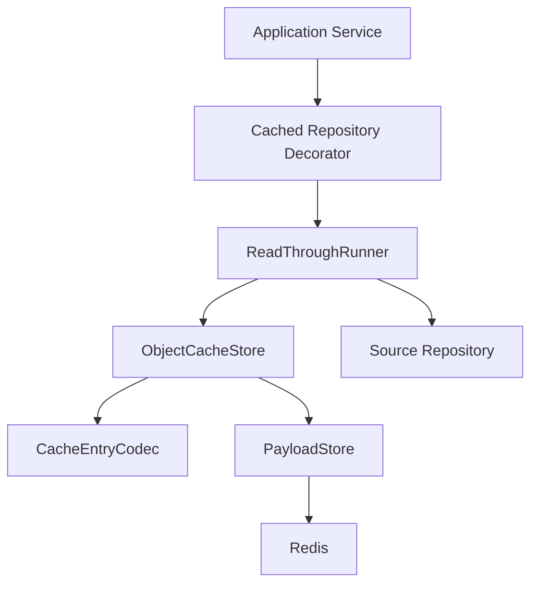
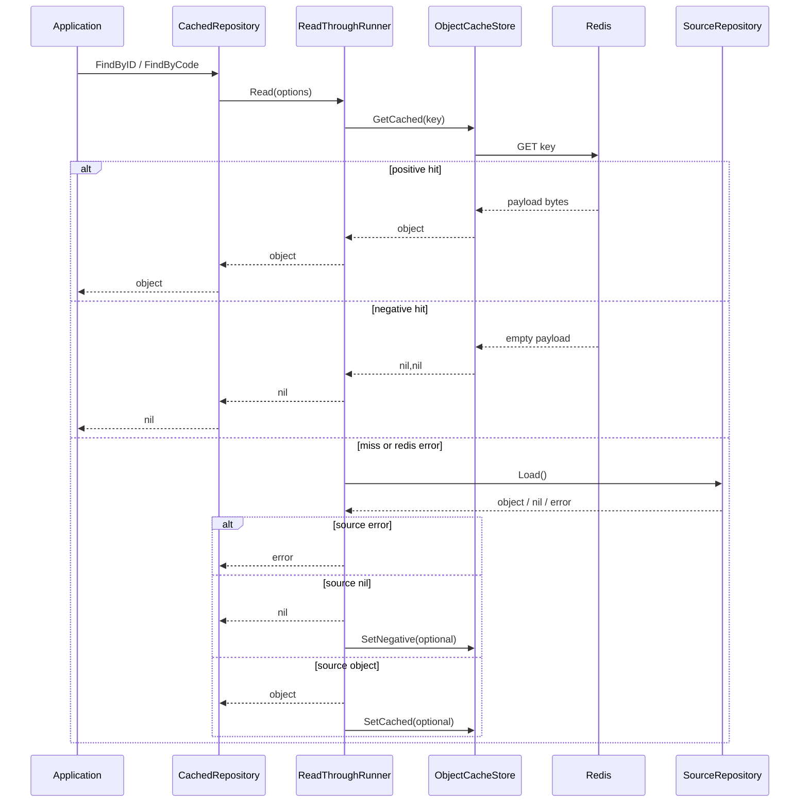

# ObjectCache 主路径

**本文回答**：qs-server 的 ObjectCache 如何通过 repository decorator、`ReadThroughRunner`、`ObjectCacheStore`、`CacheEntryCodec`、`PayloadStore` 完成 read-through；positive cache、negative cache、compression、singleflight、TTL jitter、async writeback、delete invalidation 和 degraded fallback 如何协作。

---

## 30 秒结论

| 组件 | 职责 |
| ---- | ---- |
| CachedRepository | 保持 repository decorator 形态，负责 key 构造、业务回源、失效 |
| ReadThroughRunner | 固化 hit/miss/load/writeback/singleflight/negative cache 主流程 |
| ObjectCacheStore | 封装对象缓存的 get/set/setNegative/delete/exists |
| CacheEntryCodec | domain object 与 Redis payload 的 encode/decode |
| PayloadStore | 统一 payload compression/decompression、TTL jitter、payload metrics |
| RedisCache | 最小 Redis get/set/delete/exists 封装 |
| CachePolicy | 控制 TTL、NegativeTTL、negative、compress、singleflight、jitter |
| Observer | 记录 family success/failure、hit/miss、set、source_load duration |

| 维度 | 结论 |
| ---- | ---- |
| 主路径 | GetCached -> hit 返回；miss/error -> Load source；source nil 可写 negative；source value 写 positive |
| negative cache | 使用空 payload 表示 negative hit，`ObjectCacheStore.Get` 读到空 payload 返回 `nil,nil` |
| compression | payload 写入前按 policy gzip 压缩，读取后兼容解压 |
| singleflight | miss 后可按 policy/cache key 合并并发 source load |
| async writeback | 可以先返回源数据，再异步写 positive/negative cache |
| degraded | cache nil/error 通常按 miss 处理，回源 repository，不阻断主查询 |
| 适用对象 | 稳定 ID/code 的单对象，如 Scale、Questionnaire、AssessmentDetail、Testee、Plan |
| 不适用 | 高基数组合查询、分页列表、统计 overview、排行榜、锁、SDK token |

一句话概括：

> **ObjectCache 是“单对象读穿透缓存”：缓存只优化读取，事实仍以源 repository 为准。**

---

## 1. ObjectCache 要解决什么问题

ObjectCache 主要解决稳定对象的重复读取问题：

```text
scale by code
questionnaire by code/version
assessment detail by id
testee info by id
plan info by id
```

这类对象具备几个特点：

- key 稳定。
- 回源成本不低。
- 多请求重复读取概率高。
- 可以接受短 TTL 或事件失效。
- miss 时能明确回源 repository。
- nil/not found 可以短暂 negative cache。

ObjectCache 不解决：

- 大型列表查询。
- 高基数组合查询。
- 统计聚合。
- 排名。
- 分布式锁。
- 业务写入。
- exactly-once。

---

## 2. ObjectCache 主图



层级职责：

| 层 | 说明 |
| -- | ---- |
| CachedRepository | 面向业务 repository 接口，屏蔽缓存细节 |
| ReadThroughRunner | 统一 read-through 控制流 |
| ObjectCacheStore | 对象缓存存取 |
| CacheEntryCodec | 对象和 bytes 的转换 |
| PayloadStore | payload 压缩、TTL、metrics |
| RedisCache | Redis 命令执行 |
| SourceRepository | 事实源 |

---

## 3. Read-through 时序



---

## 4. ReadThroughRunner

`ReadThroughRunner[T]` 拥有单对象读穿透策略。

### 4.1 ReadThroughOptions

| 字段 | 说明 |
| ---- | ---- |
| `PolicyKey` | cache policy key，例如 `scale`、`plan` |
| `CacheKey` | 本次对象缓存 key |
| `Policy` | TTL/negative/compress/singleflight/jitter |
| `Observer` | family observer |
| `Runner` | 可注入 runner，便于测试隔离 singleflight |
| `GetCached` | 读缓存函数 |
| `Load` | 回源函数 |
| `SetCached` | 写 positive cache |
| `SetNegativeCached` | 写 negative cache |
| `AsyncSetCached` | 是否异步写 positive |
| `AsyncSetNegative` | 是否异步写 negative |

### 4.2 读缓存阶段

流程：

1. 调用 `GetCached`。
2. 如果 err == nil，记录 hit，返回 cached。
3. 如果 err != ErrCacheNotFound，记录 error + family failure，但继续视作 miss。
4. 记录 miss。

这意味着 Redis 读错误不会直接让业务失败。

### 4.3 回源阶段

`Load` 会被包装成 source_load 观测。

如果 policy 启用 singleflight：

```text
coordinator.Do(policyKey, cacheKey, load)
```

否则直接调用 load。

### 4.4 写回阶段

如果 source 返回 nil：

- policy negative enabled。
- 且 `SetNegativeCached != nil`。
- 则写 negative cache。

如果 source 返回 value：

- 且 `SetCached != nil`。
- 则写 positive cache。

写回可同步或异步。

---

## 5. Singleflight

### 5.1 它解决什么

当热点对象 cache miss 时，可能出现大量请求同时回源：

```text
100 requests miss same scale:ABC
  -> 100 Mongo queries
```

singleflight 将它们合并为：

```text
1 source load
  -> 100 requests share result
```

### 5.2 适用场景

适合：

- 单对象 key。
- 热点对象。
- 回源成本较高。
- 并发 miss 可能造成击穿。

不适合：

- 高基数组合查询。
- 耗时很长的查询。
- 需要每个请求独立计算的场景。

### 5.3 策略开关

是否启用由：

```text
CachePolicy.Singleflight
```

控制。

---

## 6. ObjectCacheStore

`ObjectCacheStore[T]` 封装对象缓存存储细节。

### 6.1 字段

| 字段 | 说明 |
| ---- | ---- |
| policyKey | 对象策略 key |
| policy | cache policy |
| ttl | 默认 positive TTL |
| negativeTTL | 默认 negative TTL |
| codec | object encode/decode |
| payload | PayloadStore |

### 6.2 Get

`Get(ctx, key)`：

1. payload.Get。
2. 如果错误，直接返回错误。
3. 如果 data 长度为 0，返回 `nil,nil`。
4. 否则 codec.Decode。

注意：

```text
data len == 0 表示 negative cache hit
```

### 6.3 Set

`Set(ctx, key, value)`：

1. value nil 直接 no-op。
2. codec.Encode。
3. payload.Set。
4. TTL 使用 store ttl 或 policy。

### 6.4 SetNegative

`SetNegative(ctx, key)`：

1. 计算 negative ttl。
2. payload.SetNegative 写入空 payload。

### 6.5 Delete

`Delete(ctx, key)`：

1. payload.Delete。
2. 记录 invalidate outcome。

常用于写操作后的 best-effort cache invalidation。

---

## 7. CacheEntryCodec

`CacheEntryCodec[T]` 定义：

```go
EncodeFunc func(*T) ([]byte, error)
DecodeFunc func([]byte) (*T, error)
```

### 7.1 它的职责

Codec 负责：

- domain object -> JSON bytes。
- JSON bytes -> domain object。
- 隔离具体对象序列化差异。

### 7.2 它不负责

Codec 不负责：

- Redis 操作。
- TTL。
- compression。
- negative cache。
- 回源。
- 业务校验。
- 权限判断。

### 7.3 nil function

如果 EncodeFunc / DecodeFunc 为空，会返回错误：

```text
object cache encode func is nil
object cache decode func is nil
```

这类错误应在测试中暴露，不应在运行时才发现。

---

## 8. PayloadStore

`PayloadStore` 是 object/query cache 共享的 payload 层。

### 8.1 Get

`Get(ctx, key)`：

1. cache.Get。
2. 如果 cache nil，返回 ErrCacheNotFound。
3. 如果 payload len == 0，返回 nil,nil。
4. 否则按 policy DecompressValue。
5. 记录 payload size。

### 8.2 Set

`Set(ctx, key, raw, ttl)`：

1. 按 policy CompressValue。
2. 记录 payload size。
3. 使用 policy.JitterTTL(ttl)。
4. cache.Set。

### 8.3 SetNegative

写入：

```text
[]byte{}
```

TTL 使用：

```text
policy.JitterTTL(negativeTTL)
```

### 8.4 Delete

删除 key 并记录 invalidate outcome。

---

## 9. Negative Cache

### 9.1 它解决什么

如果某个对象不存在，短时间内重复查询会反复回源：

```text
GET plan:999999
  -> DB miss
  -> next request still DB miss
```

negative cache 会短暂记住“不存在”：

```text
key -> empty payload
```

### 9.2 命中语义

`ObjectCacheStore.Get` 读到空 payload：

```text
return nil, nil
```

对调用方来说，这表示：

```text
对象不存在，但这是 cache hit
```

### 9.3 TTL 必须短

negative TTL 应比 positive TTL 短。

原因：

- 对象可能稍后被创建。
- 长 negative TTL 会造成新对象短时间不可见。
- 删除/创建频繁对象尤其要谨慎。

### 9.4 适用场景

适合：

- 稳定 code/id 查询。
- 不存在对象反复被请求。
- 源 repository not found 成本高。

不适合：

- 刚创建后马上会查的新对象。
- 权限导致的不可见对象。
- 查询条件复杂且高基数。
- 业务上不能容忍短暂不存在缓存的场景。

---

## 10. Compression

### 10.1 写入时

PayloadStore.Set：

```text
raw bytes
  -> policy.CompressValue
  -> Redis SET
```

`CachePolicy.CompressValue` 使用 gzip，可由 policy 控制。

### 10.2 读取时

PayloadStore.Get：

```text
Redis payload
  -> policy.DecompressValue
  -> raw bytes
```

`DecompressValue` 是兼容式解压：如果数据不是 gzip，会原样返回。

这保证旧缓存未压缩数据仍能读取。

### 10.3 观测

PayloadStore 会记录：

```text
raw size
compressed size
```

这有助于判断压缩收益。

### 10.4 什么时候开启

适合开启：

- payload 大。
- 读多写少。
- 网络带宽或 Redis 内存敏感。
- CPU 成本可接受。

不适合开启：

- payload 很小。
- 高频写。
- CPU 已经紧张。
- latency 极敏感且网络不是瓶颈。

---

## 11. TTL 与 Jitter

### 11.1 TTL

ObjectCache positive TTL 来自：

```text
policy.TTLOr(defaultTTL)
```

negative TTL 来自：

```text
policy.NegativeTTLOr(defaultNegativeTTL)
```

### 11.2 Jitter

PayloadStore.Set 会调用：

```text
policy.JitterTTL(ttl)
```

给 TTL 加抖动。

### 11.3 为什么需要 Jitter

避免大量 key 同时过期导致缓存雪崩。

例如：

```text
10000 个 scale/questionnaire 在同一时间写入
TTL 都是 1h
1h 后同时过期
```

jitter 可以把过期时间打散。

---

## 12. Async Writeback

ReadThrough 支持：

```text
AsyncSetCached
AsyncSetNegative
```

### 12.1 同步写回

优点：

- 返回前确保尝试写缓存。
- 更容易测试。
- 后续请求更可能命中。

缺点：

- 增加当前请求延迟。

### 12.2 异步写回

优点：

- 先返回源数据。
- 减少当前请求延迟。

缺点：

- goroutine 中写失败只能靠观测。
- 使用 `context.Background()`，不会继承请求取消。
- 写回完成前后续请求仍可能 miss。
- 需要注意并发和日志。

### 12.3 使用建议

默认优先同步，只有读延迟敏感且写缓存失败不影响业务时才考虑异步。

---

## 13. Delete Invalidation

写操作后通常需要删除缓存。

### 13.1 删除语义

`ObjectCacheStore.Delete`：

- payload.Delete。
- 记录 invalidate ok/error。
- cache nil 时 no-op。

### 13.2 best-effort 边界

Cache invalidation 通常不应阻断主写流程。

但如果对象强一致读非常重要，需要：

- 写后读走源 repository。
- 或使用版本化 key。
- 或缩短 TTL。
- 或在应用层明确强一致查询路径。

### 13.3 常见触发

| 操作 | 失效 |
| ---- | ---- |
| Update Scale | delete scale key / scale list |
| Publish Questionnaire | delete questionnaire / published questionnaire |
| Update Testee | delete testee info |
| Update Plan | delete plan info |
| Update Assessment | delete assessment detail |

---

## 14. 当前 ObjectCache 清单

| 对象 | 典型 policy | family | 说明 |
| ---- | ----------- | ------ | ---- |
| Scale | `scale` | static_meta | 量表详情 |
| Questionnaire | `questionnaire` | static_meta | 问卷详情/发布版本 |
| AssessmentDetail | `assessment_detail` | object_view | 测评详情 |
| Testee | `testee` | object_view | 受试者信息 |
| Plan | `plan` | object_view | 计划信息 |

### 14.1 static vs object

| family | 特征 |
| ------ | ---- |
| static_meta | 发布后较稳定，适合预热 |
| object_view | 业务对象视图，可能随业务更新失效 |

---

## 15. 错误与降级

### 15.1 Redis Get 错误

ReadThrough 中：

- 非 ErrCacheNotFound 的 Get 错误会记录 error 和 family failure。
- 然后继续按 miss 回源。

### 15.2 Redis Set 错误

写回失败会：

- 记录 set error。
- 记录 family failure。
- 不改变已经返回的源数据结果。

### 15.3 nil cache/client

`ObjectCacheStore` / `PayloadStore` 对 nil cache/client 多数按 no-op 或 miss 处理。

这使 cache degraded 时业务还能回源。

### 15.4 什么时候不应降级

如果缓存本身承载唯一运行时能力，例如 lock 或 SDK token，就不能简单按 ObjectCache 逻辑降级。这不属于 ObjectCache 主路径。

---

## 16. 观测

ReadThrough / PayloadStore 会记录：

| 观测 | 说明 |
| ---- | ---- |
| cache get hit/miss/error | 读缓存结果 |
| source_load duration | 回源耗时 |
| cache set ok/error | 写缓存结果 |
| get/set duration | Redis 操作耗时 |
| payload raw/compressed size | compression 效果 |
| family success/failure | family 可用性 |

### 16.1 低基数原则

metrics label 使用：

```text
family
policy
operation
outcome
```

不要使用：

```text
cache key
object id
scale code
questionnaire code
user id
raw error
```

对象 ID 放日志，不放 metrics label。

---

## 17. 与 QueryCache 的区别

| 维度 | ObjectCache | QueryCache |
| ---- | ----------- | ---------- |
| 缓存对象 | 单对象 | 查询/列表结果 |
| key | ID/code 稳定 key | version key + versioned data key |
| 失效 | delete key / TTL | bump version token / TTL |
| singleflight | 常用 | 谨慎 |
| negative cache | 常用 | 少用 |
| hotset | 可接入 warmup target | 更常接入 dashboard hotset |
| 适用 | detail / object view | list / statistics / overview |

不要把分页列表强行套 ObjectCache。

---

## 18. 设计模式

| 模式 | 当前实现 | 意图 |
| ---- | -------- | ---- |
| Repository Decorator | CachedRepository | 不改 port 增加缓存 |
| Read-through | ReadThroughRunner | 统一 hit/miss/load/writeback |
| Singleflight | SingleflightCoordinator | 防击穿 |
| Negative Cache | empty payload | 缓存 not found |
| Codec | CacheEntryCodec | 对象序列化解耦 |
| Payload Store | PayloadStore | bytes/compression/TTL/metrics |
| Policy | CachePolicy | 策略集中配置 |
| Best-effort Invalidation | Delete | 写后失效不阻塞主流程 |

---

## 19. 设计取舍

| 设计 | 收益 | 代价 |
| ---- | ---- | ---- |
| repository decorator | 业务接口不变 | 每类对象要写 decorator |
| empty payload negative | 实现简单 | 必须清楚 nil,nil 语义 |
| cache error as miss | 可用性高 | 回源压力会升高 |
| compression policy | 节省网络/内存 | CPU 成本 |
| TTL jitter | 降低雪崩 | 过期时间不可完全固定 |
| singleflight | 降低击穿 | 长回源会阻塞同 key 请求 |
| async writeback | 降低响应延迟 | 写失败更隐蔽 |
| delete invalidation | 简单直接 | 不适合复杂 query/list |

---

## 20. 常见误区

### 20.1 “negative hit 是错误”

不是。negative hit 表示短时间内确认对象不存在。

### 20.2 “cache error 应直接返回给用户”

ObjectCache 不建议这样。cache error 通常应降级为 miss 并回源。

### 20.3 “所有对象都应该开启 compression”

不一定。小 payload 压缩得不偿失。

### 20.4 “singleflight 开得越多越好”

不一定。高基数或长耗时 key 可能造成等待堆积。

### 20.5 “删除缓存失败要回滚业务写”

通常不应。cache 是读优化，写模型已成功时应记录错误并依赖 TTL 或后续失效修复。

### 20.6 “ObjectCache 可以缓存列表”

不建议。列表/查询结果用 QueryCache/StaticList。

---

## 21. 排障路径

### 21.1 命中率低

检查：

1. key builder 是否一致。
2. family namespace 是否一致。
3. TTL 是否过短。
4. delete invalidation 是否过频繁。
5. SetCached 是否失败。
6. Redis family 是否 degraded。
7. 是否回源返回 nil 写入 negative。

### 21.2 源库压力高

检查：

1. cache miss rate。
2. singleflight 是否启用。
3. hot object TTL。
4. Redis error rate。
5. negative cache 是否启用。
6. 是否缓存了不适合缓存的高基数对象。

### 21.3 数据旧

检查：

1. source repository 当前事实。
2. 写操作是否 delete invalidation。
3. TTL 是否过长。
4. 是否有 local hot cache。
5. 是否读写用了不同 namespace/profile。
6. 是否需要强一致绕过 cache。

### 21.4 negative cache 误伤

检查：

1. negative TTL 是否过长。
2. 对象是否刚创建。
3. 创建后是否 delete negative key。
4. not found 是否其实是权限问题。
5. 是否应该禁用 negative cache。

### 21.5 compression 异常

检查：

1. policy.Compress 是否开启。
2. payload 是否旧格式未压缩。
3. DecompressValue 是否兼容原数据。
4. Encode/Decode 是否 JSON schema 变化。
5. payload size metrics。

---

## 22. 修改指南

### 22.1 新增 ObjectCache

步骤：

1. 确认对象是稳定 ID/code 单对象。
2. 定义 CachePolicyKey。
3. 定义 family 映射。
4. 增加 keyspace builder 方法。
5. 实现 CacheEntryCodec。
6. 实现 ObjectCacheStore。
7. 实现 repository decorator。
8. 配置 TTL/negative/compression/singleflight。
9. 设计失效路径。
10. 补 read-through / contract tests。
11. 更新文档。

### 22.2 修改 negative cache

必须评估：

- not found 是否真实不存在。
- 新建对象后是否会被 negative 阻挡。
- negative TTL 是否足够短。
- 权限不可见是否不能 negative。
- 是否需要按 org/user scope 入 key。

### 22.3 修改 compression

必须评估：

- payload 平均大小。
- QPS。
- CPU。
- Redis memory。
- 旧 payload 兼容。
- metrics 是否能看到压缩收益。

---

## 23. 代码锚点

- ObjectCacheStore：[../../../internal/apiserver/infra/cache/object_cache_store.go](../../../internal/apiserver/infra/cache/object_cache_store.go)
- CacheEntryCodec：[../../../internal/apiserver/infra/cache/object_cache_codec.go](../../../internal/apiserver/infra/cache/object_cache_codec.go)
- ReadThroughRunner：[../../../internal/apiserver/infra/cache/readthrough.go](../../../internal/apiserver/infra/cache/readthrough.go)
- PayloadStore：[../../../internal/apiserver/infra/cacheentry/payload_store.go](../../../internal/apiserver/infra/cacheentry/payload_store.go)
- RedisCache：[../../../internal/apiserver/infra/cacheentry/redis_cache.go](../../../internal/apiserver/infra/cacheentry/redis_cache.go)
- CachePolicy：[../../../internal/apiserver/infra/cachepolicy/policy.go](../../../internal/apiserver/infra/cachepolicy/policy.go)
- Scale cache：[../../../internal/apiserver/infra/cache/scale_cache.go](../../../internal/apiserver/infra/cache/scale_cache.go)
- Questionnaire cache：[../../../internal/apiserver/infra/cache/questionnaire_cache.go](../../../internal/apiserver/infra/cache/questionnaire_cache.go)
- Assessment detail cache：[../../../internal/apiserver/infra/cache/assessment_detail_cache.go](../../../internal/apiserver/infra/cache/assessment_detail_cache.go)
- Testee cache：[../../../internal/apiserver/infra/cache/testee_cache.go](../../../internal/apiserver/infra/cache/testee_cache.go)
- Plan cache：[../../../internal/apiserver/infra/cache/plan_cache.go](../../../internal/apiserver/infra/cache/plan_cache.go)

---

## 24. Verify

```bash
go test ./internal/apiserver/infra/cache
go test ./internal/apiserver/infra/cacheentry
go test ./internal/apiserver/infra/cachepolicy
go test ./internal/pkg/cacheplane/keyspace
```

如果新增对象缓存：

```bash
go test ./internal/apiserver/infra/cache ./internal/apiserver/application/...
```

如果修改文档：

```bash
make docs-hygiene
git diff --check
```

---

## 25. 下一跳

| 目标 | 文档 |
| ---- | ---- |
| QueryCache 与 StaticList | [04-QueryCache与StaticList.md](./04-QueryCache与StaticList.md) |
| Hotset 与 WarmupTarget | [05-Hotset与WarmupTarget模型.md](./05-Hotset与WarmupTarget模型.md) |
| 缓存治理层 | [07-缓存治理层.md](./07-缓存治理层.md) |
| 观测降级排障 | [08-观测降级与排障.md](./08-观测降级与排障.md) |
| Cache 层总览 | [02-Cache层总览.md](./02-Cache层总览.md) |
