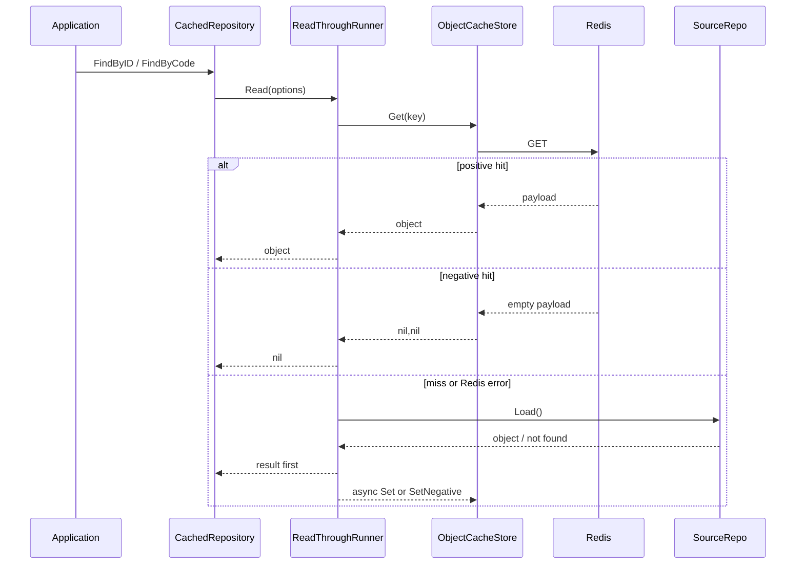
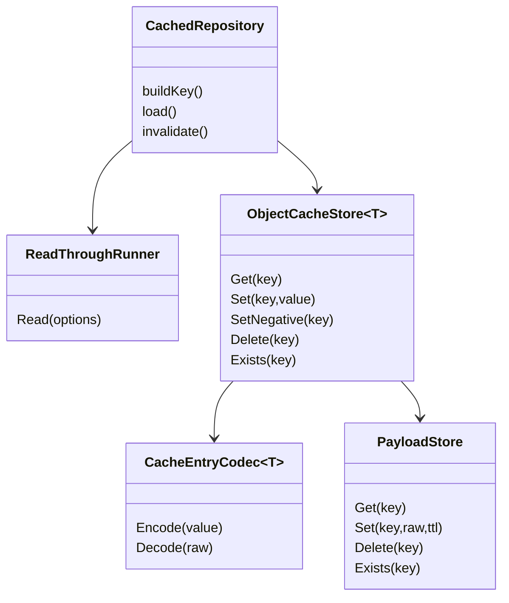
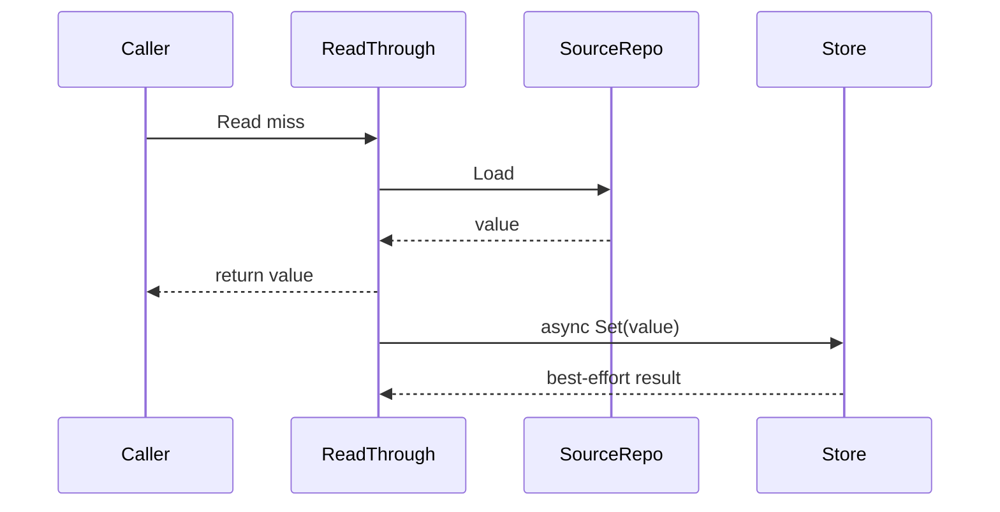

# Object Cache 主路径

**本文回答**：object repository cache 的 read-through、entry codec/store、negative cache、compression、async writeback 和 delete invalidation 如何协作。

## 30 秒结论

| 组件 | 职责 |
| ---- | ---- |
| `Cached*Repository` | 保持 repository decorator 形态，负责 key 与业务回源 |
| `ReadThroughRunner` | 统一 hit/miss/load/writeback/singleflight 流程 |
| `ObjectCacheStore` | 统一 Redis entry get/set/delete/negative/exists |
| `CacheEntryCodec` | domain object 与 JSON payload 转换 |
| `cacheentry.PayloadStore` | Redis payload、compression、observability |

## Read-through 时序

## Entry codec/store 模型

## Async writeback

## 当前 object cache 清单

| 对象 | 文件 | family |
| ---- | ---- | ------ |
| scale | [scale_cache.go](../../../internal/apiserver/infra/cache/scale_cache.go) | `static_meta` |
| questionnaire | [questionnaire_cache.go](../../../internal/apiserver/infra/cache/questionnaire_cache.go) | `static_meta` |
| assessment_detail | [assessment_detail_cache.go](../../../internal/apiserver/infra/cache/assessment_detail_cache.go) | `object_view` |
| testee | [testee_cache.go](../../../internal/apiserver/infra/cache/testee_cache.go) | `object_view` |
| plan | [plan_cache.go](../../../internal/apiserver/infra/cache/plan_cache.go) | `object_view` |

## 行为边界

- `redis.Nil` 是 miss。
- Redis error 对 read-through 主路径按 miss 降级。
- negative sentinel 是空 payload。
- nil cache/client 下，Get 返回 miss，Set/Delete no-op。
- delete invalidation 是 best-effort，但不应阻断主写流程。

## Verify

- [object_cache_store.go](../../../internal/apiserver/infra/cache/object_cache_store.go)
- [object_readthrough.go](../../../internal/apiserver/infra/cache/object_readthrough.go)
- [readthrough.go](../../../internal/apiserver/infra/cache/readthrough.go)
- [object_cache_contract_test.go](../../../internal/apiserver/infra/cache/object_cache_contract_test.go)
