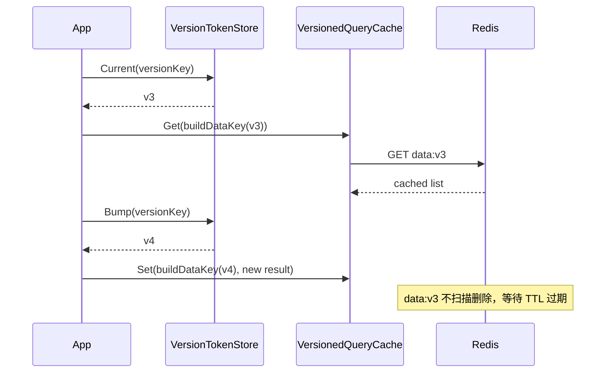
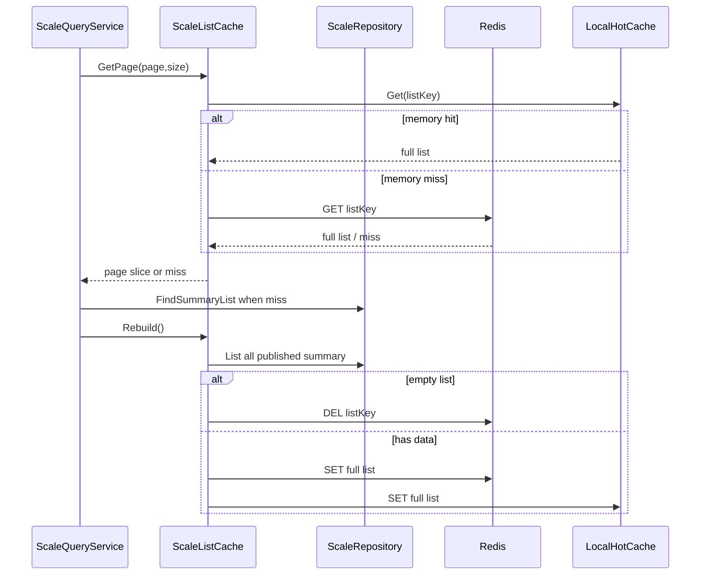
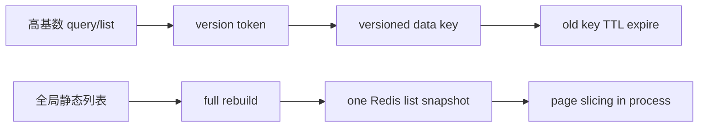

# Query Cache 与 StaticList

**本文回答**：`cachequery` 的 version token / versioned key 如何让 query/list 缓存失效，`ScaleListCache` 为什么是 static-list rebuilder 而不是 object decorator。

## 30 秒结论

| 能力 | 当前实现 | 失效方式 |
| ---- | -------- | -------- |
| versioned query | `VersionTokenStore + VersionedQueryCache` | bump version token，旧 key TTL 过期 |
| local hot cache | `LocalHotCache` | 节点内短 TTL |
| assessment list | `MyAssessmentListCache` | version token |
| statistics query | `infra/statistics/cache.go` | TTL + warmup 重建 |
| scale list | `ScaleListCache` | rebuild 覆盖，空列表 delete |

## Version token 失效时序

## Static-list rebuild 时序

## 模型对比

## 当前实现

| 路径 | 文件 | 说明 |
| ---- | ---- | ---- |
| version token | [version_token_store.go](../../../internal/apiserver/infra/cachequery/version_token_store.go) | query/list 的版本游标 |
| versioned query | [versioned_query_cache.go](../../../internal/apiserver/infra/cachequery/versioned_query_cache.go) | versioned data key |
| local hot cache | [local_hot_cache.go](../../../internal/apiserver/infra/cachequery/local_hot_cache.go) | 进程内短 TTL |
| assessment list | [my_assessment_list_cache.go](../../../internal/apiserver/infra/cachequery/my_assessment_list_cache.go) | 我的测评列表 |
| scale list | [global_list_cache.go](../../../internal/apiserver/application/scale/global_list_cache.go) | 已发布量表列表 |
| statistics query | [infra/statistics/cache.go](../../../internal/apiserver/infra/statistics/cache.go) | 统计查询缓存 |

## 选择规则

- 查询维度多、失效点宽：优先 version token。
- 全局列表快照、页内切片：优先 static-list rebuilder。
- 统计查询：保持 TTL 驱动 + warmup，不新增业务 invalidation 除非单独设计。
- 不要把 static-list 强行做成 object repository decorator。

## Verify

- [cachequery tests](../../../internal/apiserver/infra/cachequery)
- [global_list_cache_test.go](../../../internal/apiserver/application/scale/global_list_cache_test.go)
- [statistics cache tests](../../../internal/apiserver/infra/statistics/cache_test.go)
