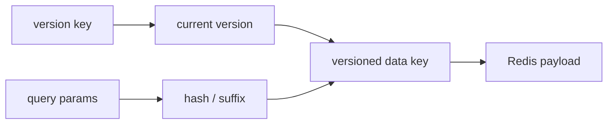
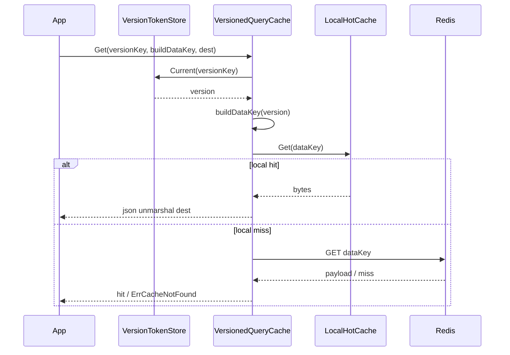
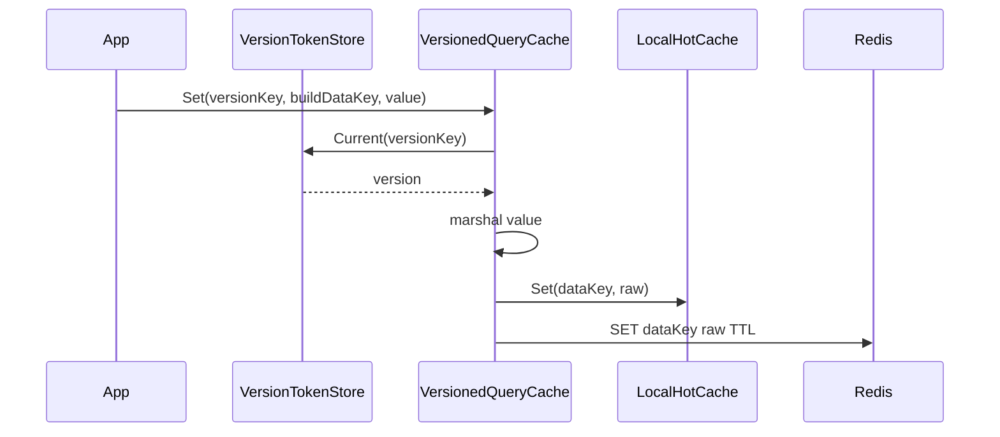
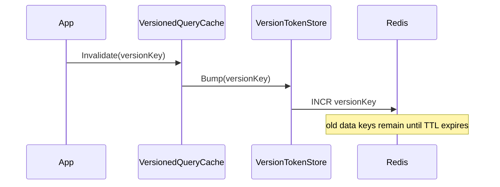
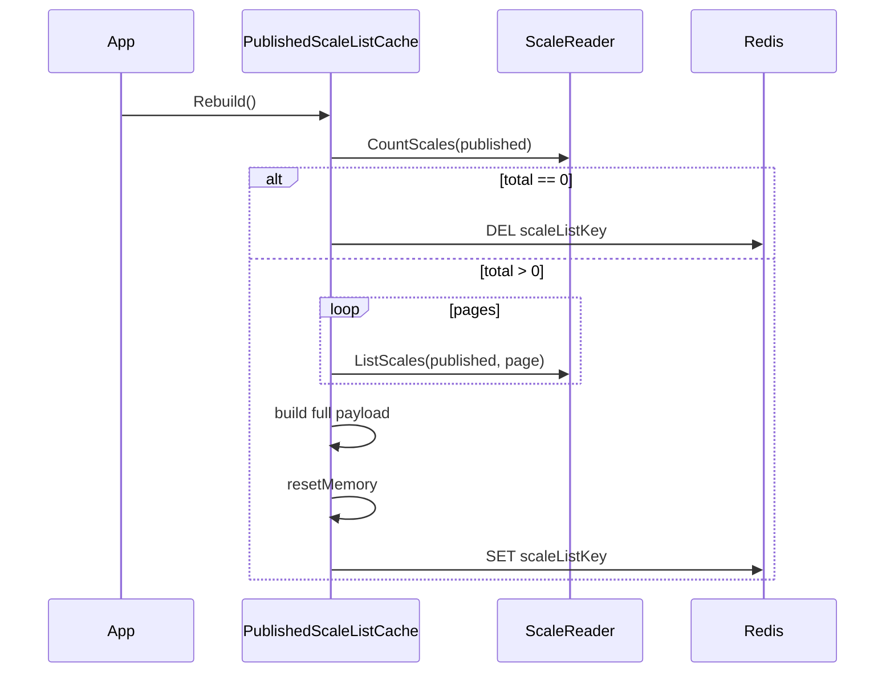

# QueryCache 与 StaticList

**本文回答**：qs-server 中 `cachequery` 如何用 version token + versioned key 支撑查询/列表缓存失效；`MyAssessmentListCache` 如何缓存“我的测评列表”；`PublishedScaleListCache` 为什么是 static-list rebuilder，而不是 ObjectCache repository decorator；QueryCache、StaticList 和 Statistics QueryCache 的边界分别是什么。

---

## 30 秒结论

| 能力 | 适用对象 | 失效方式 | 典型实现 |
| ---- | -------- | -------- | -------- |
| Versioned QueryCache | 查询/列表结果 | bump version token，旧 versioned key 等 TTL 过期 | `VersionedQueryCache` |
| LocalHotCache | 进程内热点查询结果 | 本地 TTL + LRU 容量 | `LocalHotCache` |
| MyAssessmentListCache | 用户维度测评列表 | userID version token | `my_assessment_list_cache.go` |
| Statistics QueryCache | 统计 overview / dashboard query | TTL + warmup，部分路径用 static version token | `infra/statistics/cache.go` |
| StaticList | 全局发布列表快照 | rebuild 覆盖；空列表 delete key | `PublishedScaleListCache` |
| ScaleListCache Port | 应用层消费的已发布量表列表缓存端口 | `Rebuild / GetPage` | `port/scalelistcache` |

| 维度 | 结论 |
| ---- | ---- |
| QueryCache 核心 | 用 `versionKey -> version -> versionedDataKey` 避免扫描删除高基数 query key |
| version 初值 | Redis version key 不存在时 `Current()` 返回 0 |
| invalidation | `Bump()` 使用 Redis `INCR` 递增版本 |
| data key | 查询参数通常 hash 后拼入 versioned key，避免 key 过长 |
| local cache | 进程内短 TTL LRU，只加速热点，不作为跨进程事实 |
| StaticList 核心 | Redis 保存全量列表快照，分页在进程内切片 |
| ScaleList 特点 | 只缓存已发布量表列表，Rebuild 会从 read model 全量拉取并写入 Redis |
| 边界 | QueryCache/StaticList 都是读优化；事实源仍然是 repository/read model |

一句话概括：

> **QueryCache 解决“很多查询 key 怎么失效”，StaticList 解决“全局稳定列表怎么快速分页读取”。**

---

## 1. 为什么 QueryCache 不能像 ObjectCache 一样 delete key

ObjectCache 的 key 通常稳定：

```text
scale:{code}
testee:{id}
plan:{id}
```

写操作后直接 delete 一个 key 通常可行。

但查询缓存不同：

```text
assessment list:
  user_id=123&page=1&page_size=20&status=...
  user_id=123&page=2&page_size=20&status=...
  user_id=123&page=1&page_size=50&risk_level=...
```

如果每个查询条件都是一个 key，当某个 Assessment 发生变化时，很难知道要删除哪些 key。

错误做法：

```text
SCAN assessment_list:user:123:*
DEL ...
```

问题：

- Redis scan/delete 成本不可控。
- key 命名复杂。
- 容易误删。
- 高并发下删除和写入竞态。
- 多 namespace/profile 更难处理。

所以 qs-server 使用 versioned query cache：

```text
versionKey
  -> version
  -> versionedDataKey
```

失效时只 bump version，不扫描删除旧 key。

---

## 2. Versioned QueryCache 模型



### 2.1 读流程



### 2.2 写流程



### 2.3 失效流程



---

## 3. VersionTokenStore

`VersionTokenStore` 接口：

```go
type VersionTokenStore interface {
    Current(ctx, versionKey) (uint64, error)
    Bump(ctx, versionKey) (uint64, error)
}
```

### 3.1 RedisVersionTokenStore

`RedisVersionTokenStore` 使用 Redis 保存版本 token。

| 方法 | 行为 |
| ---- | ---- |
| `Current` | GET versionKey；key 不存在时返回 0 |
| `Bump` | INCR versionKey，返回新版本 |

### 3.2 version key 不存在为什么是 0

新系统或刚清缓存时 version key 可能不存在。

此时：

```text
Current(versionKey) = 0
data key = versioned_key(..., version=0, ...)
```

这样无需提前初始化 version token。

### 3.3 StaticVersionTokenStore

`StaticVersionTokenStore(version)` 总是返回固定版本。

适合：

- TTL 驱动的查询缓存。
- 不需要业务 invalidate 的路径。
- 通过 warmup 重建结果。
- 统计 overview 这类短 TTL dashboard query。

注意：static version 不能通过 Bump 真正失效。

---

## 4. VersionedQueryCache

`VersionedQueryCache` 管理：

| 字段 | 说明 |
| ---- | ---- |
| `version` | VersionTokenStore |
| `policy` | CachePolicy |
| `key` | CachePolicyKey |
| `ttl` | 默认 TTL |
| `memory` | LocalHotCache |
| `observer` | family observer |
| `payload` | PayloadStore |

### 4.1 Get

Get 做：

1. Current(versionKey)。
2. buildDataKey(version)。
3. 先查 LocalHotCache。
4. miss 后查 Redis PayloadStore。
5. JSON unmarshal 到 dest。
6. 记录 hit/miss/error 和 duration。

如果 version token 获取失败，直接返回 `ErrCacheNotFound`，业务回源。

### 4.2 Set

Set 做：

1. Current(versionKey)。
2. buildDataKey(version)。
3. json.Marshal(value)。
4. 写 LocalHotCache。
5. 写 Redis PayloadStore。
6. 写失败只记录 error，不应破坏主查询结果。

### 4.3 Invalidate

Invalidate 做：

```text
version.Bump(versionKey)
```

并记录 invalidate outcome。

---

## 5. LocalHotCache

`LocalHotCache[T]` 是进程内短 TTL LRU。

### 5.1 结构

| 字段 | 说明 |
| ---- | ---- |
| ttl | 本地缓存 TTL |
| maxEntries | 最大条目数 |
| list | LRU 双向链表 |
| items | key -> list element |

### 5.2 Get

- key 不存在 -> miss。
- key 过期 -> 删除并 miss。
- key 命中 -> 移到 front。

### 5.3 Set

- key 已存在 -> 更新 value/expire 并移到 front。
- key 不存在 -> 插入 front。
- 超过 maxEntries -> 删除尾部。

### 5.4 边界

LocalHotCache：

- 只在单进程内有效。
- 进程重启即丢。
- 不跨 worker/apiserver 实例同步。
- 不能作为一致性机制。
- 只适合极短 TTL 热点优化。

---

## 6. MyAssessmentListCache

`MyAssessmentListCache` 是典型 versioned query cache。

### 6.1 它缓存什么

缓存“我的测评列表”查询结果。

参数包括：

```text
userID
page
pageSize
status
scaleCode
riskLevel
dateFrom
dateTo
```

### 6.2 version key

version key 只按 userID：

```text
BuildAssessmentListVersionKey(userID)
```

这表示：

```text
某个用户的测评列表整体版本
```

当该用户相关 Assessment 发生变化时，可以 bump userID 的 version。

### 6.3 data key

data key 由：

```text
userID
version
hash(query params)
```

构成。

查询参数先拼成 raw string，再 sha256，取前 8 位作为 hash：

```text
status=...&scale_code=...&risk_level=...&date_from=...&date_to=...&page=...&page_size=...
```

然后：

```text
BuildAssessmentListVersionedKey(userID, version, hash)
```

### 6.4 为什么 query params 要 hash

好处：

- key 长度可控。
- 不暴露复杂参数。
- 不容易出现非法字符。
- 同 version 下不同查询条件可共存。

### 6.5 TTL 和 LocalHotCache

默认：

```text
Redis TTL = 10 min
LocalHotCache TTL = 30 sec
LocalHotCache max entries = 512
```

---

## 7. Statistics QueryCache

Statistics QueryCache 也属于 QueryCache 体系，但它的失效思路不同。

### 7.1 特点

统计 query 常见特点：

- dashboard 高频。
- 查询窗口固定，例如 today / 7d / 30d。
- 结果允许短暂延迟。
- 事实源是 Statistics ReadModel。
- sync 完成后可以 warmup。

### 7.2 当前语义

Statistics cache 当前更多依赖：

```text
TTL
warmup
hotset
sync/rebuild 后预热
```

而不是每个业务写入都触发 invalidate。

这避免每次业务写入都更新大量统计 query version。

### 7.3 适用边界

适合：

- overview。
- dashboard。
- 低基数标准 preset。
- 可接受最终一致的统计。

不适合：

- 管理端实时排障查询。
- 高基数自定义 from/to。
- 需要逐事件强一致更新的查询。

---

## 8. StaticList 是什么

StaticList 是“全局稳定列表快照”缓存。

它不同于 QueryCache：

| 维度 | QueryCache | StaticList |
| ---- | ---------- | ---------- |
| key 数量 | 多 query key | 通常一个全量 list key |
| 失效方式 | bump version | rebuild 覆盖 |
| 存储内容 | 某个查询结果 | 全量列表快照 |
| 分页方式 | 每个 query 可单独缓存 | 从全量 list 进程内切片 |
| 适用 | 高基数查询 | 规模可控的全局发布列表 |

---

## 9. PublishedScaleListCache

`PublishedScaleListCache` 是当前 StaticList 的代表。

### 9.1 Port

应用层依赖 `scalelistcache.PublishedListCache`：

```go
type PublishedListCache interface {
    Rebuild(ctx context.Context) error
    GetPage(ctx context.Context, page, pageSize int) (*Page, bool)
}
```

返回的是端口结构：

```text
Page
  Items []Summary
  Total int64
```

应用层不依赖 Redis 细节。

### 9.2 Rebuild

`Rebuild(ctx)` 做：

1. 构造 filter：`Status = published`。
2. CountScales。
3. 如果 total == 0，删除 scale list key。
4. 如果 total > 0，分页拉取全部 published scale summary。
5. 解析 user display names。
6. 构造完整 list payload。
7. reset local memory cache。
8. Redis SET scale list payload。



### 9.3 GetPage

`GetPage(ctx, page, pageSize)` 做：

1. 先查 LocalHotCache，key = page/pageSize。
2. 本地 miss 后读 Redis full list payload。
3. Redis miss/error 返回 `nil,false`。
4. 反序列化 full list。
5. page/pageSize 不合法返回 `nil,false`。
6. 根据 page/pageSize 在进程内切片。
7. 结果写入 LocalHotCache。
8. 返回 page result 和 true。

### 9.4 空列表为什么 delete key

如果已发布量表数为 0：

```text
DEL scaleListKey
```

而不是缓存空列表。

这样 `GetPage` miss 后可以让应用层回源，避免把“当前无数据”和“缓存未构建”长期混淆。

---

## 10. StaticList 为什么不是 ObjectCache

Scale list 不是单对象：

```text
scale:ABC
```

而是：

```text
所有 published scales 的列表快照
```

它不适合 ObjectCache，因为：

- 没有单个稳定 object id。
- 分页只是列表视图。
- 失效通常由发布/下线触发。
- 适合整体 rebuild。
- 适合 startup/warmup。

也不完全适合普通 QueryCache，因为它的查询维度非常低，保存全量列表再本地分页更简单。

---

## 11. QueryCache 与 StaticList 选择规则

| 场景 | 建议 |
| ---- | ---- |
| 用户私有列表，有多个筛选条件 | QueryCache |
| 机构 dashboard 统计 | QueryCache + Hotset/Warmup |
| 全局 published scale list | StaticList |
| 全局 published questionnaire list | StaticList 或类似结构 |
| 单个 scale detail | ObjectCache |
| 单个 questionnaire detail | ObjectCache |
| 高基数搜索 | 通常不要缓存，或谨慎 QueryCache |
| 强实时列表 | 直接回源或极短 TTL |

---

## 12. Invalidation / Rebuild 边界

### 12.1 QueryCache 失效

使用：

```text
Invalidate(versionKey)
  -> Bump(versionKey)
```

旧 data key 不删除，等待 TTL 过期。

适合：

- 同一业务对象影响多个查询 key。
- 不知道所有 data key。
- 不想 scan/delete。

### 12.2 StaticList 重建

使用：

```text
Rebuild()
  -> 重新读取全部 published items
  -> 覆盖 list key
```

适合：

- 列表规模可控。
- 更新频率低。
- 查询频率高。
- 可在发布后或 startup warmup 执行。

### 12.3 TTL 兜底

无论 QueryCache 还是 StaticList，都应保留 TTL。

原因：

- 防止失效事件丢失。
- 防止旧 key 永久占用内存。
- 防止 rebuild 逻辑异常后长期不变。
- 作为最终自然回收机制。

---

## 13. 与 Hotset / Governance 的关系

### 13.1 QueryCache

QueryCache 通常适合接 hotset：

```text
query.stats_overview org:preset
query.stats_plan org:plan
```

治理层可根据 hotset 预热。

### 13.2 StaticList

StaticList 通常适合 seed warmup：

```text
startup static warmup
scale published后 warmup
repair complete warmup
```

因为它是低基数固定目标，不一定需要依赖 hotset。

### 13.3 suppress hotset

Warmup 执行过程中应抑制 hotset 记录，避免：

```text
warmup -> query -> record hotset -> 下一次 warmup 更热
```

---

## 14. 与 ObjectCache 的边界

| 维度 | ObjectCache | QueryCache | StaticList |
| ---- | ----------- | ---------- | ---------- |
| 缓存粒度 | 单对象 | 查询结果 | 全量列表 |
| key 类型 | stable id/code | version + query hash | one list key |
| 失效 | delete key | bump version | rebuild |
| negative cache | 常用 | 少用 | 通常不用 |
| singleflight | 常用 | 谨慎 | 通常由 rebuild 控制 |
| local cache | 少量场景 | hot query bytes | page slice |
| warmup | 对象热点 | 查询热点 | seed/static |

---

## 15. Degraded 行为

### 15.1 QueryCache degraded

如果 version token 或 payload Redis 不可用：

```text
Get -> ErrCacheNotFound
业务回源
Set -> no-op or observe error
```

### 15.2 StaticList degraded

如果 scale list cache miss/error：

```text
GetPage -> false
应用层回源 ScaleReader
```

Rebuild 失败应返回 error 给调用方，并记录 family failure。

### 15.3 LocalHotCache degraded

LocalHotCache 是内存结构，不依赖 Redis。为空或禁用时只是少一层本地加速。

---

## 16. 观测

### 16.1 Version Token

记录：

- current ok/error。
- bump ok/error。
- duration。
- family success/failure。

### 16.2 QueryCache

记录：

- hit/miss/error。
- set ok/error。
- payload size。
- operation duration。

### 16.3 StaticList

记录：

- family success/failure。
- payload set/delete error。
- local cache 不作为 Prometheus 主指标，避免过细。

---

## 17. 设计模式与实现意图

| 模式 | 当前实现 | 意图 |
| ---- | -------- | ---- |
| Versioned Key | VersionedQueryCache | 让查询失效不用 scan/delete |
| Version Token | RedisVersionTokenStore | 用 INCR 生成查询版本 |
| Local Hot Cache | LocalHotCache | 节点内热点短缓存 |
| Query Param Hash | MyAssessmentListCache | 控制 data key 长度 |
| Static Snapshot | PublishedScaleListCache | 全局稳定列表快照 |
| Port | scalelistcache.PublishedListCache | 应用层不依赖 Redis |
| Rebuilder | Rebuild() | 显式刷新 static list |
| TTL Fallback | policy TTL | 自然回收旧数据 |

---

## 18. 设计取舍

| 设计 | 收益 | 代价 |
| ---- | ---- | ---- |
| version token | 不扫描删 key | 旧 key 留到 TTL 过期 |
| userID 级 version | 失效简单 | 用户所有列表查询一起失效 |
| query hash | key 短且稳定 | hash 不是可读参数 |
| local hot cache | 降低 Redis 读 | 多实例不共享 |
| StaticList 全量缓存 | 分页快、逻辑简单 | 列表过大时不适合 |
| Rebuild 覆盖 | 结果一致 | 需要触发时机 |
| 空列表 delete | 避免长期缓存空结果 | 应用层要能回源 |
| TTL + warmup | 可自然恢复 | 存在短暂 stale |

---

## 19. 常见误区

### 19.1 “查询缓存失效就应该删除所有 query key”

不建议。应该 bump version token。

### 19.2 “LocalHotCache 可以保证跨实例一致”

不能。它只是单进程短 TTL 缓存。

### 19.3 “ScaleListCache 是 ObjectCache”

不是。它是 static-list rebuilder，缓存全量发布列表。

### 19.4 “StaticList 适合所有列表”

不适合。只适合低维、全局、规模可控、更新频率低的列表。

### 19.5 “Statistics query 应每次业务写入都 bump version”

不一定。统计查询通常通过 sync/warmup/TTL 管理，不适合每次业务写入都失效所有 dashboard key。

### 19.6 “version key 不存在是错误”

不是。它代表 version 0。

---

## 20. 排障路径

### 20.1 Assessment list 缓存不命中

检查：

1. versionKey 是否存在，不存在则 version=0。
2. dataKey 是否由相同参数 hash 生成。
3. policy TTL。
4. Redis query_result family 是否 available。
5. VersionedQueryCache Set 是否成功。
6. 是否频繁 Invalidate。

### 20.2 Assessment list 数据旧

检查：

1. 相关业务写入后是否调用 Invalidate(userID)。
2. version token 是否 bump。
3. 是否读到旧 version data key。
4. local hot cache 是否仍有旧值。
5. TTL 是否过长。

### 20.3 Scale list miss

检查：

1. Rebuild 是否执行。
2. CountScales(published) 是否为 0。
3. total=0 时是否 delete key。
4. Redis static_meta family 是否 available。
5. payload JSON 是否可 unmarshal。
6. page/pageSize 是否非法。

### 20.4 Scale list 数据旧

检查：

1. 量表发布/下线后是否触发 Rebuild 或 warmup。
2. local memory 是否 reset。
3. Redis key 是否覆盖。
4. TTL。
5. query service 是否 fallback 到 source。

---

## 21. 修改指南

### 21.1 新增 Versioned QueryCache

步骤：

1. 判断查询是否高频、低/中基数、允许短暂 stale。
2. 定义 version scope。
3. 定义 query params hash。
4. 增加 keyspace builder 方法。
5. 创建 VersionedQueryCache。
6. 实现 Get/Set/Invalidate。
7. 设计 invalidate 触发点。
8. 补 LocalHotCache 策略。
9. 补 tests/docs。

### 21.2 新增 StaticList

步骤：

1. 判断列表是否全局、规模可控、更新频率低。
2. 定义 port。
3. 定义 full list payload。
4. 实现 Rebuild。
5. 实现 GetPage。
6. 定义空列表语义。
7. 定义 warmup 触发点。
8. 补 tests/docs。

### 21.3 修改 VersionToken

谨慎评估：

- scope 是否太宽。
- scope 是否太窄。
- 是否需要按 org/user/plan 拆分。
- Bump 频率是否过高。
- 旧 key TTL 是否合理。

---

## 22. 代码锚点

### Versioned Query

- Version token store：[../../../internal/apiserver/infra/cachequery/version_token_store.go](../../../internal/apiserver/infra/cachequery/version_token_store.go)
- Versioned query cache：[../../../internal/apiserver/infra/cachequery/versioned_query_cache.go](../../../internal/apiserver/infra/cachequery/versioned_query_cache.go)
- Local hot cache：[../../../internal/apiserver/infra/cachequery/local_hot_cache.go](../../../internal/apiserver/infra/cachequery/local_hot_cache.go)
- My assessment list cache：[../../../internal/apiserver/infra/cachequery/my_assessment_list_cache.go](../../../internal/apiserver/infra/cachequery/my_assessment_list_cache.go)

### StaticList

- Scale list cache port：[../../../internal/apiserver/port/scalelistcache/cache.go](../../../internal/apiserver/port/scalelistcache/cache.go)
- Published scale list cache：[../../../internal/apiserver/infra/cachequery/scale_list_cache.go](../../../internal/apiserver/infra/cachequery/scale_list_cache.go)

### Shared

- PayloadStore：[../../../internal/apiserver/infra/cacheentry/payload_store.go](../../../internal/apiserver/infra/cacheentry/payload_store.go)
- Keyspace builder：[../../../internal/pkg/cacheplane/keyspace/builder.go](../../../internal/pkg/cacheplane/keyspace/builder.go)
- Cache policy：[../../../internal/apiserver/infra/cachepolicy/policy.go](../../../internal/apiserver/infra/cachepolicy/policy.go)

---

## 23. Verify

```bash
go test ./internal/apiserver/infra/cachequery
go test ./internal/apiserver/port/scalelistcache
go test ./internal/apiserver/application/scale
go test ./internal/apiserver/infra/cacheentry
go test ./internal/pkg/cacheplane/keyspace
```

如果修改 statistics query cache：

```bash
go test ./internal/apiserver/infra/statistics
go test ./internal/apiserver/application/statistics
go test ./internal/apiserver/application/cachegovernance
```

如果修改文档：

```bash
make docs-hygiene
git diff --check
```

---

## 24. 下一跳

| 目标 | 文档 |
| ---- | ---- |
| Hotset 与 WarmupTarget | [05-Hotset与WarmupTarget模型.md](./05-Hotset与WarmupTarget模型.md) |
| 缓存治理层 | [07-缓存治理层.md](./07-缓存治理层.md) |
| 观测降级排障 | [08-观测降级与排障.md](./08-观测降级与排障.md) |
| ObjectCache 主路径 | [03-ObjectCache主路径.md](./03-ObjectCache主路径.md) |
| Cache 层总览 | [02-Cache层总览.md](./02-Cache层总览.md) |
