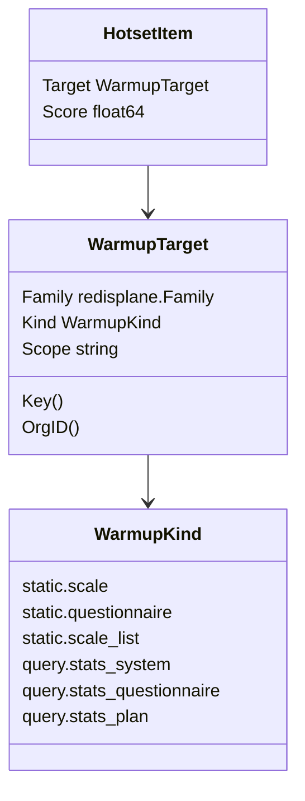
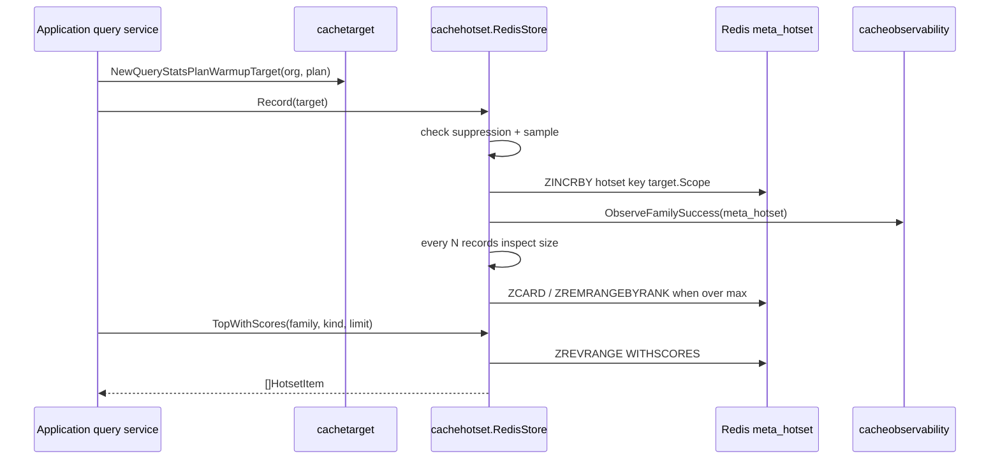
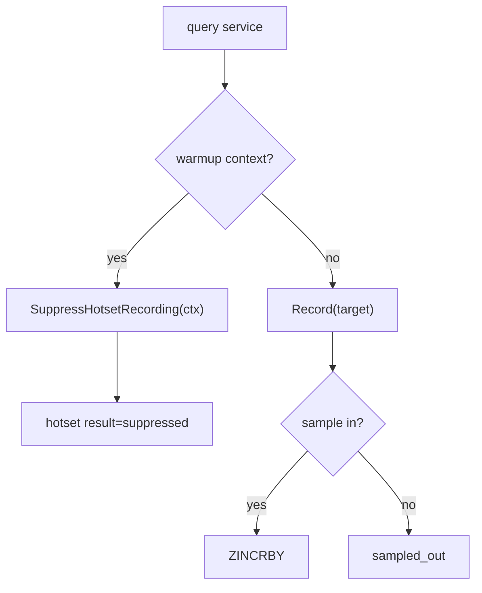

# Hotset 与 WarmupTarget 模型

**本文回答**：`cachetarget` 如何定义可治理缓存目标，`cachehotset` 如何记录热点，hotset 与 warmup 如何协作。

## 30 秒结论

| 概念 | 说明 | 代码 |
| ---- | ---- | ---- |
| `WarmupKind` | 可治理目标类型 | [cachetarget/target.go](../../../internal/apiserver/cachetarget/target.go) |
| `WarmupTarget` | family + kind + scope 的稳定目标 | [cachetarget/target.go](../../../internal/apiserver/cachetarget/target.go) |
| `HotsetRecorder` | application 层记录热点目标的端口 | [cachetarget/target.go](../../../internal/apiserver/cachetarget/target.go) |
| `RedisStore` | 使用 `meta_hotset` ZSet 存储热点排行 | [cachehotset/store.go](../../../internal/apiserver/infra/cachehotset/store.go) |

## WarmupTarget 模型

## Scope canonical 格式

| Kind | Family | Scope |
| ---- | ------ | ----- |
| `static.scale` | `static_meta` | `scale:{code}` |
| `static.questionnaire` | `static_meta` | `questionnaire:{code}` |
| `static.scale_list` | `static_meta` | `published` |
| `query.stats_system` | `query_result` | `org:{orgID}` |
| `query.stats_questionnaire` | `query_result` | `org:{orgID}:questionnaire:{code}` |
| `query.stats_plan` | `query_result` | `org:{orgID}:plan:{planID}` |

## Hotset record/top/trim 时序

## Recording suppression

## 使用边界

- hotset 是 warmup 候选与治理观测，不是业务权限来源。
- `cachetarget` 是 application、governance、infra hotset 的共享目标模型。
- query target 的 orgID 解析由 `WarmupTarget.OrgID()` 提供，BFF 不应维护另一套规则。
- warmup 执行失败不应回写成业务错误，除非调用方明确是 manual command。

## Verify

- target parser：[cachetarget/target_test.go](../../../internal/apiserver/cachetarget/target_test.go)
- hotset store：[cachehotset/store_test.go](../../../internal/apiserver/infra/cachehotset/store_test.go)
- governance status：[cachegovernance/status_service_test.go](../../../internal/apiserver/application/cachegovernance/status_service_test.go)
