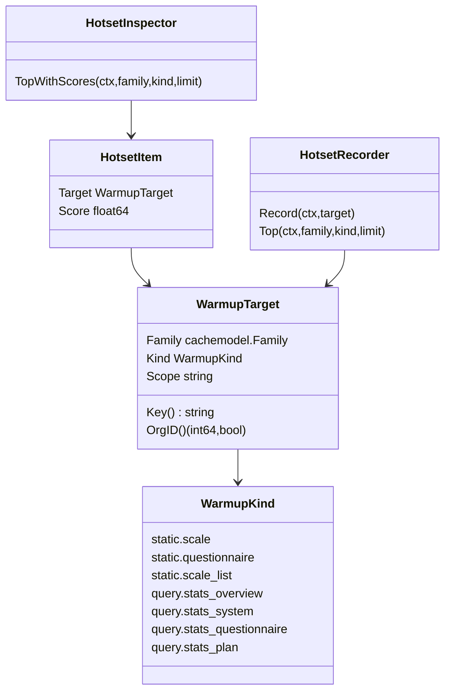
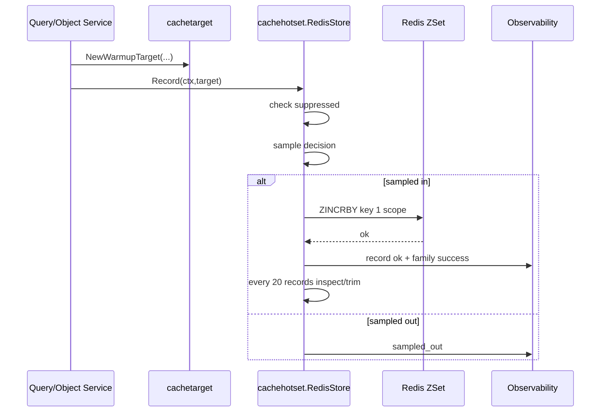
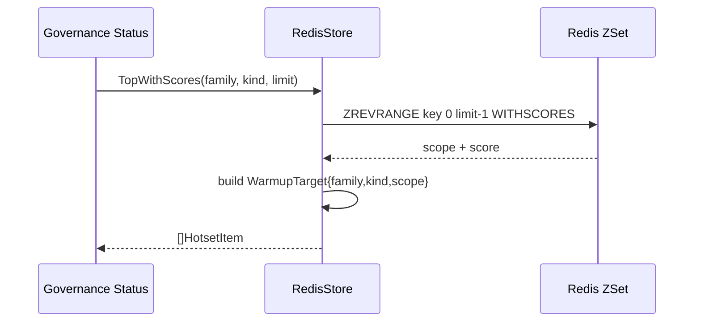
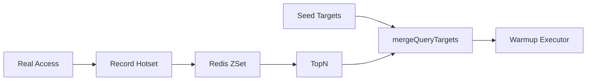

# Hotset 与 WarmupTarget 模型

**本文回答**：qs-server 如何用 `WarmupTarget` 统一表达可治理缓存目标；`scope` 为什么必须规范化和可解析；`HotsetRecorder` 如何把真实访问记录到 Redis ZSet；hotset 如何服务 cache governance 的 warmup；为什么 hotset 是治理信号而不是业务事实。

---

## 30 秒结论

| 概念 | 结论 |
| ---- | ---- |
| WarmupKind | 可治理缓存目标类型，例如 `static.scale`、`query.stats_overview` |
| WarmupTarget | 由 `Family + Kind + Scope` 组成的稳定目标 |
| Scope | 目标的 canonical 标识，例如 `scale:abc`、`org:1:preset:7d` |
| Key | `family|kind|scope`，用于去重和排序 |
| OrgID | query 类 target 可通过 `WarmupTarget.OrgID()` 解析所属 org |
| FamilyForKind | static 类归 `static_meta`，query statistics 类归 `query_result` |
| HotsetRecorder | application 层记录访问热点的端口 |
| HotsetInspector | 治理状态读取带 score 的热点目标 |
| RedisStore | 用 `meta_hotset` family 的 Redis ZSet 记录 TopN 热点 |
| Suppression | warmup 上下文可调用 `SuppressHotsetRecording(ctx)`，避免预热污染 hotset |
| Sampling | 除 scale_list 外，hotset 记录默认采样 10%，降低写 Redis 压力 |
| Trim | 每 20 次记录尝试检查并按 MaxItemsPerKind 裁剪 |
| 边界 | Hotset 是 warmup 候选与治理观测，不是业务权限、排序或事实源 |

一句话概括：

> **WarmupTarget 定义“什么可以预热”，Hotset 记录“什么最近值得预热”，Governance 决定“什么时候执行预热”。**

---

## 1. 为什么需要 WarmupTarget

缓存治理需要回答几个问题：

```text
哪个缓存对象可以预热？
这个目标属于 static 还是 query？
目标 scope 如何唯一表示？
这个目标属于哪个 org？
能否从治理接口手工触发？
能否从 hotset 自动选出？
warmup 过程中如何避免再次记录热点？
```

如果直接用裸字符串表示目标，会出现：

| 问题 | 后果 |
| ---- | ---- |
| scope 格式不统一 | governance 无法解析 |
| family/kind 不明确 | 无法路由 warmup executor |
| org 无法解析 | 无法按机构过滤 |
| 高基数 from/to 全进 hotset | Redis ZSet 污染 |
| 手工 warmup scope 不校验 | 可能预热错误目标 |
| warmup 自己记录 hotset | 形成虚假热点 |

所以项目定义了 `cachetarget.WarmupTarget`。

---

## 2. WarmupTarget 模型



### 2.1 WarmupTarget 字段

| 字段 | 说明 |
| ---- | ---- |
| `Family` | Redis cache family，例如 static/query |
| `Kind` | 具体治理目标类型 |
| `Scope` | canonical scope 字符串 |

### 2.2 Key

`WarmupTarget.Key()` 返回：

```text
{family}|{kind}|{scope}
```

用途：

- dedupe targets。
- 排序。
- governance 状态显示。
- manual warmup target 归一。

### 2.3 OrgID

`WarmupTarget.OrgID()` 只对 query statistics 类目标有意义：

- `query.stats_overview`。
- `query.stats_system`。
- `query.stats_questionnaire`。
- `query.stats_plan`。

static scale/questionnaire/list 不属于单个 org，因此返回 false。

---

## 3. 当前 WarmupKind 清单

| Kind | Family | Scope 格式 | 示例 |
| ---- | ------ | ---------- | ---- |
| `static.scale` | static | `scale:{code}` | `scale:phq9` |
| `static.questionnaire` | static | `questionnaire:{code}` | `questionnaire:adhd_parent` |
| `static.scale_list` | static | `published` | `published` |
| `query.stats_overview` | query | `org:{orgID}:preset:{preset}` | `org:1:preset:7d` |
| `query.stats_system` | query | `org:{orgID}` | `org:1` |
| `query.stats_questionnaire` | query | `org:{orgID}:questionnaire:{code}` | `org:1:questionnaire:phq9` |
| `query.stats_plan` | query | `org:{orgID}:plan:{planID}` | `org:1:plan:1001` |

### 3.1 支持的 overview preset

`query.stats_overview` 只支持：

```text
today
7d
30d
```

不支持任意 from/to 进入 WarmupTarget。

原因：

- 避免高基数 scope 污染 hotset。
- overview warmup 应围绕标准 dashboard 窗口。
- 自定义时间范围通常不适合自动预热。

---

## 4. Target 构造函数

当前 target 构造函数包括：

| 函数 | 说明 |
| ---- | ---- |
| `NewStaticScaleWarmupTarget(code)` | 量表详情预热 |
| `NewStaticQuestionnaireWarmupTarget(code)` | 问卷详情预热 |
| `NewStaticScaleListWarmupTarget()` | 已发布量表列表预热 |
| `NewQueryStatsOverviewWarmupTarget(orgID,preset)` | 统计 overview 预热 |
| `NewQueryStatsSystemWarmupTarget(orgID)` | 系统统计预热 |
| `NewQueryStatsQuestionnaireWarmupTarget(orgID,code)` | 问卷统计预热 |
| `NewQueryStatsPlanWarmupTarget(orgID,planID)` | 计划统计预热 |

### 4.1 Code 规范化

scale/questionnaire code 会：

```text
strings.ToLower(strings.TrimSpace(code))
```

并带上前缀：

```text
scale:{code}
questionnaire:{code}
```

这保证同一个 code 不会因为大小写或空格形成多个 hotset 目标。

---

## 5. Scope Parser

`ParseWarmupTarget(kind, scope)` 会根据 kind 校验和规范化 scope。

### 5.1 Static parsers

| Parser | 合法 scope |
| ------ | ---------- |
| `ParseStaticScaleScope` | `scale:{code}` |
| `ParseStaticQuestionnaireScope` | `questionnaire:{code}` |
| static scale list | 必须等于 `published` |

### 5.2 Query parsers

| Parser | 合法 scope |
| ------ | ---------- |
| `ParseQueryStatsOverviewScope` | `org:{orgID}:preset:{today|7d|30d}` |
| `ParseQueryStatsSystemScope` | `org:{orgID}` |
| `ParseQueryStatsQuestionnaireScope` | `org:{orgID}:questionnaire:{code}` |
| `ParseQueryStatsPlanScope` | `org:{orgID}:plan:{planID}` |

### 5.3 为什么必须 parser

parser 的价值：

- manual warmup scope 校验。
- governance API 安全。
- 避免大小写/空格漂移。
- 避免高基数非法目标。
- 支持 OrgID 解析。
- 支持 target 去重。

不要让前端、BFF 或运维脚本各自维护 scope 格式。

---

## 6. FamilyForKind

`FamilyForKind(kind)` 负责把 WarmupKind 映射到 Redis cache family：

| Kind | Family |
| ---- | ------ |
| static.scale / static.questionnaire / static.scale_list | `static` |
| query.stats_* | `query` |
| unknown | `default` |

这和 `cachepolicy.FamilyFor(policy)` 是两个不同视角：

| 函数 | 用途 |
| ---- | ---- |
| `cachepolicy.FamilyFor` | cache policy -> family |
| `cachetarget.FamilyForKind` | warmup kind -> family |

---

## 7. HotsetRecorder

`HotsetRecorder` 接口：

```go
type HotsetRecorder interface {
    Record(ctx, target) error
    Top(ctx, family, kind, limit) ([]WarmupTarget, error)
}
```

它面向 application/gov 代码，不暴露 Redis ZSet 细节。

### 7.1 Record

Record 表示：

```text
某个可预热目标被访问了一次
```

不是：

```text
业务事件发生
业务优先级上升
权限授权
统计事实变化
```

### 7.2 Top

Top 返回某个 family/kind 下近期热度最高的 targets。

Governance 可用它选择 warmup 候选。

---

## 8. HotsetInspector

`HotsetInspector` 供治理状态接口使用：

```go
TopWithScores(ctx, family, kind, limit) ([]HotsetItem, error)
```

`HotsetItem` 包含：

```text
target
score
```

Score 来自 Redis ZSet 分数。

---

## 9. RedisStore

`cachehotset.RedisStore` 是 HotsetRecorder/Inspector 的 Redis 实现。

### 9.1 创建条件

`NewRedisStoreWithObserver(client,builder,opts,observer)` 在以下情况返回 nil：

- client nil。
- builder nil。
- opts.Enable=false。

这意味着 Hotset 可以配置关闭，不影响主查询。

### 9.2 默认参数

| 参数 | 默认 |
| ---- | ---- |
| TopN | 20 |
| MaxItemsPerKind | 200 |
| SampleRate | 0.1 |
| TrimEvery | 20 records |

### 9.3 Redis key

RedisStore 通过 governance keyspace 构造：

```text
WarmupHotset(family, kind)
```

底层是 Redis ZSet：

```text
member = target.Scope
score = heat score
```

注意：ZSet member 只存 scope，family/kind 由 key 表达。

---

## 10. Hotset 记录时序



### 10.1 suppress

如果 ctx 中有 suppress 标记：

```text
HotsetRecordingSuppressed(ctx) == true
```

Record 会直接记 `suppressed` outcome，不写 Redis。

### 10.2 sampling

除 `static.scale_list` 外，默认抽样记录。

原因：

- 热点记录可能非常频繁。
- 每次查询都 ZINCRBY 会增加 Redis 写压力。
- topN 治理不需要精确每次访问。

### 10.3 trim

每个 hotset key 记录计数每到 20 次，会：

1. ZCARD。
2. 如果超过 MaxItemsPerKind。
3. ZREMRANGEBYRANK 删除低分项。
4. 更新 hotset size metrics。

---

## 11. TopWithScores 读取时序



### 11.1 limit

如果 limit <= 0，会使用 opts.TopN。

### 11.2 返回 target

返回时重新构造：

```text
WarmupTarget{Family: family, Kind: kind, Scope: scope}
```

因此 scope 格式必须 canonical，否则后续 warmup parser 可能失败。

---

## 12. Recording Suppression

Warmup 执行时应该使用：

```go
cachetarget.SuppressHotsetRecording(ctx)
```

### 12.1 为什么要 suppression

如果不 suppress：

```text
warmup target
  -> query cache
  -> query service
  -> record hotset
  -> target 分数更高
  -> 下次 warmup 更可能选它
```

会形成“自我增强的假热点”。

### 12.2 正确语义

| 场景 | 是否记录 hotset |
| ---- | --------------- |
| 用户真实查询 | 是 |
| 管理端真实访问 dashboard | 是 |
| startup warmup | 否 |
| statistics sync warmup | 否 |
| repair complete warmup | 否 |
| manual warmup | 否 |

---

## 13. Hotset 与 Governance 的关系

Hotset 自己不执行 warmup，它只是提供候选。

完整关系：

```text
真实访问
  -> HotsetRecorder.Record
  -> Redis ZSet TopN
  -> cachegovernance queryHotTargets
  -> merge seed targets
  -> execute warmup targets
```



### 13.1 Seed vs Hotset

| 类型 | 来源 | 语义 |
| ---- | ---- | ---- |
| Seed targets | 配置 / 固定核心目标 | 必须/推荐预热 |
| Hotset targets | 近期访问热度 | 动态候选 |
| Merged targets | seed + hotset dedupe | 实际 warmup 目标 |

---

## 14. Scope 设计原则

新增 scope 时必须满足：

| 原则 | 说明 |
| ---- | ---- |
| canonical | 同一目标只有一种字符串 |
| 可解析 | parser 能还原关键参数 |
| 低基数 | 不要把任意 from/to、search keyword 放入 hotset |
| 可归属 | query 类最好能解析 orgID |
| 安全 | 不包含敏感信息 |
| 稳定 | 不随展示文案变化 |
| 简短 | 避免长 key / 长 member |

### 14.1 不推荐 scope

```text
org:1:from:2026-01-01T12:01:13:to:2026-01-17T09:23:01
keyword:儿童发育量表全部搜索词
user:123:raw_token:...
```

### 14.2 推荐 scope

```text
org:1:preset:7d
org:1:plan:1001
questionnaire:phq9
scale:adhd-parent
published
```

---

## 15. 高基数污染控制

Hotset 高基数污染会导致：

- Redis ZSet 增长。
- TopN 失真。
- Warmup 执行低命中目标。
- Governance status 噪声。
- 排障困难。

当前控制手段：

| 手段 | 说明 |
| ---- | ---- |
| parser 限制 | overview 只接受 today/7d/30d |
| sampling | 默认 10% 写入 |
| MaxItemsPerKind | 每 kind 最大项数 |
| trim | 每 20 次记录尝试维护大小 |
| scope 规范化 | code lower/trim |
| suppression | warmup 不记录热度 |

---

## 16. Hotset 不是业务能力

Hotset 不能用于：

- 权限判断。
- 推荐排序。
- 业务排行榜。
- 计费。
- 审计。
- 业务统计。
- 判断对象是否存在。

它只能用于：

- cache warmup 候选。
- governance status。
- cache 热点排障。

如果需要业务排行榜，应使用独立 business_rank family 或业务 read model，不要复用 warmup hotset。

---

## 17. 与 QueryCache / StaticList 的关系

### 17.1 QueryCache

QueryCache 更适合记录 hotset：

- stats overview。
- stats plan。
- stats questionnaire。
- query dashboard。

但必须限制低基数标准 scope。

### 17.2 StaticList

StaticList 通常不依赖 hotset，因为目标固定：

```text
static.scale_list:published
```

但 scale_list Record 永远采样通过，方便治理层知道列表访问热度。

### 17.3 ObjectCache

ObjectCache 也可以接 hotset，例如 scale/questionnaire 详情访问热度。

但新增时必须确认：

- target kind 是否存在。
- scope 是否 canonical。
- warmup executor 是否支持。

---

## 18. Observability

Hotset 相关指标：

| 指标 | 说明 |
| ---- | ---- |
| `qs_cache_hotset_records_total` | 按 family/kind/result 统计 record 尝试 |
| `qs_cache_warmup_hot_reads_total` | 按 family/kind/result 统计 TopN 读取 |
| hotset size gauge | 每个 family/kind 的 ZSet size |
| family success/failure | meta_hotset family 可用性 |

Record result 包括：

```text
ok
error
suppressed
sampled_out
```

### 18.1 指标标签

允许：

```text
family
kind
result
```

不允许：

```text
scope
orgID
planID
scaleCode
questionnaireCode
```

这些属于高基数，只能在治理状态或日志中出现。

---

## 19. Degraded 行为

### 19.1 Hotset disabled

如果 hotset 未启用，`NewRedisStore` 返回 nil。

调用方应把 nil recorder 当 no-op，不影响主查询。

### 19.2 Redis error

Record 失败：

- 记录 error。
- 记录 meta_hotset family failure。
- 返回 error 给调用方。

但大多数业务查询不应因为 hotset 写失败而失败。调用处通常应 best-effort 处理。

### 19.3 Top read error

TopWithScores 失败：

- 记录 read error。
- governance 可显示 degraded。
- warmup 可跳过 hot targets，仅执行 seed targets。

---

## 20. 设计模式与实现意图

| 模式 | 当前实现 | 意图 |
| ---- | -------- | ---- |
| Target Object | WarmupTarget | 统一预热目标表达 |
| Canonical Scope | ParseWarmupTarget | 防止 scope 漂移 |
| Port | HotsetRecorder / Inspector | 应用层不依赖 Redis |
| Sorted Set | Redis ZSet | 维护热点分数 |
| Sampling | defaultHotsetSampleRate | 降低写压力 |
| Trimming | MaxItemsPerKind | 控制集合大小 |
| Suppression Context | SuppressHotsetRecording | 防止 warmup 污染热点 |
| Seed + Hot merge | cachegovernance | 固定目标和动态热点结合 |

---

## 21. 设计取舍

| 设计 | 收益 | 代价 |
| ---- | ---- | ---- |
| WarmupTarget 三元组 | 目标稳定、可去重 | 新 kind 要写 parser |
| scope parser | 安全可控 | 灵活性降低 |
| 采样记录 | 降低 Redis 写压力 | 分数不是精确访问量 |
| ZSet 存 scope | 存储简单 | family/kind 必须从 key 补全 |
| MaxItems trim | 控制内存 | 低分历史目标被丢弃 |
| hotset nil no-op | 不影响主查询 | 热点治理失效 |
| suppression | 防止假热点 | warmup 访问不会贡献热度 |

---

## 22. 常见误区

### 22.1 “Hotset 就是排行榜”

不是。它是缓存治理热点，不是业务排行榜。

### 22.2 “Scope 可以随便写字符串”

不行。scope 必须可解析、canonical、低基数。

### 22.3 “WarmupTarget 可以包含任意 from/to”

不建议。overview 当前只支持 today/7d/30d。

### 22.4 “Warmup 查询应该记录 hotset”

不应该。否则会制造假热点。

### 22.5 “Hotset 记录失败应让业务查询失败”

通常不应该。Hotset 是治理信号，主查询应继续。

### 22.6 “Score 是准确访问次数”

不准确。默认有采样，score 是近似热度。

---

## 23. 排障路径

### 23.1 Hotset 没有记录

检查：

1. HotsetEnable 是否开启。
2. meta_hotset family 是否 available。
3. recorder 是否 nil。
4. 是否处于 SuppressHotsetRecording context。
5. 是否被 sampling sampled_out。
6. target.Scope 是否为空。
7. kind/family 是否正确。

### 23.2 Governance 看不到热点

检查：

1. TopWithScores 是否报错。
2. family/kind 是否查询正确。
3. limit 是否过小。
4. Redis ZSet key 是否在正确 namespace。
5. MaxItemsPerKind 是否过小导致被 trim。
6. 是否真实访问量不足。

### 23.3 Warmup target 解析失败

检查：

1. kind 是否支持。
2. scope 是否符合 canonical 格式。
3. orgID 是否 > 0。
4. planID 是否 > 0。
5. overview preset 是否为 today/7d/30d。
6. code 是否为空。

### 23.4 Hotset 项过多

检查：

1. 是否把高基数参数写入 scope。
2. MaxItemsPerKind 配置。
3. trim 是否执行。
4. 是否新增了缺 parser 的 kind。
5. 是否手工写入错误 scope。

---

## 24. 修改指南

### 24.1 新增 WarmupKind

步骤：

1. 在 `WarmupKind` 增加常量。
2. 在 `FamilyForKind` 增加映射。
3. 增加 target constructor。
4. 增加 scope parser。
5. 更新 `ParseWarmupKind`。
6. 更新 `ParseWarmupTarget`。
7. 如是 query target，更新 `WarmupTarget.OrgID()`。
8. 增加 governance executor。
9. 增加 hotset record 调用点。
10. 补 tests/docs。

### 24.2 新增 Scope

必须回答：

| 问题 | 要求 |
| ---- | ---- |
| 是否低基数 | 是 |
| 是否可解析 | 是 |
| 是否包含敏感信息 | 否 |
| 是否规范化大小写/空格 | 是 |
| 是否能定位 org | query 类最好能 |
| 是否有 parser tests | 必须 |

### 24.3 新增 Hotset 记录点

必须：

1. 确认是真实用户/业务访问。
2. 构造 WarmupTarget。
3. Record error best-effort 处理。
4. 避免 warmup path 记录。
5. 限制高基数。
6. 补 metrics/tests。

---

## 25. 代码锚点

- WarmupTarget 模型：[../../../internal/apiserver/cachetarget/target.go](../../../internal/apiserver/cachetarget/target.go)
- Hotset RedisStore：[../../../internal/apiserver/infra/cachehotset/store.go](../../../internal/apiserver/infra/cachehotset/store.go)
- Cache governance coordinator：[../../../internal/apiserver/application/cachegovernance/coordinator.go](../../../internal/apiserver/application/cachegovernance/coordinator.go)
- Cache governance status：[../../../internal/apiserver/application/cachegovernance/status_service.go](../../../internal/apiserver/application/cachegovernance/status_service.go)
- Governance keyspace：[../../../internal/pkg/cachegovernance/keyspace/](../../../internal/pkg/cachegovernance/keyspace/)
- Observability：[../../../internal/pkg/cachegovernance/observability/](../../../internal/pkg/cachegovernance/observability/)

---

## 26. Verify

```bash
go test ./internal/apiserver/cachetarget
go test ./internal/apiserver/infra/cachehotset
go test ./internal/apiserver/application/cachegovernance
go test ./internal/pkg/cachegovernance/observability
```

如果修改 keyspace：

```bash
go test ./internal/pkg/cachegovernance/keyspace
go test ./internal/pkg/cacheplane/keyspace
```

如果修改文档：

```bash
make docs-hygiene
git diff --check
```

---

## 27. 下一跳

| 目标 | 文档 |
| ---- | ---- |
| 缓存治理层 | [07-缓存治理层.md](./07-缓存治理层.md) |
| QueryCache 与 StaticList | [04-QueryCache与StaticList.md](./04-QueryCache与StaticList.md) |
| 观测降级排障 | [08-观测降级与排障.md](./08-观测降级与排障.md) |
| 新增 Redis 能力 | [09-新增Redis能力SOP.md](./09-新增Redis能力SOP.md) |
| Cache 层总览 | [02-Cache层总览.md](./02-Cache层总览.md) |
