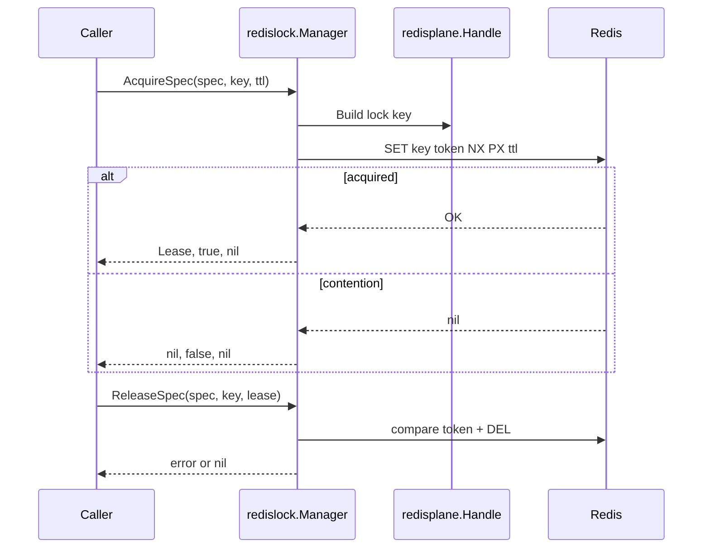
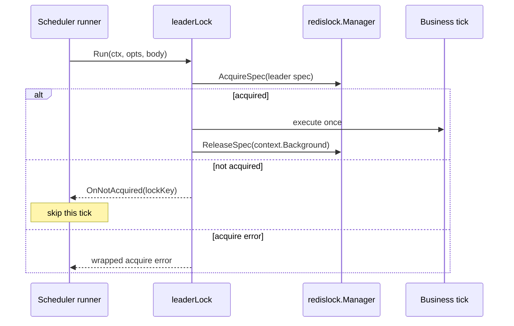
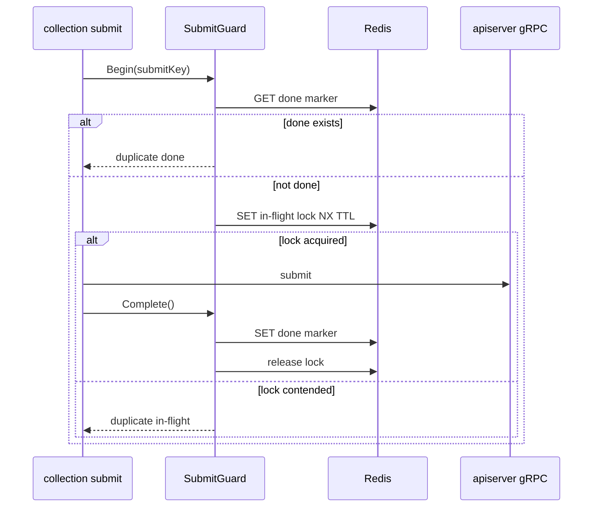

# Redis 分布式锁层

**本文回答**：`redislock` 如何建模 Redis lease，scheduler leader lock、collection submit guard、worker duplicate suppression 三类消费语义如何不同，以及当前明确不支持什么。

## 30 秒结论

| 维度 | 当前结论 |
| ---- | -------- |
| 模型 | `Spec + Identity + Lease + Manager` |
| 语义 | Redis lease primitive，不是业务幂等框架 |
| 释放 | token ownership release，wrong token 不释放他人锁 |
| 不支持 | 自动续租、fencing token、跨业务通用幂等状态机 |
| 使用方 | apiserver scheduler、statistics sync、collection submit、worker handler |

## Lease acquire/release 时序

## Scheduler leader skip

## SubmitGuard in-flight / done-marker

## 内建 LockSpec

| Spec | 默认 TTL | 主要使用方 |
| ---- | -------- | ---------- |
| `answersheet_processing` | `5m` | worker |
| `plan_scheduler_leader` | `50s` | apiserver scheduler |
| `statistics_sync_leader` | `30m` | apiserver scheduler |
| `statistics_sync` | `30m` | statistics sync service |
| `behavior_pending_reconcile` | `30s` | apiserver scheduler |
| `collection_submit` | `5m` | collection-server |

## 三类消费语义

| 场景 | 当前语义 | 代码 |
| ---- | -------- | ---- |
| leader lock | 竞争失败 skip，不执行本 tick | [runtime/scheduler/leader_lock.go](../../../internal/apiserver/runtime/scheduler/leader_lock.go) |
| submit guard | done marker + in-flight lock，共同表达幂等 | [redisops/submit_guard.go](../../../internal/collection-server/infra/redisops/submit_guard.go) |
| duplicate suppression | best-effort，Redis degraded 由 handler 策略决定 | [answersheet_handler.go](../../../internal/worker/handlers/answersheet_handler.go) |

## 当前不支持

- 不自动续租。
- 不提供 fencing token。
- 不把 Redis lock 当数据库唯一约束。
- 不统一三类业务幂等语义。
- 不把 lock contention 统一视为错误。

## Verify

- [redislock tests](../../../internal/pkg/redislock/lock_test.go)
- [leader lock tests](../../../internal/apiserver/runtime/scheduler/leader_lock_test.go)
- [submit guard tests](../../../internal/collection-server/infra/redisops/submit_guard_test.go)
- [worker handler tests](../../../internal/worker/handlers/answersheet_handler_test.go)
