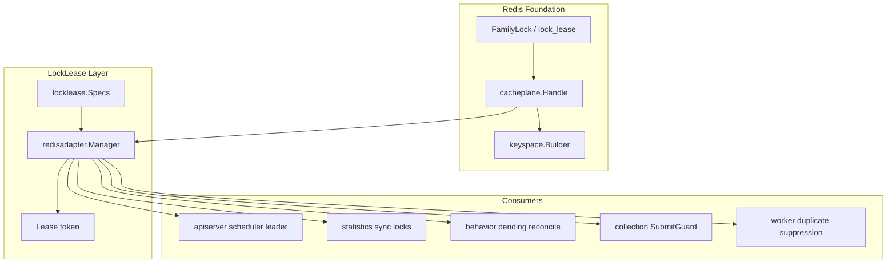
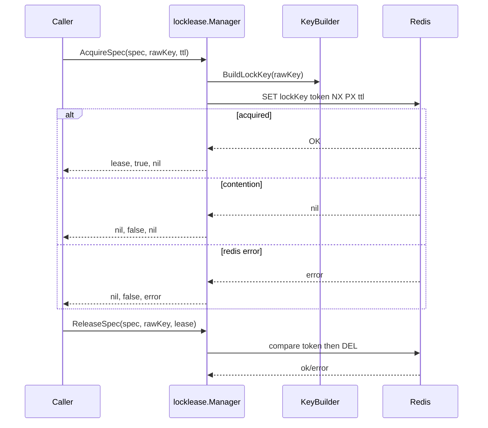
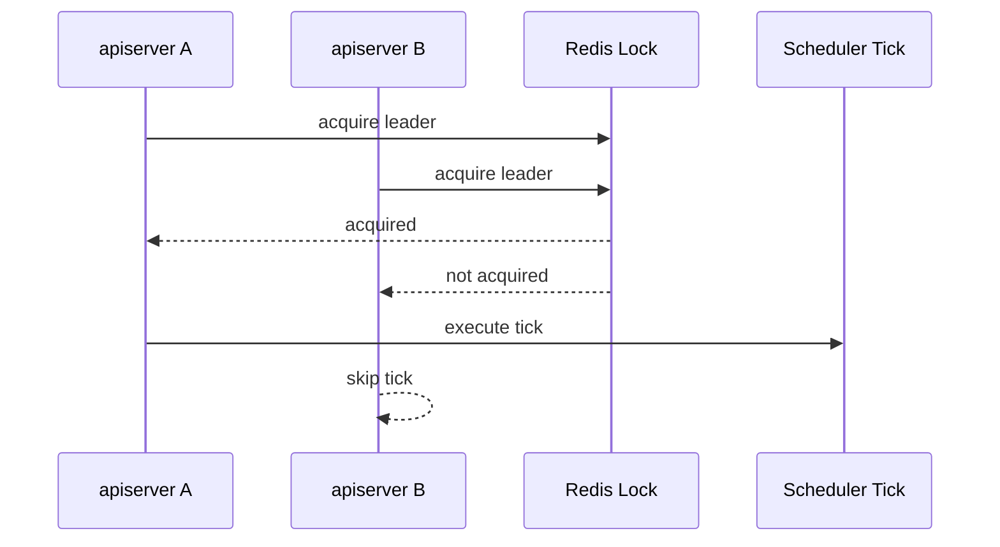
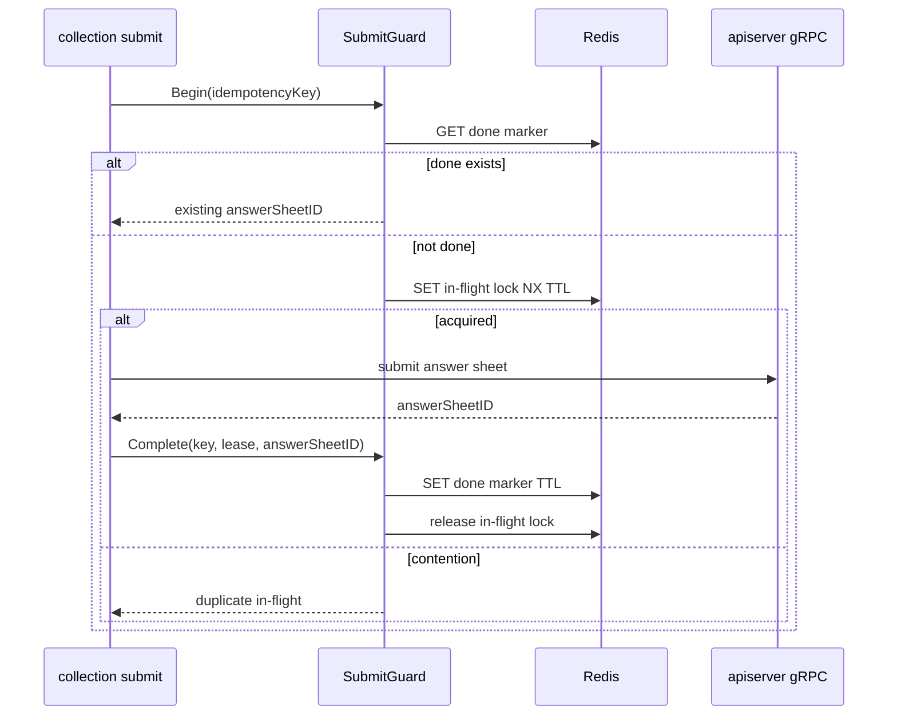

# Redis 分布式锁层

**本文回答**：qs-server 的 Redis 分布式锁层如何用 `locklease` 建模短期 lease；`Spec / Identity / Lease / Manager` 分别是什么；Redis adapter 如何基于 `FamilyLock` 构造 key 并做 token-based acquire/release；leader election、idempotency、duplicate suppression 三类消费语义有什么不同；为什么 Redis lock 不能替代数据库事务、唯一约束和业务幂等。

---

## 30 秒结论

| 维度 | 结论 |
| ---- | ---- |
| 模型 | `Spec + Identity + Lease + Manager` |
| 本质 | Redis lease primitive，不是业务幂等框架，也不是调度框架 |
| Redis family | 所有 locklease 基于 `lock_lease` family 的 Redis handle 和 namespace |
| Acquire | `AcquireSpec(spec,key,ttlOverride...)` 使用 spec 默认 TTL 或 override |
| Release | token-based release，错误 token 不能释放他人锁；lease nil/空 token 时 release no-op |
| Leader | scheduler leader lock 抢不到时 skip 当前 tick，不算业务失败 |
| Idempotency | collection SubmitGuard 使用 done marker + in-flight lock 组合表达提交幂等 |
| Duplicate | worker answersheet duplicate suppression 是 best-effort，Redis degraded 时 degraded-open 继续处理 |
| Serial | statistics sync 使用 leader lock + task lock 串行化重建任务 |
| 不支持 | 自动续租、fencing token、跨业务通用幂等状态机、exactly-once |
| 风险边界 | TTL 必须覆盖 critical section；业务正确性仍需状态机、唯一约束、checkpoint、idempotency key 兜底 |

一句话概括：

> **locklease 提供的是“带 TTL 和 owner token 的短期排他租约”；不同业务如何解释抢不到锁，必须由调用方自己定义。**

---

## 1. 为什么需要 Redis 分布式锁层

qs-server 是多进程、多实例系统：

```text
qs-apiserver 多实例
collection-server 多实例
qs-worker 多实例
```

这些实例会同时执行一些“不能无限并发”的动作：

- 计划调度器只能一个实例执行一轮。
- 统计同步只能一个实例执行一轮。
- 同一个统计窗口不能并发 rebuild。
- 同一份答卷提交事件不能被 worker 重复处理。
- 同一个 collection submit 不能并发提交多次。
- pending behavior reconcile 不能多实例重复跑。

这些场景都需要短期排他能力。

但这些场景语义不同：

| 场景 | 抢不到锁意味着什么 |
| ---- | ------------------ |
| scheduler leader | 跳过本轮 |
| statistics sync task | 任务繁忙，返回/跳过 |
| collection submit | 可能是重复提交或正在处理 |
| worker duplicate suppression | 认为重复，或 Redis degraded 时继续处理 |
| behavior reconcile | 另一个实例在跑，跳过 |

所以不能用一个“通用幂等框架”覆盖所有场景。`locklease` 只提供 primitive，业务解释留给调用方。

---

## 2. Lock 层总图



---

## 3. 核心模型

### 3.1 Spec

`Spec` 表达一个内置锁工作负载。

包含：

```text
Name
Description
DefaultTTL
```

qs-server 内置 Specs：

| Spec | Name | 默认 TTL | 说明 |
| ---- | ---- | -------- | ---- |
| `AnswersheetProcessing` | `answersheet_processing` | 5m | worker 答卷事件重复处理抑制 |
| `PlanSchedulerLeader` | `plan_scheduler_leader` | 50s | plan scheduler leader election |
| `StatisticsSyncLeader` | `statistics_sync_leader` | 30m | statistics sync scheduler leader election |
| `StatisticsSync` | `statistics_sync` | 30m | 单个 statistics sync task 串行化 |
| `BehaviorPendingReconcile` | `behavior_pending_reconcile` | 30s | behavior pending reconcile 串行化 |
| `CollectionSubmit` | `collection_submit` | 5m | collection submit 幂等与进行中抑制 |

### 3.2 Identity

Identity 表示一次具体锁目标：

```text
Name = spec name
Key  = raw business key
```

例如：

```text
spec = answersheet_processing
key  = answersheet:processing:123
```

### 3.3 Lease

Lease 是成功获取锁后的租约，关键字段是 token。

释放锁时必须带 token。Redis adapter 会校验 token，防止错误 owner 释放他人锁。

### 3.4 Manager

Manager 提供：

```text
Acquire
AcquireSpec
Release
ReleaseSpec
```

调用方通常使用 `AcquireSpec / ReleaseSpec`，避免手工拼 spec name 和 TTL。

---

## 4. Redis Adapter

`redisadapter.Manager` 构建在 cache runtime 之上。

### 4.1 字段

| 字段 | 说明 |
| ---- | ---- |
| component | 组件名，例如 apiserver / worker / collection-server |
| name | lock workload 名称 |
| handle | `FamilyLock` 的 cacheplane.Handle |
| observer | resilience observer |

### 4.2 lock key 构造

Manager 不直接使用 raw key，而是通过：

```text
lockkeyspace.FromBuilder(handle.Builder).Lock(base)
```

构造 namespace-safe lock key。

这保证不同环境、不同 family namespace 不会互相污染。

### 4.3 Acquire

`Acquire(ctx, identity, ttl)`：

1. 计算 metric name。
2. 通过 lockKey(identity) 构造 key。
3. 如果 handle/client 不可用，记录 degraded，返回 error。
4. 调 component-base Redis lock manager 执行 acquire。
5. acquired=false 时记录 contention。
6. acquired=true 时记录 ok。
7. 更新 lock/family/resilience 观测。

### 4.4 AcquireSpec

`AcquireSpec(ctx, spec, key, ttlOverride...)`：

1. 默认使用 `spec.DefaultTTL`。
2. 如果传入 ttlOverride 且 >0，使用 override。
3. spec name 不能为空。
4. TTL 必须 >0。
5. 调 `Acquire(ctx, spec.Identity(key), ttl)`。

### 4.5 Release

`Release(ctx, identity, lease)`：

1. 如果 manager/handle/client/lease/token 不可用，no-op。
2. 调 Redis adapter token-based release。
3. 记录 release ok/error。
4. 更新 resilience outcome。

### 4.6 ReleaseSpec

按 spec 构造 identity 后 release。

---

## 5. Acquire / Release 时序



---

## 6. 三类核心消费语义

locklease 是同一个 primitive，但调用方语义不同。

| 类型 | 语义 | 抢不到锁 |
| ---- | ---- | -------- |
| Leader election | 多实例中只有一个执行本轮 | skip tick |
| Idempotency / in-flight | 同一提交 key 同时只能处理一次，完成后可复用结果 | 返回 duplicate/in-flight |
| Duplicate suppression | 尽力抑制重复消费，失败时可继续 | skip duplicate 或 degraded-open |
| Task serialization | 同一 org/window/task 只能一个执行 | lock busy / skip / retry |

不要混淆这些语义。

---

## 7. Leader Lock

### 7.1 使用场景

apiserver scheduler 使用 leader lock：

- plan scheduler。
- statistics sync scheduler。
- behavior pending reconcile。

### 7.2 leaderLock.Run

`leaderLock.Run(ctx, opts, body)`：

1. acquire leader spec。
2. 如果 acquire error，返回包装错误。
3. 如果 not acquired，执行 `OnNotAcquired(lockKey)`，返回 nil。
4. 如果 acquired，执行 body。
5. defer 使用 `context.Background()` release。
6. release error 只进入 `OnReleaseError`，不改变 body 结果。

### 7.3 抢不到锁不是错误

多实例下只有一个实例应该执行本 tick。其它实例抢不到锁是正常行为。



### 7.4 TTL 要求

leader TTL 必须覆盖：

```text
预计单轮 tick 执行时间 + 抖动
```

当前 locklease 不自动续租。任务超过 TTL 可能导致另一个实例获得锁并执行重叠任务。

---

## 8. SubmitGuard：idempotency + in-flight

collection-server 的 `SubmitGuard` 是更复杂的语义。

它不是单纯 lock，而是：

```text
done marker
+
in-flight lock
```

### 8.1 Begin

`Begin(ctx,key)`：

1. 如果 key 空或 guard nil，允许继续。
2. 查 done marker。
3. 如果 done 存在，返回 doneID，acquired=false。
4. 如果 lockMgr nil，degraded-open，允许继续。
5. Acquire `CollectionSubmit` in-flight lock。
6. acquired=true：允许提交。
7. acquired=false：表示正在处理或重复提交。

### 8.2 Complete

`Complete(ctx,key,lease,answerSheetID)`：

1. 如果 answerSheetID 非空且 ops Redis 可用，写 done marker。
2. TTL 默认 30min。
3. 释放 in-flight lock。

### 8.3 Abort

失败时释放 in-flight lock，不写 done marker。

### 8.4 时序图



### 8.5 SubmitGuard 的边界

SubmitGuard 能降低重复提交概率，但不替代：

- AnswerSheet durable submit。
- idempotency collection。
- AnswerSheet 唯一约束。
- apiserver 侧业务幂等。

Redis 故障时它可能 degraded-open，最终正确性仍要由后端持久化幂等兜底。

---

## 9. Worker Duplicate Suppression

worker 的 `answersheet_submitted_handler` 使用 `AnswersheetProcessing` lock。

### 9.1 处理逻辑

`answerSheetDuplicateSuppressionGate.Run`：

1. 根据 answerSheetID 构造 lock key。
2. 如果 lock manager 不可用：
   - 记录 lock degraded。
   - resilience outcome = degraded_open。
   - 继续执行 handler。
3. 如果 acquire error：
   - 记录 degraded。
   - 继续执行 handler。
4. 如果 not acquired：
   - 记录 duplicate skipped。
   - 返回 nil，消息 Ack。
5. 如果 acquired：
   - 执行 handler fn。
   - defer release。
   - release 失败只 warn。

### 9.2 degraded-open 的含义

Redis 不可用时，worker 选择：

```text
继续处理事件
```

原因：

- 答卷提交主链路不能因为 Redis lock 故障完全停摆。
- 下游 `CreateAssessmentFromAnswerSheet` 等业务能力应该具备幂等兜底。
- 这是 availability first 的取舍。

### 9.3 not acquired 返回 nil

如果没拿到锁，认为已有其它 worker 正在处理同一 answerSheetID：

```text
return nil
```

这会让 MQ Ack，避免重复消息不断重试。

### 9.4 这不是 exactly-once

即使有这个 lock，也可能重复处理：

- Redis degraded-open。
- TTL 过期后前一个 handler 还没完成。
- release 失败。
- 同一业务被不同事件触发。
- 下游操作非幂等。

因此业务创建 Assessment 仍要用唯一约束/状态机/幂等处理兜底。

---

## 10. Statistics Sync Locks

statistics sync 用两层锁：

| 锁 | 作用 |
| -- | ---- |
| `StatisticsSyncLeader` | 多 apiserver 中只有一个执行 nightly sync runner |
| `StatisticsSync` | 某个 org/window/snapshot/plan 具体任务串行执行 |

### 10.1 Leader lock

用于整个 runner tick：

```text
statistics_sync_leader
```

抢不到则本实例跳过 tick。

### 10.2 Task lock

SyncService 内部会针对具体任务构造 lock name：

```text
statistics:daily:{orgID}:{start}:{end}
statistics:org_snapshot:{orgID}:{date}
statistics:plan:{orgID}:{date}
```

防止同一 org/window 被重复 rebuild。

### 10.3 TTL

默认 30min。重建窗口过大或 SQL 过慢时，需要评估 TTL 是否足够覆盖 critical section。

---

## 11. Behavior Pending Reconcile Lock

`BehaviorPendingReconcile` 用于 pending behavior events 的重试投影串行化。

语义：

- 多实例 scheduler 中只让一个实例执行 pending reconcile。
- 抢不到锁通常 skip。
- TTL 默认 30s。
- 不承诺长期任务续租。

如果 reconcile 变长，需要重新评估 TTL 或引入分页/批处理。

---

## 12. Lock 与数据库事务的边界

Redis lock 不等于 DB transaction。

| Redis lock | DB transaction |
| ---------- | -------------- |
| 跨实例短期排他 | 单数据库事务一致性 |
| TTL 到期会释放 | commit/rollback 明确 |
| 可能网络分区 | 数据库 ACID |
| 无 fencing token | 有事务隔离 |
| 适合调度/防重复 | 适合业务事实写入 |

不要用 Redis lock 替代：

- MySQL unique index。
- Mongo idempotency collection。
- Outbox transaction。
- Assessment 状态机。
- Report durable save。
- Statistics rebuild transaction。

---

## 13. TTL 与 Critical Section

### 13.1 TTL 必须覆盖 critical section

如果任务预计 2 分钟完成，TTL 只有 30 秒，则可能：

```text
A 获取锁
A 还在执行
锁过期
B 获取锁
A/B 同时执行
```

### 13.2 当前不自动续租

Redis adapter 文档明确：

```text
本包不会自动续租。
```

长耗时任务必须：

- 选择足够长 TTL。
- 拆小任务。
- 引入分页。
- 或单独设计 renew/heartbeat。
- 或引入 fencing token 机制。

### 13.3 不要无限拉长 TTL

TTL 太长会导致：

- 实例崩溃后任务长时间不能恢复。
- lock contention 时间过长。
- 运维误判任务卡死。

---

## 14. Fencing Token 不支持

当前 locklease 不提供 fencing token。

这意味着即使 A 的锁过期后 B 获得锁，A 仍可能继续写外部系统。

如果某个场景必须防止“过期 owner 写入”，需要：

- DB 层 version check。
- fencing token。
- optimistic lock。
- 状态机前置条件。
- 唯一约束。
- 幂等记录。

不要把当前 Redis lock 用在需要强 fencing 的金融/库存类写入上。

---

## 15. Observability

Lock 层记录两类观测：

### 15.1 Cache governance observability

例如：

- lock acquire ok/error/contention。
- lock release ok/error。
- lock degraded。

### 15.2 Resilience plane outcome

例如：

| Outcome | 语义 |
| ------- | ---- |
| `lock_acquired` | 成功获得锁 |
| `lock_contention` | 竞争失败 |
| `lock_error` | Redis 或 key 构造错误 |
| `lock_released` | 释放成功 |
| `lock_degraded` | Redis lock 不可用 |
| `degraded_open` | 调用方选择降级放行 |
| `duplicate_skipped` | 重复处理被跳过 |
| `idempotency_hit` | done marker 命中 |

指标 label 应使用 lock spec / scope 低基数字段，不应直接放完整业务 ID 或 raw lock key。

---

## 16. Degraded 策略

不同场景不同。

| 场景 | Redis lock degraded 时 |
| ---- | ---------------------- |
| scheduler leader | 通常不启动/跳过，避免多实例重复 |
| statistics sync task | 返回错误或跳过，避免重建冲突 |
| collection submit | lockMgr nil 时 degraded-open，但 done marker 查询失败会返回错误 |
| worker duplicate suppression | degraded-open，继续处理 |
| behavior reconcile | 通常跳过，等待下一轮 |

原则：

```text
主链路可用性优先的场景，可以 degraded-open；
后台任务/调度器通常 fail-closed 或 skip。
```

---

## 17. 操作边界

当前不默认提供：

- 手工释放任意 lock。
- 查看所有 lock key。
- 自动续租。
- fencing token。
- 动态调整 TTL。
- lock owner 管理页面。
- 通用业务幂等状态机。

原因：

- 误释放 lock 可能造成并发执行。
- raw lock key 高基数且敏感。
- 自动续租需要完整 owner 生命周期。
- 幂等语义必须由业务定义。

---

## 18. 设计模式与实现意图

| 模式 | 当前实现 | 意图 |
| ---- | -------- | ---- |
| Lease | `Lease{Token}` | 带 owner token 的短期锁 |
| Spec | `locklease.Specs` | 标准化内置锁工作负载 |
| Manager Adapter | `redisadapter.Manager` | 基于 cacheplane Handle 使用 Redis |
| Keyspace | lock key builder | namespace 隔离 |
| Leader Election | `leaderLock.Run` | 多实例任务单点执行 |
| In-flight Guard | `SubmitGuard` | 正在处理的提交抑制 |
| Done Marker | SubmitGuard done key | 已完成幂等结果 |
| Duplicate Suppression | answersheet gate | worker 重复消费抑制 |
| Observability | lock + resilience outcome | 排查 contention/degraded |

---

## 19. 设计取舍

| 设计 | 收益 | 代价 |
| ---- | ---- | ---- |
| Redis lease primitive | 简单通用 | 业务语义需调用方定义 |
| token-based release | 防误释放他人锁 | 需要保存 lease |
| 不自动续租 | 实现简单、风险小 | 长任务要设计 TTL |
| leader not acquired skip | 多实例安全 | 当前实例本轮不做任务 |
| worker degraded-open | 保证主链路可用 | 可能重复处理 |
| SubmitGuard done+lock | 同时处理完成和进行中 | 依赖 Redis + 后端幂等 |
| lock family 独立 | 可观测/可路由 | 需要 family 配置 |
| release 用 background ctx | 尽量释放 | 请求取消也会尝试 release |

---

## 20. 常见误区

### 20.1 “Redis lock 能保证 exactly-once”

不能。它只能降低并发/重复概率。

### 20.2 “抢不到锁就是系统错误”

不一定。leader lock 抢不到是正常 skip。

### 20.3 “锁 TTL 越长越安全”

不一定。TTL 太长会影响故障恢复。

### 20.4 “锁 TTL 短一点性能好”

太短会导致 critical section 未结束时锁过期，引发并发执行。

### 20.5 “有 Redis lock 就不需要唯一约束”

错误。业务正确性仍需要 DB 唯一约束或状态机。

### 20.6 “degraded-open 是 bug”

不是。它是特定场景的可用性取舍，必须由业务风险决定。

---

## 21. 排障路径

### 21.1 scheduler 不执行

检查：

1. `lock_lease` family 是否 available。
2. leader lock acquire 是否 error。
3. 是否 lock contention。
4. 是否其它实例持有锁。
5. TTL 是否过长。
6. runner 是否配置启用。
7. release 是否失败导致 stale lock。

### 21.2 同一统计任务重复执行

检查：

1. 是否使用 `StatisticsSync` task lock。
2. lock name 是否包含 org/window/date。
3. TTL 是否覆盖任务执行时间。
4. 是否 Redis degraded。
5. 是否任务被手工并发触发。
6. DB transaction 是否保护 delete+insert。

### 21.3 collection 重复提交

检查：

1. idempotency key 是否稳定。
2. done marker 是否存在。
3. in-flight lock 是否抢到。
4. lock TTL 是否足够。
5. done TTL 是否过短。
6. apiserver AnswerSheet durable submit 幂等是否生效。

### 21.4 worker 重复处理答卷

检查：

1. answersheet_processing lock 是否 available。
2. acquire 是否 degraded-open。
3. TTL 是否太短。
4. MQ 是否重复投递。
5. handler 是否 Ack 失败/Nack。
6. apiserver 创建 Assessment 是否幂等。

### 21.5 lock release 失败

检查：

1. Redis 可用性。
2. lease token 是否为空。
3. lock 是否已过期。
4. release 是否使用正确 raw key。
5. namespace 是否一致。
6. 是否错误 token 尝试释放。

---

## 22. 修改指南

### 22.1 新增 Lock Spec

步骤：

1. 在 `locklease.Specs` 增加 Spec。
2. 定义 Name、Description、DefaultTTL。
3. 定义 raw key 构造规则。
4. 使用 `AcquireSpec / ReleaseSpec`。
5. 明确 contention 语义。
6. 明确 Redis degraded 策略。
7. 明确 TTL 与 critical section。
8. 补 tests/docs。

### 22.2 使用 lock 做 leader

必须：

1. contention -> skip，不当错误。
2. release 放 defer。
3. release error 只记录。
4. TTL 覆盖 tick。
5. body 必须可重入或至少幂等。

### 22.3 使用 lock 做幂等/重复抑制

必须：

1. 有业务持久化幂等兜底。
2. contention 的返回语义明确。
3. degraded-open/fail-closed 明确。
4. TTL 不应替代 done marker。
5. 不能只靠 lock 判断业务是否完成。

---

## 23. 代码锚点

- Lock specs：[../../../internal/pkg/locklease/lease.go](../../../internal/pkg/locklease/lease.go)
- Redis adapter doc：[../../../internal/pkg/locklease/redisadapter/doc.go](../../../internal/pkg/locklease/redisadapter/doc.go)
- Redis adapter manager：[../../../internal/pkg/locklease/redisadapter/lock.go](../../../internal/pkg/locklease/redisadapter/lock.go)
- Scheduler leader lock：[../../../internal/apiserver/runtime/scheduler/leader_lock.go](../../../internal/apiserver/runtime/scheduler/leader_lock.go)
- Collection SubmitGuard：[../../../internal/collection-server/infra/redisops/submit_guard.go](../../../internal/collection-server/infra/redisops/submit_guard.go)
- Worker answersheet gate：[../../../internal/worker/handlers/answersheet_handler.go](../../../internal/worker/handlers/answersheet_handler.go)
- Runtime bundle：[../../../internal/pkg/cacheplane/bootstrap/runtime.go](../../../internal/pkg/cacheplane/bootstrap/runtime.go)

---

## 24. Verify

```bash
go test ./internal/pkg/locklease
go test ./internal/pkg/locklease/redisadapter
go test ./internal/apiserver/runtime/scheduler
go test ./internal/collection-server/infra/redisops
go test ./internal/worker/handlers
```

如果修改 resilience outcome：

```bash
go test ./internal/pkg/resilienceplane
go test ./internal/pkg/cachegovernance/observability
```

如果修改文档：

```bash
make docs-hygiene
git diff --check
```

---

## 25. 下一跳

| 目标 | 文档 |
| ---- | ---- |
| 缓存治理层 | [07-缓存治理层.md](./07-缓存治理层.md) |
| 观测降级排障 | [08-观测降级与排障.md](./08-观测降级与排障.md) |
| 新增 Redis 能力 | [09-新增Redis能力SOP.md](./09-新增Redis能力SOP.md) |
| 运行时与 Family | [01-运行时与Family模型.md](./01-运行时与Family模型.md) |
| Redis 整体架构 | [00-整体架构.md](./00-整体架构.md) |
