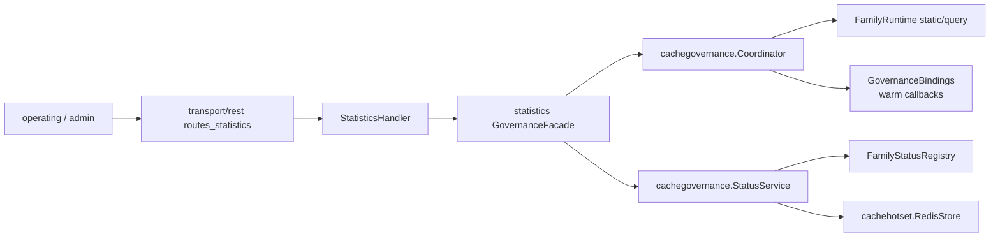
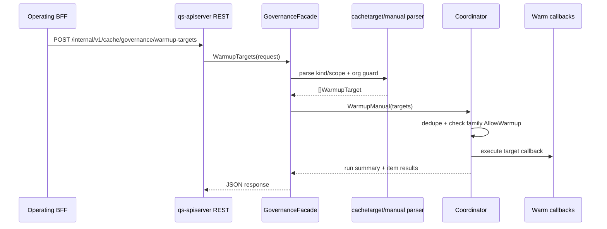
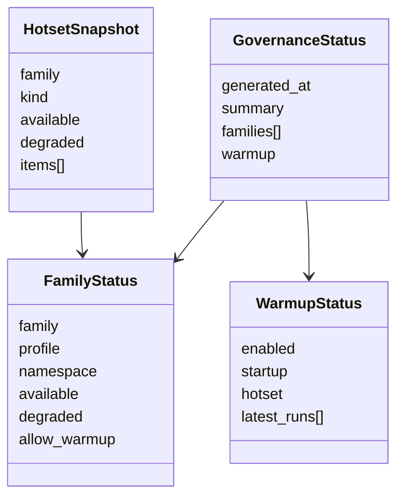

# 缓存治理层

**本文回答**：cache governance 如何把 family status、hotset、manual warmup、repair complete、startup/publish/statistics warmup 串起来，REST 接口如何到达 coordinator 和 status service。

## 30 秒结论

| 组件 | 职责 |
| ---- | ---- |
| `cachebootstrap.Subsystem` | 创建并绑定 cache governance runtime |
| `cachegovernance.Coordinator` | 执行 startup、publish、statistics、repair、manual warmup |
| `cachegovernance.StatusService` | 输出 family/warmup/hotset snapshot |
| `cachetarget` | 提供 kind/scope/family/orgID 模型 |
| REST routes | 暴露 internal governance API |

## Governance REST 调用图

## Manual warmup 时序

## Warmup 来源

| 来源 | 触发 | 典型目标 |
| ---- | ---- | -------- |
| startup | apiserver runtime bootstrap | static/query seeds |
| publish | scale/questionnaire publish post action | `static.scale`、`static.questionnaire` |
| statistics sync | sync complete | `query.stats_*` |
| repair complete | internal REST | `query.stats_*` |
| manual | operating/internal REST | request targets |
| hotset | coordinator 从 ZSet top-N 读取 | 热点 query/static targets |

## 状态模型

## 接口清单

| 接口 | 说明 |
| ---- | ---- |
| `GET /readyz` | 进程 readiness |
| `GET /governance/redis` | family runtime snapshot |
| `GET /internal/v1/cache/governance/status` | cache governance status |
| `GET /internal/v1/cache/governance/hotset` | hotset top-N |
| `POST /internal/v1/cache/governance/warmup-targets` | manual warmup |
| `POST /internal/v1/cache/governance/repair-complete` | repair complete 后触发 warmup |

## Verify

- [cachegovernance/coordinator.go](../../../internal/apiserver/application/cachegovernance/coordinator.go)
- [cachegovernance/status_service.go](../../../internal/apiserver/application/cachegovernance/status_service.go)
- [cachegovernance/manual_warmup.go](../../../internal/apiserver/application/cachegovernance/manual_warmup.go)
- [transport/rest/routes_statistics.go](../../../internal/apiserver/transport/rest/routes_statistics.go)
- [interface/restful/handler/statistics_cache_governance_test.go](../../../internal/apiserver/interface/restful/handler/statistics_cache_governance_test.go)
