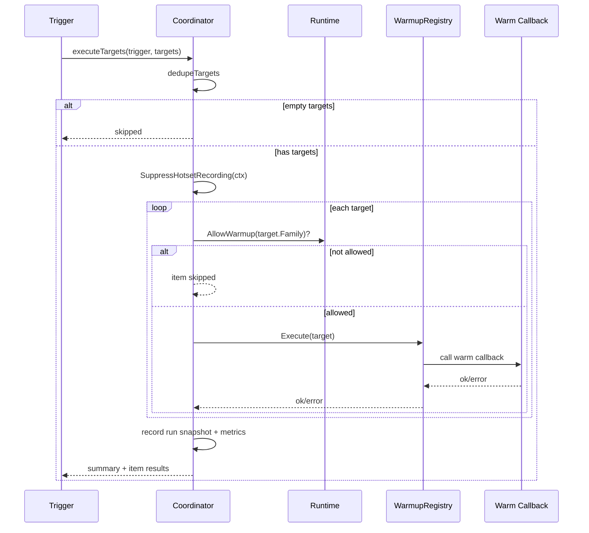

# 缓存治理层

**本文回答**：qs-server 的 cache governance 如何把 Redis family status、hotset、startup warmup、publish warmup、statistics sync warmup、repair complete warmup 和 manual warmup 串起来；`Coordinator`、`WarmupRegistry`、`WarmupTarget`、`StatusService` 分别承担什么职责；为什么 repair complete 只触发缓存预热，不修业务数据。

---

## 30 秒结论

| 组件 | 职责 |
| ---- | ---- |
| `cachebootstrap.Subsystem` | apiserver cache 子系统组合根，负责 runtime、policy、hotset、lock、governance、status 装配 |
| `cachegovernance.Coordinator` | 统一执行 startup、publish、statistics sync、repair complete、manual warmup |
| `WarmupRegistry` | 将 `WarmupKind` 分发到具体 warm callback |
| `WarmupTarget` | 用 `Family + Kind + Scope` 稳定表达一个可预热目标 |
| `HotsetRecorder` | 提供真实访问热点 TopN，作为 warmup 候选 |
| `StatusService` | 输出 runtime family、warmup runs、hotset snapshot 的只读状态 |
| `ManualWarmupRequest` | 接受 kind/scope 形式的手工预热请求 |
| `RepairCompleteRequest` | repair/backfill 完成后触发相关 query target 预热 |
| `SuppressHotsetRecording` | warmup 执行期间抑制 hotset 记录，避免假热点 |
| Observability | warmup run/item 指标、duration、family status、hotset status |

| 维度 | 结论 |
| ---- | ---- |
| Governance 定位 | 缓存治理只管理“缓存预热、热度、状态和只读观察”，不修改业务主事实 |
| Manual warmup | 需要显式 targets；每个 target 必须经过 kind/scope parser 校验 |
| Repair complete | 表示某个修复或 backfill 已完成，随后预热相关缓存；它本身不执行修复 |
| Statistics sync | 同步完成后预热 stats overview/system 和相关 hot targets |
| Publish warmup | scale/questionnaire 发布后预热静态对象和 scale list |
| Startup warmup | 启动时根据配置预热 static/query seed targets |
| 执行结果 | 单 target 可能 ok、skipped、error；整体 result 可能 ok、partial、error、skipped |
| Family guard | 如果目标 family 未开启 warmup，会跳过该 target |

一句话概括：

> **缓存治理层负责“让缓存变热、让状态可见、让手工预热受控”，但不负责修业务数据。**

---

## 1. 为什么需要缓存治理层

没有治理层时，缓存能力会散成几类问题：

| 问题 | 后果 |
| ---- | ---- |
| 服务启动后缓存全冷 | 首次访问慢，DB/Mongo/read model 压力大 |
| 发布后缓存没刷新 | 用户看到旧 scale/questionnaire |
| statistics sync 后 dashboard 仍然冷 | 看板访问回源压力高 |
| repair/backfill 后 QueryCache 旧 | 修复完成但用户仍读旧缓存 |
| 运维想手工预热 | 没有统一 target/parser/status |
| 不知道哪些目标热 | 缺少 hotset |
| 不知道 Redis family 状态 | degraded 难定位 |
| warmup 自己污染 hotset | 形成假热点 |

治理层把这些能力统一到一个 coordinator 和 status service。

---

## 2. Governance 总图

```mermaid
flowchart TB
    subgraph Runtime["Cache Runtime"]
        subsystem["cachebootstrap.Subsystem"]
        family["FamilyStatusRegistry"]
        hotset["HotsetRecorder / Inspector"]
    end

    subgraph Governance["cachegovernance"]
        coord["Coordinator"]
        registry["WarmupRegistry"]
        status["StatusService"]
        target["WarmupTarget"]
    end

    subgraph Triggers["Triggers"]
        startup["Startup"]
        publish["Scale / Questionnaire Published"]
        statsSync["Statistics Sync"]
        repair["Repair Complete"]
        manual["Manual Warmup"]
        hot["Hotset TopN"]
    end

    subgraph WarmFuncs["Warm callbacks"]
        warmScale["WarmScale"]
        warmQuestionnaire["WarmQuestionnaire"]
        warmScaleList["WarmScaleList"]
        warmStatsOverview["WarmStatsOverview"]
        warmStatsSystem["WarmStatsSystem"]
        warmStatsQuestionnaire["WarmStatsQuestionnaire"]
        warmStatsPlan["WarmStatsPlan"]
    end

    subsystem --> coord
    subsystem --> status
    family --> status
    hotset --> coord
    hotset --> status
    target --> coord
    coord --> registry

    startup --> coord
    publish --> coord
    statsSync --> coord
    repair --> coord
    manual --> coord
    hot --> coord

    registry --> warmScale
    registry --> warmQuestionnaire
    registry --> warmScaleList
    registry --> warmStatsOverview
    registry --> warmStatsSystem
    registry --> warmStatsQuestionnaire
    registry --> warmStatsPlan
```



---

## 3. cachebootstrap.Subsystem 的治理装配

`cachebootstrap.Subsystem` 在 apiserver 中收口：

| 能力 | 字段 |
| ---- | ---- |
| Redis runtime | `runtime` |
| family handles | `handles` |
| family status | `statusRegistry` |
| cache policy | `policyCatalog` |
| observer | `observer` |
| hotset recorder | `hotsetRecorder` |
| hotset inspector | `hotsetInspector` |
| lock manager | `lockManager` |
| warmup coordinator | `warmupCoordinator` |
| status service | `statusService` |

### 3.1 BindGovernance

`BindGovernance(bindings)` 在业务 warm callbacks 准备好后创建：

```text
cachegovernance.Coordinator
cachegovernance.StatusService
```

绑定的 callback 包括：

- ListPublishedScaleCodes。
- ListPublishedQuestionnaireCodes。
- LookupScaleQuestionnaireCode。
- WarmScale。
- WarmQuestionnaire。
- WarmScaleList。
- WarmStatsOverview。
- WarmStatsSystem。
- WarmStatsQuestionnaire。
- WarmStatsPlan。

这说明 governance 层不直接访问 repository，而是调用 application 暴露的 warm 函数。

---

## 4. Coordinator 接口

`cachegovernance.Coordinator` 提供：

| 方法 | 触发来源 |
| ---- | -------- |
| `WarmStartup` | apiserver startup |
| `HandleScalePublished` | scale publish post action |
| `HandleQuestionnairePublished` | questionnaire publish post action |
| `HandleStatisticsSync` | statistics sync complete |
| `HandleRepairComplete` | repair/backfill complete |
| `HandleManualWarmup` | manual governance command |
| `Snapshot` | status service 读取最新运行快照 |

### 4.1 Config

| 字段 | 说明 |
| ---- | ---- |
| Enable | 是否启用治理 |
| StartupStatic | 启动时是否预热 static targets |
| StartupQuery | 启动时是否预热 query targets |
| HotsetEnable | 是否使用 hotset |
| HotsetTopN | 读取多少热点 target |
| MaxItemsPerKind | 每类热点最大项数 |

### 4.2 Dependencies

Dependencies 包含：

- Runtime。
- StatisticsSeeds。
- Hotset。
- List/Warm static callbacks。
- Warm statistics query callbacks。

---

## 5. WarmupRegistry

`WarmupRegistry` 是 kind -> executor 的分发表。

```text
WarmupKind
  -> WarmFunc(ctx, target)
```

### 5.1 注册的 executor

| WarmupKind | Executor |
| ---------- | -------- |
| `static.scale` | parse scale scope -> `WarmScale(ctx, code)` |
| `static.questionnaire` | parse questionnaire scope -> `WarmQuestionnaire(ctx, code)` |
| `static.scale_list` | `WarmScaleList(ctx)` |
| `query.stats_overview` | parse org+preset -> `WarmStatsOverview(ctx, orgID, preset)` |
| `query.stats_system` | parse org -> `WarmStatsSystem(ctx, orgID)` |
| `query.stats_questionnaire` | parse org+code -> `WarmStatsQuestionnaire(ctx, orgID, code)` |
| `query.stats_plan` | parse org+planID -> `WarmStatsPlan(ctx, orgID, planID)` |

### 5.2 executor 未注册

如果 target kind 没有 executor：

```text
warmup executor for {kind} is not registered
```

该 target 标记 error。

---

## 6. executeTargets 主路径

`executeTargets(ctx, trigger, targets)` 是所有 warmup 触发的统一执行路径。



### 6.1 dedupeTargets

targets 会按：

```text
target.Key() = family|kind|scope
```

去重，并按 key 排序。

空 scope 会被丢弃。

### 6.2 Family warmup guard

如果 runtime 表示某 family 不允许 warmup：

```text
status = skipped
message = 该缓存族未开启预热
```

### 6.3 suppress hotset

执行前会创建：

```text
runCtx := cachetarget.SuppressHotsetRecording(ctx)
```

防止 warmup 查询路径写入 hotset，制造假热点。

---

## 7. WarmStartup

`WarmStartup(ctx)` 在 apiserver 启动后执行。

它根据配置选择：

| 配置 | 目标 |
| ---- | ---- |
| StartupStatic | startupStaticTargets |
| StartupQuery | query seed + hot targets |

### 7.1 startupStaticTargets

来源：

1. `ListPublishedScaleCodes` -> `static.scale:{code}`。
2. `ListPublishedQuestionnaireCodes` -> `static.questionnaire:{code}`。
3. 如果 `WarmScaleList != nil` -> `static.scale_list:published`。

### 7.2 StartupQuery

通过：

```text
mergeQueryTargets(ctx, nil, nil)
```

合并：

- statistics seed targets。
- hotset top query targets。

### 7.3 启动预热边界

Startup warmup 不应该：

- 阻塞服务长期不可用。
- 修改业务主状态。
- 修复 read model。
- 依赖高基数任意查询。

---

## 8. Publish Warmup

### 8.1 HandleScalePublished

Scale 发布后预热：

1. `static.scale:{code}`。
2. `static.scale_list:published`。
3. 如果能查到关联 questionnaire code，则追加：
   - `static.questionnaire:{questionnaireCode}`。

这样能减少发布后首次访问的冷缓存。

### 8.2 HandleQuestionnairePublished

Questionnaire 发布后预热：

```text
static.questionnaire:{code}
```

### 8.3 Publish warmup 失败

某个 target 失败会记录 item error 和 run partial/error，不应回滚发布动作。

缓存预热是发布后的优化副作用，不是发布主事实。

---

## 9. Statistics Sync Warmup

`HandleStatisticsSync(ctx, orgID)` 在统计同步完成后触发。

默认目标：

```text
query.stats_overview org:{orgID}:preset:today
query.stats_overview org:{orgID}:preset:7d
query.stats_overview org:{orgID}:preset:30d
query.stats_system org:{orgID}
```

然后追加：

```text
mergeQueryTargets(ctx, []int64{orgID}, nil)
```

即当前 org 范围内的 seed targets + hot query targets。

### 9.1 为什么 sync 后预热

statistics sync 刚更新 read model，此时 dashboard 访问通常会发生。提前 warmup 可以：

- 降低首个看板访问延迟。
- 降低 read model 瞬时回源压力。
- 让标准 overview preset 更快。

### 9.2 不是强一致刷新

它不保证所有 query cache 都立刻最新：

- 只预热 selected targets。
- target 可能失败。
- query cache 仍有 TTL。
- 自定义 from/to 通常不在自动预热范围。

---

## 10. Repair Complete Warmup

`HandleRepairComplete(ctx, req)` 表示：

```text
某个 repair/backfill 已完成；
现在请预热相关缓存目标。
```

它不是 repair 本身。

### 10.1 RepairCompleteRequest

| 字段 | 说明 |
| ---- | ---- |
| RepairKind | repair 类型，例如 statistics_backfill、journey_rebuild_history |
| OrgIDs | 影响的机构 |
| QuestionnaireCodes | 影响的问卷 |
| PlanIDs | 影响的计划 |

### 10.2 statistics_backfill

当 RepairKind = `statistics_backfill`：

1. 对每个 org 生成 overview today/7d/30d。
2. 生成 stats system。
3. 对 questionnaire codes 生成 stats questionnaire。
4. 对 plan IDs 生成 stats plan。
5. 追加符合 org/repair 过滤的 hot query targets。

### 10.3 journey_rebuild_history

当 RepairKind = `journey_rebuild_history`：

- 生成 repairQueryTargets。
- 不默认追加所有 seed/hot targets，除非逻辑需要。

### 10.4 default

其它 repair kind：

- 仅根据 request 显式字段生成 repairQueryTargets。

### 10.5 关键边界

Repair complete 不做：

- 修复 MySQL/Mongo 主数据。
- 重建 statistics read model。
- 重放事件。
- 清理 dirty migration。
- 手工改 Redis。

它只做：

```text
repair finished -> warm related cache targets
```

---

## 11. Manual Warmup

Manual warmup 是手工治理命令。

### 11.1 请求模型

```json
{
  "targets": [
    {
      "kind": "query.stats_overview",
      "scope": "org:1:preset:7d"
    }
  ]
}
```

### 11.2 ParseManualWarmupTarget

每个 target 都必须：

1. ParseWarmupKind。
2. ParseWarmupTarget(kind, scope)。
3. 生成 canonical WarmupTarget。

如果 kind 或 scope 不合法，整个请求返回 error。

### 11.3 手工目标不能为空

`HandleManualWarmup` 要求：

```text
len(req.Targets) > 0
```

否则返回：

```text
warmup targets cannot be empty
```

### 11.4 返回结果

返回：

| 字段 | 说明 |
| ---- | ---- |
| trigger | manual |
| started_at / finished_at | 执行时间 |
| summary | target/ok/skipped/error/result |
| items | 每个 target 的执行结果 |

item status：

```text
ok
skipped
error
```

summary result：

```text
ok
partial
error
skipped
```

---

## 12. Query Targets 合并

`mergeQueryTargets(ctx, orgFilter, repair)` 会合并：

```text
querySeedTargets
+
queryHotTargets
```

### 12.1 Statistics seed targets

来自 `StatisticsWarmupConfig`：

- OrgIDs。
- OverviewPresets。
- QuestionnaireCodes。
- PlanIDs。

如果 OverviewPresets 为空或非法，默认：

```text
today
7d
30d
```

### 12.2 Hot query targets

当 hotset enable 且 Hotset 不为 nil，会读取：

- query.stats_overview。
- query.stats_system。
- query.stats_questionnaire。
- query.stats_plan。

然后用 orgFilter / repair scope 过滤。

### 12.3 allowQueryTarget

按 target kind 解析 scope，并检查：

- org 是否允许。
- questionnaire 是否在 repair.QuestionnaireCodes 中。
- planID 是否在 repair.PlanIDs 中。

这避免 repair complete 预热不相关的热点 query。

---

## 13. StatusService

`StatusService` 提供只读状态。

### 13.1 GetRuntime

返回 Redis runtime snapshot：

- generated_at。
- component。
- families。
- summary。

如果 service nil，也返回一个 ready=true 的空 snapshot，避免 status endpoint panic。

### 13.2 GetStatus

返回：

```text
RuntimeSnapshot + WarmupStatusSnapshot
```

WarmupStatusSnapshot 包含：

- enabled。
- startup static/query。
- hotset enable/topN/maxItemsPerKind。
- latest runs。

### 13.3 GetHotset

输入：

```text
kind
limit
```

流程：

1. 根据 kind 推导 family。
2. 读取 family status。
3. 如果 hotset inspector nil，返回 message。
4. TopWithScores。
5. 返回 HotsetSnapshot。

如果 TopWithScores 报错，状态 degraded=true，available=false，但不直接抛出错误。

---

## 14. Warmup 观测

Coordinator 记录两类指标：

### 14.1 run-level

```text
qs_cache_warmup_runs_total{trigger,result}
```

trigger：

- startup。
- publish。
- statistics_sync。
- repair。
- manual。

result：

- started。
- ok。
- partial。
- error。
- skipped。

### 14.2 item-level

```text
qs_cache_warmup_items_total{trigger,family,kind,result}
```

result：

- ok。
- error。

skip 在 summary/items 中体现。

### 14.3 duration

通过 observability 记录：

```text
warmup duration by trigger/result
```

---

## 15. Governance 与 Hotset 的边界

Hotset 负责：

```text
发现近期访问热点
```

Coordinator 负责：

```text
选择 target 并执行 warmup
```

StatusService 负责：

```text
展示状态
```

它们都不负责：

- 判断业务权限。
- 修改业务主数据。
- 修复 read model。
- 生成业务事件。
- 直接操作 repository 写入。

---

## 16. Governance REST 边界

当前 REST 治理入口应保持：

| 接口类型 | 语义 |
| -------- | ---- |
| runtime/status | 只读 |
| hotset | 只读 |
| manual warmup | 有动作，但仅限缓存预热 |
| repair complete | 有动作，但仅限 repair 后预热 |

不应在 cache governance 下塞入：

- event replay。
- outbox mark published。
- DB repair。
- lock release。
- direct Redis write。
- 权限变更。

这些应有独立 SOP、权限和审计。

---

## 17. 设计模式与实现意图

| 模式 | 当前实现 | 意图 |
| ---- | -------- | ---- |
| Coordinator | cachegovernance.Coordinator | 统一 warmup 触发入口 |
| Registry | WarmupRegistry | kind -> executor 分发 |
| Target Object | WarmupTarget | 目标表达稳定化 |
| Seed + Hot Merge | mergeQueryTargets | 固定目标 + 动态热点 |
| Suppression Context | SuppressHotsetRecording | 防止 warmup 污染 hotset |
| Status Snapshot | StatusService | 治理状态只读可见 |
| Run Snapshot | WarmupRunSnapshot | 记录最新执行结果 |
| Manual Command | ManualWarmupRequest | 受控手工预热 |
| Repair Hook | RepairCompleteRequest | 修复后刷新缓存 |

---

## 18. 设计取舍

| 设计 | 收益 | 代价 |
| ---- | ---- | ---- |
| Coordinator 统一入口 | 触发路径一致 | 依赖 bindings 装配完整 |
| manual 只收 kind/scope | 安全可校验 | 使用方要懂 scope 格式 |
| repair complete 不修数据 | 边界清楚 | repair 和 warmup 分两步 |
| seed + hotset 合并 | 核心目标和真实热点兼顾 | target 过滤逻辑更复杂 |
| family AllowWarmup guard | 防误预热不可用 family | 有些 target 会 skipped |
| run snapshot 只存最新每 trigger | 状态简单 | 历史记录不完整 |
| warmup suppress hotset | 防止假热点 | warmup 流量不贡献热度 |
| per-target partial result | 可观测 | 调用方要处理 partial |

---

## 19. 常见误区

### 19.1 “repair complete 会修复数据”

错误。它只表示 repair 完成后触发缓存预热。

### 19.2 “manual warmup 可以传任意 key”

不可以。只能传 kind + canonical scope，并经过 parser 校验。

### 19.3 “warmup 失败应该让业务发布失败”

通常不应该。发布主事实和缓存预热是两件事。

### 19.4 “startup warmup 越多越好”

不一定。过多目标会拖慢启动并冲击 DB/read model。

### 19.5 “hotset top 一定都要预热”

不一定。还要经过 org/repair 过滤和 family allow warmup 判断。

### 19.6 “governance 可以直接修改 Redis 结果”

不应该。治理层执行的是预热，不是手工改缓存内容。

---

## 20. 排障路径

### 20.1 manual warmup 失败

检查：

1. targets 是否为空。
2. kind 是否支持。
3. scope 是否符合 parser。
4. family 是否允许 warmup。
5. 对应 executor 是否注册。
6. warm callback 是否 nil。
7. 事实源 repository/read model 是否可用。
8. Redis family 是否 degraded。

### 20.2 repair complete 后缓存仍旧

检查：

1. repair 是否真的完成 read model 或业务数据修复。
2. RepairKind 是否正确。
3. OrgIDs/QuestionnaireCodes/PlanIDs 是否传入。
4. repairQueryTargets 是否生成目标。
5. executeTargets 是否 partial/error。
6. QueryCache TTL/local hot cache。
7. warm callback 是否实际写缓存。

### 20.3 statistics sync 后 overview 仍慢

检查：

1. HandleStatisticsSync 是否调用。
2. orgID 是否 >0。
3. default overview targets 是否执行。
4. hotset query targets 是否读取成功。
5. WarmStatsOverview 是否返回错误。
6. query_result family 是否 allow warmup。

### 20.4 startup warmup 没执行

检查：

1. governance enable。
2. StartupStatic / StartupQuery。
3. ListPublishedScaleCodes / ListPublishedQuestionnaireCodes。
4. StatisticsSeeds。
5. Hotset enable。
6. family allow warmup。
7. latest runs snapshot。

### 20.5 status/hotset 看不到数据

检查：

1. StatusService 是否绑定。
2. FamilyStatusRegistry 是否有 snapshot。
3. HotsetInspector 是否 nil。
4. meta_hotset family 是否 available。
5. kind 是否正确。
6. limit 是否太小。
7. TopWithScores 是否报错。

---

## 21. 修改指南

### 21.1 新增 WarmupKind

步骤：

1. 在 cachetarget 增加 kind。
2. 定义 constructor。
3. 定义 scope parser。
4. 更新 ParseWarmupKind / ParseWarmupTarget。
5. 更新 OrgID，如果是 query/org 目标。
6. 在 Coordinator registerExecutors 注册 executor。
7. 在 Dependencies 增加 warm callback。
8. 在 cachebootstrap.GovernanceBindings 增加绑定。
9. 更新 manual warmup tests/status docs。

### 21.2 新增 RepairKind

步骤：

1. 定义 repair kind 字符串。
2. 明确 repair 已完成的事实。
3. 在 HandleRepairComplete 中生成 targets。
4. 明确 org/questionnaire/plan 过滤逻辑。
5. 不在此处执行 repair。
6. 补 tests/docs。

### 21.3 新增 manual target

步骤：

1. 确认 target kind/scope 已支持。
2. 确认 parser 可校验。
3. 确认 executor 已注册。
4. 确认 family allow warmup。
5. 补 manual warmup API 测试。
6. 更新运维示例。

---

## 22. 代码锚点

- Coordinator：[../../../internal/apiserver/application/cachegovernance/coordinator.go](../../../internal/apiserver/application/cachegovernance/coordinator.go)
- Manual warmup：[../../../internal/apiserver/application/cachegovernance/manual_warmup.go](../../../internal/apiserver/application/cachegovernance/manual_warmup.go)
- Status service：[../../../internal/apiserver/application/cachegovernance/status_service.go](../../../internal/apiserver/application/cachegovernance/status_service.go)
- Cache subsystem：[../../../internal/apiserver/cachebootstrap/subsystem.go](../../../internal/apiserver/cachebootstrap/subsystem.go)
- Warmup target：[../../../internal/apiserver/cachetarget/target.go](../../../internal/apiserver/cachetarget/target.go)
- Hotset store：[../../../internal/apiserver/infra/cachehotset/store.go](../../../internal/apiserver/infra/cachehotset/store.go)
- Governance observability：[../../../internal/pkg/cachegovernance/observability/](../../../internal/pkg/cachegovernance/observability/)

---

## 23. Verify

```bash
go test ./internal/apiserver/application/cachegovernance
go test ./internal/apiserver/cachebootstrap
go test ./internal/apiserver/cachetarget
go test ./internal/apiserver/infra/cachehotset
go test ./internal/pkg/cachegovernance/observability
```

如果修改 REST 治理接口：

```bash
go test ./internal/apiserver/transport/rest/handler
make docs-rest
make docs-verify
```

如果修改文档：

```bash
make docs-hygiene
git diff --check
```

---

## 24. 下一跳

| 目标 | 文档 |
| ---- | ---- |
| Hotset 与 WarmupTarget | [05-Hotset与WarmupTarget模型.md](./05-Hotset与WarmupTarget模型.md) |
| 观测降级排障 | [08-观测降级与排障.md](./08-观测降级与排障.md) |
| 新增 Redis 能力 | [09-新增Redis能力SOP.md](./09-新增Redis能力SOP.md) |
| QueryCache 与 StaticList | [04-QueryCache与StaticList.md](./04-QueryCache与StaticList.md) |
| Redis 整体架构 | [00-整体架构.md](./00-整体架构.md) |
