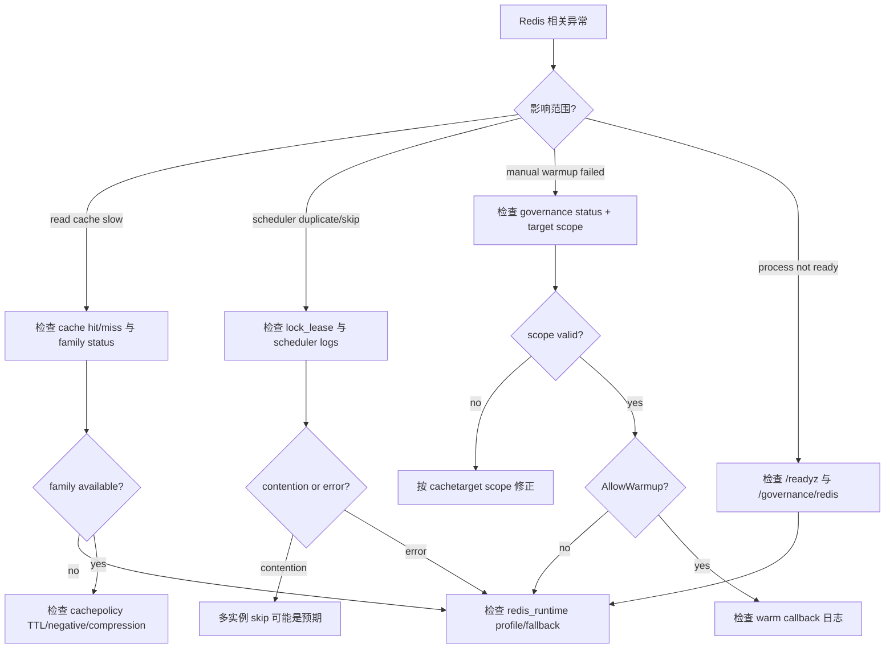
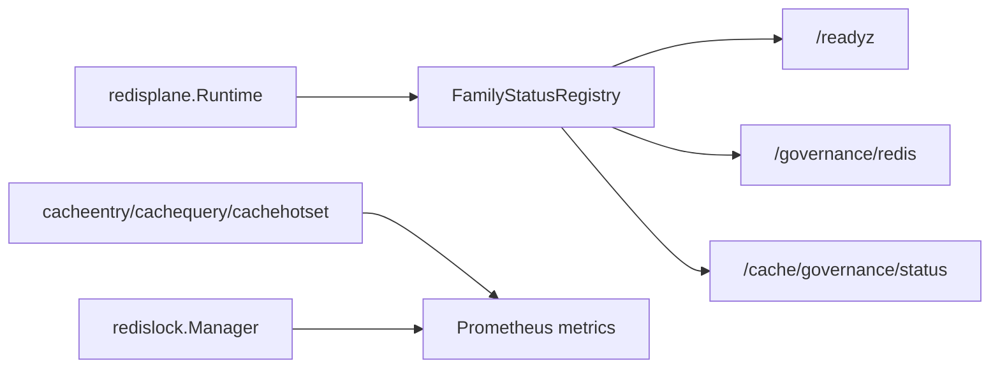

# Redis 观测、降级与排障

**本文回答**：Redis family 状态、metrics、readyz/governance endpoint 如何帮助排障；Redis degraded 时 cache、lock、governance 各自如何降级。

## 30 秒结论

| 维度 | 当前事实 |
| ---- | -------- |
| family 状态 | 由 `cacheobservability.FamilyStatusRegistry` 维护 |
| metrics | cache、payload、hotset、lock 通过 Prometheus 指标观测 |
| readyz | 三进程都有 readiness 路由 |
| governance | 三进程都有 `/governance/redis`；apiserver 有 cache governance 详情 |
| 降级原则 | cache 错误通常降级为 miss；lock 降级由调用方决定；governance 返回 degraded/message |

## 排障决策树



## 观测链路



## Endpoint

| 进程 | Endpoint | 代码 |
| ---- | -------- | ---- |
| apiserver | `/readyz`、`/governance/redis` | [transport/rest/registrars.go](../../../internal/apiserver/transport/rest/registrars.go) |
| apiserver | `/internal/v1/cache/governance/*` | [transport/rest/routes_statistics.go](../../../internal/apiserver/transport/rest/routes_statistics.go) |
| collection-server | `/readyz`、`/governance/redis` | [transport/rest/router.go](../../../internal/collection-server/transport/rest/router.go) |
| worker | `/readyz`、`/governance/redis`、`/metrics` | [observability/metrics_server.go](../../../internal/worker/observability/metrics_server.go) |

## 降级语义

| 层 | Redis error 时 |
| -- | -------------- |
| object cache | Get 视为 miss，回源；Set/Delete best-effort |
| query cache | Get 视为 miss；Set/Invalidate 记录失败 |
| static-list | Redis miss/error 返回 cache miss，回源重建 |
| hotset | 记录失败但不阻断业务查询 |
| scheduler leader lock | acquire error 返回 runner 错误；contention skip |
| collection submit guard | 按 submit guard 契约返回 duplicate/degraded 语义 |
| worker duplicate suppression | best-effort；handler 决定是否继续 |

## 常用检查

```bash
curl -s http://127.0.0.1:8080/readyz
curl -s http://127.0.0.1:8080/governance/redis
curl -s http://127.0.0.1:8080/internal/v1/cache/governance/status
curl -s "http://127.0.0.1:8080/internal/v1/cache/governance/hotset?kind=query.stats_system&limit=20"
```

端口以部署配置为准，不要把示例端口当成契约。

## Verify

- [cacheobservability](../../../internal/pkg/cacheobservability)
- [cacheentry/observability.go](../../../internal/apiserver/infra/cacheentry/observability.go)
- [cachehotset/store.go](../../../internal/apiserver/infra/cachehotset/store.go)
- [worker observability](../../../internal/worker/observability/metrics_server.go)
