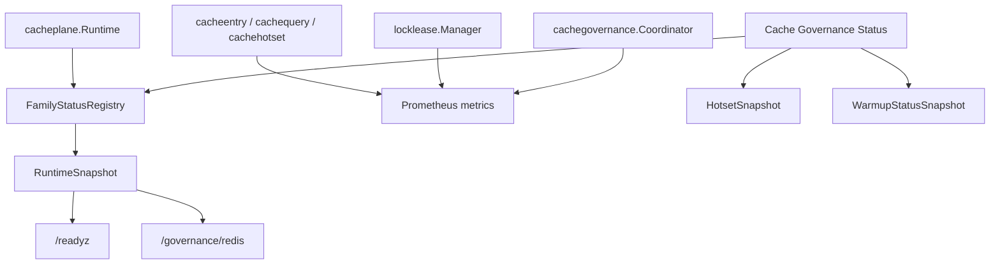
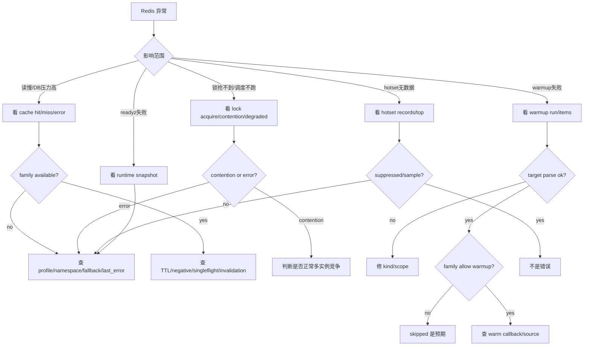

# 观测、降级与排障

**本文回答**：qs-server 的 Redis plane 如何通过 family status、runtime snapshot、Prometheus metrics、readyz/governance endpoint 观察运行状态；`degraded` 到底表示什么；ObjectCache、QueryCache、StaticList、Hotset、LockLease、Governance 在 Redis 异常时如何降级；遇到缓存慢、锁异常、warmup 失败、family 不可用时应该按什么顺序排查。

---

## 30 秒结论

| 维度 | 结论 |
| ---- | ---- |
| Family Status | 由 `FamilyStatusRegistry` 维护，记录 component、family、profile、namespace、available、degraded、mode、last_error 等 |
| Runtime Snapshot | `RuntimeSnapshot` 聚合某个 component 的 family 状态，summary 中只要有 degraded/unavailable，ready=false |
| Metrics | Redis plane 指标覆盖 cache get/write/duration/payload、family available/degraded、runtime ready、warmup、hotset、query version、lock |
| Readyz / Governance | `/readyz`、`/governance/redis`、`/internal/v1/cache/governance/status` 等用于只读观察 |
| Degraded 语义 | degraded 表示该 family 当前不可用或非预期运行，调用方如何处理取决于 cache/lock/governance 语义 |
| Cache 降级 | ObjectCache/QueryCache 通常把 Redis error 当 miss，回源 repository/read model |
| Hotset 降级 | hotset 写失败不应阻断业务查询，只削弱治理和 warmup |
| Lock 降级 | lock 的降级策略由调用方定义：scheduler 多为 skip/fail-closed，worker 可 degraded-open |
| Governance 降级 | status/hotset 可返回 degraded/message，不应直接执行修复 |
| 排障原则 | 先看 family status，再看 metrics，再进入具体能力：cache/query/hotset/lock/warmup |

一句话概括：

> **Redis degraded 不是一个统一业务错误，而是运行时状态；是否继续、跳过、回源或失败，必须按具体能力判断。**

---

## 1. Redis 观测分层

Redis plane 的观测分四层：

```text
1. Runtime family status
2. Prometheus metrics
3. Readiness / governance endpoints
4. 业务日志与调用方 outcome
```



---

## 2. FamilyStatus

`FamilyStatus` 是 Redis family 的核心运行时状态。

字段：

| 字段 | 说明 |
| ---- | ---- |
| `component` | 组件名，例如 apiserver、worker、collection-server |
| `family` | Redis family，例如 query_result、lock_lease |
| `profile` | 命名 Redis profile |
| `namespace` | family namespace |
| `allow_warmup` | 是否允许 warmup |
| `configured` | 是否配置 |
| `available` | 是否可用 |
| `degraded` | 是否降级 |
| `mode` | default / fallback_default / named_profile / degraded / disabled |
| `last_error` | 最近错误 |
| `last_success_at` | 最近成功时间 |
| `last_failure_at` | 最近失败时间 |
| `consecutive_failures` | 连续失败次数 |
| `updated_at` | 状态更新时间 |

### 2.1 Mode

| Mode | 含义 |
| ---- | ---- |
| `default` | 使用默认 Redis |
| `fallback_default` | 命名 profile 缺失后 fallback default |
| `named_profile` | 使用命名 Redis profile |
| `degraded` | family 不可用 |
| `disabled` | 未启用或状态未初始化 |

### 2.2 状态更新

`FamilyStatusRegistry.Update(status)` 会：

- 写入最新 family status。
- 设置 `qs_cache_family_available` gauge。
- degraded 变化时增加 `qs_cache_family_degraded_total`。
- 更新 `qs_runtime_component_ready`。

`RecordSuccess(family)` 会：

- available=true。
- degraded=false。
- 清空 last_error。
- consecutive_failures=0。

`RecordFailure(family, err)` 会：

- available=false。
- degraded=true。
- mode=degraded。
- last_error=err。
- consecutive_failures++。

---

## 3. RuntimeSnapshot

`RuntimeSnapshot` 描述某个 component 的 Redis runtime 状态。

字段：

| 字段 | 说明 |
| ---- | ---- |
| generated_at | 快照生成时间 |
| component | 组件 |
| summary | 汇总 |
| families | family 状态列表 |

### 3.1 RuntimeSummary

| 字段 | 说明 |
| ---- | ---- |
| family_total | family 数量 |
| available_count | 可用且未 degraded 的 family 数量 |
| degraded_count | degraded family 数量 |
| unavailable_count | unavailable family 数量 |
| ready | 是否 ready |

### 3.2 ready 规则

`SummarizeFamilies` 中：

```text
如果 degraded_count > 0 或 unavailable_count > 0，则 ready=false。
```

这意味着 Redis runtime 层面只要有 family 降级，component ready summary 就会变为 false。

注意：这不一定代表业务请求全部失败。它代表“Redis plane 有能力异常”。

---

## 4. Prometheus 指标

### 4.1 Cache get

```text
qs_cache_get_total{family,policy,result}
```

result 通常包括：

```text
hit
miss
error
```

用途：

- 观察命中率。
- 发现 Redis error。
- 判断是否回源过多。

### 4.2 Cache write

```text
qs_cache_write_total{family,policy,op,result}
```

op：

```text
set
delete / invalidate
```

result：

```text
ok
error
```

### 4.3 Operation duration

```text
qs_cache_operation_duration_seconds{family,policy,op}
```

op 可能包括：

- get。
- set。
- source_load。
- version_current。
- version_bump。

### 4.4 Payload size

```text
qs_cache_payload_bytes{family,policy,stage}
```

stage 可表达：

- raw。
- compressed。
- payload。

用于观察 compression 是否有收益。

### 4.5 Family availability

```text
qs_cache_family_available{component,family,profile}
```

1 表示可用，0 表示不可用。

### 4.6 Family degraded

```text
qs_cache_family_degraded_total{component,family,profile,reason}
```

只在 degraded transition 或原因变化时增加。

### 4.7 Runtime ready

```text
qs_runtime_component_ready{component}
```

1 表示 Redis runtime summary ready，0 表示存在 degraded/unavailable family。

### 4.8 Warmup

```text
qs_cache_warmup_duration_seconds{trigger,result}
qs_cache_warmup_runs_total{trigger,result}
qs_cache_warmup_items_total{trigger,family,kind,result}
```

### 4.9 Hotset

```text
qs_cache_hotset_size{family,kind}
qs_cache_hotset_records_total{family,kind,result}
qs_cache_warmup_hot_reads_total{family,kind,result}
```

### 4.10 Query version

```text
qs_query_cache_version_total{kind,op,result}
```

op：

```text
current
bump
```

### 4.11 Lock

```text
qs_cache_lock_acquire_total{name,result}
qs_cache_lock_release_total{name,result}
qs_cache_lock_degraded_total{name,reason}
```

---

## 5. 低基数标签原则

允许 labels：

```text
component
family
profile
policy
op
result
trigger
kind
name
reason
```

不应作为 metrics label：

```text
cache key
lock key
scope
org_id
plan_id
user_id
assessment_id
answer_sheet_id
scale_code
questionnaire_code
raw error
request_id
```

这些高基数字段应进入日志、治理状态或手工排障上下文，不进 Prometheus label。

---

## 6. Endpoint 观测入口

### 6.1 Runtime / Ready

常见入口：

```bash
curl -s http://127.0.0.1:8080/readyz
curl -s http://127.0.0.1:8080/governance/redis
```

### 6.2 Cache Governance

apiserver 内部治理入口：

```bash
curl -s http://127.0.0.1:8080/internal/v1/cache/governance/status
curl -s "http://127.0.0.1:8080/internal/v1/cache/governance/hotset?kind=query.stats_overview&limit=20"
```

端口以部署配置为准，不要把示例端口当成固定契约。

### 6.3 StatusService

`StatusService` 提供：

| 方法 | 说明 |
| ---- | ---- |
| `GetRuntime` | Redis family runtime snapshot |
| `GetStatus` | RuntimeSnapshot + WarmupStatusSnapshot |
| `GetHotset` | 指定 kind 的 HotsetSnapshot |

---

## 7. Degraded 总体语义

Degraded 表示 Redis family 当前不可用或不在预期路径。

常见原因：

- resolver nil。
- Redis client nil。
- profile missing。
- profile unavailable。
- fallback default 失败。
- Redis command error。
- version token 读写失败。
- lock acquire/release 失败。
- hotset ZSet 操作失败。

### 7.1 Degraded 不是统一失败策略

| 能力 | 典型降级 |
| ---- | -------- |
| ObjectCache | 当 miss 回源 |
| QueryCache | 当 miss 回源 read model |
| StaticList | GetPage 返回 false，应用回源 |
| Hotset | 不记录热点，不阻断查询 |
| Warmup | target error/skip |
| LockLease | 调用方决定 skip/fail/degraded-open |
| SDK token | 可能回源第三方或失败 |

---

## 8. ObjectCache 降级

### 8.1 Redis get error

Read-through 路径中：

```text
GetCached error
  -> record error/family failure
  -> treat as miss
  -> Load source repository
```

### 8.2 Redis set error

写缓存失败：

```text
record set error
return source value to caller
```

不应让 ObjectCache 写失败污染主查询。

### 8.3 排障

| 现象 | 检查 |
| ---- | ---- |
| 命中率低 | key builder、TTL、invalidation、SetCached error |
| 源库压力高 | miss rate、singleflight、Redis error |
| 数据旧 | invalidation、TTL、local cache、source fact |
| negative 误伤 | negative TTL、创建后失效、not found 是否真实 |

---

## 9. QueryCache 降级

### 9.1 Version token error

`VersionedQueryCache.Get` 如果 Current(versionKey) 失败：

```text
return ErrCacheNotFound
业务回源
```

### 9.2 Payload error

payload get/unmarshal 失败：

```text
record error
return ErrCacheNotFound
业务回源
```

### 9.3 Invalidate error

`Bump(versionKey)` 失败时，invalidate 返回错误。

这通常不应回滚业务写模型，但必须记录并观察，因为旧 query cache 可能继续存在到 TTL 过期。

### 9.4 排障

| 现象 | 检查 |
| ---- | ---- |
| 查询缓存不命中 | version key、data key、TTL、family query_result |
| 数据旧 | version bump、local hot cache、TTL、source read model |
| invalidate 失败 | meta_hotset family、Redis INCR、version store |
| high miss | query param hash、版本频繁 bump |

---

## 10. StaticList 降级

PublishedScaleListCache 的降级行为：

| 场景 | 行为 |
| ---- | ---- |
| memory miss | 读 Redis full list |
| Redis miss/error | 返回 false，应用回源 |
| payload unmarshal error | 返回 false |
| Rebuild total=0 | DEL list key |
| Rebuild set error | 返回 error，记录 family failure |

排障重点：

- Rebuild 是否执行。
- published count 是否为 0。
- static_meta family 是否 available。
- list key namespace 是否正确。
- local memory 是否 reset。
- payload JSON 是否兼容。

---

## 11. Hotset 降级

### 11.1 Record 失败

Hotset Record 失败：

- 记录 `qs_cache_hotset_records_total{result="error"}`。
- family meta_hotset failure。
- 返回 error。

业务查询通常应 best-effort 忽略，不应失败。

### 11.2 Suppressed / sampled_out

不是错误：

| result | 说明 |
| ------ | ---- |
| suppressed | warmup context 抑制记录 |
| sampled_out | 采样未命中 |

### 11.3 Top 读取失败

StatusService / Coordinator 可显示 degraded/message 或跳过 hot targets。

---

## 12. LockLease 降级

Lock 不能统一降级。

### 12.1 Scheduler leader

Redis 锁不可用时通常不执行任务，避免多实例重复。

抢不到锁是正常 skip。

### 12.2 Collection SubmitGuard

- done marker 查询失败：返回错误。
- lockMgr nil：degraded-open。
- lock contention：表示 in-flight duplicate。
- Complete 写 done marker 失败：返回错误。

### 12.3 Worker duplicate suppression

- lockManager unavailable：degraded-open，继续处理。
- acquire error：degraded-open，继续处理。
- not acquired：duplicate skipped，返回 nil。
- release error：warn，不改变 handler 结果。

### 12.4 排障

| 现象 | 检查 |
| ---- | ---- |
| lock degraded | lock_lease family、Redis profile、client |
| contention 高 | 多实例正常竞争还是 stuck lock |
| release error | token、TTL、namespace、Redis |
| duplicate 多 | TTL、MQ redelivery、handler 幂等 |

---

## 13. Governance 降级

### 13.1 StatusService

如果 hotset inspector nil：

```text
message = hotset inspector unavailable
```

如果 TopWithScores 报错：

```text
degraded=true
available=false
message=err
```

### 13.2 Manual warmup

如果 family 不允许 warmup：

```text
item status = skipped
message = 该缓存族未开启预热
```

如果 executor error：

```text
item status = error
summary result = partial/error
```

### 13.3 Repair complete

Repair complete warmup 失败只影响缓存预热，不应表示 repair 本身失败。

---

## 14. 排障决策树



---

## 15. 常用 PromQL

### 15.1 Family unavailable

```promql
qs_cache_family_available == 0
```

### 15.2 Degraded transition

```promql
increase(qs_cache_family_degraded_total[10m])
```

### 15.3 Cache hit/miss

```promql
sum by (family, policy, result) (
  increase(qs_cache_get_total[5m])
)
```

### 15.4 Cache write error

```promql
sum by (family, policy, op, result) (
  increase(qs_cache_write_total{result="error"}[5m])
)
```

### 15.5 Query version error

```promql
sum by (kind, op, result) (
  increase(qs_query_cache_version_total{result="error"}[5m])
)
```

### 15.6 Lock contention/error

```promql
sum by (name, result) (
  increase(qs_cache_lock_acquire_total{result=~"contention|error"}[5m])
)
```

### 15.7 Lock degraded

```promql
sum by (name, reason) (
  increase(qs_cache_lock_degraded_total[10m])
)
```

### 15.8 Warmup partial/error

```promql
sum by (trigger, result) (
  increase(qs_cache_warmup_runs_total{result=~"partial|error"}[10m])
)
```

### 15.9 Hotset size

```promql
qs_cache_hotset_size
```

---

## 16. 告警建议

| 告警 | 建议 |
| ---- | ---- |
| lock_lease family unavailable | 高优先级，会影响 scheduler/submit/worker |
| query_result family unavailable | 中优先级，查询可回源但压力升高 |
| object_view family unavailable | 中优先级，DB/Mongo 压力升高 |
| meta_hotset unavailable | 中优先级，影响 version token/hotset/warmup |
| cache write error 激增 | 中优先级，可能导致命中率下降 |
| lock contention 激增 | 需要区分正常多实例竞争和 stuck lock |
| warmup error/partial | 中低优先级，看影响目标 |
| hotset 长期为空 | 治理弱化，但业务不一定失败 |
| runtime ready = 0 | Redis plane 有 degraded/unavailable family，需要定位 |

---

## 17. 结构化日志建议

### 17.1 Family degraded

建议字段：

```text
component
family
profile
namespace
mode
last_error
```

### 17.2 Cache miss/error

```text
family
policy
operation
result
cache_key_hash
source
error
```

不要记录完整 cache key，尤其包含业务 ID 或 token 时。

### 17.3 Lock

```text
lock_name
lock_key_hash
result
ttl
owner
reason
```

### 17.4 Warmup

```text
trigger
family
kind
scope
status
message
duration
```

scope 可以在治理日志中出现，但不要作为 metrics label。

---

## 18. 操作边界

当前 Redis 观测/治理默认允许：

- 查看 family status。
- 查看 runtime summary。
- 查看 hotset TopN。
- 手工触发 warmup targets。
- repair complete 后触发 warmup。

不默认允许：

- 手工释放任意 lock。
- 手工修改缓存 payload。
- 手工修改 version token。
- 删除任意 Redis key。
- 修改 Redis route。
- 动态打开/关闭 warmup。
- 把 governance endpoint 当 repair endpoint。

这些动作风险更高，需要单独 SOP、权限和审计。

---

## 19. 常见误区

### 19.1 “ready=false 就表示业务全部不可用”

不一定。它表示 Redis plane 有 degraded/unavailable family。cache 可回源，lock 可能按场景处理。

### 19.2 “cache miss 高就是 Redis 坏了”

不一定。可能是 TTL 短、失效频繁、key 不一致、policy 配错。

### 19.3 “lock contention 是错误”

不一定。leader lock contention 在多实例下是正常 skip。

### 19.4 “hotset sampled_out 是丢数据”

不是。hotset 默认采样，score 是近似热度。

### 19.5 “清 Redis 可以解决所有缓存问题”

危险。可能造成缓存雪崩、version token 丢失、lock 异常。先定位 source/read model/invalidation。

### 19.6 “degraded-open 是 bug”

不是。它是调用方做的可用性取舍，例如 worker duplicate suppression。

---

## 20. 修改观测能力 SOP

### 20.1 新增指标

必须：

1. 使用低基数 label。
2. 定义 result/outcome 枚举。
3. 增加 tests。
4. 更新本文档。
5. 更新 dashboard/alert。

### 20.2 新增 family status 字段

必须：

1. 更新 FamilyStatus 结构。
2. 更新 Update/RecordSuccess/RecordFailure 逻辑。
3. 更新 RuntimeSnapshot。
4. 更新 REST 返回兼容性。
5. 更新 docs/tests。

### 20.3 新增 degraded 策略

必须：

1. 说明该能力是 cache/lock/governance 还是 SDK。
2. 明确 Redis error 时是回源、skip、fail、还是 degraded-open。
3. 补 resilience outcome。
4. 补日志字段。
5. 补测试。

---

## 21. 代码锚点

- Family status：[../../../internal/pkg/cachegovernance/observability/family_status.go](../../../internal/pkg/cachegovernance/observability/family_status.go)
- Runtime snapshot：[../../../internal/pkg/cachegovernance/observability/runtime_snapshot.go](../../../internal/pkg/cachegovernance/observability/runtime_snapshot.go)
- Metrics：[../../../internal/pkg/cachegovernance/observability/metrics.go](../../../internal/pkg/cachegovernance/observability/metrics.go)
- Runtime：[../../../internal/pkg/cacheplane/runtime.go](../../../internal/pkg/cacheplane/runtime.go)
- Cache governance status：[../../../internal/apiserver/application/cachegovernance/status_service.go](../../../internal/apiserver/application/cachegovernance/status_service.go)
- Hotset store：[../../../internal/apiserver/infra/cachehotset/store.go](../../../internal/apiserver/infra/cachehotset/store.go)
- Lock manager：[../../../internal/pkg/locklease/redisadapter/lock.go](../../../internal/pkg/locklease/redisadapter/lock.go)
- Object read-through：[../../../internal/apiserver/infra/cache/readthrough.go](../../../internal/apiserver/infra/cache/readthrough.go)
- Query cache：[../../../internal/apiserver/infra/cachequery/versioned_query_cache.go](../../../internal/apiserver/infra/cachequery/versioned_query_cache.go)

---

## 22. Verify

```bash
go test ./internal/pkg/cachegovernance/observability
go test ./internal/pkg/cacheplane
go test ./internal/apiserver/application/cachegovernance
go test ./internal/apiserver/infra/cacheentry
go test ./internal/apiserver/infra/cachequery
go test ./internal/apiserver/infra/cachehotset
go test ./internal/pkg/locklease/redisadapter
```

如果修改 REST 状态入口：

```bash
go test ./internal/apiserver/transport/rest/handler
go test ./internal/collection-server/transport/rest/handler
go test ./internal/worker/observability
```

如果修改文档：

```bash
make docs-hygiene
git diff --check
```

---

## 23. 下一跳

| 目标 | 文档 |
| ---- | ---- |
| 新增 Redis 能力 | [09-新增Redis能力SOP.md](./09-新增Redis能力SOP.md) |
| 缓存治理层 | [07-缓存治理层.md](./07-缓存治理层.md) |
| Redis 分布式锁层 | [06-Redis分布式锁层.md](./06-Redis分布式锁层.md) |
| Hotset 与 WarmupTarget | [05-Hotset与WarmupTarget模型.md](./05-Hotset与WarmupTarget模型.md) |
| Cache 层总览 | [02-Cache层总览.md](./02-Cache层总览.md) |
