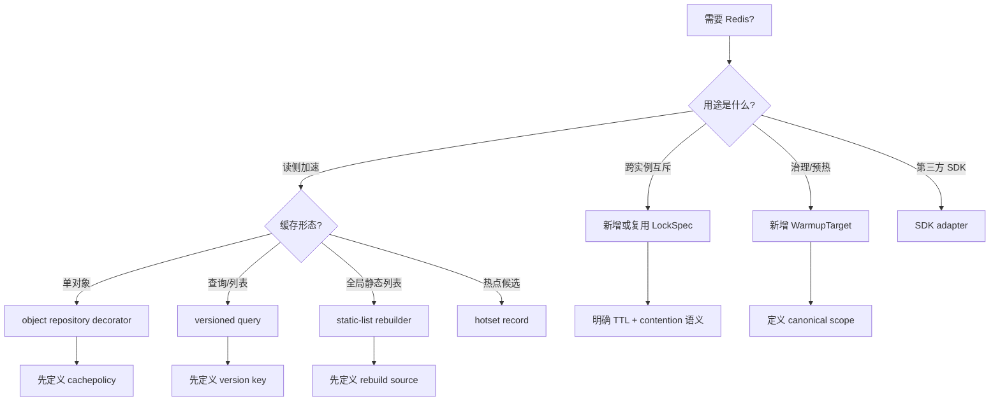
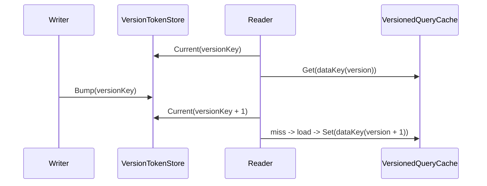

# 新增 Redis 能力 SOP

**本文回答**：新增 object cache、query cache、static-list cache、warmup target、LockSpec、operating BFF 接入时，应该如何决策、落代码、补测试和更新文档。

## 30 秒结论

| 新增能力 | 首选入口 | 必补测试 |
| -------- | -------- | -------- |
| object cache | `infra/cache` repository decorator | hit/miss/load/negative/delete/Redis error |
| query cache | `infra/cachequery` versioned query | version token、local hot、Redis fallback |
| static-list cache | application rebuilder + `cacheentry` + `cachequery.LocalHotCache` | rebuild、empty delete、memory hit |
| warmup target | `cachetarget` + `cachegovernance` bindings | kind/scope/family/org guard |
| LockSpec | `redislock` + 调用方 helper | acquire/contention/release/TTL |
| operating BFF | internal REST proxy | kind/scope whitelist、org guard、error passthrough |

## 决策流程



## 新增 object cache

1. 在 `cachepolicy` 中定义 `PolicyKey`、family 和默认策略。
2. 在 repository 外层新增 `Cached*Repository`，保持原 repository 接口。
3. 使用 `ObjectCacheStore` 和 `ReadThroughObject`。
4. key 使用 `rediskey.Builder`。
5. 写路径定义失效点。
6. 补测试：
   - positive hit
   - miss load
   - Redis error fallback
   - negative cache 如适用
   - delete invalidation
   - async writeback 如适用

## 新增 query cache



要求：

- 不优先扫描删 key。
- 明确 version key 维度。
- 明确 TTL 与 local hot cache 是否需要。
- 补 `version_token_store` 和 `versioned_query_cache` 回归测试。

## 新增 warmup target

1. 在 `cachetarget` 增加 `WarmupKind`、factory、parser、`FamilyForKind`。
2. 定义 scope canonical 格式。
3. 在 `cachegovernance.Coordinator` 中绑定 executor。
4. 如果来自 application 热点记录，注入 `cachetarget.HotsetRecorder`。
5. 更新 operating 白名单。
6. 补 target parser、manual warmup、status/hotset tests。

## 新增 LockSpec

1. 先确认不是数据库唯一性或事务问题。
2. 在 `redislock/spec.go` 增加 spec。
3. 明确 TTL 覆盖的 critical section。
4. 明确 contention 语义：skip、duplicate、retry 或 degraded continue。
5. 在调用方保留业务语义，不把它放进 `redislock`。
6. 补 acquire/release/contention/wrong-token/TTL 测试。

## operating BFF 接入

- 浏览器不要直连 qs-apiserver internal API。
- BFF 只代理受控治理接口。
- `query.*` target 必须做 org scope 校验。
- 不暴露破坏性 delete/invalidate。
- kind/scope 以 `cachetarget` 为准。

## 文档更新清单

新增 Redis 能力后同步更新：

- [../12-Redis文档中心.md](../12-Redis文档中心.md)，如果改变阅读地图或事实优先级。
- [../13-Redis缓存业务清单.md](../13-Redis缓存业务清单.md)，如果新增业务缓存。
- 本目录对应深讲文档。
- [../../04-接口与运维/06-operating 缓存治理页接入.md](../../04-接口与运维/06-operating%20缓存治理页接入.md)，如果新增 BFF 可操作 target。

## Verify

```bash
python scripts/check_docs_hygiene.py
git diff --check
GOTOOLCHAIN=local /Users/yangshujie/.gvm/gos/go1.25.9/bin/go test ./internal/pkg/redisplane ./internal/pkg/redisbootstrap ./internal/pkg/redislock ./internal/pkg/rediskey ./internal/pkg/cacheobservability ./internal/apiserver/cachebootstrap ./internal/apiserver/cachetarget ./internal/apiserver/infra/cache ./internal/apiserver/infra/cacheentry ./internal/apiserver/infra/cachequery ./internal/apiserver/infra/cachehotset ./internal/apiserver/application/cachegovernance ./internal/apiserver/runtime/scheduler ./internal/collection-server/infra/redisops ./internal/worker/handlers
```
