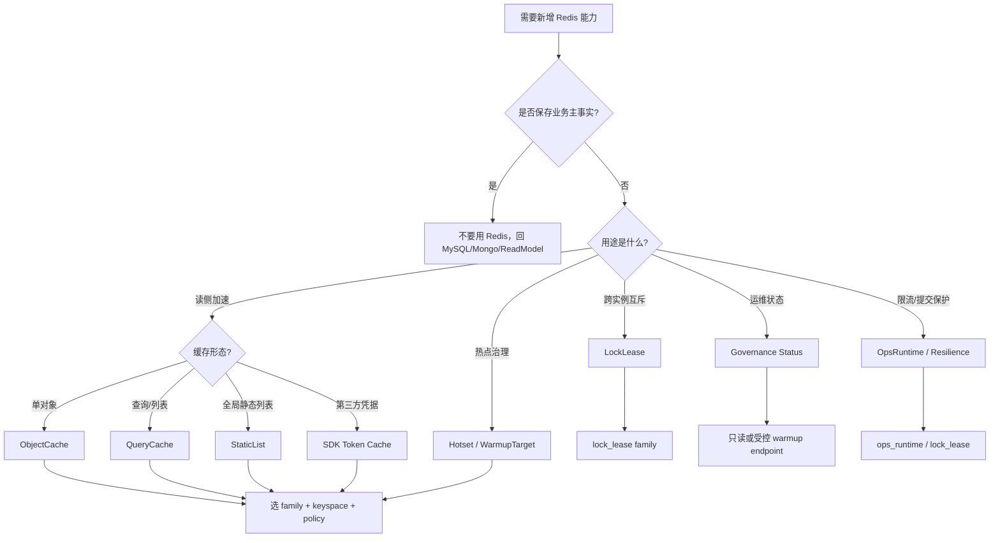

# 新增 Redis 能力 SOP

**本文回答**：在 qs-server 中新增 Redis 能力时，如何先判断它到底是 ObjectCache、QueryCache、StaticList、Hotset/WarmupTarget、LockLease、SDK token cache、Governance endpoint 还是纯粹不该用 Redis；然后如何选择 family、keyspace、policy、fallback/degraded、warmup、metrics、测试和文档，避免 Redis 被滥用成“万能临时状态库”。

---

## 30 秒结论

新增 Redis 能力按这条顺序执行：

```text
用途判断
  -> 选择能力类型
  -> 选择 family/profile/namespace
  -> 设计 keyspace
  -> 设计 policy / TTL / fallback / degraded
  -> 实现 adapter / decorator / target / lock spec
  -> 接入观测
  -> 补测试
  -> 更新文档
```

| 新增能力 | 首选入口 | 必须先回答 |
| -------- | -------- | ---------- |
| ObjectCache | `infra/cache` repository decorator | 是否是稳定 ID/code 的单对象读缓存？ |
| QueryCache | `infra/cachequery` versioned query | 是否是高频、低/中基数、可短暂 stale 的查询？ |
| StaticList | `Published*ListCache` rebuilder | 是否是全局、规模可控、更新低频的列表快照？ |
| Hotset / WarmupTarget | `cachetarget` + `cachehotset` + `cachegovernance` | 是否是可预热、低基数、canonical scope 的治理目标？ |
| LockLease | `locklease.Specs` + 调用方 helper | 是否是短期互斥，而不是 DB 事务/唯一约束问题？ |
| SDK Token Cache | integration adapter | 是否是第三方凭据缓存，而非业务对象？ |
| Governance endpoint | status/manual warmup/repair complete | 是否只读或受控预热，而非破坏性操作？ |
| Redis Family | `cacheplane.Family` / route | 是否真的需要独立 workload/profile/namespace？ |

一句话原则：

> **Redis 只能做运行时优化和短期协调，不能成为业务主事实源。**

---

## 1. 新增前先问 12 个问题

任何新增 Redis 能力前，先回答：

| 问题 | 为什么重要 |
| ---- | ---------- |
| 这是读缓存、锁、热度、token，还是业务事实？ | 决定是否应该用 Redis |
| cache miss 是否能回源？ | 不能回源就不是普通 cache |
| Redis unavailable 时怎么办？ | 决定 degraded 策略 |
| key 是否低基数？ | 高基数会污染 Redis 和 metrics |
| 是否需要 namespace 隔离？ | 防止跨环境/跨 family 冲突 |
| 是否需要独立 Redis profile？ | 决定 family route |
| TTL 如何确定？ | 影响 stale、内存和恢复 |
| 是否需要 warmup？ | 决定 WarmupTarget |
| 是否需要 invalidation？ | 决定 delete、bump version 或 rebuild |
| 是否需要幂等/锁？ | 决定 LockSpec 和业务兜底 |
| 是否有观测指标？ | 没观测就无法运维 |
| 是否已有更合适的 Data Access / Event / Resilience 能力？ | 避免 Redis 被滥用 |

如果回答不清，不要先写 Redis key。

---

## 2. 决策树



---

## 3. Family 选择

当前 Redis family：

| Family | 适用能力 |
| ------ | -------- |
| `static_meta` | scale/questionnaire/static-list 等静态元数据缓存 |
| `object_view` | assessment/testee/plan 等对象视图缓存 |
| `query_result` | assessment list、statistics query 等查询结果缓存 |
| `meta_hotset` | version token、hotset、治理元数据 |
| `sdk_token` | WeChat / 第三方 SDK token |
| `lock_lease` | Redis lease lock |
| `ops_runtime` | collection-server 限流、submit guard 等运行时保护 |
| `business_rank` | 业务排行类能力预留 |
| `default` | 默认 route，不应作为新能力的长期归宿 |

### 3.1 不要随意新增 family

只有满足以下条件才新增 family：

- 现有 family 语义不匹配。
- 需要独立 Redis profile。
- 需要独立 namespace。
- 需要独立 warmup/degraded 策略。
- 需要独立观测和治理。
- 该能力足够稳定，不是临时 key。

否则优先复用已有 family。

---

## 4. 新增 ObjectCache

### 4.1 适用场景

ObjectCache 适合：

```text
按稳定 ID/code 读取单个对象
```

例如：

- scale by code。
- questionnaire by code/version。
- assessment detail by id。
- testee by id。
- plan by id。

不适合：

- 分页列表。
- 高基数组合查询。
- 统计 overview。
- 业务排行榜。
- 锁。
- SDK token。

### 4.2 实施步骤

1. 确认对象有稳定 key。
2. 在 `cachepolicy` 增加或复用 `CachePolicyKey`。
3. 确认 `FamilyFor(policy)` 映射正确。
4. 在 `keyspace.Builder` 增加 key builder 方法。
5. 实现 `CacheEntryCodec[T]`。
6. 使用 `ObjectCacheStore[T]`。
7. 使用 `ReadThroughRunner`。
8. 写 `Cached*Repository` decorator。
9. 设计 delete invalidation。
10. 判断是否启用 negative cache。
11. 判断是否启用 compression。
12. 判断是否启用 singleflight。
13. 补测试和文档。

### 4.3 必测项

| 测试 | 必须 |
| ---- | ---- |
| positive hit | ☐ |
| miss -> source load -> set positive | ☐ |
| Redis get error -> fallback source | ☐ |
| source nil -> set negative，如启用 | ☐ |
| negative hit -> nil,nil | ☐ |
| decode error -> miss/fallback | ☐ |
| compression on/off | ☐ |
| delete invalidation | ☐ |
| singleflight，如启用 | ☐ |
| nil cache/client degraded | ☐ |

---

## 5. 新增 QueryCache

### 5.1 适用场景

QueryCache 适合：

- 用户列表。
- 管理端列表。
- dashboard 查询。
- statistics query。
- 查询参数有限且可 hash。
- 可接受短暂 stale。
- 失效范围可用 version scope 表达。

不适合：

- 任意全文搜索。
- 高基数字符串参数。
- 强实时排障查询。
- 无明确回源路径的查询。
- 写后必须立即一致的查询。

### 5.2 实施步骤

1. 定义 query scope。
2. 定义 version key。
3. 定义 versioned data key。
4. 对 query params 做稳定 hash。
5. 创建 `VersionTokenStore`。
6. 创建 `VersionedQueryCache`。
7. 实现 Get / Set / Invalidate。
8. 判断是否使用 LocalHotCache。
9. 设计 version bump 时机。
10. 设计 TTL。
11. 如需治理，设计 WarmupTarget。
12. 补测试和文档。

### 5.3 version scope 选择

| 维度 | 示例 | 代价 |
| ---- | ---- | ---- |
| user 级 | assessment list by userID | 失效简单，但该用户全部列表一起失效 |
| org 级 | statistics overview by org | 适合 dashboard |
| plan 级 | stats plan by org+planID | 更精准 |
| global 级 | published list | 可能过宽，应考虑 StaticList |

### 5.4 禁止优先 scan/delete

不要优先使用：

```text
SCAN query:...
DEL ...
```

优先使用：

```text
Bump(versionKey)
old data key TTL expire
```

---

## 6. 新增 StaticList

### 6.1 适用场景

StaticList 适合：

- 全局列表。
- 规模可控。
- 更新频率低。
- 读取频率高。
- 可以全量 rebuild。
- 可以本地分页切片。
- 可在 startup/publish 后 warmup。

典型：

```text
published scale list
published questionnaire list
```

### 6.2 实施步骤

1. 定义应用层 port。
2. 定义列表 item summary。
3. 定义 full list payload。
4. 定义 Redis list key。
5. 实现 `Rebuild(ctx)`。
6. 实现 `GetPage(ctx,page,pageSize)`。
7. 设计空列表语义。
8. 设计 LocalHotCache。
9. 设计 startup/publish warmup。
10. 补测试和文档。

### 6.3 必测项

| 测试 | 必须 |
| ---- | ---- |
| Redis hit -> page slice | ☐ |
| memory hit | ☐ |
| Redis miss -> false | ☐ |
| invalid page/pageSize | ☐ |
| rebuild with data -> set key | ☐ |
| rebuild empty -> delete key | ☐ |
| payload unmarshal error | ☐ |
| local cache reset after rebuild | ☐ |

---

## 7. 新增 Hotset / WarmupTarget

### 7.1 适用场景

适合：

- 可预热对象。
- 高频访问目标。
- 低基数 target。
- 可以用 canonical scope 表达。
- 能被 warm callback 重新加载。

不适合：

- 任意 from/to 查询。
- 搜索关键词。
- 用户隐私 token。
- 高基数 ID 组合。
- 业务排行榜。

### 7.2 实施步骤

1. 在 `cachetarget` 增加 `WarmupKind`。
2. 实现 target constructor。
3. 定义 scope canonical 格式。
4. 实现 scope parser。
5. 更新 `ParseWarmupKind`。
6. 更新 `ParseWarmupTarget`。
7. 更新 `FamilyForKind`。
8. 如是 query/org target，更新 `OrgID()`。
9. 在业务查询路径调用 `HotsetRecorder.Record`。
10. 在 `Coordinator.registerExecutors` 注册 executor。
11. 在 `cachebootstrap.GovernanceBindings` 增加 warm callback。
12. 补 parser、hotset、manual warmup、status tests。
13. 更新文档。

### 7.3 scope 规则

必须：

- 低基数。
- 可解析。
- 可规范化。
- 不含敏感信息。
- 不含 raw 时间戳范围。
- 不含 raw query string。
- 最好能解析 orgID。

示例：

```text
org:1:preset:7d
org:1:plan:1001
scale:phq9
questionnaire:adhd_parent
published
```

---

## 8. 新增 LockSpec

### 8.1 适用场景

适合：

- 多实例 leader election。
- 短期 in-flight protection。
- 重复消费抑制。
- 后台任务串行化。
- 小范围临界区。

不适合：

- DB 唯一性。
- 业务状态机。
- 长事务。
- 金融级 fencing。
- exactly-once。
- 长期任务占用。
- 永久幂等状态。

### 8.2 实施步骤

1. 确认不是数据库唯一约束/事务问题。
2. 在 `locklease.Specs` 增加 spec。
3. 定义 `Name`。
4. 定义 `Description`。
5. 定义 `DefaultTTL`。
6. 设计 raw key 格式。
7. 使用 `AcquireSpec / ReleaseSpec`。
8. 明确 contention 语义。
9. 明确 Redis error degraded 策略。
10. 明确 TTL 能覆盖 critical section。
11. 补 acquire/contention/release/degraded tests。
12. 更新文档。

### 8.3 contention 语义必须写清

| 场景 | contention 语义 |
| ---- | --------------- |
| leader | skip tick |
| submit guard | duplicate/in-flight |
| worker duplicate | duplicate skipped + Ack |
| sync task | busy/skip/retry |
| reconcile | skip |

不要把所有 contention 都当 error。

---

## 9. 新增 SDK Token Cache

### 9.1 适用场景

适合：

- WeChat access token。
- JSAPI ticket。
- 第三方 API token。
- 外部凭据短缓存。

不适合：

- 业务对象。
- 用户 session 主事实。
- 密码或敏感明文日志。
- 内部权限真值。

### 9.2 实施步骤

1. 确认 token 来源和 TTL。
2. 使用 `sdk_token` family。
3. 通过 keyspace builder 构造 key。
4. 不把 token 写入业务 ObjectCache。
5. 设计 refresh 策略。
6. 设计第三方失败降级。
7. 禁止日志输出 token。
8. 补 adapter tests。
9. 更新 integrations/redis 文档。

---

## 10. 新增 Governance Endpoint

### 10.1 适用场景

适合：

- runtime status。
- hotset status。
- manual warmup。
- repair complete warmup。
- 只读治理状态。

不适合：

- 手工改 Redis payload。
- 手工释放 lock。
- 手工删除任意 key。
- 直接修改 version token。
- 执行 DB repair。
- event replay。

### 10.2 实施步骤

1. 明确 endpoint 是只读还是受控 action。
2. 只读优先。
3. action 必须有 scope parser。
4. query target 必须做 org guard。
5. 不暴露 raw Redis key。
6. 补权限和审计。
7. 补 handler tests。
8. 更新接口文档和运维文档。

---

## 11. 新增 Family

### 11.1 什么时候新增

只有当现有 family 不适合时才新增。

需要满足：

- 独立 workload。
- 独立 profile/namespace。
- 独立 degraded 语义。
- 独立 warmup 策略。
- 独立观测价值。
- 稳定长期存在。

### 11.2 实施步骤

1. 在 `cacheplane.Family` 增加常量。
2. 更新组件默认 routes。
3. 更新 known family validation。
4. 更新 runtime options docs。
5. 定义 namespace suffix。
6. 判断 AllowFallbackDefault。
7. 判断 AllowWarmup。
8. 更新 governance status 文档。
9. 补 runtime/options tests。

---

## 12. Degraded 策略设计

每个 Redis 新能力必须写清 Redis unavailable 时怎么处理。

| 类型 | 常见策略 |
| ---- | -------- |
| ObjectCache | miss -> source repository |
| QueryCache | miss -> read model |
| StaticList | GetPage false -> source query |
| Hotset | skip record, business continue |
| Warmup | target error/skipped |
| Lock leader | skip/fail-closed |
| Worker duplicate | degraded-open |
| SubmitGuard | done lookup error -> error；lockMgr nil -> degraded-open |
| SDK token | 回源第三方或失败 |

不要默认“Redis 挂了就所有业务失败”。

---

## 13. Keyspace 设计

新增 key 必须走 builder。

### 13.1 Key 设计原则

| 原则 | 说明 |
| ---- | ---- |
| 使用 family namespace | 不手写 root prefix |
| 低基数 | 不把无限参数写入 key |
| 稳定 | 不依赖展示文案 |
| 可定位 | 需要时包含 org/user/plan |
| 不含敏感信息 | token、手机号等不进 key |
| 可 hash | 长 query params 用 hash |
| 可失效 | 能明确 delete/bump/rebuild |

### 13.2 需要补测试

- namespace。
- key 格式。
- 空参数。
- hash 稳定。
- 与旧 key 兼容，如有。

---

## 14. Policy 设计

新增 cache policy 时必须定义：

| 字段 | 判断 |
| ---- | ---- |
| TTL | 多久可接受 stale？ |
| NegativeTTL | not found 可缓存多久？ |
| Negative | 是否适合 negative cache？ |
| Compress | payload 是否够大？ |
| Singleflight | miss 是否可能击穿？ |
| JitterRatio | 是否需要打散过期？ |

### 14.1 不要盲目开启

| 能力 | 风险 |
| ---- | ---- |
| Negative cache | 新创建对象可能短暂不可见 |
| Compression | 增加 CPU |
| Singleflight | 长查询会让同 key 请求等待 |
| 长 TTL | stale 风险 |
| 短 TTL | 命中率低 |

---

## 15. Observability 要求

新增 Redis 能力至少考虑：

| 观测 | 要求 |
| ---- | ---- |
| family status | 是否会记录 success/failure |
| metrics | 是否有 get/write/lock/warmup outcome |
| duration | 慢操作是否可见 |
| payload size | 大缓存是否可观察 |
| degraded | Redis 不可用是否可见 |
| logs | 是否有低基数字段和必要业务上下文 |
| status endpoint | 是否需要治理状态展示 |

### 15.1 不允许高基数 labels

不要把以下字段作为 Prometheus label：

```text
cache key
lock key
scope
orgID
userID
planID
assessmentID
answerSheetID
scaleCode
questionnaireCode
raw error
```

---

## 16. 测试矩阵

### 16.1 ObjectCache

```text
hit
miss
source error
negative cache
compression
delete invalidation
singleflight
Redis error fallback
nil cache
```

### 16.2 QueryCache

```text
version current = 0
version bump
versioned data key
local hot cache
Redis payload miss
marshal/unmarshal error
invalidate error
```

### 16.3 StaticList

```text
rebuild with data
rebuild empty delete
GetPage memory hit
GetPage Redis hit
GetPage miss false
invalid page
payload decode error
```

### 16.4 Hotset / Target

```text
constructor
parser
canonical scope
OrgID
FamilyForKind
Record ok
suppressed
sampled_out
TopWithScores
trim
```

### 16.5 LockLease

```text
acquire ok
contention
release ok
wrong token not release
ttl validation
redis unavailable
degraded strategy
```

### 16.6 Governance

```text
manual target parse
empty targets error
family allow warmup skip
executor error
partial result
repair complete targets
statistics sync targets
suppression context
```

---

## 17. 文档同步矩阵

| 变更 | 至少同步 |
| ---- | -------- |
| 新 family / runtime route | [01-运行时与Family模型.md](./01-运行时与Family模型.md) |
| 新 cache 类型或 policy | [02-Cache层总览.md](./02-Cache层总览.md) |
| 新 ObjectCache | [03-ObjectCache主路径.md](./03-ObjectCache主路径.md) |
| 新 QueryCache / StaticList | [04-QueryCache与StaticList.md](./04-QueryCache与StaticList.md) |
| 新 WarmupTarget / Hotset | [05-Hotset与WarmupTarget模型.md](./05-Hotset与WarmupTarget模型.md) |
| 新 LockSpec | [06-Redis分布式锁层.md](./06-Redis分布式锁层.md) |
| 新 governance action | [07-缓存治理层.md](./07-缓存治理层.md) |
| 新 metrics/degraded | [08-观测降级与排障.md](./08-观测降级与排障.md) |
| 新业务缓存 | 对应业务模块文档 |
| 新运维接口 | 接口与运维文档 |

---

## 18. 合并前检查清单

| 检查项 | 是否完成 |
| ------ | -------- |
| 已证明 Redis 不是业务主事实源 | ☐ |
| 已选择正确能力类型 | ☐ |
| 已选择正确 family | ☐ |
| 已设计 namespace-safe key | ☐ |
| 已定义 TTL / negative / compression / singleflight | ☐ |
| 已定义 invalidation / bump / rebuild | ☐ |
| 已定义 fallback / degraded 策略 | ☐ |
| 已接 observability | ☐ |
| 已避免高基数 metrics label | ☐ |
| 如有 warmup，已定义 target kind/scope/parser | ☐ |
| 如有 lock，已定义 contention 语义和 TTL | ☐ |
| 已补测试 | ☐ |
| 已更新文档 | ☐ |

---

## 19. 反模式

| 反模式 | 后果 |
| ------ | ---- |
| 用 Redis 保存业务主事实 | 数据不可恢复，事务边界缺失 |
| handler 里手写 Redis key | namespace 漂移，难治理 |
| QueryCache 扫描删除 key | 风险高，性能不可控 |
| Hotset scope 写入任意时间范围 | 高基数污染 |
| 用 Redis lock 替代唯一约束 | 仍可能重复写 |
| Lock TTL 随便写 | 任务重叠或恢复慢 |
| warmup 中记录 hotset | 假热点 |
| manual warmup 接受 raw key | 越权和误操作 |
| metrics label 放业务 ID | Prometheus 高基数爆炸 |
| cache error 直接打断所有读 | 降级策略错误 |

---

## 20. Verify 命令

基础：

```bash
go test ./internal/pkg/cacheplane
go test ./internal/pkg/cacheplane/bootstrap
go test ./internal/pkg/cacheplane/keyspace
go test ./internal/pkg/cachegovernance/observability
```

Cache：

```bash
go test ./internal/apiserver/cachebootstrap
go test ./internal/apiserver/infra/cache
go test ./internal/apiserver/infra/cacheentry
go test ./internal/apiserver/infra/cachequery
go test ./internal/apiserver/infra/cachepolicy
```

Hotset / Governance：

```bash
go test ./internal/apiserver/cachetarget
go test ./internal/apiserver/infra/cachehotset
go test ./internal/apiserver/application/cachegovernance
```

Lock：

```bash
go test ./internal/pkg/locklease
go test ./internal/pkg/locklease/redisadapter
go test ./internal/apiserver/runtime/scheduler
go test ./internal/collection-server/infra/redisops
go test ./internal/worker/handlers
```

Docs：

```bash
make docs-hygiene
git diff --check
```

---

## 21. 代码锚点

- Family catalog：[../../../internal/pkg/cacheplane/catalog.go](../../../internal/pkg/cacheplane/catalog.go)
- Runtime options：[../../../internal/pkg/options/redis_runtime_options.go](../../../internal/pkg/options/redis_runtime_options.go)
- Keyspace builder：[../../../internal/pkg/cacheplane/keyspace/builder.go](../../../internal/pkg/cacheplane/keyspace/builder.go)
- Cache policy：[../../../internal/apiserver/infra/cachepolicy/policy.go](../../../internal/apiserver/infra/cachepolicy/policy.go)
- Object read-through：[../../../internal/apiserver/infra/cache/readthrough.go](../../../internal/apiserver/infra/cache/readthrough.go)
- Versioned query cache：[../../../internal/apiserver/infra/cachequery/versioned_query_cache.go](../../../internal/apiserver/infra/cachequery/versioned_query_cache.go)
- ScaleListCache：[../../../internal/apiserver/infra/cachequery/scale_list_cache.go](../../../internal/apiserver/infra/cachequery/scale_list_cache.go)
- Warmup target：[../../../internal/apiserver/cachetarget/target.go](../../../internal/apiserver/cachetarget/target.go)
- Hotset store：[../../../internal/apiserver/infra/cachehotset/store.go](../../../internal/apiserver/infra/cachehotset/store.go)
- Lock specs：[../../../internal/pkg/locklease/lease.go](../../../internal/pkg/locklease/lease.go)
- Lock manager：[../../../internal/pkg/locklease/redisadapter/lock.go](../../../internal/pkg/locklease/redisadapter/lock.go)
- Cache governance：[../../../internal/apiserver/application/cachegovernance/](../../../internal/apiserver/application/cachegovernance/)

---

## 22. 下一跳

| 目标 | 文档 |
| ---- | ---- |
| 运行时与 Family | [01-运行时与Family模型.md](./01-运行时与Family模型.md) |
| Cache 层总览 | [02-Cache层总览.md](./02-Cache层总览.md) |
| ObjectCache | [03-ObjectCache主路径.md](./03-ObjectCache主路径.md) |
| QueryCache 与 StaticList | [04-QueryCache与StaticList.md](./04-QueryCache与StaticList.md) |
| Hotset 与 WarmupTarget | [05-Hotset与WarmupTarget模型.md](./05-Hotset与WarmupTarget模型.md) |
| Redis 分布式锁 | [06-Redis分布式锁层.md](./06-Redis分布式锁层.md) |
| 缓存治理 | [07-缓存治理层.md](./07-缓存治理层.md) |
| 观测降级排障 | [08-观测降级与排障.md](./08-观测降级与排障.md) |
