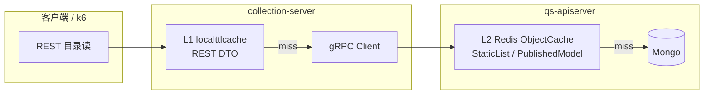
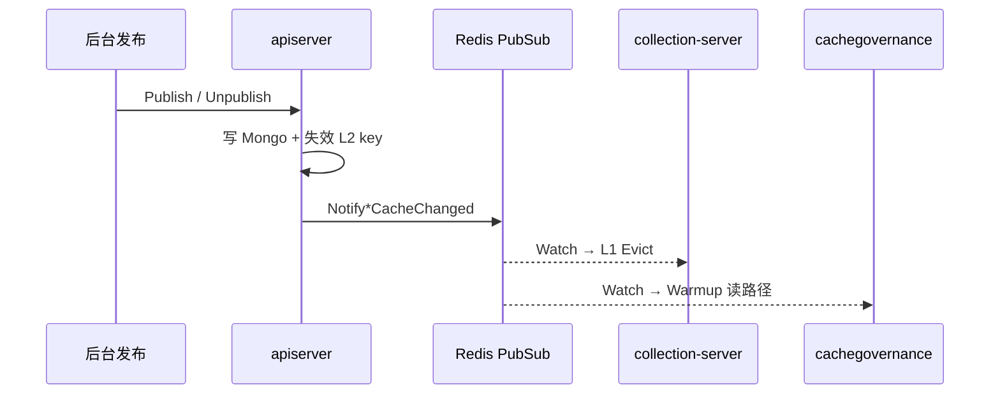

# Catalog 目录 L1 + L2 缓存

**本文回答**：C 端目录读（问卷 / 量表 / 人格模型）在 collection-server 与 apiserver 各缓存哪一层；L1 与 L2 如何分工；发布/下架后如何失效；配置项与排障入口在哪里。

---

## 30 秒结论

| 层 | 进程 | 存储 | 缓存内容 | 典型 TTL |
|----|------|------|----------|----------|
| **L1** | `collection-server` | 进程内 `localttlcache` | REST DTO（BFF 响应体） | 180s（可配） |
| **L2** | `qs-apiserver` | Redis `static_meta` family | 领域对象 / 发布快照 / 列表快照 | 按 `CachePolicy`（常见 10m～24h） |

| 域 | collection L1 | apiserver L2 | 失效信令 |
|----|---------------|--------------|----------|
| 问卷 | `questionnaire_cache` | `CachedQuestionnaireRepository` | `questionnaire_cache_changed` |
| 量表 | `scale_cache` | `CachedScaleRepository` + `PublishedScaleListCache` | `scale_cache_changed` |
| 人格模型 | `personality_cache` | `CachedPublishedModelStore` | `personality_model_cache_changed` |

一句话：

> **L1 省 collection→apiserver 一跳 gRPC；L2 省 apiserver→Mongo 读；信令 best-effort 主动失效，丢失靠 TTL 兜底。**

---

## 1. 为什么分两层

混合压测 `mixed_220`～`mixed_300` 的 query 大头是目录读：

```text
GET /api/v1/scales*           ~80/s
GET /api/v1/personality-models* ~40/s
GET /api/v1/questionnaires*   ~26/s
```

无 L1 时，每个 REST 请求都打 apiserver gRPC，collection `grpc_client.max_inflight` 先饱和。  
无 L2 时，apiserver 每次 gRPC 目录读都打 Mongo。

**压测证据（2026-07-01）**：`mixed_240_models`（54/27/19/s）与 **`mixed_280_models`（71/36/25/s）** 均 HTTP 0% 失败；后者同总读压下优于 legacy `mixed_280` 单桶（132/s 问卷 p95≈1.36s → 拆分后 http p95≈114ms）。验收：`make perf-mixed240-models` / `make perf-mixed280-models`。



**刻意不做**：wait-report 短 TTL L1、statistics 再加一层、testee/IAM 目录缓存（见停手边界 §8）。

---

## 2. L1：collection-server 进程内缓存

### 2.1 公共实现

| 项 | 说明 |
| --- | --- |
| 包 | `application/catalogl1`（泛型多桶）；L1 peek 在 `transport/rest/catalogpeek` |
| 底层 | `internal/pkg/localttlcache` + `loadguard.Coalescer`（singleflight 合并 miss） |
| 读穿透 | `catalogreadthrough`（算法层）+ `catalogl1.ReadThrough`（统一入口） |
| 语义 | FIFO + TTL；`Get/Set` 经 `clone` 深拷贝，隔离调用方修改 |
| 模式 | QueryService **cache-aside** + 可选 singleflight 合并 miss |
| nil/error | **不入缓存**（typed nil 用 reflect 判定） |

统一接线：`internal/collection-server/container/catalog_cache_runtime.go`

```text
initCatalogCaches()
  ├── questionnaire → startQuestionnaireCacheSignalWatcher
  ├── scale         → startScaleCacheSignalWatcher
  └── personality   → startPersonalityCacheSignalWatcher
cleanupCatalogCaches()  // 进程退出 cancel watcher
```

### 2.2 三域对照

| 域 | 配置块 | QueryService 读方法 | L1 Key 前缀 | 信令 evict |
|----|--------|---------------------|-------------|------------|
| 问卷 | `questionnaire_cache` | `Get`（已发布详情） | `published:{code}`、`published:{code}:{version}` | 按 code/version 删 detail |
| 量表 | `scale_cache` | `Get` / `List` / `ListHot` / `GetCategories` | `scale:detail:` / `scale:list:` / `scale:hot:` / `scale:categories` | detail + 前缀删 list/hot + categories |
| 人格 | `personality_cache` | `Get` / `List` / `GetCategories` | `personality:detail:` / `personality:list:` / `personality:categories` | 同量表（无 hot） |

列表 key 由请求参数规范化后 hash（page、pageSize、filter 等），避免组合爆炸时需注意 `max_entries` 上限。

### 2.3 生产默认配置

见 `configs/collection-server.prod.yaml`：

```yaml
questionnaire_cache:
  enabled: true
  ttl_seconds: 180
  max_entries: 256
  singleflight: true
  signal_evict_enabled: true

scale_cache:          # 字段同上
personality_cache:    # 字段同上
```

开发环境默认 `enabled: false`（`collection-server.dev.yaml`），本地调试可按需打开。

---

## 3. L2：apiserver Redis 缓存

L2 沿用既有 Redis Cache 体系（见 [02-Cache层总览](./02-Cache层总览.md)、[03-ObjectCache主路径](./03-ObjectCache主路径.md)），**family 多为 `static_meta`**。

### 3.1 三域 L2 形态

| 域 | 装饰器 / 组件 | 缓存形态 | 主要读路径 |
|----|---------------|----------|------------|
| 问卷 | `CachedQuestionnaireRepository` | ObjectCache（按 code） | gRPC 问卷详情、发布态查询 |
| 量表 | `CachedScaleRepository` | ObjectCache（code / version / questionnaire 别名） | gRPC 量表详情、按问卷反查 |
| 量表列表 | `PublishedScaleListCache` | Redis 全量列表 + 进程内 `LocalHotCache` 分页 | gRPC `ListScales` |
| 人格模型 | `CachedPublishedModelStore` | ObjectCache + catalog list/algorithms 专用 store | `FindPublishedModelByCode` / `ListPublishedModels` / `ListPublishedAlgorithms` |
| 规则目录 | `CachedPublishedModelStore`（evaluation ruleset） | 同上 | submit 热路径 + 目录读共用 |

人格模型 L2 接线：`internal/apiserver/container/modules/assessmentmodel/wire.go` 在 `static_meta` Redis 可用时用 `NewCachedPublishedModelStore` 包装 `DualStore`。

### 3.2 L1 与 L2 的 payload 差异

| 层 | Payload | 原因 |
|----|---------|------|
| L1 | REST DTO（`ScaleResponse`、`PersonalityModelResponse` 等） | BFF 已做字段裁剪与枚举转换，命中后零 gRPC |
| L2 | 领域快照 / Mongo 读模型 | gRPC 服务层共享，evaluation submit 与目录读可复用 |

两层 key **不共享**、**不联动**；一致性靠信令 + TTL。

---

## 4. 信令：发布后的失效与预热

信令定义：`configs/signals.yaml`，实现：`internal/pkg/cachesignal`。

| 信令 | 发布方 | collection 订阅行为 | apiserver 订阅行为 |
|------|--------|---------------------|-------------------|
| `questionnaire_cache_changed` | apiserver（问卷 lifecycle） | L1 evict | L2 warmup（`HandleQuestionnairePublished`） |
| `scale_cache_changed` | apiserver（量表 lifecycle） | L1 evict | L2 warmup（`HandleScalePublished`） |
| `personality_model_cache_changed` | apiserver（人格 Publish/Unpublish/Archive） | L1 evict | L2 warmup（`HandlePersonalityModelPublished`） |

语义：**ephemeral_signal**（Redis Pub/Sub），**best-effort、可丢**；丢失时 L1/L2 均由 TTL 兜底，最长陈旧窗口 ≈ 配置的 TTL。



collection debug 日志关键字：`cache signal evicted`（三域 watcher 均有）。

**前置条件**：`signaling.redis.enabled=true` 且 collection `ops_runtime` Redis 可用；`signal_evict_enabled=true` 且对应 `*_cache.enabled=true`。

---

## 5. 端到端读路径（以量表详情为例）

```text
1. GET /api/v1/scales/{code}
2. collection scale.QueryService.Get
   ├─ L1 hit → 直接返回 ScaleResponse
   └─ L1 miss → singleflight → gRPC GetScale
3. apiserver gRPC → CachedScaleRepository.FindPublishedByCode
   ├─ L2 hit → 组装 gRPC 响应
   └─ L2 miss → Mongo → 写 Redis → 返回
4. collection 将 gRPC 输出转为 REST DTO，写入 L1，返回客户端
```

人格、问卷路径同构，仅 DTO 与 gRPC 方法名不同。

---

## 6. 配置与开关速查

### 6.1 collection-server

| 开关 | 作用 |
|------|------|
| `{domain}_cache.enabled` | 总开关；false 时 QueryService 纯 gRPC 透传 |
| `ttl_seconds` | L1 条目 TTL |
| `max_entries` | FIFO 上限（每子缓存分区独立计数） |
| `singleflight` | miss 合并，防击穿 |
| `signal_evict_enabled` | 是否订阅 Redis 信令做主动 evict |
| `signaling.redis.enabled` | 信令总开关（与 wait-report 共用 ops Redis） |

### 6.2 apiserver

| 开关 | 作用 |
|------|------|
| `cache.warmup.enable` | 是否执行信令触发 warmup |
| `redis_runtime` / `static_meta` profile | L2 是否可用；不可用则纯 Mongo 回源 |
| `CachePolicy`（如 `PolicyPublishedModel`） | L2 TTL、negative cache 等 |

详见 [05-配置与环境变量.md](../../04-接口与运维/05-配置与环境变量.md)、[10-QPS容量档位与资源配置建议.md](../../04-接口与运维/10-QPS容量档位与资源配置建议.md)。

---

## 7. 观测与排障

| 现象 | 优先检查 |
|------|----------|
| 发布后 C 端仍看到旧目录 | 信令是否发出；collection `signal_evict_enabled`；debug 是否有 `cache signal evicted`；否则等 TTL |
| query p95 高、gRPC inflight 满 | L1 是否 `enabled`；命中率（`localttlcache.Stats`）；`max_inflight` |
| apiserver Mongo 读高 | L2 Redis family 是否 degraded；`Cached*` 是否接线 |
| 仅列表陈旧、详情正常 | 列表 key 为前缀 evict；检查信令是否带 code |
| 压测失败 | 须用 **拆分 query** profile（`mixed_240_models` / `mixed_300`），勿只用 legacy `mixed_240` 单桶问卷；见 [SOP §2.1](../../04-接口与运维/11-300QPS混合场景压测SOP.md) |

Redis 通用排障：[08-观测降级与排障.md](./08-观测降级与排障.md)。

---

## 8. 停手边界（刻意不做）

与 Catalog L1 重构方案一致：

- 不合并 apiserver `LocalHotCache` 与 collection `localttlcache`（层职责不同）
- 不为 personality 另建独立 ObjectCache 文件（扩展现有 `CachedPublishedModelStore`）
- 不做 wait-report / statistics / testee / IAM 的 collection L1
- 信令不做可靠投递（非 Outbox）；业务事实以 Mongo 为准

---

## 9. 代码锚点

### L1 公共

- `internal/pkg/localttlcache/cache.go`
- `internal/collection-server/container/catalog_cache_runtime.go`

### L1 三域

| 域 | 缓存 | QueryService | Evict / Watcher |
|----|------|--------------|-----------------|
| 问卷 | `application/questionnaire/local_cache.go` | `query_service.go` | `evict.go`, `signal_watcher.go` |
| 量表 | `application/scale/local_cache.go` | `query_service.go` | `evict.go`, `signal_watcher.go` |
| 人格 | `application/personalitymodel/local_cache.go` | `query_service.go` | `evict.go`, `signal_watcher.go` |

### L2 apiserver

- `internal/apiserver/infra/cache/questionnaire_cache.go`
- `internal/apiserver/infra/cache/scale_cache.go`
- `internal/apiserver/infra/cachequery/scale_list_cache.go`
- `internal/apiserver/infra/cache/published_model_cache.go`

### 信令与治理

- `internal/pkg/cachesignal/`（signal / notifier / signaling）
- `configs/signals.yaml`
- `internal/apiserver/application/cachegovernance/signal_watcher.go`
- 发布触发：问卷 `lifecycle_service.go`、量表 `scale/lifecycle/service.go`、人格 `personality/service.go`

---

## 10. Verify

```bash
# L1 单测
go test ./internal/pkg/localttlcache/...
go test ./internal/collection-server/application/questionnaire/...
go test ./internal/collection-server/application/scale/...
go test ./internal/collection-server/application/personalitymodel/...
go test ./internal/collection-server/container/...

# L2 单测
go test ./internal/apiserver/infra/cache/...
go test ./internal/apiserver/application/cachegovernance/...

# 构建
go build ./cmd/collection-server/...
```

压测验收：`mixed_280_models` 已通过；300 档分步 **`make perf-mixed300-http`** → **`make perf-mixed300-http-query`** → `make perf-mixed300`。

---

## 11. 相关文档

| 文档 | 关系 |
|------|------|
| [02-Cache层总览](./02-Cache层总览.md) | apiserver L2 能力总览 |
| [03-ObjectCache主路径](./03-ObjectCache主路径.md) | L2 read-through 细节 |
| [04-QueryCache与StaticList](./04-QueryCache与StaticList.md) | 量表列表 StaticList |
| [07-缓存治理层](./07-缓存治理层.md) | 信令 warmup、manual warmup |
| [10-QPS容量档位](../../04-接口与运维/10-QPS容量档位与资源配置建议.md) | 生产配置表 |
| [11-300QPS混合场景压测SOP](../../04-接口与运维/11-300QPS混合场景压测SOP.md) | 压测档位与 L1 收益证据 |
| [AssessmentModel 发布快照](../../02-业务模块/assessment-model/03-发布快照与执行链路.md) | 人格发布与 Mongo 事实源 |
