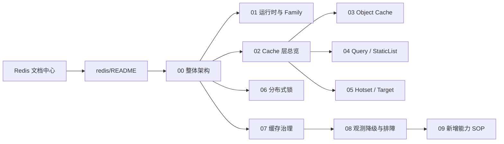

# Redis 深讲文档地图

**本文回答**：Redis 深讲文档应该按什么顺序读、每篇文档负责什么、哪些文档是现行真值、哪些历史材料只作背景。

## 30 秒结论

| 维度 | 结论 |
| ---- | ---- |
| 阅读入口 | 先读本文，再按问题进入整体架构、运行时、Cache、Lock、Governance |
| 真值来源 | 源码与配置优先；本目录只解释当前实现，不替代代码 |
| 组织方式 | `00-09` 按“架构 -> runtime -> cache -> lock -> governance -> 排障 -> SOP”展开 |
| 图示约定 | 所有长文使用 Mermaid 图，优先表达架构、模型、时序和排障决策 |
| 历史材料 | `docs/_archive` 只作演进背景，不作为本目录事实来源 |

## 阅读地图



## 文档清单

| 文档 | 负责什么 | 先读场景 |
| ---- | -------- | -------- |
| [00-整体架构.md](./00-整体架构.md) | Redis 四层架构、三进程职责、包依赖图 | 想建立全局心智模型 |
| [01-运行时与Family模型.md](./01-运行时与Family模型.md) | `redisplane`、`redisbootstrap`、family/profile/namespace/fallback | 排查 runtime 路由、profile 或 namespace |
| [02-Cache层总览.md](./02-Cache层总览.md) | `cachebootstrap.Subsystem`、policy、observer、cache 形态分流 | 判断一个缓存应该走哪条主路径 |
| [03-ObjectCache主路径.md](./03-ObjectCache主路径.md) | object repository decorator、read-through、negative、compression、async writeback | 新增或排查单对象缓存 |
| [04-QueryCache与StaticList.md](./04-QueryCache与StaticList.md) | version token、versioned query、local hot cache、ScaleListCache | 新增或排查列表/查询缓存 |
| [05-Hotset与WarmupTarget模型.md](./05-Hotset与WarmupTarget模型.md) | `cachetarget`、hotset ZSet、target scope、采样与 trim | 新增 warmup target 或排查 hotset |
| [06-Redis分布式锁层.md](./06-Redis分布式锁层.md) | `redislock`、scheduler leader、submit guard、worker duplicate suppression | 新增 LockSpec 或排查多实例互斥 |
| [07-缓存治理层.md](./07-缓存治理层.md) | coordinator、status service、manual warmup、repair complete | 接 operating 或排查治理接口 |
| [08-观测降级与排障.md](./08-观测降级与排障.md) | family status、metrics、readyz、Redis degraded 排障 | 生产排障 |
| [09-新增Redis能力SOP.md](./09-新增Redis能力SOP.md) | 新增缓存/锁/target 的决策流程与测试要求 | 开始改代码前 |

## 与上层文档的关系

- [../12-Redis文档中心.md](../12-Redis文档中心.md)：稳定入口，负责真值优先级和子目录地图。
- [../06-Redis使用情况.md](../06-Redis使用情况.md)：当前运行时事实总览。
- [../11-Redis三层设计与落地手册.md](../11-Redis三层设计与落地手册.md)：兼容入口，指向本目录深讲。
- [../13-Redis缓存业务清单.md](../13-Redis缓存业务清单.md)：业务缓存清单与回链。

## Verify

修改本目录后至少执行：

```bash
python scripts/check_docs_hygiene.py
git diff --check
```

如果新增或移动 Redis 代码锚点，额外执行 Redis 相关包测试：

```bash
GOTOOLCHAIN=local /Users/yangshujie/.gvm/gos/go1.25.9/bin/go test ./internal/pkg/redisplane ./internal/pkg/redisbootstrap ./internal/pkg/redislock ./internal/pkg/rediskey ./internal/pkg/cacheobservability ./internal/apiserver/cachebootstrap ./internal/apiserver/cachetarget ./internal/apiserver/infra/cache ./internal/apiserver/infra/cacheentry ./internal/apiserver/infra/cachequery ./internal/apiserver/infra/cachehotset ./internal/apiserver/application/cachegovernance ./internal/apiserver/runtime/scheduler ./internal/collection-server/infra/redisops ./internal/worker/handlers
```

---

*写作约定见 [CONTRIBUTING-DOCS.md](../../CONTRIBUTING-DOCS.md)。*
