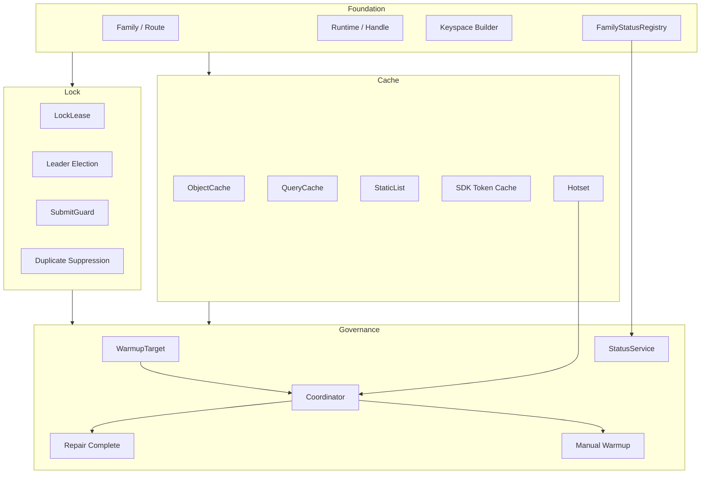

# Redis 阅读地图

**本文回答**：`redis/` 子目录这一组文档应该如何阅读；qs-server 的 Redis Plane 负责什么、不负责什么；Foundation、Cache、ObjectCache、QueryCache、Hotset、LockLease、Governance、Observability、新增能力 SOP 分别应该去哪里看。

---

## 30 秒结论

| 维度 | 结论 |
| ---- | ---- |
| 模块定位 | `redis/` 是 qs-server 的**非结构化运行时能力文档组**，解释 Redis family、cache、query cache、hotset、warmup、lock、governance、metrics 和 degraded 机制 |
| 四层架构 | Foundation / Cache / Lock / Governance |
| Foundation | `cacheplane` 负责 family、profile、namespace、runtime handle、fallback、degraded、family status |
| Cache | ObjectCache、QueryCache、StaticList、SDK token cache、PayloadStore、CachePolicy |
| Lock | `locklease` 负责 leader election、collection submit guard、worker duplicate suppression、statistics sync lock |
| Governance | `cachegovernance` 负责 startup/publish/statistics sync/repair complete/manual warmup 和 status |
| Observability | family status、runtime snapshot、Prometheus metrics、readyz/governance endpoint |
| 不负责 | 不保存业务主事实，不替代 MySQL/Mongo，不替代 ReadModel，不替代业务幂等和 DB 事务 |
| 推荐读法 | 先读整体架构和 family runtime，再读 cache、lock、governance，最后读排障和新增能力 SOP |

一句话概括：

> **Redis 在 qs-server 中不是“一个 Redis client”，而是被建模成可路由、可观测、可降级、可治理的运行时 plane。**

---

## 1. Redis Plane 负责什么

Redis Plane 负责 qs-server 中所有 Redis 相关运行时能力：

```text
family/profile/namespace
runtime handle
keyspace builder
object cache
query cache
static list cache
hotset
warmup target
SDK token cache
distributed lock
leader election
submit guard
duplicate suppression
cache governance
family status
metrics
degraded handling
```

它要回答：

```text
某个 Redis 能力属于哪个 family？
它用哪个 namespace 和 key builder？
Redis 不可用时如何降级？
cache miss 是否能回源？
query cache 如何失效？
warmup target 的 scope 如何定义？
lock 抢不到是 skip、duplicate 还是 error？
治理接口是只读还是受控 action？
```

---

## 2. Redis Plane 不负责什么

| 不属于 Redis Plane 的内容 | 应归属 |
| ------------------------- | ------ |
| 业务主事实 | MySQL / Mongo / Domain Repository |
| 统计事实源 | Statistics ReadModel |
| 事件可靠出站 | Event Outbox |
| 业务幂等最终兜底 | DB 唯一约束、状态机、idempotency collection |
| 大规模历史修复 | Backfill / Repair SOP |
| REST/gRPC 契约 | 接口与运维文档 |
| 第三方业务逻辑 | Integrations |
| 权限判断 | Security Plane |
| 限流总体策略 | Resilience Plane |

一句话边界：

```text
Redis 可以优化读取、协调短期并发、记录治理热点；
Redis 不能成为业务事实源。
```

---

## 3. 本目录文档地图

```text
redis/
├── README.md
├── 00-整体架构.md
├── 01-运行时与Family模型.md
├── 02-Cache层总览.md
├── 03-ObjectCache主路径.md
├── 04-QueryCache与StaticList.md
├── 05-Hotset与WarmupTarget模型.md
├── 06-Redis分布式锁层.md
├── 07-缓存治理层.md
├── 08-观测降级与排障.md
└── 09-新增Redis能力SOP.md
```

| 顺序 | 文档 | 先回答什么 |
| ---- | ---- | ---------- |
| 1 | [00-整体架构.md](./00-整体架构.md) | Redis 四层架构、三进程角色、Cache/Lock/Governance 总边界 |
| 2 | [01-运行时与Family模型.md](./01-运行时与Family模型.md) | family、profile、namespace、Runtime、Handle、fallback、degraded |
| 3 | [02-Cache层总览.md](./02-Cache层总览.md) | ObjectCache、QueryCache、StaticList、Hotset、SDK token 的分流 |
| 4 | [03-ObjectCache主路径.md](./03-ObjectCache主路径.md) | read-through、negative cache、compression、singleflight、writeback |
| 5 | [04-QueryCache与StaticList.md](./04-QueryCache与StaticList.md) | versioned query cache、version token、ScaleListCache |
| 6 | [05-Hotset与WarmupTarget模型.md](./05-Hotset与WarmupTarget模型.md) | hotset、WarmupTarget、scope、TopN、suppression |
| 7 | [06-Redis分布式锁层.md](./06-Redis分布式锁层.md) | locklease、leader、idempotency、duplicate suppression |
| 8 | [07-缓存治理层.md](./07-缓存治理层.md) | coordinator、manual warmup、repair complete、status |
| 9 | [08-观测降级与排障.md](./08-观测降级与排障.md) | family status、metrics、degraded、排障路径 |
| 10 | [09-新增Redis能力SOP.md](./09-新增Redis能力SOP.md) | 新缓存、新锁、新 target、新 governance endpoint 的执行流程 |

---

## 4. 推荐阅读路径

### 4.1 第一次理解 Redis Plane

按顺序读：

```text
00-整体架构
  -> 01-运行时与Family模型
  -> 02-Cache层总览
  -> 06-Redis分布式锁层
  -> 07-缓存治理层
```

读完后应能回答：

1. Redis 为什么要按 family 建模？
2. profile、namespace、fallback、degraded 分别是什么？
3. ObjectCache、QueryCache、StaticList 的差异是什么？
4. locklease 为什么不是业务幂等框架？
5. cache governance 为什么只做预热和状态，不修业务数据？

### 4.2 要新增对象缓存

读：

```text
03-ObjectCache主路径
  -> 02-Cache层总览
  -> 09-新增Redis能力SOP
```

重点看：

- 是否是稳定 ID/code 单对象。
- CachePolicyKey。
- keyspace builder。
- CacheEntryCodec。
- ReadThroughRunner。
- negative cache。
- compression。
- delete invalidation。
- Redis error fallback。

### 4.3 要新增查询缓存或列表缓存

读：

```text
04-QueryCache与StaticList
  -> 05-Hotset与WarmupTarget模型
  -> 09-新增Redis能力SOP
```

重点看：

- version key 维度。
- versioned data key。
- query params hash。
- invalidate / bump version。
- LocalHotCache。
- 是否适合 StaticList。
- 是否需要 WarmupTarget。

### 4.4 要新增预热目标或热点治理

读：

```text
05-Hotset与WarmupTarget模型
  -> 07-缓存治理层
  -> 09-新增Redis能力SOP
```

重点看：

- WarmupKind。
- canonical scope。
- ParseWarmupTarget。
- FamilyForKind。
- OrgID。
- HotsetRecorder。
- Coordinator executor。
- suppress hotset recording。

### 4.5 要新增分布式锁

读：

```text
06-Redis分布式锁层
  -> 01-运行时与Family模型
  -> 09-新增Redis能力SOP
```

重点看：

- 是否真的是短期互斥问题。
- LockSpec。
- TTL。
- raw key。
- contention 语义。
- degraded-open / fail-closed / skip。
- DB 事务和唯一约束兜底。

### 4.6 要排查 Redis 异常

读：

```text
08-观测降级与排障
  -> 01-运行时与Family模型
  -> 02-Cache层总览
  -> 06-Redis分布式锁层
```

按顺序看：

```text
family status
  -> runtime summary
  -> metrics
  -> endpoint
  -> 具体能力日志
```

---

## 5. Redis 四层主图



---

## 6. 三进程 Redis 角色

| 进程 | 使用能力 | 不承担 |
| ---- | -------- | ------ |
| `qs-apiserver` | ObjectCache、QueryCache、StaticList、Hotset、SDK token、LockLease、Governance | 不把 Redis 当业务主数据源 |
| `collection-server` | ops_runtime、distributed limiter、SubmitGuard、CollectionSubmit lock | 不做 apiserver object/query cache |
| `qs-worker` | lock_lease、answersheet duplicate suppression | 不做 object/query cache，不写 Redis 统计事实 |

### 6.1 apiserver

典型 Redis family：

```text
static_meta
object_view
query_result
meta_hotset
sdk_token
lock_lease
```

### 6.2 collection-server

典型 Redis family：

```text
ops_runtime
lock_lease
```

### 6.3 worker

典型 Redis family：

```text
lock_lease
```

---

## 7. Family 快速索引

| Family | 典型用途 |
| ------ | -------- |
| `static_meta` | scale/questionnaire/static-list |
| `object_view` | assessment/testee/plan 等对象视图 |
| `query_result` | assessment list、statistics query |
| `meta_hotset` | version token、hotset、warmup metadata |
| `sdk_token` | WeChat / 第三方 token |
| `lock_lease` | 分布式锁 |
| `ops_runtime` | collection submit guard、rate limit |
| `business_rank` | 业务排行类预留 |
| `default` | 默认 fallback route |

---

## 8. Cache 形态速查

| 场景 | 用什么 | 不用什么 |
| ---- | ------ | -------- |
| 按 ID/code 读单对象 | ObjectCache | QueryCache / 手写 Redis |
| 用户私有列表 | QueryCache | ObjectCache |
| dashboard overview | QueryCache + WarmupTarget | 实时扫主表 |
| 全局发布量表列表 | StaticList | ObjectCache |
| 热点预热候选 | Hotset | 业务排行榜 |
| 微信 token | SDK Token Cache | ObjectCache |
| 跨实例互斥 | LockLease | ObjectCache |
| 统计事实 | Statistics ReadModel | Redis 增量计数 |

---

## 9. Redis 事实源边界

| Redis 能力 | 事实源 |
| ---------- | ------ |
| Scale ObjectCache | Scale repository |
| Questionnaire ObjectCache | Questionnaire repository |
| Assessment ObjectCache | Evaluation repository |
| Testee ObjectCache | Actor repository |
| Plan ObjectCache | Plan repository |
| Statistics QueryCache | Statistics ReadModel |
| ScaleList StaticList | Scale read model / list builder |
| Hotset | 访问行为热度，只是治理信号 |
| LockLease | 短期租约，不是业务事实 |
| SDK Token Cache | 第三方平台 token |
| Governance Status | 运行时状态快照 |

原则：

```text
cache miss 必须能回源；
lock 失败必须有业务策略；
warmup 失败不修数据；
Redis 不保存不可重建业务事实。
```

---

## 10. Degraded 快速判断

| 能力 | Redis degraded 后 |
| ---- | ----------------- |
| ObjectCache | 当 miss，回源 repository |
| QueryCache | 当 miss，回源 read model |
| StaticList | 返回 false，应用回源 |
| Hotset | 不记录热点，不阻断主查询 |
| Warmup | target error / skipped |
| Scheduler leader | skip 或 fail-closed |
| Collection SubmitGuard | 视 done marker / lock manager 状态 |
| Worker duplicate suppression | degraded-open，继续处理 |
| SDK token | 回源第三方或失败 |

不要把 degraded 统一理解成“业务失败”。

---

## 11. 维护原则

### 11.1 不写裸 Redis key

新增 key 必须走：

```text
keyspace.Builder
```

不要在业务代码中手写 root namespace 或 family prefix。

### 11.2 不把 Redis 当事实源

Redis 只能缓存或协调，不能替代 MySQL/Mongo/ReadModel。

### 11.3 不滥用 QueryCache

高基数、强实时、排障查询不适合缓存。

### 11.4 不滥用 LockLease

Redis lock 不能替代：

- DB 事务。
- 唯一索引。
- 状态机。
- idempotency collection。
- outbox checkpoint。
- fencing token。

### 11.5 Governance 默认只读或受控预热

不要在 governance endpoint 中提供任意 delete key、release lock、修改 payload 等破坏性能力。

### 11.6 Metrics label 必须低基数

不要把：

```text
cache key
lock key
scope
orgID
userID
planID
assessmentID
scaleCode
raw error
```

放进 Prometheus label。

---

## 12. 常见误区

### 12.1 “Redis 是缓存，所以挂了没事”

不准确。ObjectCache 挂了可回源；LockLease 挂了可能影响调度、提交保护和重复消费抑制。

### 12.2 “Redis lock 能保证 exactly-once”

不能。最终正确性仍需要业务幂等和数据库约束。

### 12.3 “Hotset 是业务排行榜”

不是。Hotset 是 cache warmup 的治理信号。

### 12.4 “repair complete 会修数据”

不会。它只在 repair 完成后触发缓存预热。

### 12.5 “清 Redis 能解决所有问题”

危险。可能造成缓存雪崩、version token 丢失、lock 行为异常。先看 family status 和事实源。

### 12.6 “所有列表都用 StaticList”

不对。StaticList 只适合全局、低频更新、规模可控的列表。

---

## 13. 排障入口

| 现象 | 优先文档 |
| ---- | -------- |
| Redis family degraded | [08-观测降级与排障.md](./08-观测降级与排障.md) |
| profile / namespace / fallback 错 | [01-运行时与Family模型.md](./01-运行时与Family模型.md) |
| ObjectCache 命中率低 | [03-ObjectCache主路径.md](./03-ObjectCache主路径.md) |
| QueryCache 失效不对 | [04-QueryCache与StaticList.md](./04-QueryCache与StaticList.md) |
| Hotset 无数据 | [05-Hotset与WarmupTarget模型.md](./05-Hotset与WarmupTarget模型.md) |
| warmup 失败 | [07-缓存治理层.md](./07-缓存治理层.md) |
| scheduler 不跑 | [06-Redis分布式锁层.md](./06-Redis分布式锁层.md) |
| 重复提交/重复消费 | [06-Redis分布式锁层.md](./06-Redis分布式锁层.md) |
| 新增 Redis 能力 | [09-新增Redis能力SOP.md](./09-新增Redis能力SOP.md) |

---

## 14. 代码锚点

### Foundation

- Family catalog：[../../../internal/pkg/cacheplane/catalog.go](../../../internal/pkg/cacheplane/catalog.go)
- Runtime：[../../../internal/pkg/cacheplane/runtime.go](../../../internal/pkg/cacheplane/runtime.go)
- Runtime bootstrap：[../../../internal/pkg/cacheplane/bootstrap/runtime.go](../../../internal/pkg/cacheplane/bootstrap/runtime.go)
- Keyspace builder：[../../../internal/pkg/cacheplane/keyspace/builder.go](../../../internal/pkg/cacheplane/keyspace/builder.go)

### Cache

- Cache subsystem：[../../../internal/apiserver/cachebootstrap/subsystem.go](../../../internal/apiserver/cachebootstrap/subsystem.go)
- Cache policy：[../../../internal/apiserver/infra/cachepolicy/](../../../internal/apiserver/infra/cachepolicy/)
- Object cache：[../../../internal/apiserver/infra/cache/](../../../internal/apiserver/infra/cache/)
- Cache entry：[../../../internal/apiserver/infra/cacheentry/](../../../internal/apiserver/infra/cacheentry/)
- Query cache：[../../../internal/apiserver/infra/cachequery/](../../../internal/apiserver/infra/cachequery/)

### Hotset / Governance

- Cache target：[../../../internal/apiserver/cachetarget/](../../../internal/apiserver/cachetarget/)
- Cache hotset：[../../../internal/apiserver/infra/cachehotset/](../../../internal/apiserver/infra/cachehotset/)
- Cache governance：[../../../internal/apiserver/application/cachegovernance/](../../../internal/apiserver/application/cachegovernance/)
- Governance observability：[../../../internal/pkg/cachegovernance/observability/](../../../internal/pkg/cachegovernance/observability/)

### Lock

- Lock specs：[../../../internal/pkg/locklease/lease.go](../../../internal/pkg/locklease/lease.go)
- Redis lock adapter：[../../../internal/pkg/locklease/redisadapter/](../../../internal/pkg/locklease/redisadapter/)
- SubmitGuard：[../../../internal/collection-server/infra/redisops/submit_guard.go](../../../internal/collection-server/infra/redisops/submit_guard.go)
- Worker answersheet gate：[../../../internal/worker/handlers/answersheet_handler.go](../../../internal/worker/handlers/answersheet_handler.go)

---

## 15. Verify

Foundation：

```bash
go test ./internal/pkg/cacheplane
go test ./internal/pkg/cacheplane/bootstrap
go test ./internal/pkg/cacheplane/keyspace
go test ./internal/pkg/options
```

Cache：

```bash
go test ./internal/apiserver/cachebootstrap
go test ./internal/apiserver/infra/cache
go test ./internal/apiserver/infra/cacheentry
go test ./internal/apiserver/infra/cachequery
go test ./internal/apiserver/infra/cachepolicy
```

Hotset / Governance：

```bash
go test ./internal/apiserver/cachetarget
go test ./internal/apiserver/infra/cachehotset
go test ./internal/apiserver/application/cachegovernance
go test ./internal/pkg/cachegovernance/observability
```

Lock：

```bash
go test ./internal/pkg/locklease
go test ./internal/pkg/locklease/redisadapter
go test ./internal/apiserver/runtime/scheduler
go test ./internal/collection-server/infra/redisops
go test ./internal/worker/handlers
```

Docs：

```bash
make docs-hygiene
git diff --check
```

---

## 16. 下一跳

| 目标 | 文档 |
| ---- | ---- |
| 整体架构 | [00-整体架构.md](./00-整体架构.md) |
| Runtime / Family | [01-运行时与Family模型.md](./01-运行时与Family模型.md) |
| Cache 总览 | [02-Cache层总览.md](./02-Cache层总览.md) |
| ObjectCache | [03-ObjectCache主路径.md](./03-ObjectCache主路径.md) |
| QueryCache / StaticList | [04-QueryCache与StaticList.md](./04-QueryCache与StaticList.md) |
| Hotset / WarmupTarget | [05-Hotset与WarmupTarget模型.md](./05-Hotset与WarmupTarget模型.md) |
| Redis 分布式锁 | [06-Redis分布式锁层.md](./06-Redis分布式锁层.md) |
| 缓存治理 | [07-缓存治理层.md](./07-缓存治理层.md) |
| 观测降级排障 | [08-观测降级与排障.md](./08-观测降级与排障.md) |
| 新增 Redis 能力 | [09-新增Redis能力SOP.md](./09-新增Redis能力SOP.md) |
| 回到基础设施总入口 | [../README.md](../README.md) |
