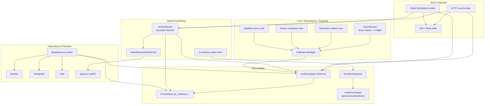

# Resilience Plane 整体架构

**本文回答**：qs-server 的高并发治理由哪些保护点组成；入口限流、SubmitQueue、Backpressure、LockLease、幂等、重复抑制和观测状态如何协作；三进程分别承担什么 Resilience 职责；为什么当前不把限流、队列、锁、幂等抽成一个“万能高并发框架”。

---

## 30 秒结论

| 层 | 目标 | 主要代码 |
| -- | ---- | -------- |
| Entry Protection | 在入口挡住突发请求，返回明确 429 / Retry-After | `ratelimit`、`middleware/limit.go`、Redis limiter |
| Submit Smoothing | 把答卷提交削峰为 collection-server 本进程有界异步队列 | `SubmitQueue`、`submitQueueWorkerPool` |
| Dependency Protection | 限制 MySQL/Mongo/IAM 等下游同时占用的 in-flight 操作数 | `backpressure.Limiter` |
| Lock / Lease | 跨实例短期互斥、选主、串行化、重复抑制 | `locklease`、Redis adapter |
| Idempotency | 已完成结果复用、进行中抑制、提交幂等 | collection `SubmitGuard`、AnswerSheet durable submit |
| Duplicate Suppression | MQ 重复投递场景下的 best-effort 重复处理抑制 | worker answersheet gate |
| Observability | 用统一 vocabulary 和 metrics 解释保护决策 | `resilienceplane` |
| Status Snapshot | 暴露只读 runtime 状态，不提供动态调参/drain/release | `resilienceplane.StatusService` |

| 维度 | 结论 |
| ---- | ---- |
| 核心定位 | Resilience Plane 负责高并发保护、削峰、背压、重复抑制、降级和观测 |
| 不是框架 | `resilienceplane` 只是 vocabulary + observer + status snapshot，不实现限流/队列/锁本体 |
| 三进程分工 | collection-server 扛前台提交峰值；apiserver 保护下游与 scheduler；worker 控制 MQ 消费和重复事件 |
| 降级原则 | 不同保护点语义不同：rate limit 返回 429，queue full 返回错误，backpressure timeout 返回错误，leader contention 是 skip，worker lock degraded 可继续 |
| 关键边界 | SubmitQueue 不是 MQ，LockLease 不是 exactly-once，Backpressure 不是 SQL timeout，RateLimit 不是业务权限 |
| 观测边界 | metrics label 只能用低基数 subject，不放 requestID/userID/lockKey/cacheKey |

一句话概括：

> **Resilience Plane 的目标不是“让请求永不失败”，而是在高并发下用可解释的方式保护入口、队列、下游和重复处理边界。**

---

## 1. 为什么需要 Resilience Plane

qs-server 的核心链路会遇到多种并发压力：

```text
前台答卷提交突增
collection-server 到 apiserver gRPC 高峰
apiserver 写 MySQL/Mongo 峰值
worker 消费 MQ 重复投递
statistics sync / plan scheduler 多实例抢跑
IAM / WeChat / DB 等下游变慢
```

如果没有 Resilience Plane，会出现：

| 问题 | 后果 |
| ---- | ---- |
| 入口请求无限进入 | goroutine/连接/DB 被压垮 |
| 答卷提交同步堆积 | 前台超时，apiserver 被打爆 |
| 下游慢但上游继续压 | 雪崩 |
| 多实例调度器同时跑 | 重复任务、重复写 |
| MQ 重复投递无抑制 | 重复副作用 |
| 保护点结果不可观测 | 只能猜测“系统慢” |
| 高并发策略散落 | 排障和扩展困难 |

Resilience Plane 就是把这些保护点统一建模、观测和文档化。

---

## 2. Resilience 总图



---

## 3. Resilience Plane 与具体能力的关系

### 3.1 resilienceplane 只是 vocabulary

`resilienceplane` 定义：

- ProtectionKind。
- Outcome。
- Subject。
- Decision。
- Observer。
- RuntimeSnapshot。
- Prometheus metrics。

它不实现：

- token bucket。
- queue。
- lock。
- backpressure semaphore。
- idempotency store。
- retry。
- dynamic config。

### 3.2 具体能力分别实现

| 能力 | 实现位置 |
| ---- | -------- |
| HTTP local limit | `internal/pkg/middleware/limit.go` |
| Redis distributed limit | `internal/pkg/ratelimit/redisadapter` |
| SubmitQueue | `internal/collection-server/application/answersheet` |
| Backpressure | `internal/pkg/backpressure` |
| LockLease | `internal/pkg/locklease` |
| SubmitGuard | `internal/collection-server/infra/redisops` |
| Worker duplicate gate | `internal/worker/handlers/answersheet_handler.go` |

Resilience Plane 统一观测这些结果，但不把它们抽象成一个大框架。

---

## 4. ProtectionKind

当前保护类型：

| Kind | 说明 |
| ---- | ---- |
| `rate_limit` | 入口限流 |
| `queue` | 有界队列削峰 |
| `backpressure` | 下游并发槽位保护 |
| `lock` | 分布式锁/租约 |
| `idempotency` | 幂等命中/提交保护 |
| `duplicate_suppression` | 重复处理抑制 |

### 4.1 为什么要区分 kind

因为不同保护点的语义完全不同：

| Kind | 被拒绝/未获取时通常意味着 |
| ---- | ------------------------- |
| rate_limit | 当前请求太多，返回 429 |
| queue | 队列满或重复请求 |
| backpressure | 下游已满，等待槽位超时 |
| lock | 可能是正常竞争，也可能是异常 |
| idempotency | 结果已存在或正在处理 |
| duplicate_suppression | 重复事件可以跳过 |

---

## 5. Outcome

当前 outcome 是 bounded vocabulary。

常见分类：

### 5.1 RateLimit

| Outcome | 说明 |
| ------- | ---- |
| `allowed` | 允许通过 |
| `rate_limited` | 被限流 |
| `degraded_open` | 限流组件不可用时放行 |

### 5.2 Queue

| Outcome | 说明 |
| ------- | ---- |
| `queue_accepted` | 入队成功 |
| `queue_full` | 队列满 |
| `queue_duplicate` | requestID 已存在，复用状态 |
| `queue_processing` | 任务处理中 |
| `queue_done` | 任务完成 |
| `queue_failed` | 任务失败 |
| `queue_status_cleaned` | 过期状态清理 |

### 5.3 Backpressure

| Outcome | 说明 |
| ------- | ---- |
| `backpressure_acquired` | 获得槽位 |
| `backpressure_timeout` | 等待槽位超时 |
| `backpressure_released` | 释放槽位 |

### 5.4 Lock / Idempotency / Duplicate

| Outcome | 说明 |
| ------- | ---- |
| `lock_acquired` | 获得锁 |
| `lock_contention` | 锁竞争失败 |
| `lock_released` | 释放锁 |
| `lock_error` | 锁操作错误 |
| `lock_degraded` | 锁能力降级 |
| `idempotency_hit` | 幂等结果命中 |
| `duplicate_skipped` | 重复处理跳过 |

---

## 6. Subject：低基数观测维度

`Subject` 字段：

| 字段 | 说明 |
| ---- | ---- |
| Component | 组件，例如 apiserver、collection-server、worker |
| Scope | 保护范围，例如 answersheet_submit、mysql、mongo |
| Resource | 被保护资源，例如 submit_queue、redis_lock |
| Strategy | 策略，例如 local、redis_lock、memory_channel、semaphore |

### 6.1 禁止高基数字段

不要把这些放进 Subject：

```text
userID
requestID
answerSheetID
assessmentID
lockKey
cacheKey
raw URL
raw error
```

它们会污染 Prometheus label。

---

## 7. Entry Protection：入口限流

### 7.1 Local HTTP limiter

`middleware.LimitWithOptions`：

1. 构造 RateLimitPolicy。
2. 调 `ratelimit.NewLocalLimiter`。
3. 每个请求调用 `limiter.Decide(ctx,key)`。
4. allowed 则 `c.Next()`。
5. not allowed 则：
   - 记录 resilience decision。
   - 设置 Retry-After。
   - 返回 HTTP 429。

### 7.2 ByKey limiter

`LimitByKeyWithOptions` 支持不同 key 独立限流。

适合：

- per IP。
- per org。
- per route。
- per token。

前提：keyFn 不能产生高基数 metrics label；key 只给 limiter 使用，不进入 resilience subject。

### 7.3 Redis distributed limiter

collection-server 可使用 Redis distributed limiter，适合多实例共享入口速率。

Redis limiter 失败时当前策略偏 fail-open / degraded-open，避免 Redis 抖动导致所有请求被挡死。

---

## 8. SubmitQueue：提交削峰

collection-server 的 SubmitQueue 是进程内有界队列。

### 8.1 它做什么

`SubmitQueue` 把前台答卷提交从同步处理转成：

```text
HTTP request
  -> enqueue bounded channel
  -> worker pool async submit
  -> status polling
```

### 8.2 Enqueue 行为

`Enqueue(ctx, requestID, writerID, req)`：

1. queue nil -> disabled error。
2. requestID 为空 -> error。
3. 如果 requestID 已有状态：
   - done / queued / processing -> queue_duplicate，返回 nil。
   - failed -> queue_failed，要求新 request_id。
4. 如果 ctx canceled -> 返回 ctx error。
5. 尝试写入 jobs channel。
6. 成功：状态 queued，记录 queue_accepted。
7. channel full：记录 queue_full，返回 ErrQueueFull。

### 8.3 状态 store

进程内 status store 维护：

```text
queued
processing
done
failed
```

默认 TTL 10 分钟。

### 8.4 关键边界

SubmitQueue：

- 是 collection-server 进程内队列。
- 不是 MQ。
- 不是 Redis durable queue。
- 没有跨进程队列持久化。
- lifecycle boundary 是 `process_memory_no_drain`。
- 进程退出时不保证 drain。

---

## 9. Backpressure：下游背压

`backpressure.Limiter` 限制下游 in-flight 操作。

### 9.1 作用

保护：

- MySQL。
- MongoDB。
- IAM。
- internal gRPC。
- 外部 SDK。

### 9.2 Acquire 语义

`Acquire(ctx)`：

- 如果 limiter nil，直接放行并返回 no-op release。
- 如果有 limiter，等待槽位。
- 获取成功返回 wrapped ctx 和 release func。
- 等待超时/ctx canceled 返回 error。
- 释放时记录 released。

### 9.3 它不做什么

Backpressure 不限制：

- 下游操作执行时长。
- SQL 慢查询本身。
- DB connection pool。
- HTTP client timeout。
- 业务重试次数。

它只限制：

```text
进入下游操作前等待槽位
```

### 9.4 Status

`Snapshot(name)` 返回：

- enabled。
- max_inflight。
- in_flight。
- timeout_millis。
- degraded。
- reason。

---

## 10. LockLease：锁、幂等、重复抑制

LockLease 被多个 Resilience 场景消费。

### 10.1 使用场景

| 场景 | 语义 |
| ---- | ---- |
| scheduler leader | 多实例中一个实例执行 tick |
| statistics sync | 同一任务串行化 |
| collection submit | in-flight lock + done marker |
| worker answersheet | duplicate suppression |
| behavior reconcile | 多实例串行化 |

### 10.2 关键边界

LockLease 不是：

- exactly-once。
- DB transaction。
- 唯一约束。
- 通用幂等框架。
- fencing token。

锁竞争失败的语义必须由调用方定义。

---

## 11. 三进程职责

### 11.1 collection-server

负责：

- 前台 submit 限流。
- Redis distributed limiter。
- SubmitQueue。
- SubmitGuard。
- request status。
- resilience status snapshot。

不负责：

- 持久化业务主事实。
- durable queue。
- evaluation pipeline。
- statistics sync。

### 11.2 apiserver

负责：

- REST local limiter。
- MySQL/Mongo/IAM backpressure。
- scheduler leader lock。
- statistics sync task lock。
- behavior pending reconcile lock。
- durable submit 幂等边界。
- internal resilience status。

不负责：

- SubmitQueue。
- 前台入口削峰队列。
- worker MQ 消费。

### 11.3 worker

负责：

- MQ consumer 并发控制。
- answersheet duplicate suppression。
- handler 幂等辅助。
- worker metrics/status。

不负责：

- exactly-once。
- object/query cache。
- 主写模型持久化。

---

## 12. RuntimeSnapshot

`resilienceplane.RuntimeSnapshot` 是只读状态模型。

字段包括：

- generated_at。
- component。
- summary。
- rate_limits。
- queues。
- backpressure。
- locks。
- idempotency。
- duplicate_suppression。

### 12.1 Summary

`FinalizeRuntimeSnapshot` 会统计：

- capability_count。
- degraded_count。
- ready。

如果有 degraded 能力，ready=false。

### 12.2 QueueSnapshot

QueueSnapshot 包含：

- depth。
- capacity。
- status_ttl_seconds。
- status_counts。
- lifecycle_boundary。

### 12.3 BackpressureSnapshot

BackpressureSnapshot 包含：

- dependency。
- max_inflight。
- in_flight。
- timeout_millis。
- degraded。

---

## 13. Metrics

### 13.1 Decision counter

```text
qs_resilience_decision_total{
  component,
  kind,
  scope,
  resource,
  strategy,
  outcome
}
```

这是 Resilience Plane 最核心指标。

### 13.2 Queue depth

```text
qs_resilience_queue_depth{
  component,
  scope,
  resource,
  strategy
}
```

### 13.3 Queue status

```text
qs_resilience_queue_status_total{
  component,
  scope,
  status
}
```

### 13.4 Backpressure in-flight

```text
qs_resilience_backpressure_inflight{
  component,
  scope,
  resource,
  strategy
}
```

### 13.5 Backpressure wait duration

```text
qs_resilience_backpressure_wait_duration_seconds{
  component,
  scope,
  resource,
  strategy,
  outcome
}
```

### 13.6 低基数原则

允许：

```text
component
kind
scope
resource
strategy
outcome
status
```

不允许：

```text
userID
requestID
answerSheetID
assessmentID
lockKey
raw path
raw error
```

---

## 14. 只读状态与治理边界

Resilience 状态入口只应展示 bounded snapshot。

当前不默认提供：

- 动态限流调参。
- queue drain。
- 手工删除 queue status。
- 手工释放 lock。
- retry/replay。
- repair。
- 临时改 degraded 策略。

这些动作风险高，必须单独 SOP、权限和审计。

---

## 15. Degraded 策略总览

| 能力 | degraded / failure 策略 |
| ---- | ----------------------- |
| local limiter | limiter nil 时放行 |
| Redis limiter | Redis 错误通常 degraded-open |
| SubmitQueue | queue nil/disabled 返回 error；queue full 返回 ErrQueueFull |
| SubmitGuard | lockMgr nil 可 degraded-open；done lookup error 返回 error |
| Backpressure | limiter nil 放行；等待槽位 timeout 返回 error |
| leader lock | acquire error 返回 runner 错误；contention skip |
| worker duplicate | lock error degraded-open 继续；contention duplicate skipped |
| status service | degraded 只读展示 |

---

## 16. 为什么不抽成大框架

限流、队列、背压、锁、幂等看似都是“高并发治理”，但语义差别很大：

| 能力 | 核心语义 |
| ---- | -------- |
| RateLimit | 拒绝过多入口流量 |
| SubmitQueue | 接住短峰并异步处理 |
| Backpressure | 保护下游并发槽位 |
| LockLease | 跨实例短期排他 |
| Idempotency | 复用完成结果 |
| Duplicate Suppression | 跳过重复事件 |
| Leader Election | 多实例单点执行 |

如果抽成一个大框架，会导致：

- 语义被抹平。
- 错误处理不清。
- contention 被误当错误。
- degraded-open 滥用。
- 业务幂等边界不明确。

当前更合理的是：

```text
primitive 分别实现；
resilienceplane 统一 vocabulary 和 observability；
业务调用方保留语义。
```

---

## 17. 设计模式与实现意图

| 模式 | 当前实现 | 意图 |
| ---- | -------- | ---- |
| Bounded Vocabulary | ProtectionKind / Outcome | 统一观测语言 |
| Observer | PrometheusObserver | 不影响业务行为 |
| Bounded Queue | SubmitQueue | 提交削峰 |
| Worker Pool | submitQueueWorkerPool | 控制异步处理并发 |
| Semaphore / In-flight Limit | backpressure.Limiter | 下游保护 |
| Lease | locklease.Manager | 跨实例短期互斥 |
| Done Marker | SubmitGuard | 提交幂等结果复用 |
| Runtime Snapshot | StatusService | 只读治理状态 |
| Degraded Strategy | 调用方定义 | 保留业务语义 |

---

## 18. 设计取舍

| 设计 | 收益 | 代价 |
| ---- | ---- | ---- |
| SubmitQueue 进程内 | 简单、低延迟 | 进程退出不 drain |
| Redis limiter fail-open | 可用性优先 | 可能短暂超限 |
| Backpressure 只管等槽位 | 语义明确 | 不解决慢 SQL |
| LockLease 不续租 | 简单可靠 | 长任务要设计 TTL |
| Worker degraded-open | 主链路可继续 | 可能重复处理 |
| Status 只读 | 风险低 | 不支持即时治理动作 |
| Outcome 低基数 | 指标稳定 | 细节要靠日志补充 |

---

## 19. 常见误区

### 19.1 “Resilience 就是限流”

不够。它还包括 queue、backpressure、lock、idempotency、duplicate suppression、degraded 和 observability。

### 19.2 “SubmitQueue 是 MQ”

不是。它是 collection-server 进程内有界队列，进程退出不保证 drain。

### 19.3 “Backpressure timeout 等于下游操作超时”

不等于。它只是等待槽位超时。

### 19.4 “抢不到 lock 就是错误”

不一定。leader contention 通常是正常 skip。

### 19.5 “有 lock 就不需要幂等”

错误。locklease 不是 exactly-once，业务还要唯一约束/状态机/idempotency。

### 19.6 “状态接口应该能动态调参”

当前不支持。只读状态更安全，调参需要单独设计。

---

## 20. 排障入口

| 现象 | 优先看 |
| ---- | ------ |
| HTTP 429 | RateLimit |
| SubmitQueue full | SubmitQueue depth/capacity |
| 提交一直 processing | SubmitQueue worker pool / apiserver gRPC |
| MySQL/Mongo 慢 | Backpressure in-flight / wait duration |
| scheduler 不运行 | leader lock contention/error |
| 统计重复 rebuild | StatisticsSync lock / TTL / transaction |
| 答卷事件重复处理 | Worker duplicate suppression / MQ redelivery |
| Resilience status ready=false | RuntimeSnapshot degraded capabilities |
| 指标爆炸 | Subject 是否放了高基数字段 |

---

## 21. 修改能力前的判断

新增任何 Resilience 保护点前，先问：

| 问题 | 影响 |
| ---- | ---- |
| 保护的是入口、队列、下游、锁、幂等还是重复处理？ | 决定能力类型 |
| 被拒绝时返回什么？ | 429 / error / skip / duplicate |
| Redis 不可用时怎么办？ | degraded-open / fail-closed |
| 是否有业务持久化幂等兜底？ | lock 不能单独保证正确性 |
| 是否需要 status snapshot？ | 便于治理 |
| 是否有低基数 metrics labels？ | 避免 Prometheus 爆炸 |
| 是否需要配置开关？ | 运维可控 |
| 是否有测试覆盖 contention/degraded？ | 防止误判 |

详细流程见：

- [06-新增高并发治理能力SOP.md](./06-新增高并发治理能力SOP.md)

---

## 22. 代码锚点

### Vocabulary / Observability

- Resilience model：[../../../internal/pkg/resilienceplane/model.go](../../../internal/pkg/resilienceplane/model.go)
- Runtime status：[../../../internal/pkg/resilienceplane/status.go](../../../internal/pkg/resilienceplane/status.go)
- Prometheus metrics：[../../../internal/pkg/resilienceplane/prometheus.go](../../../internal/pkg/resilienceplane/prometheus.go)

### RateLimit

- Middleware limit：[../../../internal/pkg/middleware/limit.go](../../../internal/pkg/middleware/limit.go)
- RateLimit package：[../../../internal/pkg/ratelimit/](../../../internal/pkg/ratelimit/)
- Redis adapter：[../../../internal/pkg/ratelimit/redisadapter/](../../../internal/pkg/ratelimit/redisadapter/)

### Queue / Backpressure / Lock

- SubmitQueue：[../../../internal/collection-server/application/answersheet/submit_queue.go](../../../internal/collection-server/application/answersheet/submit_queue.go)
- Backpressure limiter：[../../../internal/pkg/backpressure/limiter.go](../../../internal/pkg/backpressure/limiter.go)
- LockLease：[../../../internal/pkg/locklease/](../../../internal/pkg/locklease/)
- SubmitGuard：[../../../internal/collection-server/infra/redisops/submit_guard.go](../../../internal/collection-server/infra/redisops/submit_guard.go)
- Worker duplicate gate：[../../../internal/worker/handlers/answersheet_handler.go](../../../internal/worker/handlers/answersheet_handler.go)

---

## 23. Verify

```bash
go test ./internal/pkg/resilienceplane
go test ./internal/pkg/middleware
go test ./internal/pkg/backpressure
go test ./internal/pkg/locklease
go test ./internal/pkg/cacheplane
go test ./internal/collection-server/application/answersheet
go test ./internal/collection-server/infra/redisops
go test ./internal/worker/handlers
```

如果修改 REST 状态入口：

```bash
go test ./internal/apiserver/transport/rest/handler
go test ./internal/collection-server/transport/rest/handler
go test ./internal/worker/observability
```

如果修改文档：

```bash
make docs-hygiene
git diff --check
```

---

## 24. 下一跳

| 目标 | 文档 |
| ---- | ---- |
| 入口限流 | [01-RateLimit入口限流.md](./01-RateLimit入口限流.md) |
| SubmitQueue | [02-SubmitQueue提交削峰.md](./02-SubmitQueue提交削峰.md) |
| Backpressure | [03-Backpressure下游背压.md](./03-Backpressure下游背压.md) |
| LockLease 幂等与重复抑制 | [04-LockLease幂等与重复抑制.md](./04-LockLease幂等与重复抑制.md) |
| 观测降级排障 | [05-观测降级与排障.md](./05-观测降级与排障.md) |
| 新增高并发治理能力 | [06-新增高并发治理能力SOP.md](./06-新增高并发治理能力SOP.md) |
| 能力矩阵 | [07-能力矩阵.md](./07-能力矩阵.md) |
| 回到 Resilience 阅读地图 | [README.md](./README.md) |
