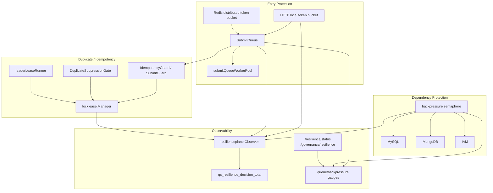
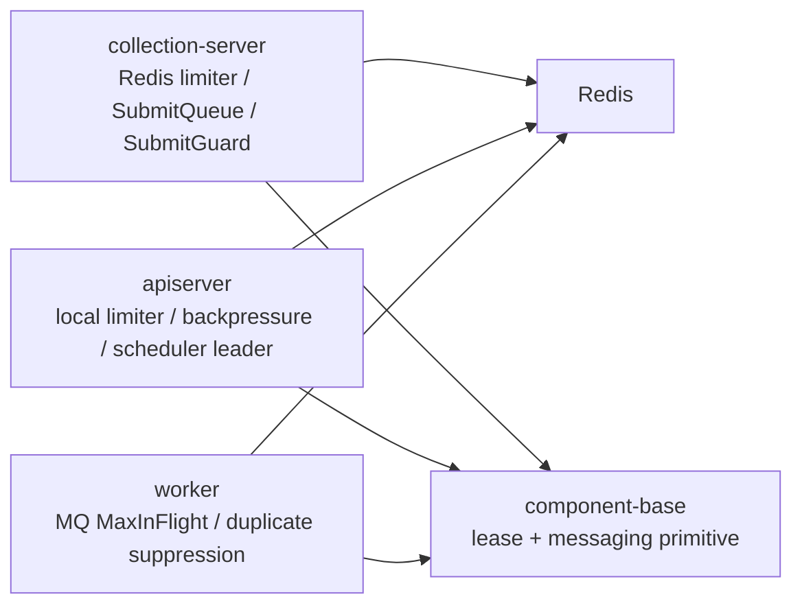
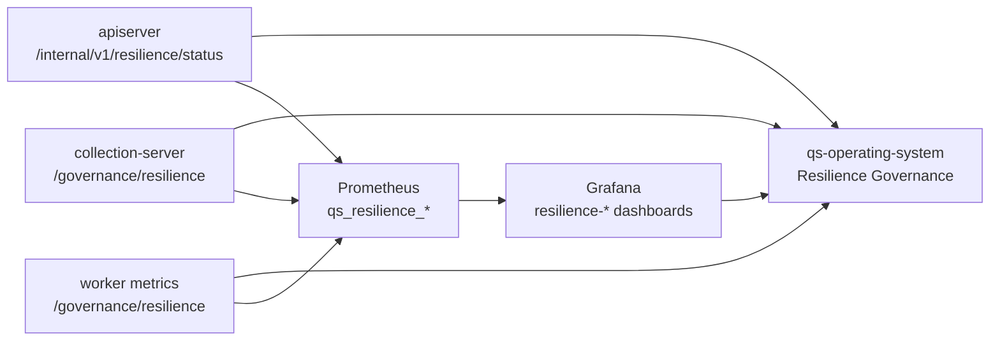

# Resilience Plane 整体架构

**本文回答**：`qs-server` 高并发治理由哪些层组成、三进程分别承担什么角色、哪些是业务语义、哪些只是 primitive，以及为什么当前不把所有锁/限流/幂等抽成一个大框架。

## 30 秒结论

| 层 | 目标 | 主要代码 |
| -- | ---- | -------- |
| 入口保护 | 挡住突发请求 | [`internal/pkg/ratelimit`](../../../internal/pkg/ratelimit/)、[`internal/pkg/ratelimit/redisadapter`](../../../internal/pkg/ratelimit/redisadapter/)、[`internal/pkg/middleware`](../../../internal/pkg/middleware/) |
| 提交削峰 | 把答卷提交转为本进程有界异步 | [`SubmitQueue`](../../../internal/collection-server/application/answersheet/submit_queue.go)、[`submitQueueWorkerPool`](../../../internal/collection-server/application/answersheet/submit_queue_worker_pool.go) |
| 依赖保护 | 限制下游资源占用 | [`backpressure.Limiter`](../../../internal/pkg/backpressure/limiter.go) |
| 重复抑制 | 避免同一任务多实例重复推进 | [`locklease`](../../../internal/pkg/locklease/) |
| 观测与状态 | 用统一 outcome 解释保护决策，并提供只读 snapshot | [`resilienceplane`](../../../internal/pkg/resilienceplane/) |

## 总图



## 三进程职责



| 进程 | 当前 Resilience 职责 | 不承担什么 |
| ---- | -------------------- | ---------- |
| `collection-server` | 前台限流、提交削峰、提交进行中抑制和 done marker | 不持久化业务事实，不做跨实例 durable queue |
| `apiserver` | 本地 REST 限流、MySQL/Mongo/IAM 背压、scheduler leader lock、durable submit 幂等 | 不使用 SubmitQueue |
| `worker` | MQ consumer 并发控制、答卷事件 best-effort duplicate suppression | 不保证 exactly-once |
| `component-base` | Redis lease、messaging Ack/Nack、NSQ MaxInFlight primitive | 不拥有 qs-server 业务 Resilience 语义 |

## 可视化与只读状态



Operating 只展示当前 bounded snapshot；Grafana 展示历史趋势和告警。二者都不提供限流动态调参、queue drain、lock release、retry、repair 等治理动作。

## 关键边界

- `resilienceplane` 是 vocabulary 和 observer，不是高并发治理框架。
- `locklease` 是 lease primitive，不是幂等框架。
- `SubmitQueue` 是 collection 进程内削峰队列，不是 MQ，也不是 Redis durable queue。
- `SubmitQueue` 没有 `Stop / Drain / Close` 控制面；进程退出时不保证 drain，本边界由文档和测试锁定。
- `backpressure` 的 timeout 只限制“等槽位”，不限制下游操作执行时长。
- collection Redis limiter 失败时 fail-open；worker duplicate gate 失败时 degraded-continue。
- `qs_resilience_*` metric labels 只允许 `component / scope / resource / strategy / outcome / status` 等低基数字段。

## 代码锚点与测试锚点

- 模型与观测：[`internal/pkg/resilienceplane`](../../../internal/pkg/resilienceplane/)
- 只读状态：[`internal/pkg/resilienceplane/status.go`](../../../internal/pkg/resilienceplane/status.go)、[`routes_resilience.go`](../../../internal/apiserver/transport/rest/routes_resilience.go)
- 限流：[`internal/pkg/ratelimit`](../../../internal/pkg/ratelimit/)、[`internal/pkg/ratelimit/redisadapter`](../../../internal/pkg/ratelimit/redisadapter/)、[`internal/pkg/middleware/limit.go`](../../../internal/pkg/middleware/limit.go)
- 队列：[`internal/collection-server/application/answersheet/submit_queue.go`](../../../internal/collection-server/application/answersheet/submit_queue.go)
- 背压：[`internal/pkg/backpressure/limiter.go`](../../../internal/pkg/backpressure/limiter.go)
- 锁：[`internal/pkg/locklease`](../../../internal/pkg/locklease/)
- 契约测试：[`internal/pkg/resilienceplane`](../../../internal/pkg/resilienceplane/)、[`internal/collection-server/infra/redisops`](../../../internal/collection-server/infra/redisops/)
- 能力矩阵：[`07-能力矩阵`](./07-能力矩阵.md)

## Verify

```bash
go test ./internal/pkg/resilienceplane ./internal/pkg/middleware ./internal/pkg/backpressure ./internal/pkg/locklease ./internal/pkg/cacheplane
```
