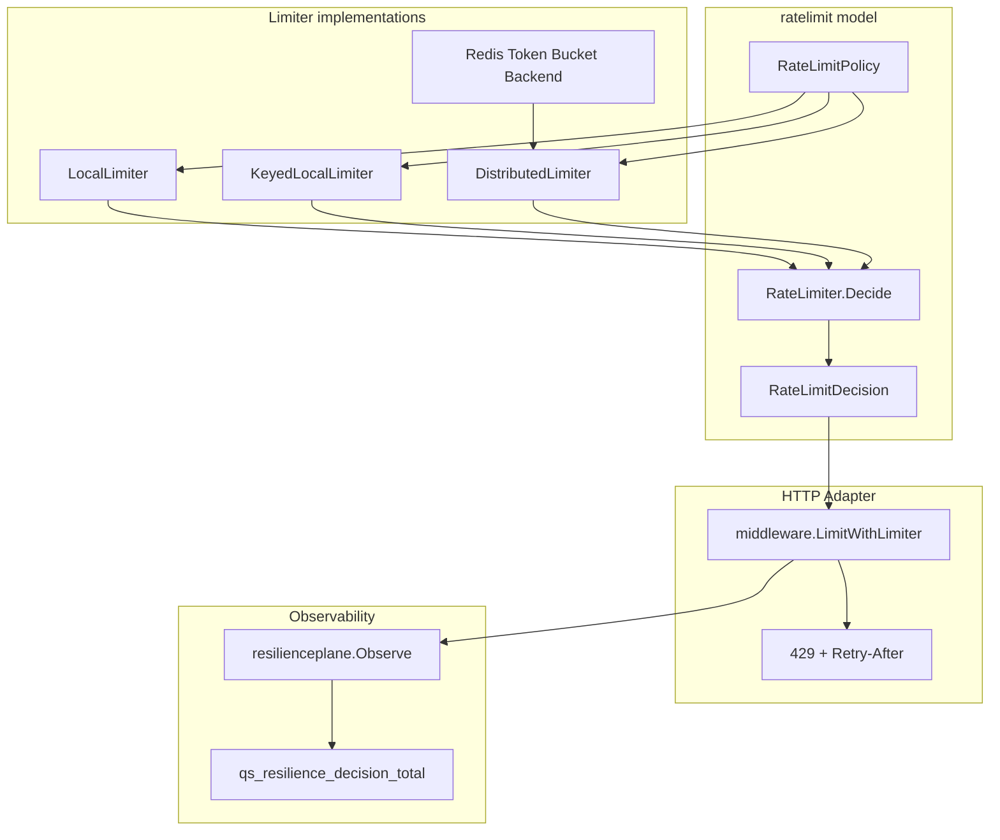

# RateLimit 入口限流

**本文回答**：qs-server 的入口限流如何工作；`ratelimit` 模型层、HTTP Gin middleware、本地 token bucket、Redis distributed token bucket、collection-server 挂载点、429 / Retry-After、degraded-open 和 resilienceplane 观测之间如何协作；apiserver 与 collection-server 为什么不完全一样。

---

## 30 秒结论

| 维度 | 结论 |
| ---- | ---- |
| 模型层 | `ratelimit.RateLimitPolicy` 定义低基数保护点；`RateLimitDecision` 是 transport-neutral 限流决策 |
| HTTP adapter | `middleware.LimitWithLimiter` 把 decision 翻译成 `c.Next()` 或 `HTTP 429 + Retry-After` |
| 本地限流 | `LocalLimiter` / `KeyedLocalLimiter` 是进程内 token bucket，不跨实例共享 |
| Redis 限流 | `DistributedLimiter` 使用 shared backend，多实例共享令牌桶 |
| collection-server | submit/query/wait-report 等入口可优先使用 Redis backend，否则 fallback local/local_key |
| apiserver | 主要使用本地 REST limiter；不默认引入分布式限流，避免容量和部署语义变化 |
| 超限 outcome | `rate_limited`，HTTP 返回 429 |
| 允许 outcome | `allowed`，继续请求链 |
| 降级 outcome | `degraded_open`，通常表示 limiter backend 不可用但请求放行 |
| 观测 | 所有 decision 统一进入 `resilienceplane` 的 `qs_resilience_decision_total` |
| 边界 | RateLimit 只保护入口流量，不做权限判断、不做业务幂等、不做下游背压 |

一句话概括：

> **RateLimit 是入口阀门：能挡住过量请求，但不能替代 SubmitQueue、Backpressure、LockLease 或业务幂等。**

---

## 1. RateLimit 要解决什么问题

入口请求如果无限进入，会把后续链路全部打满：

```text
HTTP request
  -> handler
  -> gRPC
  -> MySQL/Mongo
  -> MQ/Event
  -> worker
```

限流的目标是：

- 提前拒绝过量请求。
- 返回明确 429。
- 告诉客户端 Retry-After。
- 保护 SubmitQueue 和下游服务。
- 保持保护决策可观测。

它不保证：

- 请求一定成功。
- 后续队列不满。
- 下游数据库不慢。
- 业务幂等。
- 用户有权限。
- 结果 eventually 完成。

---

## 2. RateLimit 分层



---

## 3. RateLimitPolicy

`RateLimitPolicy` 描述一个 bounded rate limit control point。

字段：

| 字段 | 说明 |
| ---- | ---- |
| Component | 组件，例如 collection-server / apiserver |
| Scope | 限流范围，例如 submit / query / wait-report |
| Resource | 资源，例如 global / user / request |
| Strategy | 策略，例如 local / local_key / redis |
| RatePerSecond | 每秒令牌数 |
| Burst | 桶容量 |

### 3.1 Subject

`RateLimitPolicy.Subject()` 会生成：

```text
resilienceplane.Subject{
  Component,
  Scope,
  Resource,
  Strategy,
}
```

这用于 metrics labels。

### 3.2 Valid

`Valid()` 要求：

```text
RatePerSecond > 0
Burst > 0
```

### 3.3 低基数要求

不要把以下信息放到 policy subject：

- userID。
- IP。
- requestID。
- raw path。
- token。
- orgID。
- answerSheetID。

user/ip 可以作为 limiter key，但不能进入 resilience subject。

---

## 4. RateLimitDecision

`RateLimitDecision` 是一次限流判断结果。

字段：

| 字段 | 说明 |
| ---- | ---- |
| Allowed | 是否放行 |
| RetryAfter | 建议等待时间 |
| RetryAfterSeconds | HTTP header 使用的秒数 |
| Subject | resilience subject |
| Outcome | allowed / rate_limited / degraded_open |

### 4.1 三类 outcome

| Outcome | Allowed | 语义 |
| ------- | ------- | ---- |
| `allowed` | true | 令牌充足，放行 |
| `rate_limited` | false | 令牌不足，拒绝 |
| `degraded_open` | true | limiter 不可用或降级，选择放行 |

---

## 5. 本地限流

### 5.1 LocalLimiter

`LocalLimiter` 适合单实例或不需要跨实例共享限流额度的场景。

```text
每个进程自己维护 token bucket
```

优点：

- 简单。
- 不依赖 Redis。
- 延迟低。
- 适合 apiserver 基础保护。

缺点：

- 多实例不共享配额。
- N 个实例总体 QPS 约等于单实例配额 * N。
- 不能实现全局入口限流。

### 5.2 KeyedLocalLimiter

`KeyedLocalLimiter` 为不同 key 维护独立 bucket。

key 可以是：

- user。
- IP。
- route group。
- org。

注意：key 不能进入 metrics subject。

### 5.3 nil limiter 行为

`LocalLimiter.Decide` 中 limiter nil 会返回 limited decision。

这和 distributed nil 的 fail-open 行为不同。它代表本地 limiter 本身装配异常时不应该默默放行。

---

## 6. Redis 分布式限流

### 6.1 DistributedLimiter

`DistributedLimiter` 包装 shared token bucket backend。

```text
multiple instances
  -> same Redis backend
  -> shared token bucket
```

### 6.2 Redis Backend

`redisadapter.NewBackend(client,builder)` 使用 Redis backend。

如果传入 keyspace builder，会使用：

```text
builder.BuildLockKey
```

构造 Redis key，保证 namespace 安全。

### 6.3 nil distributed limiter 行为

`DistributedLimiter.Decide` 中 limiter nil 会返回：

```text
allowed + degraded_open
```

也就是 fail-open。

原因：

- Redis limiter 是入口保护能力。
- Redis 抖动时如果所有请求 fail-closed，前台业务可能整体不可用。
- 后续还有 SubmitQueue、SubmitGuard、Backpressure 等保护。

这是一种可用性优先取舍。

### 6.4 分布式限流的代价

Redis limiter 带来：

- Redis RTT。
- Redis 可用性依赖。
- Redis key namespace 管理。
- distributed hot key 风险。
- 需要 degraded-open 观测。

---

## 7. HTTP Adapter：LimitWithLimiter

`middleware.LimitWithLimiter(limiter,keyFn,opts)` 是 Gin adapter。

流程：

1. 根据 keyFn 获取 limiter key。
2. limiter nil 时直接放行。
3. 调 `limiter.Decide(ctx,key)`。
4. 记录 resilience decision。
5. 如果 Allowed=true，执行 `c.Next()`。
6. 如果 Allowed=false：
   - `c.Error(ErrLimitExceeded)`。
   - 设置 `Retry-After`。
   - `AbortWithStatus(429)`。

### 7.1 429 行为

超限返回：

```text
HTTP 429 Too Many Requests
Retry-After: {seconds}
```

`RetryAfterSeconds` 至少为 1。

### 7.2 不改变 handler 语义

被限流时 handler 不会执行。

被放行时后续仍可能：

- SubmitQueue full。
- Backpressure timeout。
- 业务校验失败。
- 下游错误。

RateLimit 只决定是否进入后续链路。

---

## 8. Limit / LimitByKey

### 8.1 Limit

`Limit(maxEventsPerSec,maxBurstSize)` 是全局本地限流。

默认 subject：

```text
component=http
scope=global
resource=request
strategy=local
```

### 8.2 LimitByKey

`LimitByKey(maxEventsPerSec,maxBurstSize,keyFn)` 是本地 keyed 限流。

默认 subject：

```text
component=http
scope=per_key
resource=request
strategy=local_key
```

### 8.3 WithOptions

`LimitWithOptions` / `LimitByKeyWithOptions` 用于显式设置：

- Component。
- Scope。
- Resource。
- Strategy。
- Observer。

用于接入 resilienceplane 统一观测。

---

## 9. collection-server 限流挂载

collection-server 对核心入口使用 `rateLimitedHandlers`。

### 9.1 挂载结构

`rateLimitedHandlers` 会根据是否有 Redis backend 分两类：

#### 有 backend

```text
DistributedLimiter(global, resource=global, strategy=redis)
DistributedLimiter(user,   resource=user,   strategy=redis)
handler
```

#### 无 backend

```text
LocalLimiter(global, strategy=local)
KeyedLocalLimiter(user, strategy=local_key)
handler
```

### 9.2 scope

当前典型 scope：

| Scope | 用途 |
| ----- | ---- |
| submit | 答卷提交 |
| query | 查询提交状态、答卷详情、测评列表等 |
| wait-report | 长轮询等待报告 |

### 9.3 global + user 双层限流

每个受限入口通常先经过：

```text
global limiter
  -> user/ip keyed limiter
  -> handler
```

global 保护系统整体，user/ip 防单个主体打爆资源。

### 9.4 requestLimitKey

key 选择：

```text
如果有 userID -> user:{userID}
否则 -> ip:{clientIP}
```

注意：这个 key 只用于 limiter，不进入 metrics subject。

---

## 10. apiserver 限流边界

apiserver REST 当前主要使用本地 limiter。

原因：

- apiserver 有更多内部/后台能力。
- 是否需要全局分布式限流要单独容量评估。
- 直接切换为 distributed limiter 会改变多实例限流语义。
- apiserver 下游还有 Backpressure、LockLease、DB/Redis 等保护点。

不要悄悄把 apiserver 改成 Redis distributed limiter。需要独立设计：

- 哪些 route。
- 哪些 scope。
- global/user/org 维度。
- Redis failure 策略。
- 容量模型。
- 告警阈值。

---

## 11. Degraded-open 语义

### 11.1 什么是 degraded-open

当 limiter 后端异常时，系统选择：

```text
记录 degraded_open
放行请求
```

### 11.2 适用场景

适合：

- Redis distributed limiter 不可用。
- 入口限流只是第一层保护。
- 后续还有 queue/backpressure/lock。
- 可用性优先于严格限流。

### 11.3 不适用场景

不适合：

- 安全风控。
- 防刷计费。
- 法务合规限流。
- 必须强制拒绝的流量治理。

这些场景需要 fail-closed，并且应该独立建模。

---

## 12. RateLimit 与其它 Resilience 能力的边界

| 能力 | 负责 |
| ---- | ---- |
| RateLimit | 请求是否可以进入 handler |
| SubmitQueue | 提交请求进入后是否可以排队 |
| SubmitGuard | 同一提交 key 是否已处理/处理中 |
| Backpressure | 下游是否还有 in-flight 槽位 |
| LockLease | 跨实例是否可进入 critical section |
| Business Idempotency | 重复业务事实是否可安全复用 |
| Auth / Authz | 用户是否允许访问 |

### 12.1 RateLimit 不等于权限

限流只能回答：

```text
请求太多了吗？
```

不能回答：

```text
你有没有权限？
```

### 12.2 RateLimit 不等于幂等

限流只能减少请求量，不能处理重复提交语义。

重复提交要靠：

- request_id。
- SubmitQueue status。
- SubmitGuard done marker。
- AnswerSheet durable submit idempotency。
- DB 唯一约束。

---

## 13. Observability

### 13.1 Decision

每次 decision 都进入：

```text
qs_resilience_decision_total{
  component,
  kind="rate_limit",
  scope,
  resource,
  strategy,
  outcome
}
```

outcome：

```text
allowed
rate_limited
degraded_open
```

### 13.2 示例 PromQL

#### 查看 submit 限流

```promql
sum by (resource, strategy, outcome) (
  increase(qs_resilience_decision_total{
    component="collection-server",
    kind="rate_limit",
    scope="submit"
  }[5m])
)
```

#### 查看 rate_limited 比例

```promql
sum(increase(qs_resilience_decision_total{kind="rate_limit",outcome="rate_limited"}[5m]))
/
sum(increase(qs_resilience_decision_total{kind="rate_limit"}[5m]))
```

#### 查看 Redis limiter 降级

```promql
sum by (scope, resource) (
  increase(qs_resilience_decision_total{
    kind="rate_limit",
    strategy="redis",
    outcome="degraded_open"
  }[10m])
)
```

### 13.3 日志建议

限流日志可带：

- component。
- scope。
- resource。
- strategy。
- outcome。
- retry_after_seconds。

不要带：

- raw token。
- request id 作为 metric label。
- user id 作为 metric label。
- raw IP 作为 metric label。

---

## 14. 设计模式与实现意图

| 模式 | 当前实现 | 意图 |
| ---- | -------- | ---- |
| Policy | RateLimitPolicy | 保护点参数化 |
| Decision | RateLimitDecision | transport-neutral 结果 |
| Adapter | Gin middleware | HTTP 429 翻译 |
| Local Token Bucket | LocalLimiter | 单实例低成本保护 |
| Keyed Limiter | KeyedLocalLimiter | per user/ip 控制 |
| Distributed Backend | Redis adapter | 多实例共享配额 |
| Observer | resilienceplane | 统一观测 |
| Fail-open | degraded_open | Redis limiter 故障时可用性优先 |

---

## 15. 设计取舍

| 设计 | 收益 | 代价 |
| ---- | ---- | ---- |
| global + user 双层 | 同时保护整体和个体 | 每个请求多次限流判断 |
| Redis limiter fail-open | Redis 抖动不打死业务 | 短时间可能超限 |
| apiserver 本地限流 | 简单稳定 | 多实例总 QPS 不共享 |
| collection 优先 distributed | 前台入口全局可控 | 依赖 Redis |
| Retry-After | 客户端有重试提示 | 客户端必须配合 |
| 低基数 subject | metrics 稳定 | 细节靠日志补充 |

---

## 16. 常见误区

### 16.1 “限流就是高并发治理全部”

不是。限流只是入口保护，后面还需要 queue、backpressure、lock、idempotency。

### 16.2 “Redis limiter 一定比 local 好”

不一定。Redis limiter 跨实例共享，但增加 Redis 依赖和 RTT。

### 16.3 “degraded_open 是 bug”

不是。它是 Redis limiter 故障时的可用性取舍。

### 16.4 “keyed limiter 的 key 可以放进 metrics”

不可以。user/IP 是高基数，不进入 resilience subject。

### 16.5 “429 表示服务挂了”

不是。429 表示限流保护生效，客户端应按 Retry-After 重试。

### 16.6 “限流可以防重复提交”

不能。重复提交要用 request_id / idempotency / SubmitGuard / DB 约束。

---

## 17. 排障路径

### 17.1 请求返回 429

检查：

1. scope 是 submit/query/wait-report 还是其它。
2. global 还是 user resource。
3. strategy 是 local/local_key/redis。
4. Retry-After。
5. QPS 是否超过配置。
6. 是否单用户或单 IP 突增。
7. 后续 SubmitQueue 是否也满。

### 17.2 Redis limiter degraded_open

检查：

1. collection RateLimitBackend 是否 nil。
2. ops_runtime Redis family 是否可用。
3. Redis profile/namespace。
4. Redis command error。
5. fallback 是否走 local。
6. degraded_open 是否短期可接受。

### 17.3 限流没生效

检查：

1. RateLimitOptions.Enabled。
2. route 是否挂了 rateLimitedHandlers。
3. backend 是否 nil 后 fallback local。
4. global/user QPS/Burst 是否过高。
5. keyFn 是否稳定。
6. client 是否绕过对应 route。

### 17.4 被限流太频繁

检查：

1. 配置是否过低。
2. 前端重试是否过快。
3. 长轮询 wait-report 是否并发过多。
4. 是否需要 SubmitQueue 而不是单纯加 QPS。
5. 是否应该区分 route scope。
6. 是否某个 user/ip 异常。

---

## 18. 修改指南

### 18.1 新增限流入口

必须：

1. 定义 scope。
2. 定义 global QPS/Burst。
3. 定义 user/ip QPS/Burst。
4. 决定 local 还是 distributed。
5. 设计 keyFn。
6. 明确 Redis error 策略。
7. 使用 LimitWithLimiter 或 rateLimitedHandlers。
8. 补 middleware/router tests。
9. 更新文档和能力矩阵。

### 18.2 调整阈值

必须结合：

- 平均 QPS。
- 峰值 QPS。
- SubmitQueue capacity。
- apiserver gRPC 能力。
- DB/Mongo capacity。
- 前端重试策略。
- 429 比例。
- 用户体验。

不要只凭感觉调大。

### 18.3 将 apiserver 改为 distributed limiter

必须单独设计：

- Redis dependency。
- 多实例总 QPS。
- route scope。
- degraded-open 是否可接受。
- 是否影响内部调用。
- 是否影响运营后台。
- 是否需要独立 Redis profile。
- 告警和回滚方案。

---

## 19. 代码锚点

- RateLimit model：[../../../internal/pkg/ratelimit/model.go](../../../internal/pkg/ratelimit/model.go)
- Local limiter：[../../../internal/pkg/ratelimit/local.go](../../../internal/pkg/ratelimit/local.go)
- Distributed limiter：[../../../internal/pkg/ratelimit/distributed.go](../../../internal/pkg/ratelimit/distributed.go)
- Redis backend：[../../../internal/pkg/ratelimit/redisadapter/redis_backend.go](../../../internal/pkg/ratelimit/redisadapter/redis_backend.go)
- HTTP middleware：[../../../internal/pkg/middleware/limit.go](../../../internal/pkg/middleware/limit.go)
- Collection router：[../../../internal/collection-server/transport/rest/router.go](../../../internal/collection-server/transport/rest/router.go)
- Resilience model：[../../../internal/pkg/resilienceplane/model.go](../../../internal/pkg/resilienceplane/model.go)
- Resilience metrics：[../../../internal/pkg/resilienceplane/prometheus.go](../../../internal/pkg/resilienceplane/prometheus.go)

---

## 20. Verify

```bash
go test ./internal/pkg/ratelimit/...
go test ./internal/pkg/middleware
go test ./internal/pkg/resilienceplane
go test ./internal/collection-server/transport/rest
```

如果修改 Redis backend：

```bash
go test ./internal/pkg/ratelimit/redisadapter
go test ./internal/pkg/cacheplane/keyspace
```

如果修改文档：

```bash
make docs-hygiene
git diff --check
```

---

## 21. 下一跳

| 目标 | 文档 |
| ---- | ---- |
| SubmitQueue 提交削峰 | [02-SubmitQueue提交削峰.md](./02-SubmitQueue提交削峰.md) |
| Backpressure 下游背压 | [03-Backpressure下游背压.md](./03-Backpressure下游背压.md) |
| LockLease 幂等与重复抑制 | [04-LockLease幂等与重复抑制.md](./04-LockLease幂等与重复抑制.md) |
| 观测降级排障 | [05-观测降级与排障.md](./05-观测降级与排障.md) |
| 能力矩阵 | [07-能力矩阵.md](./07-能力矩阵.md) |
| 回看整体架构 | [00-整体架构.md](./00-整体架构.md) |
