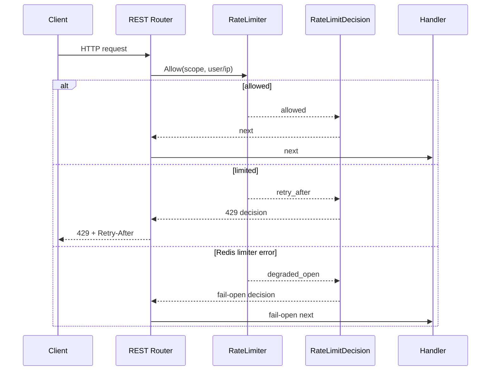

# RateLimit 入口限流

**本文回答**：当前 HTTP 限流如何工作，apiserver 与 collection-server 为什么不完全一样，Redis 分布式限流的降级语义是什么。

## 30 秒结论

| 维度 | 当前事实 |
| ---- | -------- |
| 决策模型 | [`ratelimit.RateLimitPolicy / RateLimitDecision`](../../../internal/pkg/ratelimit/model.go) |
| 本地限流 | [`ratelimit.LocalLimiter`](../../../internal/pkg/ratelimit/local.go)，进程内 token bucket |
| 分布式限流 | collection-server 优先使用 [`ratelimit.NewDistributedLimiter`](../../../internal/pkg/ratelimit/distributed.go) 包装 [`ratelimit/redisadapter.NewBackend`](../../../internal/pkg/ratelimit/redisadapter/redis_backend.go) |
| 超限行为 | HTTP `429` + `Retry-After` |
| Redis 错误 | collection 分布式 limiter fail-open，继续请求 |
| 观测 | `resilienceplane` 记录 `allowed / rate_limited / degraded_open` |

## 时序图



## 当前分工

- `ratelimit` 是 Rate Limit 的模型层，只产生 `RateLimitDecision`，不依赖 Gin。
- `middleware.LimitWithLimiter` 是 HTTP adapter，负责把 decision 翻译成 `c.Next()` 或 `429 + Retry-After`，并统一上报 `resilienceplane`。
- apiserver REST 当前只使用本地 `LimitWithOptions` / `LimitByKeyWithOptions`，底层已经走同一个 decision path。
- collection-server REST 在 `ops_runtime` Redis 可用时使用 Redis token bucket；不可用时回退到本地 token bucket。
- collection 的 Redis limiter key 是 bounded scope，例如 `limit:submit:global`、`limit:query:user:<user/ip>`；观测 subject 不记录 user/ip。

## 不变量

- 不改变现有 `429` 语义。
- 不把 Redis limiter 错误变成请求错误。
- 不把 apiserver 悄悄改成分布式限流；这需要单独容量评估。

## 代码锚点与测试锚点

- Rate Limit 模型与测试：[`internal/pkg/ratelimit`](../../../internal/pkg/ratelimit/)
- Gin adapter 与测试：[`internal/pkg/middleware`](../../../internal/pkg/middleware/)
- Redis token bucket 与测试：[`internal/pkg/ratelimit/redisadapter`](../../../internal/pkg/ratelimit/redisadapter/)
- collection 挂载点：[`internal/collection-server/transport/rest/router.go`](../../../internal/collection-server/transport/rest/router.go)
- apiserver 挂载点：[`internal/apiserver/transport/rest/router.go`](../../../internal/apiserver/transport/rest/router.go)

## Verify

```bash
go test ./internal/pkg/ratelimit/... ./internal/pkg/middleware
```
