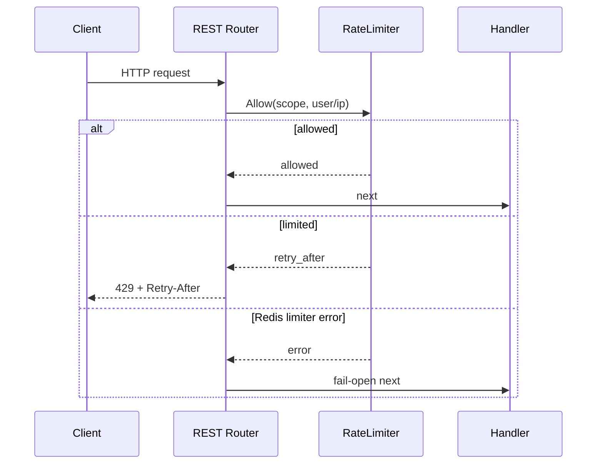

# RateLimit 入口限流

**本文回答**：当前 HTTP 限流如何工作，apiserver 与 collection-server 为什么不完全一样，Redis 分布式限流的降级语义是什么。

## 30 秒结论

| 维度 | 当前事实 |
| ---- | -------- |
| 本地限流 | [`Limit`](../../../internal/pkg/middleware/limit.go) + [`LimitByKey`](../../../internal/pkg/middleware/limit.go)，进程内 token bucket |
| 分布式限流 | collection-server 优先使用 [`redisplane.DistributedLimiter`](../../../internal/pkg/redisplane/ratelimiter.go) |
| 超限行为 | HTTP `429` + `Retry-After` |
| Redis 错误 | collection 分布式 limiter fail-open，继续请求 |
| 观测 | `resilienceplane` 记录 `allowed / rate_limited / degraded_open` |

## 时序图



## 当前分工

- apiserver REST 当前只使用本地 `LimitWithOptions` / `LimitByKeyWithOptions`。
- collection-server REST 在 `ops_runtime` Redis 可用时使用 Redis token bucket；不可用时回退到本地 token bucket。
- collection 的 Redis limiter key 是 bounded scope，例如 `limit:submit:global`、`limit:query:user:<user/ip>`；观测不记录 user/ip。

## 不变量

- 不改变现有 `429` 语义。
- 不把 Redis limiter 错误变成请求错误。
- 不把 apiserver 悄悄改成分布式限流；这需要单独容量评估。

## 代码锚点与测试锚点

- 本地限流实现与测试：[`internal/pkg/middleware`](../../../internal/pkg/middleware/)
- Redis token bucket 与测试：[`internal/pkg/redisplane/ratelimiter.go`](../../../internal/pkg/redisplane/ratelimiter.go)
- collection 挂载点：[`internal/collection-server/transport/rest/router.go`](../../../internal/collection-server/transport/rest/router.go)
- apiserver 挂载点：[`internal/apiserver/transport/rest/router.go`](../../../internal/apiserver/transport/rest/router.go)

## Verify

```bash
go test ./internal/pkg/middleware ./internal/pkg/redisplane
```
