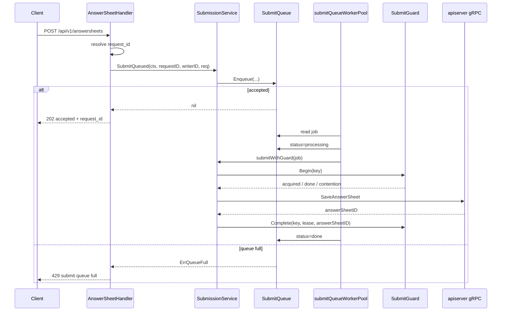
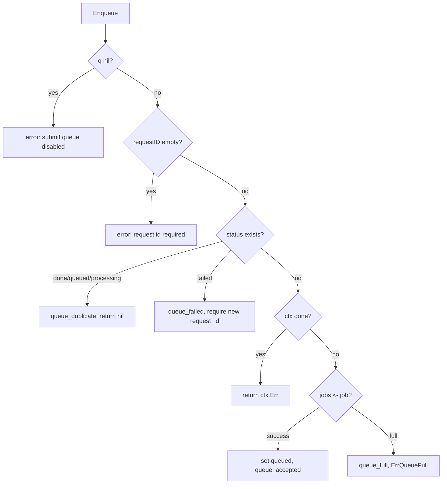
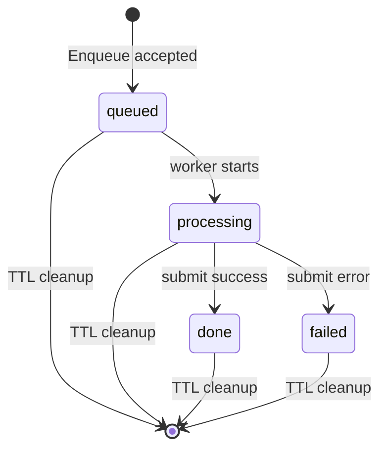

# SubmitQueue 提交削峰

**本文回答**：collection-server 为什么要引入 `SubmitQueue`；它如何把答卷提交从同步处理变成 `202 Accepted + request_id + status polling` 的削峰链路；bounded channel、worker pool、requestID 状态复用、状态 TTL、队列满、process memory no drain 和 SubmitGuard / apiserver durable submit 的边界分别是什么。

---

## 30 秒结论

| 维度 | 结论 |
| ---- | ---- |
| 模块定位 | `SubmitQueue` 是 collection-server 内部的**进程内有界异步提交队列**，用于削峰答卷提交请求 |
| 入口 | `AnswerSheetHandler.Submit` 解析请求和 request_id，调用 `SubmissionService.SubmitQueued` |
| 返回语义 | 入队成功返回 HTTP `202 Accepted`，包含 `request_id` 和初始状态 `queued` |
| 满队语义 | jobs channel 满时返回 `ErrQueueFull`，HTTP handler 转成 `429 submit queue full` |
| 队列结构 | `jobs chan submitJob` + `submitQueueWorkerPool` |
| 状态机 | `queued -> processing -> done/failed`，状态存储在本进程内存中 |
| 状态 TTL | 默认 10 分钟，过期状态会被 cleanup |
| requestID 语义 | requestID 只服务 collection-server 本地状态查询和队列去重，不等于全链路 durable 幂等 |
| 幂等兜底 | 跨实例/完成结果复用靠 SubmitGuard；业务持久化幂等靠 apiserver durable submit / idempotency key |
| 生命周期边界 | `process_memory_no_drain`：当前没有 Stop/Drain/Close，进程退出不保证队列 drain |
| 观测 | queue accepted/full/duplicate/processing/done/failed/cleaned 进入 resilienceplane |
| 关键边界 | SubmitQueue 不是 MQ，不是 Redis durable queue，不是全局队列，不承担 exactly-once |

一句话概括：

> **SubmitQueue 负责“前台提交削峰与异步受理”，不负责“业务事实可靠持久化”。**

---

## 1. 为什么需要 SubmitQueue

答卷提交是典型突发流量入口：

```text
用户集中提交
  -> collection-server REST
  -> apiserver gRPC
  -> Mongo AnswerSheet durable submit
  -> event outbox
  -> worker evaluation
```

如果所有请求都同步穿透到 apiserver：

- collection-server goroutine 堆积。
- apiserver gRPC 被瞬时打满。
- Mongo durable submit 压力陡增。
- 前端长时间等待。
- 用户重复点击提交。
- 失败语义难以区分“正在处理”和“真正失败”。

SubmitQueue 把提交变成：

```text
请求快速入队
  -> 返回 202 + request_id
  -> 后台 worker pool 慢慢处理
  -> 前端轮询 submit-status
```

这是一种削峰，而不是可靠消息队列。

---

## 2. 总体链路



---

## 3. 组成结构

`SubmitQueue` 包含：

| 字段 | 说明 |
| ---- | ---- |
| `jobs chan submitJob` | 有界内存队列 |
| `statuses *submitQueueStatusStore` | requestID -> 状态 |
| `workerPool *submitQueueWorkerPool` | 消费 jobs 的 worker pool |
| `observer resilienceplane.Observer` | 观测出口 |
| `subject resilienceplane.Subject` | 低基数保护点标识 |

`submitJob` 包含：

| 字段 | 说明 |
| ---- | ---- |
| ctx | `context.WithoutCancel(ctx)` 后的上下文 |
| requestID | 本次提交请求 ID |
| writerID | 当前用户 ID |
| req | 答卷提交请求 |

---

## 4. 初始化

`NewSubmitQueueWithOptions(workerCount, queueSize, submit, opts)`：

1. workerCount <= 0 或 queueSize <= 0 或 submit nil -> 返回 nil。
2. 创建 `jobs` channel，容量为 queueSize。
3. 创建 status store，TTL 默认 10 分钟。
4. 设置 resilience subject：
   - component = collection-server。
   - scope = answersheet_submit。
   - resource = submit_queue。
   - strategy = memory_channel。
5. 创建 worker pool。
6. 启动 worker goroutines。

### 4.1 queue nil 的含义

如果配置错误导致 queue nil，`SubmitQueued` 会返回：

```text
submit queue not initialized
```

这不是正常降级路径，而是启动/配置问题。

---

## 5. Enqueue 主路径

`Enqueue(ctx, requestID, writerID, req)`：



### 5.1 requestID 必填

requestID 是本地状态查询的唯一键。

如果 HTTP 请求没有 request ID：

- 先从 context 取。
- 再从 headers 取。
- 仍没有则生成 UUID。

### 5.2 状态复用

如果 requestID 已存在：

| 现有状态 | 行为 |
| -------- | ---- |
| done | 记录 queue_duplicate，返回 nil |
| queued | 记录 queue_duplicate，返回 nil |
| processing | 记录 queue_duplicate，返回 nil |
| failed | 记录 queue_failed，返回 error，要求新 request_id |

这避免前端重复提交同一个 request_id 时重复入队。

### 5.3 context.WithoutCancel

入队 job 的 ctx 会使用：

```go
context.WithoutCancel(ctx)
```

这意味着：

```text
客户端断开后，后台 worker 仍可以继续提交
```

这是削峰异步受理的关键语义。

---

## 6. WorkerPool

`submitQueueWorkerPool` 只负责 drain jobs。

### 6.1 Start

`Start()` 根据 workerCount 启动多个 goroutine。

### 6.2 worker

每个 worker：

1. 从 jobs channel 读 job。
2. 设置状态 `processing`。
3. 调用 submit 函数。
4. 如果 error，设置状态 `failed`。
5. 如果成功且 response 非 nil，设置状态 `done`，保存 answerSheetID。

```mermaid
flowchart TD
    job["receive job"] --> processing["status=processing"]
    processing --> submit["submit(job.ctx, requestID, writerID, req)"]
    submit --> ok{"success?"}
    ok -->|no| failed["status=failed"]
    ok -->|yes| resp{"resp != nil?"}
    resp -->|yes| done["status=done + answerSheetID"]
    resp -->|no| end["no status change"]
```

### 6.3 WorkerPool 不负责什么

WorkerPool 不负责：

- 入队决策。
- 状态查询。
- resilience metrics。
- HTTP response。
- requestID 生成。
- SubmitGuard。
- gRPC DTO 转换。
- 生命周期 drain。

这些职责分别在 SubmitQueue、Handler、SubmissionService 中。

---

## 7. 状态机

状态：

```text
queued
processing
done
failed
```



### 7.1 Status TTL

status store 默认 TTL：

```text
10 minutes
```

过期状态会在 Set/Get/Snapshot 时按节流 cleanup。

### 7.2 TTL cleanup

`cleanupAt` 每分钟最多执行一次。

过期后：

- submit-status 查询可能返回 not found。
- 已 done 的 requestID 也会被清理。
- requestID 重新提交时不再受本地状态保护。

所以本地 status 不是 durable 幂等记录。

---

## 8. HTTP Handler 语义

### 8.1 Submit

`AnswerSheetHandler.Submit`：

1. Bind JSON。
2. 从 query 补 task_id。
3. 获取 writerID。
4. 获取或生成 requestID。
5. 调 `SubmitQueued`。
6. 如果 `ErrQueueFull`，返回 429。
7. 其它错误按 gRPC code 或 500 转换。
8. 成功返回 202。

成功响应：

```json
{
  "code": 0,
  "message": "accepted",
  "data": {
    "status": "queued",
    "request_id": "..."
  }
}
```

### 8.2 SubmitStatus

`GET /api/v1/answersheets/submit-status?request_id=...`

返回：

- queued。
- processing。
- done + answerSheetID。
- failed。
- not found。

### 8.3 队列满

队列满返回：

```text
HTTP 429
message = submit queue full
```

这和 RateLimit 的 429 不同：

| 来源 | 429 原因 |
| ---- | -------- |
| RateLimit | 入口令牌不足 |
| SubmitQueue | 请求已进入 handler，但本地队列满 |
| SubmitGuard / gRPC ResourceExhausted | 可能是重复进行中或下游资源耗尽 |

排障时要区分来源。

---

## 9. SubmitQueue 与 SubmitGuard

SubmitQueue 后面仍然会进入 `submitWithGuard`。

### 9.1 SubmitWithGuard

`submitWithGuard(ctx, requestID, writerID, req)`：

1. `key := requestKey(requestID, req)`。
2. 如果 req.IdempotencyKey 不为空，优先使用 idempotency key。
3. 如果 key 空或 submitGuard nil，直接 submitSync。
4. Begin(key)。
5. 如果 doneID 非空，返回 already submitted。
6. 如果未获得锁，返回 ResourceExhausted：submit already in progress。
7. submitSync。
8. submit 失败 -> Abort。
9. submit 成功 -> Complete，写 done marker。

### 9.2 requestKey

优先级：

```text
req.IdempotencyKey
  > requestID
```

这说明：

- requestID 是 HTTP/队列状态键。
- idempotency_key 是更稳定的业务提交幂等键。

### 9.3 两层防护

| 层 | 范围 | 作用 |
| -- | ---- | ---- |
| SubmitQueue status | 单 collection-server 进程 | requestID 本地重复入队抑制和状态查询 |
| SubmitGuard | 跨实例 Redis | done marker + in-flight lock |
| apiserver durable submit | Mongo transaction | AnswerSheet 保存和 outbox/idempotency 同事务 |

---

## 10. SubmitQueue 不是 MQ

SubmitQueue 不具备 MQ 能力：

| MQ 能力 | SubmitQueue |
| ------- | ----------- |
| 持久化消息 | 没有 |
| 跨实例消费 | 没有 |
| consumer group | 没有 |
| Ack/Nack | 没有 |
| retry queue | 没有 |
| dead letter | 没有 |
| 进程重启恢复 | 没有 |
| drain/shutdown protocol | 当前没有 |

它只是：

```text
bounded memory channel + worker goroutines + local status store
```

### 10.1 为什么这样设计

收益：

- 实现简单。
- 延迟低。
- 适合 BFF/collection 层削峰。
- 主持久化事实仍在 apiserver。
- 不引入第二套业务 MQ。

代价：

- collection-server 重启会丢未处理队列 job。
- status 只在当前进程可见。
- 多实例之间 requestID status 不共享。
- 需要前端/网关层面理解 202 + polling。

---

## 11. Lifecycle Boundary：process_memory_no_drain

`StatusSnapshot` 明确暴露：

```text
LifecycleBoundary = process_memory_no_drain
```

### 11.1 含义

- 队列存在于进程内存。
- 进程退出时未处理 job 不保证完成。
- 没有 Stop。
- 没有 Drain。
- 没有 Close。
- 没有 graceful queue shutdown。
- 没有失败回写持久化。

### 11.2 如果未来要支持 drain

必须单独设计：

1. 停止接收新请求。
2. 等待队列消费。
3. 设置最大等待时间。
4. 超时后如何标记状态。
5. 是否通知前端重试。
6. 是否持久化未处理 request。
7. 与 SubmitGuard done/in-flight 的关系。
8. 与 apiserver durable submit 的关系。
9. shutdown tests。

不能顺手重构加入。

---

## 12. Observability

### 12.1 Decision outcomes

SubmitQueue 记录：

| Outcome | 触发 |
| ------- | ---- |
| `queue_accepted` | 入队成功 |
| `queue_full` | channel full |
| `queue_duplicate` | requestID 已存在且 queued/processing/done |
| `queue_processing` | worker 开始处理 |
| `queue_done` | worker 提交成功 |
| `queue_failed` | worker 提交失败或 previous failed |
| `queue_status_cleaned` | 清理过期状态 |

### 12.2 Queue metrics

```text
qs_resilience_queue_depth{
  component="collection-server",
  scope="answersheet_submit",
  resource="submit_queue",
  strategy="memory_channel"
}
```

```text
qs_resilience_queue_status_total{
  component="collection-server",
  scope="answersheet_submit",
  status="queued|processing|done|failed"
}
```

### 12.3 StatusSnapshot

QueueSnapshot 包括：

- generated_at。
- component。
- name。
- strategy。
- depth。
- capacity。
- status_ttl_seconds。
- status_counts。
- lifecycle_boundary。

---

## 13. Status 查询

`SubmissionService.GetSubmitStatus(requestID)`：

1. queue nil -> false。
2. queue.GetStatus(requestID)。
3. status store cleanup。
4. 观察 queue status counts。
5. 返回 status 或 not found。

### 13.1 not found 的含义

not found 可能表示：

- requestID 错误。
- 请求尚未入队。
- status 已 TTL cleanup。
- 请求落到另一个 collection-server 实例。
- 进程重启导致内存状态丢失。

它不一定表示业务没有提交成功。

如果需要业务结果，应使用 answerSheetID 或业务幂等 key 查询事实源。

---

## 14. 与前端交互模型

推荐交互：

```text
POST /answersheets
  -> 202 + request_id

GET /answersheets/submit-status?request_id=...
  -> queued / processing / done / failed
```

前端策略：

- 收到 202 后轮询。
- 收到 429 queue full 时按重试策略稍后再提交。
- queued/processing 不要重复换 request_id 提交。
- failed 需要新 request_id 或重新提交。
- status not found 要结合是否超时、是否换实例、是否已有 answerSheet 结果判断。

---

## 15. 与 RateLimit 的边界

RateLimit 在 SubmitQueue 之前。

```text
RateLimit
  -> SubmitQueue
  -> SubmitGuard
  -> apiserver durable submit
```

| 层 | 保护什么 |
| -- | -------- |
| RateLimit | 入口请求速率 |
| SubmitQueue | 本进程提交并发和削峰 |
| SubmitGuard | 跨实例同 key 提交进行中/完成 |
| apiserver durable submit | 业务持久化幂等和事件可靠出站 |

RateLimit 允许通过，不代表 SubmitQueue 一定有容量。

---

## 16. 与 Backpressure 的边界

SubmitQueue 控制 collection-server 提交任务进入后台 worker 的速率。

Backpressure 控制下游资源 in-flight。

如果 apiserver gRPC 或 Mongo 慢，SubmitQueue 可能会出现：

- processing 增多。
- queue depth 增长。
- queue full。
- status 卡 processing。

这时不是简单把队列调大就能解决。还要看：

- apiserver gRPC 延迟。
- Mongo durable submit。
- Backpressure in-flight。
- workerCount。
- queueSize。
- 前端重试频率。

---

## 17. 与 Event/MQ 的边界

SubmitQueue 不是 `answersheet.submitted` 事件队列。

真实业务事件链路在 apiserver：

```text
AnswerSheet durable submit
  -> Mongo outbox
  -> answersheet.submitted
  -> worker
```

SubmitQueue 只在 collection-server 前面削峰，不承担 event delivery。

---

## 18. 设计模式与实现意图

| 模式 | 当前实现 | 意图 |
| ---- | -------- | ---- |
| Bounded Queue | buffered channel | 限制本进程排队量 |
| Worker Pool | fixed goroutines | 控制后台提交并发 |
| Async Accepted | 202 + request_id | 前台快速返回 |
| Status Store | in-memory request status | 支持 polling |
| Duplicate Request Reuse | requestID status check | 避免同 request 重复入队 |
| Process Boundary | process_memory_no_drain | 明确非 durable queue |
| Resilience Observer | resilienceplane | 统一队列 outcome |
| Guard Composition | SubmitGuard behind queue | 跨实例幂等兜底 |

---

## 19. 设计取舍

| 设计 | 收益 | 代价 |
| ---- | ---- | ---- |
| 进程内队列 | 简单、低延迟 | 重启丢未处理 job |
| 202 + polling | 前台不长时间阻塞 | 前端要维护轮询 |
| requestID 本地去重 | 重复提交体验更好 | 多实例不共享 |
| status TTL | 控制内存 | 过期后 status not found |
| context.WithoutCancel | 客户端断开不影响处理 | 后台可能继续消耗资源 |
| queue full 429 | 保护后端 | 用户要重试 |
| 无 drain | 实现清晰 | 优雅关闭能力不足 |
| 后接 SubmitGuard | 跨实例幂等增强 | Redis 依赖和 done marker 复杂度 |

---

## 20. 常见误区

### 20.1 “SubmitQueue 是消息队列”

不是。它是内存 channel，不能持久化、不能跨实例、不能恢复。

### 20.2 “入队成功等于答卷保存成功”

不是。入队成功只表示 accepted，后续可能 processing/done/failed。

### 20.3 “requestID 等于业务幂等 key”

不完全。业务幂等优先使用 req.IdempotencyKey，requestID 主要服务本地状态。

### 20.4 “queue full 就应该无限调大 queueSize”

不一定。queue full 可能说明下游慢，应该看 workerCount、apiserver、Mongo、Backpressure。

### 20.5 “status not found 表示提交没发生”

不一定。可能 status TTL 过期、进程重启或请求落到别的实例。

### 20.6 “进程退出时会 drain 队列”

当前不会。文档明确是 process_memory_no_drain。

---

## 21. 排障路径

### 21.1 POST 返回 429 submit queue full

检查：

1. queue depth。
2. queue capacity。
3. workerCount。
4. processing count。
5. apiserver gRPC 延迟。
6. SubmitGuard contention。
7. Mongo durable submit 延迟。
8. 前端重试频率。

### 21.2 status 一直 queued

检查：

1. workerPool 是否启动。
2. workerCount 是否 >0。
3. goroutine 是否 panic。
4. jobs channel 是否被 worker 消费。
5. submit func 是否阻塞在前一个任务。

### 21.3 status 一直 processing

检查：

1. submitWithGuard 是否卡住。
2. SubmitGuard Begin 是否阻塞/错误。
3. validateGuardianship 是否慢。
4. apiserver SaveAnswerSheet gRPC 是否慢。
5. Mongo durable submit 是否慢。
6. gRPC timeout 是否配置。

### 21.4 status failed

检查：

1. gRPC error code。
2. guardianship validation。
3. request payload。
4. apiserver durable submit。
5. SubmitGuard Abort。
6. 是否需要新 request_id 重试。

### 21.5 submit-status not found

检查：

1. request_id 是否正确。
2. status TTL 是否过期。
3. 是否请求落到另一个 collection-server 实例。
4. collection-server 是否重启。
5. 是否 Submit 从未成功入队。

---

## 22. 修改指南

### 22.1 调整 workerCount

考虑：

- apiserver gRPC capacity。
- Mongo durable submit capacity。
- collection-server CPU。
- Backpressure 限制。
- 平均提交耗时。
- 峰值提交量。

不要只看队列堆积就盲目加 worker。

### 22.2 调整 queueSize

考虑：

- 可接受排队时长。
- 前端轮询周期。
- 内存占用。
- 请求对象大小。
- 下游恢复能力。

queueSize 过大可能把故障延迟暴露给用户。

### 22.3 增加 drain 能力

必须独立设计：

- stop accepting。
- drain timeout。
- status transition。
- shutdown hook。
- tests。
- docs。
- 与 SubmitGuard/in-flight 的关系。

### 22.4 改为 durable queue

这不是小改。需要重新设计：

- MQ / Redis Stream / DB queue。
- persistence。
- retry。
- idempotency。
- DLQ。
- visibility timeout。
- status sharing。
- exactly-once 边界。

当前不建议把 SubmitQueue 顺手改成 durable queue。

---

## 23. 代码锚点

- SubmitQueue：[../../../internal/collection-server/application/answersheet/submit_queue.go](../../../internal/collection-server/application/answersheet/submit_queue.go)
- WorkerPool：[../../../internal/collection-server/application/answersheet/submit_queue_worker_pool.go](../../../internal/collection-server/application/answersheet/submit_queue_worker_pool.go)
- SubmissionService：[../../../internal/collection-server/application/answersheet/submission_service.go](../../../internal/collection-server/application/answersheet/submission_service.go)
- AnswerSheetHandler：[../../../internal/collection-server/transport/rest/handler/answersheet_handler.go](../../../internal/collection-server/transport/rest/handler/answersheet_handler.go)
- SubmitGuard：[../../../internal/collection-server/infra/redisops/submit_guard.go](../../../internal/collection-server/infra/redisops/submit_guard.go)
- Resilience model：[../../../internal/pkg/resilienceplane/model.go](../../../internal/pkg/resilienceplane/model.go)
- Resilience metrics：[../../../internal/pkg/resilienceplane/prometheus.go](../../../internal/pkg/resilienceplane/prometheus.go)

---

## 24. Verify

```bash
go test ./internal/collection-server/application/answersheet
go test ./internal/collection-server/transport/rest/handler
go test ./internal/collection-server/infra/redisops
go test ./internal/pkg/resilienceplane
```

如果修改队列状态或 metrics：

```bash
go test ./internal/pkg/resilienceplane ./internal/collection-server/application/answersheet
```

如果修改文档：

```bash
make docs-hygiene
git diff --check
```

---

## 25. 下一跳

| 目标 | 文档 |
| ---- | ---- |
| Backpressure 下游背压 | [03-Backpressure下游背压.md](./03-Backpressure下游背压.md) |
| LockLease 幂等与重复抑制 | [04-LockLease幂等与重复抑制.md](./04-LockLease幂等与重复抑制.md) |
| 观测降级排障 | [05-观测降级与排障.md](./05-观测降级与排障.md) |
| 能力矩阵 | [07-能力矩阵.md](./07-能力矩阵.md) |
| RateLimit 入口限流 | [01-RateLimit入口限流.md](./01-RateLimit入口限流.md) |
| 回看整体架构 | [00-整体架构.md](./00-整体架构.md) |
