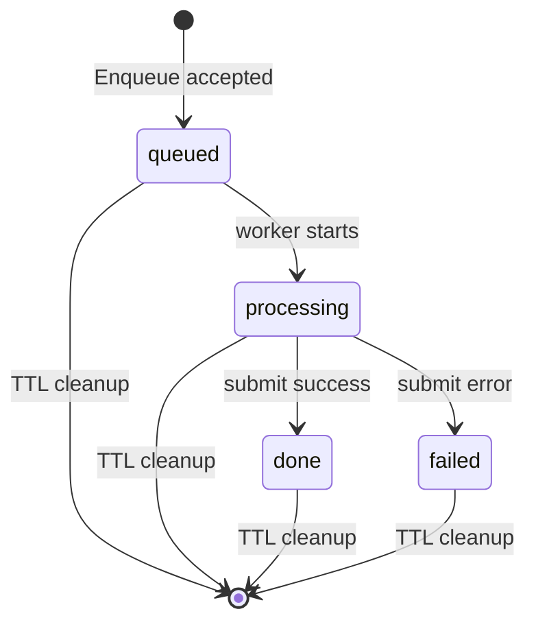
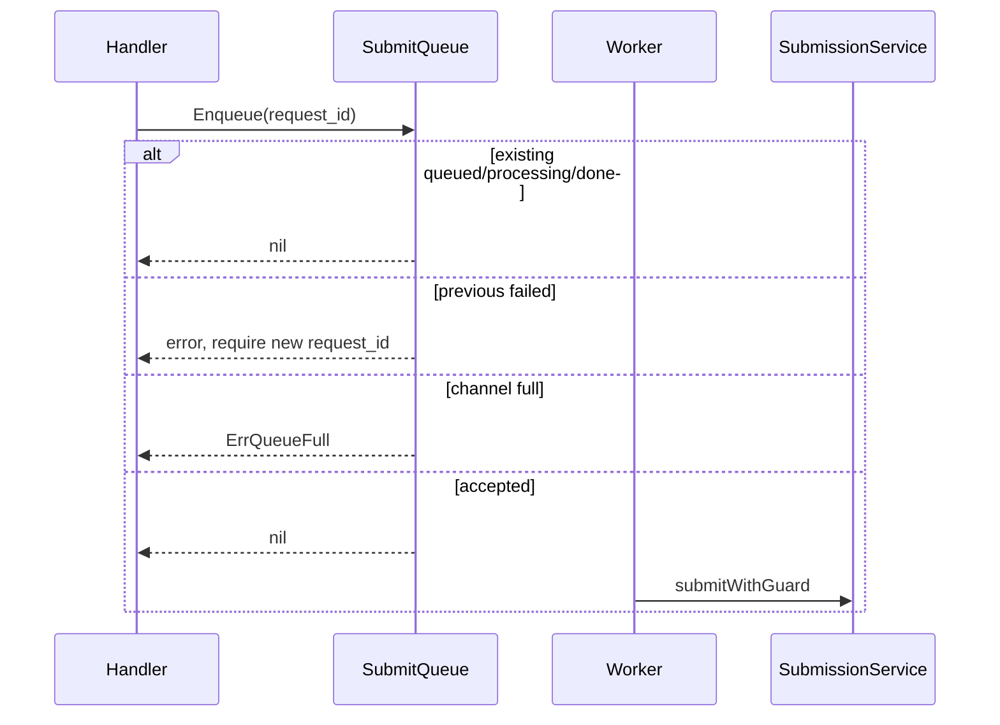

# SubmitQueue 提交削峰

**本文回答**：collection-server 的 `SubmitQueue` 解决什么问题，状态机是什么，为什么它不是 MQ 或 durable queue。

## 30 秒结论

| 维度 | 当前事实 |
| ---- | -------- |
| 类型 | collection-server 进程内 memory channel + worker goroutine |
| 入口 | [`AnswerSheetHandler.Submit`](../../../internal/collection-server/interface/restful/handler/answersheet_handler.go) |
| 核心实现 | [`SubmitQueue`](../../../internal/collection-server/application/answersheet/submit_queue.go) |
| 状态 | `queued / processing / done / failed` |
| 满队行为 | 返回 `ErrQueueFull`，handler 转 HTTP `429` |
| 幂等边界 | `request_id` 只服务本地状态查询；durable 幂等由 apiserver `idempotency_key` 承担 |

## 状态机



## 入队时序



## 关键边界

- `SubmitQueue` 不跨实例；多 collection-server 实例之间不共享 queue status。
- `context.WithoutCancel` 让 worker 在请求断开后仍可继续提交。
- `submit_queue.enabled` 是历史字段；当前服务构造时总是初始化 queue。
- 队列削峰之后仍会进入 `SubmitGuard`，由 Redis lock/done marker 做跨实例提交抑制。

## 代码锚点与测试锚点

- Queue 实现与契约测试：[`internal/collection-server/application/answersheet`](../../../internal/collection-server/application/answersheet/)
- Handler `202/429`：[`answersheet_handler.go`](../../../internal/collection-server/interface/restful/handler/answersheet_handler.go)
- 提交 guard：[`submit_guard.go`](../../../internal/collection-server/infra/redisops/submit_guard.go)

## Verify

```bash
go test ./internal/collection-server/application/answersheet ./internal/collection-server/interface/restful/handler
```
