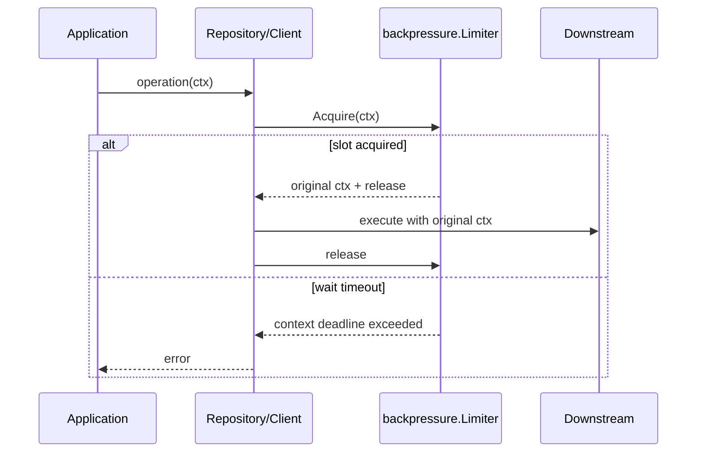

# Backpressure 下游背压

**本文回答**：apiserver 如何限制 MySQL、MongoDB、IAM 的并发占用，为什么它不是 HTTP QPS 限流，也不是数据库连接池本身。

## 30 秒结论

| 维度 | 当前事实 |
| ---- | -------- |
| Primitive | [`backpressure.Limiter`](../../../internal/pkg/backpressure/limiter.go) |
| 接入依赖 | MySQL、MongoDB、IAM |
| 注入点 | process 构建 `container.BackpressureOptions`，container/assembler 显式传入 repo/client |
| timeout 语义 | 只限制等待槽位，不限制拿到槽位后的业务执行 |
| 观测 | `backpressure_acquired / backpressure_timeout / backpressure_released` |

## 时序图



## 当前接入点

| 依赖 | 代码锚点 |
| ---- | -------- |
| MySQL | [`internal/pkg/database/mysql/base.go`](../../../internal/pkg/database/mysql/base.go) |
| MongoDB | [`internal/apiserver/infra/mongo/base.go`](../../../internal/apiserver/infra/mongo/base.go) |
| IAM | [`internal/apiserver/infra/iam/client.go`](../../../internal/apiserver/infra/iam/client.go) |
| 组合根 | [`internal/apiserver/process/resource_bootstrap.go`](../../../internal/apiserver/process/resource_bootstrap.go)、[`internal/apiserver/container/options.go`](../../../internal/apiserver/container/options.go) |

## 不变量

- `NewLimiter(maxInflight <= 0)` 返回 nil，表示不启用。
- nil limiter 是 no-op。
- `Acquire` 返回原始 ctx；不会把 limiter timeout 强加给下游操作。
- MySQL/Mongo/IAM 不再通过包级 `SetLimiter` 注入；limiter 是 repository/client 实例依赖。

## Verify

```bash
go test ./internal/pkg/backpressure ./internal/apiserver/...
```
