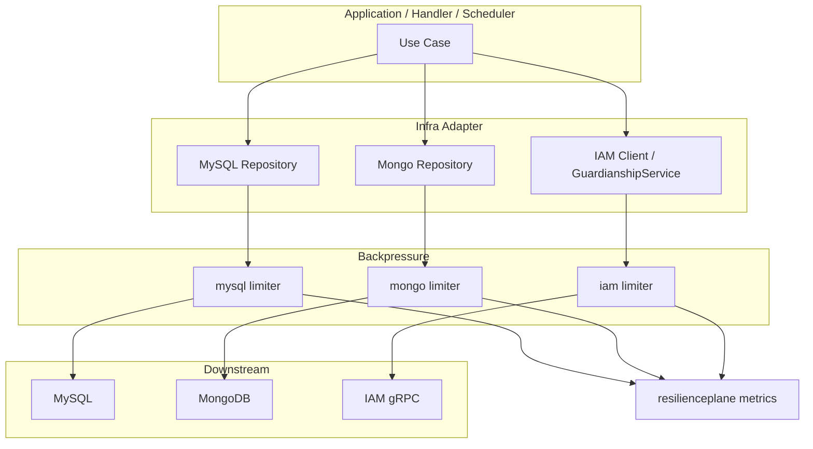
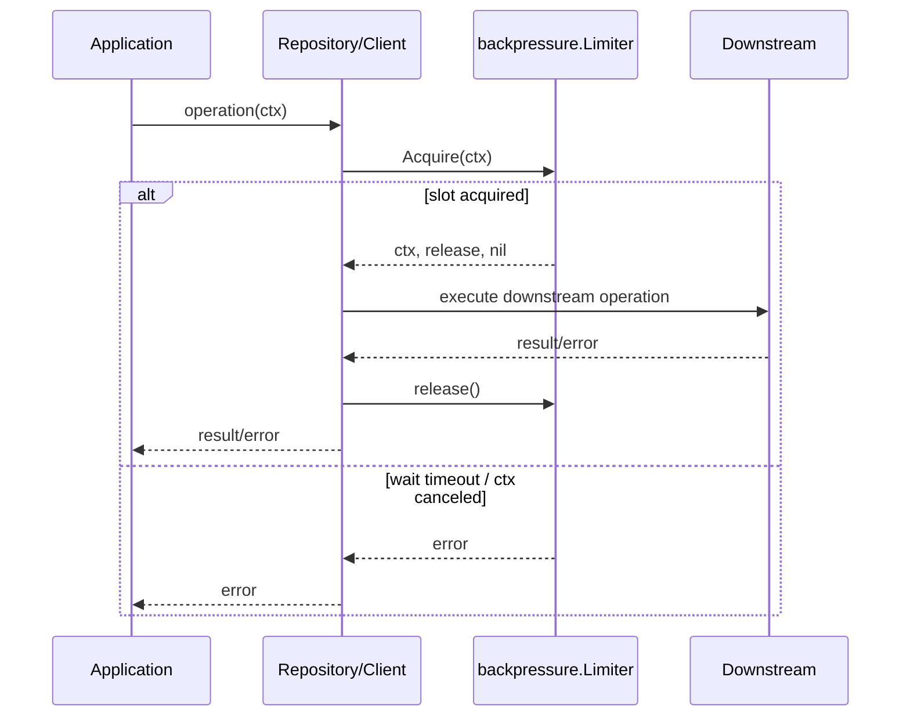

# Backpressure 下游背压

**本文回答**：qs-server 如何通过 `backpressure.Limiter` 对 MySQL、MongoDB、IAM 等下游依赖做 in-flight protection；backpressure 与 HTTP QPS 限流、数据库连接池、超时控制的边界是什么；为什么 limiter 是 infra adapter 的实例依赖，而不是包级全局变量；当下游慢、等待槽位超时、in-flight 持续打满时应如何排查。

---

## 30 秒结论

| 维度 | 结论 |
| ---- | ---- |
| 模块定位 | Backpressure 是**下游依赖保护**，限制同时进入 MySQL/Mongo/IAM 的 in-flight 操作数 |
| Primitive | `backpressure.Limiter` 包装 component-base backpressure limiter |
| 接入依赖 | apiserver 当前显式构建 MySQL、Mongo、IAM 三类 limiter |
| 注入方式 | `process.resource_bootstrap` 构建 `container.BackpressureOptions`，container/assembler 显式传入 repository/client |
| MySQL 接入 | `internal/pkg/database/mysql.BaseRepository` 的 CRUD helper 执行前 acquire |
| Mongo 接入 | `internal/apiserver/infra/mongo.BaseRepository` 的 collection 操作执行前 acquire |
| IAM 接入 | `GuardianshipService` 等 IAM SDK 调用前 acquire |
| timeout 语义 | timeout 只限制“等待槽位”的时间，不限制拿到槽位后的业务执行时间 |
| nil limiter | no-op，直接放行 |
| 观测 outcome | `backpressure_acquired`、`backpressure_timeout`、`backpressure_released` |
| 状态快照 | `BackpressureSnapshot` 暴露 max_inflight、in_flight、timeout_millis、degraded |
| 关键边界 | Backpressure 不是 HTTP 限流，不是连接池，不是 SQL timeout，不是重试机制 |

一句话概括：

> **Backpressure 保护的是“进入下游之前的并发槽位”，不是“下游操作本身的执行时长”。**

---

## 1. 为什么需要 Backpressure

限流和队列保护入口，但并不能解决下游慢的问题。

典型链路：

```text
HTTP / Worker / Scheduler
  -> Application Service
  -> Repository / Client
  -> MySQL / Mongo / IAM
```

如果下游变慢，而上游继续无限进入，会出现：

- goroutine 堆积。
- DB connection pool 被占满。
- Mongo 操作排队。
- IAM gRPC 连接被打满。
- 请求耗时越来越长。
- 失败扩大到整个服务。

Backpressure 通过“并发槽位”限制进入下游的请求数量：

```text
Acquire slot
  -> execute downstream operation
  -> Release slot
```

拿不到槽位则按 timeout 返回错误，保护系统整体。

---

## 2. Backpressure 总图



---

## 3. Backpressure 与其它保护点的边界

| 能力 | 保护位置 | 主要问题 |
| ---- | -------- | -------- |
| RateLimit | HTTP 入口 | 请求太多，提前拒绝 |
| SubmitQueue | collection-server 内存队列 | 突发提交削峰 |
| Backpressure | 下游调用前 | 下游资源 in-flight 太多 |
| LockLease | 跨实例 critical section | 重复执行 / 多实例竞争 |
| DB connection pool | DB driver 内部 | 数据库连接数量 |
| Timeout | 单次操作耗时 | 操作是否超时 |
| Retry | 失败后重试 | 临时错误恢复 |

Backpressure 不替代这些能力。

---

## 4. Limiter 模型

`backpressure.Limiter` 暴露：

```go
Acquire(ctx) (context.Context, func(), error)
Snapshot(name) resilienceplane.BackpressureSnapshot
```

### 4.1 NewLimiter

`NewLimiter(maxInflight, timeout)` 创建 limiter。

如果底层 component-base 返回 nil，则外层也返回 nil。

常见含义：

```text
maxInflight <= 0
  -> 不启用背压
  -> nil limiter
```

### 4.2 Acquire

`Acquire(ctx)`：

1. limiter nil -> 返回原 ctx、no-op release、nil error。
2. limiter enabled -> 等待槽位。
3. 获得槽位 -> 返回 ctx、release、nil。
4. 等待超时或 ctx cancel -> 返回 error。
5. release 时释放槽位。

### 4.3 Snapshot

`Snapshot(name)` 返回：

| 字段 | 说明 |
| ---- | ---- |
| component | 组件 |
| name | limiter name |
| dependency | 依赖名 |
| strategy | 策略，通常是 semaphore |
| enabled | 是否启用 |
| max_inflight | 最大并发 |
| in_flight | 当前并发 |
| timeout_millis | 等待槽位超时 |
| degraded | 是否降级 |
| reason | 降级原因 |

---

## 5. Acquire / Release 时序



### 5.1 重要语义

拿到槽位后，Backpressure 不再控制下游执行时长。

如果 SQL 执行 30 秒：

- Backpressure 只知道这个槽位一直 in-flight。
- 真正的 SQL timeout 要靠 ctx deadline、DB driver 或业务 timeout。

---

## 6. 观测模型

Backpressure 会产生三类 outcome：

| Outcome | 说明 |
| ------- | ---- |
| `backpressure_acquired` | 成功获得槽位 |
| `backpressure_timeout` | 等待槽位失败 |
| `backpressure_released` | 释放槽位 |

### 6.1 Decision metric

```text
qs_resilience_decision_total{
  component,
  kind="backpressure",
  scope,
  resource,
  strategy,
  outcome
}
```

### 6.2 In-flight gauge

```text
qs_resilience_backpressure_inflight{
  component,
  scope,
  resource,
  strategy
}
```

### 6.3 Wait duration

```text
qs_resilience_backpressure_wait_duration_seconds{
  component,
  scope,
  resource,
  strategy,
  outcome
}
```

注意：wait duration 是“等待槽位”的时间，不是下游执行时间。

---

## 7. apiserver 组合根

apiserver 在资源启动阶段构建 BackpressureOptions：

```text
buildBackpressureOptions()
  -> MySQL limiter
  -> Mongo limiter
  -> IAM limiter
  -> container.BackpressureOptions
```

配置来源：

```text
s.config.Backpressure.MySQL
s.config.Backpressure.Mongo
s.config.Backpressure.IAM
```

每个依赖如果 enabled：

```go
newDependencyBackpressureLimiter(dependency, maxInflight, timeoutMs)
```

其中：

```text
Component = apiserver
Dependency = mysql / mongo / iam
Timeout = timeoutMs
```

### 7.1 ContainerBackpressureOptions

`container.BackpressureOptions`：

```go
type BackpressureOptions struct {
    MySQL backpressure.Acquirer
    Mongo backpressure.Acquirer
    IAM   backpressure.Acquirer
}
```

这说明 limiter 是显式依赖，而不是全局变量。

---

## 8. MySQL 接入

MySQL repository 使用 `BaseRepository[T]`。

### 8.1 执行前 acquire

BaseRepository 的 CRUD helper 在 DB 操作前执行：

```text
ctx, release, err := r.acquire(ctx)
defer release()
```

典型方法：

- CreateAndSync。
- UpdateAndSync。
- FindByID。
- FindByField。
- DeleteByID。
- ExistsByID。
- FindWithConditions。
- CountWithConditions。

### 8.2 nil limiter

如果 limiter nil：

```text
return ctx, func(){}, nil
```

也就是不启用背压。

### 8.3 为什么在 BaseRepository 接入

好处：

- 不需要每个 repository 方法重复写 acquire。
- 统一观测 MySQL in-flight。
- 应用层无需知道 DB limiter。
- domain 不依赖 resilience 细节。

### 8.4 注意

复杂手写 SQL 如果绕过 BaseRepository，需要自行确认是否接入 limiter，否则可能绕过 MySQL 背压。

---

## 9. Mongo 接入

Mongo `BaseRepository` 同样支持 limiter。

### 9.1 执行前 acquire

Mongo collection 操作前 acquire：

- InsertOne。
- FindOne。
- FindByID。
- UpdateOne。
- UpdateByID。
- DeleteOne。
- Find。
- CountDocuments。
- ExistsByFilter。

### 9.2 适合保护的场景

- AnswerSheet durable submit。
- Questionnaire 大文档读取。
- Report 查询。
- Mongo outbox claim。
- Mongo collection 聚合查询。

### 9.3 注意

Mongo transaction 内部的多次操作可能分别 acquire，也可能具体 repository 自己管理。排查时要看 in-flight 与实际 Mongo 操作数量的对应关系。

---

## 10. IAM 接入

IAM 是外部 gRPC 依赖，也需要背压。

### 10.1 Client runtime option

IAM Client 使用：

```go
ClientRuntimeOptions{
    Limiter backpressure.Acquirer
}
```

`NewClientWithRuntimeOptions` 会保存 limiter 到 Client 实例。

### 10.2 GuardianshipService

`NewGuardianshipService(client)` 会从 IAM client 取 limiter：

```text
limiter = client.Limiter()
```

然后每次调用 IAM SDK 前：

```text
ctx, release, err := s.acquire(ctx)
defer release()
```

覆盖：

- IsGuardian。
- IsGuardianWithDetails。
- ValidateChildExists。
- ListChildren。
- ListGuardians。
- EstablishProfileLink。
- RevokeProfileLink。
- BatchRevokeProfileLinks。
- ImportProfileLinks。

### 10.3 为什么 IAM 也要背压

IAM 依赖一旦变慢：

- collection submit guardianship 校验会变慢。
- apiserver 登录/身份/监护关系相关调用堆积。
- 外部 gRPC 连接耗尽。
- 反向拖慢主业务链路。

Backpressure 能限制同时进入 IAM 的操作数量。

---

## 11. Backpressure 不等于连接池

| Backpressure | DB Connection Pool |
| ------------ | ------------------ |
| 应用层进入下游前的并发槽位 | driver/DB 连接资源 |
| 可按 dependency 单独配置 | 通常按 DB handle 配置 |
| 等槽位失败可提前返回 | 等连接可能在 driver 内部阻塞 |
| 有 resilience metrics | DB pool 有自己的 stats |
| 可保护 IAM 等非 DB 依赖 | 仅保护数据库连接 |

两者可以同时存在。

---

## 12. Backpressure 不等于 timeout

Backpressure timeout 是：

```text
等待槽位超时
```

不是：

```text
SQL 执行超时
IAM gRPC 超时
Mongo operation 超时
```

如果拿到槽位后操作卡住，还是要依赖：

- context deadline。
- DB driver timeout。
- gRPC timeout。
- application-level timeout。
- slow query 排查。

---

## 13. Backpressure 不等于 RateLimit

| RateLimit | Backpressure |
| --------- | ------------ |
| 入口请求速率 | 下游 in-flight |
| 拒绝过量 HTTP 请求 | 阻止更多操作进入下游 |
| 按 QPS/Burst | 按 maxInflight/timeout |
| 通常返回 429 | 通常返回内部错误或上游错误 |
| 发生在 handler 前 | 发生在 repository/client 前 |

入口没超 QPS，下游仍可能满；反过来，下游没满，入口也可能被限流。

---

## 14. 配置与容量判断

### 14.1 maxInflight

maxInflight 代表：

```text
最多有多少个操作同时进入某依赖
```

设置过高：

- 保护效果弱。
- 下游可能被压垮。
- connection pool 排队。

设置过低：

- 请求容易等槽位超时。
- 吞吐下降。
- 误伤正常流量。

### 14.2 timeoutMs

timeoutMs 代表：

```text
最多等待多久拿槽位
```

设置过短：

- 抖动时容易失败。
- 对峰值不友好。

设置过长：

- goroutine 等待堆积。
- 用户请求长时间挂起。
- 故障恢复慢。

### 14.3 不能只看一个参数

需要综合：

- QPS。
- 平均/TP95 下游耗时。
- connection pool。
- CPU/IO。
- RateLimit。
- SubmitQueue workerCount。
- 下游 SLA。
- 错误预算。

---

## 15. Degraded / disabled 语义

### 15.1 nil limiter

nil limiter 表示该依赖未启用背压。

`Acquire` no-op。

这是显式配置结果，不是错误。

### 15.2 Snapshot degraded

如果 limiter nil：

```text
Enabled=false
Degraded=true
Reason=backpressure limiter disabled
```

这在 status 中表示该能力未启用。

是否接受要看部署策略。

### 15.3 timeout

等待槽位 timeout 是保护生效，不是 limiter degraded。

它说明：

```text
当前依赖 in-flight 达到上限，且等待超过 timeout
```

---

## 16. 设计模式与实现意图

| 模式 | 当前实现 | 意图 |
| ---- | -------- | ---- |
| Semaphore | component-base limiter | 限制 in-flight |
| Adapter | qs backpressure.Limiter | 转换为 resilience outcome |
| Acquirer Interface | `Acquire(ctx)` | 让 MySQL/Mongo/IAM 统一依赖 |
| Instance Injection | ContainerOptions.Backpressure | 避免包级全局变量 |
| Snapshot | BackpressureSnapshot | 只读治理状态 |
| Observer | resilienceplane | 统一 metrics |
| No-op Disabled | nil limiter | 配置可关闭 |

---

## 17. 设计取舍

| 设计 | 收益 | 代价 |
| ---- | ---- | ---- |
| 实例级注入 | 测试清晰、无全局状态 | 装配更显式 |
| nil limiter no-op | 配置可关闭 | status 中显示 disabled/degraded |
| timeout 只等槽位 | 语义明确 | 不管下游执行慢 |
| BaseRepository 接入 | 大部分 CRUD 自动保护 | 手写查询需确认 |
| IAM 接入 limiter | 外部依赖可保护 | IAM 变慢时业务会被错误影响 |
| 单 dependency limiter | 简单可观测 | 不能按具体 SQL/接口细分 |
| 不自动 retry | 避免放大压力 | 调用方要决定重试策略 |

---

## 18. 常见误区

### 18.1 “Backpressure 就是限流”

不是。限流看入口 QPS，Backpressure 看下游 in-flight。

### 18.2 “Backpressure timeout 是数据库超时”

不是。它是等待槽位超时。

### 18.3 “maxInflight 越大越好”

不一定。过大会失去保护效果。

### 18.4 “timeout 越长越稳”

不一定。过长会造成 goroutine 堆积和用户等待。

### 18.5 “nil limiter 是 bug”

不一定。它可能是配置关闭。要看环境目标。

### 18.6 “用了 backpressure 就不用 DB pool”

错误。它们保护不同层。

---

## 19. 排障路径

### 19.1 backpressure_timeout 增长

检查：

1. dependency 是 mysql/mongo/iam 哪个。
2. in_flight 是否长期等于 max_inflight。
3. wait duration 分布。
4. 下游 TP95/TP99。
5. DB pool stats。
6. slow query / Mongo slow op / IAM latency。
7. RateLimit 是否过宽。
8. SubmitQueue workerCount 是否过高。
9. 是否需要扩容或优化下游。

### 19.2 MySQL in-flight 长期打满

检查：

1. 慢 SQL。
2. 索引。
3. transaction 持有时间。
4. connection pool。
5. worker/scheduler 并发。
6. statistics rebuild。
7. 是否某个接口高并发查询。

### 19.3 Mongo in-flight 长期打满

检查：

1. AnswerSheet durable submit 耗时。
2. Questionnaire/Report 大文档读取。
3. Mongo outbox claim。
4. Mongo index。
5. 文档大小。
6. collection scan。
7. session transaction 耗时。

### 19.4 IAM in-flight 长期打满

检查：

1. IAM 服务 latency。
2. Guardianship check 调用量。
3. submit path 是否频繁校验。
4. IAM gRPC timeout/retry。
5. IAM SDK connection。
6. 是否需要缓存监护关系结果。
7. 是否需要降低 collection submit 并发。

### 19.5 status 显示 disabled

检查：

1. config.Backpressure 是否存在。
2. dependency enabled。
3. maxInflight 是否 >0。
4. container.BackpressureOptions 是否传入。
5. repository/client 是否接收 limiter。

---

## 20. 修改指南

### 20.1 新增下游 Backpressure

步骤：

1. 确认依赖是否可能被并发打满。
2. 定义 dependency 名。
3. 增加配置项：enabled/maxInflight/timeoutMs。
4. 在 resource bootstrap 构建 limiter。
5. 加入 `container.BackpressureOptions`。
6. 显式注入 infra adapter。
7. 调用前 Acquire，defer release。
8. 增加 Snapshot。
9. 补测试和文档。

### 20.2 调整 MySQL/Mongo/IAM 阈值

不要只看 timeout 次数。需要结合：

- in-flight。
- 下游耗时。
- QPS。
- connection pool。
- submit queue depth。
- rate limit。
- CPU/IO。
- 错误率。

### 20.3 手写 repository 查询接入

如果绕过 BaseRepository：

1. 手工调用 limiter Acquire。
2. defer release。
3. 保留 ctx。
4. 把错误向上返回。
5. 补测试验证 timeout。

---

## 21. 代码锚点

- Backpressure limiter：[../../../internal/pkg/backpressure/limiter.go](../../../internal/pkg/backpressure/limiter.go)
- MySQL BaseRepository：[../../../internal/pkg/database/mysql/base.go](../../../internal/pkg/database/mysql/base.go)
- Mongo BaseRepository：[../../../internal/apiserver/infra/mongo/base.go](../../../internal/apiserver/infra/mongo/base.go)
- IAM Client：[../../../internal/apiserver/infra/iam/client.go](../../../internal/apiserver/infra/iam/client.go)
- IAM GuardianshipService：[../../../internal/apiserver/infra/iam/guardianship.go](../../../internal/apiserver/infra/iam/guardianship.go)
- Container BackpressureOptions：[../../../internal/apiserver/container/options.go](../../../internal/apiserver/container/options.go)
- Resource bootstrap：[../../../internal/apiserver/process/resource_bootstrap.go](../../../internal/apiserver/process/resource_bootstrap.go)
- Resilience metrics：[../../../internal/pkg/resilienceplane/prometheus.go](../../../internal/pkg/resilienceplane/prometheus.go)
- Resilience status：[../../../internal/pkg/resilienceplane/status.go](../../../internal/pkg/resilienceplane/status.go)

---

## 22. Verify

```bash
go test ./internal/pkg/backpressure
go test ./internal/pkg/resilienceplane
go test ./internal/pkg/database/mysql
go test ./internal/apiserver/infra/mongo
go test ./internal/apiserver/infra/iam
go test ./internal/apiserver/process
go test ./internal/apiserver/container
```

如果修改 repository 接入：

```bash
go test ./internal/apiserver/infra/mysql/...
go test ./internal/apiserver/infra/mongo/...
```

如果修改文档：

```bash
make docs-hygiene
git diff --check
```

---

## 23. 下一跳

| 目标 | 文档 |
| ---- | ---- |
| LockLease 幂等与重复抑制 | [04-LockLease幂等与重复抑制.md](./04-LockLease幂等与重复抑制.md) |
| 观测降级排障 | [05-观测降级与排障.md](./05-观测降级与排障.md) |
| 能力矩阵 | [07-能力矩阵.md](./07-能力矩阵.md) |
| SubmitQueue 提交削峰 | [02-SubmitQueue提交削峰.md](./02-SubmitQueue提交削峰.md) |
| RateLimit 入口限流 | [01-RateLimit入口限流.md](./01-RateLimit入口限流.md) |
| 回看整体架构 | [00-整体架构.md](./00-整体架构.md) |
