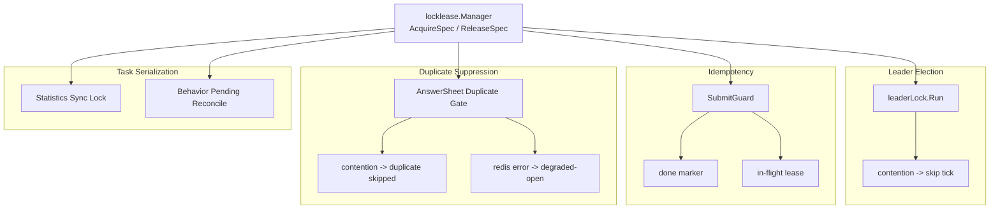
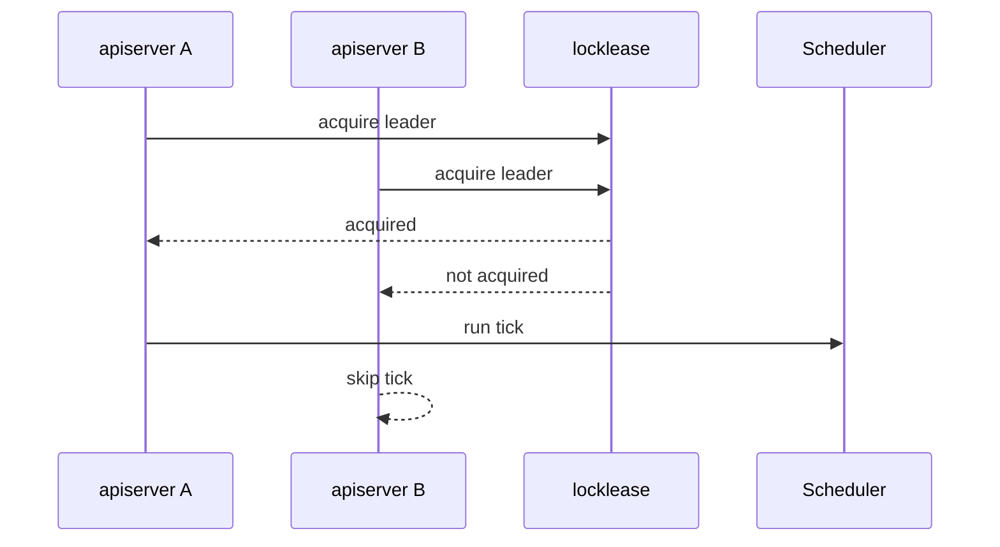
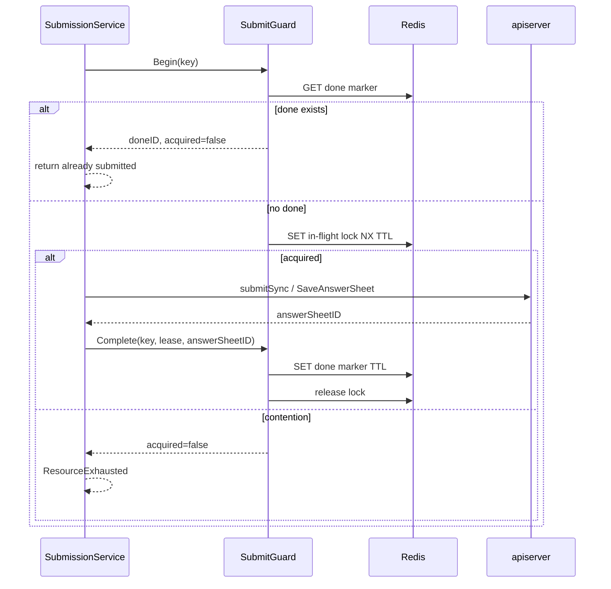

# LockLease 幂等与重复抑制

**本文回答**：qs-server 中 `locklease`、leader lock、SubmitGuard、worker duplicate suppression 分别解决什么问题；哪些是 lock primitive，哪些是业务幂等语义；为什么 Redis lock 不能替代数据库事务、唯一约束、状态机和 idempotency key；不同场景下 lock contention、Redis error、degraded-open 应该如何理解。

---

## 30 秒结论

| 场景 | 语义 | 抢不到锁 | Redis 异常 | 代码 |
| ---- | ---- | -------- | ---------- | ---- |
| Scheduler leader | 多实例只允许一个实例跑本轮调度 | skip tick | 返回 runner error 或跳过 | `runtime/scheduler/leader_lock.go` |
| Collection submit | done marker + in-flight lock，实现跨实例提交幂等保护 | submit already in progress | done lookup error 返回错误；lockMgr nil 可 degraded-open | `redisops.SubmitGuard` |
| Worker answersheet | best-effort duplicate suppression，防 MQ 重复投递造成重复处理 | duplicate skipped，返回 nil | degraded-open，继续处理 | `answersheet_handler.go` |
| Statistics sync | leader + task lock，防多实例重复同步/重建 | skip / busy | 由 scheduler/sync service 定义 | scheduler + statistics |
| Redis primitive | token-based lease，无自动续租，无 fencing token | acquired=false | error | `locklease` |

| 维度 | 结论 |
| ---- | ---- |
| LockLease 本质 | 带 TTL 和 token owner 的短期租约 primitive |
| Idempotency 本质 | 同一个业务 key 已完成时复用结果，进行中时抑制重复 |
| Duplicate suppression 本质 | MQ/worker 重复投递时尽力跳过重复副作用 |
| Leader 本质 | 多实例中只让一个实例执行当前 tick |
| 不能承诺 | 不承诺 exactly-once，不承诺 fencing，不自动续租，不替代 DB 唯一约束 |
| 正确性兜底 | 仍依赖 AnswerSheet durable submit、Assessment 唯一约束/状态机、outbox、checkpoint |
| 观测 | lock/idempotency/duplicate 都通过 resilienceplane 输出 bounded outcome |

一句话概括：

> **locklease 是 primitive；leader、idempotency、duplicate suppression 是调用方赋予 primitive 的不同业务语义。**

---

## 1. 为什么要区分三类语义

很多系统会把“锁、幂等、去重”混在一起，但它们不是同一个问题。

| 问题 | 目标 | 示例 |
| ---- | ---- | ---- |
| Leader election | 多实例中只运行一个任务 | plan scheduler tick |
| Idempotency | 同一个请求完成后复用结果 | collection submit done marker |
| Duplicate suppression | 重复事件不重复执行副作用 | worker 处理 answersheet.submitted |
| Task serialization | 同一窗口/资源只执行一次 | statistics sync |
| Mutual exclusion | 短时间临界区排他 | pending reconcile |

如果不区分，就会犯这些错：

- 抢不到 leader lock 被当成错误。
- worker Redis lock 失败导致主链路停摆。
- 以为有 Redis lock 就不需要 DB 唯一约束。
- 把 requestID 当成业务幂等 key。
- 用 lock 代替状态机。

---

## 2. 总图



---

## 3. locklease primitive

`locklease` 提供的是基础租约能力。

核心模型：

| 概念 | 说明 |
| ---- | ---- |
| `Spec` | 锁工作负载定义：name、description、default TTL |
| `Identity` | 某个具体锁目标：spec name + raw key |
| `Lease` | 成功获取锁后的 token owner |
| `Manager` | Acquire / AcquireSpec / Release / ReleaseSpec |

### 3.1 内置 Specs

| Spec | 默认 TTL | 语义 |
| ---- | -------- | ---- |
| `AnswersheetProcessing` | 5m | worker 答卷事件重复处理抑制 |
| `PlanSchedulerLeader` | 50s | plan scheduler leader |
| `StatisticsSyncLeader` | 30m | statistics sync scheduler leader |
| `StatisticsSync` | 30m | 单个 statistics sync task 串行 |
| `BehaviorPendingReconcile` | 30s | pending behavior reconcile 串行 |
| `CollectionSubmit` | 5m | collection submit in-flight lock |

### 3.2 token-based release

释放锁时必须携带 lease token。

错误 token 不应释放其他 owner 的锁。

### 3.3 不支持

当前 locklease 不支持：

- 自动续租。
- fencing token。
- exactly-once。
- durable lock history。
- 通用业务幂等状态机。
- 通用 retry。
- 通用 dead-letter。

---

## 4. Leader Lock

### 4.1 场景

用于：

- plan scheduler。
- statistics sync scheduler。
- behavior pending reconcile。

多 apiserver 实例同时启动时，只允许一个实例执行某个 tick。

### 4.2 leaderLock.Run

`leaderLock.Run(ctx, opts, body)`：

1. 调 acquire。
2. acquire error -> 返回错误，可包装 `AcquireError`。
3. not acquired -> 调 `OnNotAcquired(lockKey)`，返回 nil。
4. acquired -> 执行 body。
5. defer 使用 `context.Background()` release。
6. release error -> 调 `OnReleaseError`，不覆盖 body 结果。

### 4.3 contention 是正常 skip



抢不到 leader lock 不是错误，是多实例部署的预期结果。

---

## 5. Collection SubmitGuard：幂等保护

SubmitGuard 是 collection-server 的跨实例提交保护。

它组合了两类 Redis 状态：

```text
done marker
+
in-flight lock
```

### 5.1 Begin

`Begin(ctx,key)`：

1. key 为空或 guard nil -> acquired=true，直接放行。
2. 查 done marker。
3. done 存在 -> idempotency_hit，返回 done answerSheetID。
4. done 查询 Redis error -> lock_error，返回 error。
5. lockMgr nil -> degraded_open，acquired=true。
6. Acquire `CollectionSubmit` in-flight lock。
7. acquired=true -> lock_acquired。
8. acquired=false -> lock_contention，表示正在处理。

### 5.2 Complete

`Complete(ctx,key,lease,answerSheetID)`：

1. 如果 answerSheetID 非空且 ops Redis 可用，写 done marker。
2. done marker TTL 默认 30min。
3. 释放 in-flight lock。

如果写 done marker 失败，返回 error。

### 5.3 Abort

`Abort(ctx,key,lease)`：

- submitSync 失败时释放 in-flight lock。
- 不写 done marker。

### 5.4 时序



### 5.5 SubmitGuard 的语义

| 结果 | 上层含义 |
| ---- | -------- |
| doneID != "" | 已提交过，复用结果 |
| acquired=true | 当前请求获得处理权 |
| acquired=false | 同 key 正在处理 |
| error | Redis done lookup / lock 操作失败 |

### 5.6 SubmitGuard 不是最终幂等

SubmitGuard 只是 collection 层保护。

最终幂等仍依赖：

- req.IdempotencyKey。
- apiserver AnswerSheet durable submit。
- Mongo idempotency collection。
- AnswerSheet 唯一约束。
- outbox event_id。

---

## 6. Worker Duplicate Suppression

worker 处理 `answersheet.submitted` 时使用 duplicate suppression gate。

### 6.1 目标

防止 MQ 重复投递或多 worker 并发处理同一 AnswerSheet 时，重复执行：

- CalculateAnswerSheetScore。
- CreateAssessmentFromAnswerSheet。

### 6.2 gate.Run 流程

1. 构造 answerSheetID lock key。
2. lock manager 不可用：
   - 记录 lock degraded。
   - outcome=degraded_open。
   - 继续执行 fn。
3. acquire error：
   - 记录 lock degraded。
   - outcome=degraded_open。
   - 继续执行 fn。
4. not acquired：
   - outcome=duplicate_skipped。
   - 返回 nil。
5. acquired：
   - 执行 fn。
   - defer release。
   - release 失败只 warn。

### 6.3 为什么 Redis 异常时继续处理

worker gate 是 best-effort duplicate suppression。

如果 Redis lock 不可用就拒绝处理，可能导致主链路卡住：

```text
answersheet.submitted 已出站
worker 因 Redis lock 不可用一直失败
assessment 不创建
```

所以这里选择 availability first：

```text
degraded-open
  -> 继续处理
  -> 下游幂等兜底
```

### 6.4 not acquired 为什么返回 nil

not acquired 表示另一个 worker 正在处理该 answerSheetID。

返回 nil 后 MQ 会 Ack，避免同一消息不断重试。

业务正确性由另一个 worker 的处理结果和 apiserver 幂等保证。

---

## 7. Statistics Sync / Reconcile Lock

### 7.1 Statistics sync

通常有两层：

| 锁 | 作用 |
| -- | ---- |
| `StatisticsSyncLeader` | 多实例只允许一个 runner 执行 tick |
| `StatisticsSync` | 同一 org/window/task 不并发 rebuild |

### 7.2 Behavior pending reconcile

`BehaviorPendingReconcile` 用于：

- 多实例下只让一个实例处理 pending behavior events。
- TTL 默认短，适合周期任务。

### 7.3 语义

这类锁通常是：

```text
contention -> skip / busy
error -> skip or return error
```

不应和 SubmitGuard 的幂等结果复用混淆。

---

## 8. 三类语义对比

| 维度 | Leader | Idempotency | Duplicate Suppression |
| ---- | ------ | ----------- | --------------------- |
| 目标 | 一个实例执行 | 同 key 结果复用/进行中抑制 | 重复事件少执行 |
| 代表 | scheduler leader | SubmitGuard | worker answersheet gate |
| 抢不到锁 | skip | submit already in progress | duplicate skipped |
| Redis error | 通常 fail/skip | 视 done lookup/lock 状态 | degraded-open |
| 是否返回已有结果 | 否 | 是，done marker | 否 |
| 是否要求业务幂等兜底 | 是 | 是 | 是 |
| 是否 exactly-once | 否 | 否 | 否 |

---

## 9. Redis Lock 与数据库事务边界

Redis lock 不能替代 DB transaction。

| Redis Lock | DB Transaction / Constraint |
| ---------- | --------------------------- |
| 短期排他 | 持久一致性 |
| TTL 到期可能释放 | commit/rollback 明确 |
| 无 fencing token | 可用 version/unique/lock 保证 |
| 网络异常可能失败 | DB 结果可查询 |
| 适合降低并发冲突 | 适合保证事实唯一 |

必须使用 DB 兜底的场景：

- AnswerSheet 幂等提交。
- Assessment 创建唯一性。
- Report durable save。
- Statistics rebuild delete+insert。
- Outbox stage。
- Behavior projector checkpoint。

---

## 10. TTL 与 Critical Section

### 10.1 TTL 必须覆盖临界区

如果锁 TTL 小于任务耗时：

```text
A acquired
A still running
TTL expired
B acquired
A/B overlap
```

### 10.2 不自动续租

当前 locklease 不自动续租。

长任务应该：

- 增加 TTL。
- 拆小任务。
- 加分页。
- 引入 renew 设计。
- 或引入 DB 状态锁/fencing。

### 10.3 TTL 过长也有风险

TTL 过长会导致：

- 进程崩溃后恢复慢。
- contention 时间过长。
- 用户重复提交长时间无法处理。
- 运维误判卡死。

---

## 11. Fencing Token 边界

当前 locklease 不提供 fencing token。

这意味着：

```text
锁过期后，旧 owner 仍可能继续写下游
```

如果某场景必须阻止旧 owner 写入，需要：

- DB version check。
- optimistic lock。
- fencing token。
- 状态机前置条件。
- 幂等记录。
- 唯一约束。

不要把当前 Redis lock 用在需要强 fencing 的库存/金融/余额扣减类逻辑上。

---

## 12. RequestID 与 IdempotencyKey

SubmitQueue / SubmissionService 中有两个 key：

| Key | 来源 | 语义 |
| --- | ---- | ---- |
| requestID | HTTP request id / header / generated UUID | collection 本地状态查询和队列去重 |
| idempotency_key | 请求体业务字段 | 跨实例/业务提交幂等优先 key |

`requestKey(requestID, req)`：

```text
if req.IdempotencyKey != ""
  use IdempotencyKey
else
  use requestID
```

### 12.1 推荐

客户端应传稳定 idempotency_key。

requestID 更适合作为：

- 请求追踪。
- 本地 submit-status。
- 重复 HTTP 请求识别。

---

## 13. Observability

### 13.1 SubmitGuard

Subject：

```text
component=collection-server
scope=answersheet_submit
resource=submit_guard
strategy=redis_lock
```

ProtectionKind：

```text
idempotency
```

Outcomes：

- idempotency_hit。
- lock_acquired。
- lock_contention。
- lock_error。
- degraded_open。

### 13.2 Worker gate

Subject：

```text
component=worker
scope=answersheet_submitted
resource=answersheet_processing
strategy=redis_lock
```

ProtectionKind：

```text
duplicate_suppression
```

Outcomes：

- degraded_open。
- duplicate_skipped。

### 13.3 Leader / Lock

ProtectionKind：

```text
lock
```

Outcomes：

- lock_acquired。
- lock_contention。
- lock_released。
- lock_error。
- lock_degraded。

### 13.4 指标

```text
qs_resilience_decision_total{
  component,
  kind,
  scope,
  resource,
  strategy,
  outcome
}
```

不要把 raw lock key、requestID、answerSheetID 放进 labels。

---

## 14. Degraded 策略

| 场景 | Redis error 策略 | 原因 |
| ---- | ---------------- | ---- |
| Scheduler leader | fail/skip | 避免多实例重复执行后台任务 |
| SubmitGuard done lookup | return error | 无法确认是否已完成 |
| SubmitGuard lockMgr nil | degraded-open | 允许继续，后端幂等兜底 |
| SubmitGuard lock acquire error | return error | 无法安全判断 in-flight |
| Worker duplicate gate | degraded-open | 避免主链路卡住 |
| Behavior reconcile | skip | 后台任务可下一轮再执行 |

### 14.1 不是所有 Redis 错误都 degraded-open

degraded-open 是可用性优先策略，只适合某些场景。

如果错误可能导致重复提交或后台任务重复写，应 fail-closed 或 skip。

---

## 15. 设计模式与实现意图

| 模式 | 当前实现 | 意图 |
| ---- | -------- | ---- |
| Lease Primitive | locklease.Manager | 统一短期锁 |
| Spec Registry | locklease.Specs | 内置锁工作负载标准化 |
| Leader Runner | leaderLock.Run | 多实例调度单点执行 |
| Done Marker | SubmitGuard done key | 已完成结果复用 |
| In-flight Lock | SubmitGuard lock | 进行中提交抑制 |
| Duplicate Gate | answersheet gate | MQ 重复投递抑制 |
| Degraded Open | worker gate | 可用性优先 |
| Bounded Outcome | resilienceplane | 可观测语义统一 |

---

## 16. 设计取舍

| 设计 | 收益 | 代价 |
| ---- | ---- | ---- |
| locklease 只做 primitive | 语义清晰 | 调用方要定义业务行为 |
| SubmitGuard done+lock | 兼顾已完成和进行中 | Redis 依赖更复杂 |
| worker degraded-open | 主链路不因 Redis lock 卡死 | 重复处理风险增加 |
| leader contention skip | 多实例安全 | 当前实例不执行本轮 |
| 不自动续租 | 实现简单 | 长任务需仔细设计 TTL |
| 不提供 fencing | 低复杂度 | 强一致写入需 DB 兜底 |
| requestID 本地状态 | 前端体验好 | 不跨实例/不 durable |

---

## 17. 常见误区

### 17.1 “有 Redis lock 就实现了 exactly-once”

错误。Redis lock 只能降低重复概率。

### 17.2 “idempotency 和 duplicate suppression 是一回事”

不是。幂等要能复用完成结果；重复抑制通常只是跳过并发重复执行。

### 17.3 “抢不到锁一定是异常”

不一定。leader contention 和 duplicate skipped 都可能是正常结果。

### 17.4 “Redis error 都应该继续执行”

不对。worker gate 可以 degraded-open，但 SubmitGuard done lookup error 不能随便放行。

### 17.5 “TTL 越长越安全”

不一定。TTL 长会延迟故障恢复。

### 17.6 “requestID 可以完全替代 idempotency_key”

不建议。requestID 多用于请求追踪和本地状态，业务幂等应使用稳定 idempotency_key。

---

## 18. 排障路径

### 18.1 submit already in progress

检查：

1. SubmitGuard lock contention。
2. idempotency key 是否重复。
3. done marker 是否不存在。
4. in-flight TTL 是否过长。
5. 前一次提交是否卡在 apiserver。
6. collection-server 是否重试过快。

### 18.2 already submitted 但前端没拿到结果

检查：

1. done marker answerSheetID。
2. SubmitQueue status 是否 TTL 过期。
3. apiserver AnswerSheet 是否存在。
4. 前端是否换 requestID。
5. idempotency_key 是否稳定。

### 18.3 worker duplicate skipped 增多

检查：

1. MQ 是否重复投递。
2. Ack 是否失败。
3. handler 是否执行时间超过 TTL。
4. answersheet_processing lock TTL。
5. 多 worker 并发。
6. 是否有上游重复 event。

### 18.4 worker degraded_open 增多

检查：

1. lock_lease family 是否 available。
2. Redis profile/namespace。
3. acquire error。
4. lock manager 是否注入。
5. 下游 CreateAssessment 幂等是否有效。

### 18.5 scheduler 不运行

检查：

1. leader lock acquire error。
2. contention 是否正常有其它实例。
3. TTL 是否过长。
4. release 是否失败。
5. scheduler 是否启用。
6. lock namespace 是否一致。

---

## 19. 修改指南

### 19.1 新增 lock 场景

必须：

1. 判断是 leader、idempotency、duplicate suppression 还是 task serialization。
2. 选择或新增 LockSpec。
3. 定义 raw key。
4. 明确 TTL。
5. 明确 contention 语义。
6. 明确 Redis error 策略。
7. 明确 DB/业务幂等兜底。
8. 接 resilienceplane outcome。
9. 补测试和文档。

### 19.2 新增幂等保护

必须：

1. 明确幂等 key。
2. 明确完成结果如何存储。
3. 明确进行中如何抑制。
4. 明确失败如何 Abort。
5. 明确 done marker TTL。
6. 明确后端 durable 幂等。
7. 明确跨实例语义。

### 19.3 新增 duplicate suppression

必须：

1. 明确重复事件来源。
2. 确认重复可安全跳过。
3. Redis error 时选择 degraded-open 或 fail-closed。
4. 下游必须幂等。
5. 锁 TTL 覆盖处理时间。
6. 返回 nil 还是 error 要清楚影响 Ack/Nack。

---

## 20. 代码锚点

- LockLease specs：[../../../internal/pkg/locklease/lease.go](../../../internal/pkg/locklease/lease.go)
- Redis lock adapter：[../../../internal/pkg/locklease/redisadapter/](../../../internal/pkg/locklease/redisadapter/)
- Scheduler leader lock：[../../../internal/apiserver/runtime/scheduler/leader_lock.go](../../../internal/apiserver/runtime/scheduler/leader_lock.go)
- SubmitGuard：[../../../internal/collection-server/infra/redisops/submit_guard.go](../../../internal/collection-server/infra/redisops/submit_guard.go)
- SubmissionService：[../../../internal/collection-server/application/answersheet/submission_service.go](../../../internal/collection-server/application/answersheet/submission_service.go)
- Worker answersheet gate：[../../../internal/worker/handlers/answersheet_handler.go](../../../internal/worker/handlers/answersheet_handler.go)
- Resilience model：[../../../internal/pkg/resilienceplane/model.go](../../../internal/pkg/resilienceplane/model.go)
- Resilience metrics：[../../../internal/pkg/resilienceplane/prometheus.go](../../../internal/pkg/resilienceplane/prometheus.go)

---

## 21. Verify

```bash
go test ./internal/pkg/locklease
go test ./internal/pkg/locklease/redisadapter
go test ./internal/collection-server/infra/redisops
go test ./internal/collection-server/application/answersheet
go test ./internal/worker/handlers
go test ./internal/apiserver/runtime/scheduler
go test ./internal/pkg/resilienceplane
```

如果修改 Redis family/keyspace：

```bash
go test ./internal/pkg/cacheplane
go test ./internal/pkg/cacheplane/keyspace
```

如果修改文档：

```bash
make docs-hygiene
git diff --check
```

---

## 22. 下一跳

| 目标 | 文档 |
| ---- | ---- |
| 观测降级排障 | [05-观测降级与排障.md](./05-观测降级与排障.md) |
| 新增高并发治理能力 | [06-新增高并发治理能力SOP.md](./06-新增高并发治理能力SOP.md) |
| 能力矩阵 | [07-能力矩阵.md](./07-能力矩阵.md) |
| Redis 分布式锁层 | [../redis/06-Redis分布式锁层.md](../redis/06-Redis分布式锁层.md) |
| SubmitQueue 提交削峰 | [02-SubmitQueue提交削峰.md](./02-SubmitQueue提交削峰.md) |
| 回看整体架构 | [00-整体架构.md](./00-整体架构.md) |
