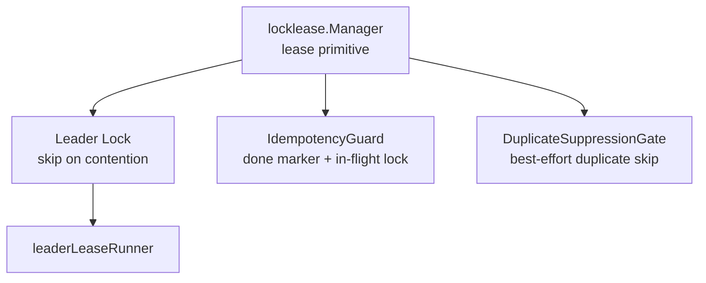
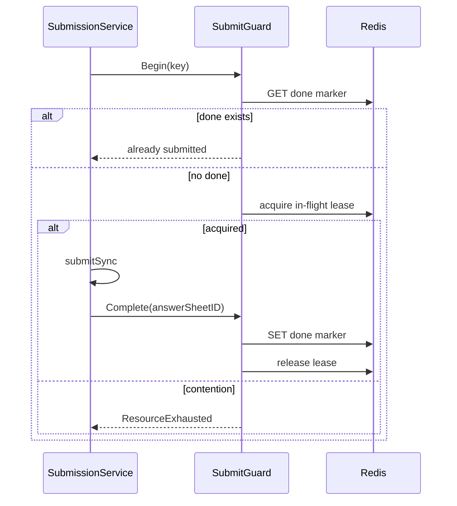

# Lock Lease、幂等与重复抑制

**本文回答**：当前 Lock lease 在哪些场景使用，哪些是 leader lock，哪些是 idempotency guard，哪些只是 best-effort duplicate suppression。

## 30 秒结论

| 场景 | 语义 | 代码 |
| ---- | ---- | ---- |
| Scheduler leader | 抢不到锁就跳过本轮，runner 依赖 `leaderLeaseRunner` | [`runtime/scheduler`](../../../internal/apiserver/runtime/scheduler/) |
| Collection submit | application-facing `IdempotencyGuard`，Redis adapter 是 `SubmitGuard` | [`SubmissionService`](../../../internal/collection-server/application/answersheet/submission_service.go)、[`SubmitGuard`](../../../internal/collection-server/infra/redisops/submit_guard.go) |
| Worker answersheet | package-local `DuplicateSuppressionGate`，降级继续 | [`answersheet_handler.go`](../../../internal/worker/handlers/answersheet_handler.go) |
| Redis primitive | token-based lease，无自动续租，无 fencing token | [`locklease`](../../../internal/pkg/locklease/) |

## 模型图



## SubmitGuard 时序



## 不变量

- `locklease` 不自动续租；长任务要单独评估 TTL。
- wrong-token release 不能释放其他 owner 的锁。
- `SubmitGuard.Complete` 写 done marker 失败时保留 in-flight lock，等待 TTL 过期。
- worker gate 失败时继续处理，正确性依赖下游幂等和唯一约束。
- 三类 lock 语义接口只存在于消费方边界，不上移到 `locklease` primitive。

## Verify

```bash
go test ./internal/pkg/locklease ./internal/collection-server/infra/redisops ./internal/worker/handlers ./internal/apiserver/runtime/scheduler
```
