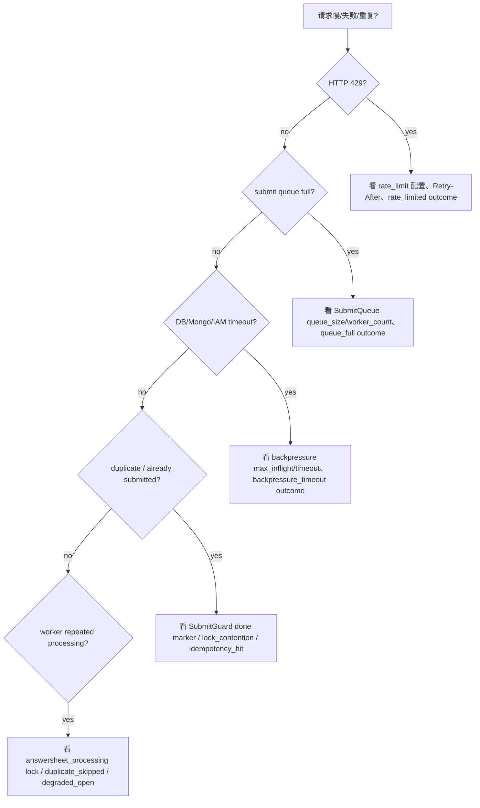
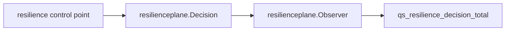

# Resilience 观测、降级与排障

**本文回答**：遇到 `429`、队列满、下游等待超时、重复提交、worker 重复处理时，应该从哪些 outcome 和源码开始查。

## 30 秒结论

| outcome | 说明 |
| ------- | ---- |
| `rate_limited` | HTTP 入口被限流 |
| `degraded_open` | Redis limiter 或 duplicate gate 失败后放行 |
| `queue_full` | SubmitQueue channel 已满 |
| `backpressure_timeout` | 等下游槽位超时 |
| `lock_contention` | Redis lease 被其他实例持有 |
| `idempotency_hit` | SubmitGuard 命中 done marker |
| `duplicate_skipped` | worker best-effort gate 跳过重复事件 |

## 排障决策树



## 观测模型



`resilienceplane.Subject` 只允许 bounded labels：`component / scope / resource / strategy`。不要把 user ID、request ID、lock key、error message 放入 label。

## Verify

```bash
go test ./internal/pkg/resilienceplane
python scripts/check_docs_hygiene.py
```
