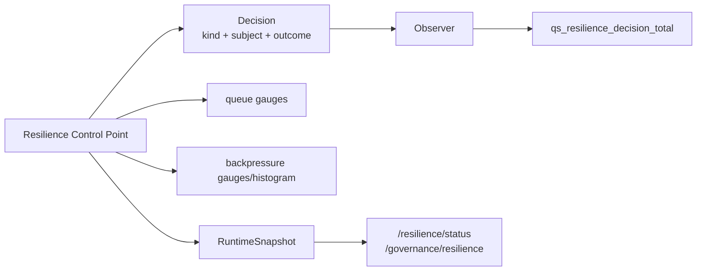
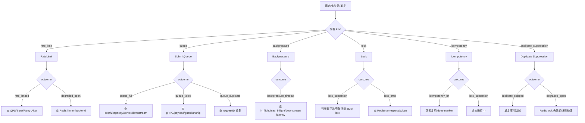

# Resilience 观测、降级与排障

**本文回答**：遇到 HTTP 429、SubmitQueue 满、下游等待槽位超时、重复提交、worker 重复处理、scheduler 不执行时，应该如何从 `outcome`、metrics、RuntimeSnapshot 和 degraded 语义定位问题；哪些 outcome 是保护生效，哪些是异常，哪些只是多实例下的正常竞争。

---

## 30 秒结论

| 维度 | 结论 |
| ---- | ---- |
| 核心入口 | 先看 `qs_resilience_decision_total` 的 `kind + scope + resource + strategy + outcome` |
| 状态入口 | 再看 `RuntimeSnapshot`：rate_limits、queues、backpressure、locks、idempotency、duplicate_suppression |
| Queue 指标 | `qs_resilience_queue_depth`、`qs_resilience_queue_status_total` |
| Backpressure 指标 | `qs_resilience_backpressure_inflight`、`qs_resilience_backpressure_wait_duration_seconds` |
| Outcome 主线 | `rate_limited` 看入口；`queue_full` 看 SubmitQueue；`backpressure_timeout` 看下游；`lock_contention` 看锁语义；`degraded_open` 看降级放行 |
| Degraded 语义 | degraded 不是统一错误，必须按保护点解释 |
| 低基数原则 | metrics 只允许 bounded labels，不放 userID、requestID、lockKey、answerSheetID、raw error |
| 操作边界 | 当前状态入口只读，不提供动态调参、queue drain、lock release、retry、repair |
| 排障顺序 | 先定位 protection kind，再定位 outcome，再看对应保护点状态，最后进入业务链路 |

一句话概括：

> **Resilience 排障不要先猜业务 bug，先看是入口被挡、队列已满、下游背压、锁竞争，还是降级放行。**

---

## 1. Resilience 观测模型



核心思想：

```text
每一个保护点都产生 bounded outcome；
每一个 outcome 都能解释一次治理决策；
每一个 status snapshot 都只展示当前状态，不提供破坏性操作。
```

---

## 2. Outcome 速查表

| Outcome | ProtectionKind | 通常含义 | 优先排查 |
| ------- | -------------- | -------- | -------- |
| `allowed` | rate_limit | 入口允许通过 | 一般无需排查 |
| `rate_limited` | rate_limit | HTTP 入口被限流 | QPS/Burst、Retry-After、前端重试 |
| `degraded_open` | rate_limit / idempotency / duplicate_suppression | 保护点异常但选择放行 | Redis limiter、lock manager、SubmitGuard、worker gate |
| `queue_accepted` | queue | 入队成功 | 正常 |
| `queue_full` | queue | SubmitQueue channel 满 | queue depth、workerCount、apiserver gRPC、Mongo |
| `queue_duplicate` | queue | requestID 已有 queued/processing/done | 前端重复提交或轮询逻辑 |
| `queue_processing` | queue | worker 开始处理 | 正常 |
| `queue_done` | queue | worker 提交成功 | 正常 |
| `queue_failed` | queue | 提交失败或 previous failed | gRPC error、guardianship、payload、apiserver |
| `queue_status_cleaned` | queue | 过期 request status 被清理 | status TTL、轮询时间 |
| `backpressure_acquired` | backpressure | 获得下游槽位 | 正常 |
| `backpressure_timeout` | backpressure | 等下游槽位超时 | MySQL/Mongo/IAM in-flight 与耗时 |
| `backpressure_released` | backpressure | 释放槽位 | 正常 |
| `lock_acquired` | lock / idempotency | 获得 lease | 正常 |
| `lock_contention` | lock / idempotency | 锁被其它实例持有 | 可能正常，也可能 stuck |
| `lock_released` | lock | 释放成功 | 正常 |
| `lock_error` | lock / idempotency | 锁操作错误 | Redis、namespace、key、token |
| `lock_degraded` | lock | lock 能力降级 | Redis / lock manager |
| `idempotency_hit` | idempotency | SubmitGuard 命中 done marker | 正常完成结果复用 |
| `duplicate_skipped` | duplicate_suppression | worker 跳过重复事件 | MQ 重投或多 worker 并发 |

---

## 3. Metrics

### 3.1 Decision counter

```text
qs_resilience_decision_total{
  component,
  kind,
  scope,
  resource,
  strategy,
  outcome
}
```

这是 Resilience Plane 最重要的指标。

典型 label：

```text
component=collection-server
kind=queue
scope=answersheet_submit
resource=submit_queue
strategy=memory_channel
outcome=queue_full
```

### 3.2 Queue depth

```text
qs_resilience_queue_depth{
  component,
  scope,
  resource,
  strategy
}
```

用于观察 SubmitQueue 当前队列深度。

### 3.3 Queue status count

```text
qs_resilience_queue_status_total{
  component,
  scope,
  status
}
```

用于观察 queued/processing/done/failed 当前状态分布。

### 3.4 Backpressure in-flight

```text
qs_resilience_backpressure_inflight{
  component,
  scope,
  resource,
  strategy
}
```

用于观察 MySQL/Mongo/IAM 当前占用槽位。

### 3.5 Backpressure wait duration

```text
qs_resilience_backpressure_wait_duration_seconds{
  component,
  scope,
  resource,
  strategy,
  outcome
}
```

注意：它记录的是等待槽位时间，不是下游执行时间。

---

## 4. RuntimeSnapshot

`RuntimeSnapshot` 是 Resilience 的只读状态模型。

### 4.1 字段

| 字段 | 说明 |
| ---- | ---- |
| generated_at | 生成时间 |
| component | 组件名 |
| summary | 汇总 |
| rate_limits | 限流能力 |
| queues | 队列能力 |
| backpressure | 背压能力 |
| locks | 锁能力 |
| idempotency | 幂等能力 |
| duplicate_suppression | 重复抑制能力 |

### 4.2 Summary

`FinalizeRuntimeSnapshot` 会根据各能力 degraded 状态生成：

| 字段 | 说明 |
| ---- | ---- |
| capability_count | 能力数量 |
| degraded_count | 降级能力数量 |
| ready | degraded_count == 0 |

### 4.3 QueueSnapshot

包含：

- depth。
- capacity。
- status_ttl_seconds。
- status_counts。
- lifecycle_boundary。

### 4.4 BackpressureSnapshot

包含：

- dependency。
- enabled。
- max_inflight。
- in_flight。
- timeout_millis。
- degraded。
- reason。

---

## 5. 低基数标签原则

`resilienceplane.Subject` 只允许 bounded labels：

```text
component
scope
resource
strategy
```

不要放：

```text
userID
requestID
answerSheetID
assessmentID
lockKey
raw URL
raw error
raw Redis key
client IP
token
```

### 5.1 错误示例

```text
scope=user:12345
resource=answersheet:987654
strategy=redis_lock:submit:idempotency:abc
```

### 5.2 正确示例

```text
component=collection-server
scope=answersheet_submit
resource=submit_guard
strategy=redis_lock
```

业务 ID 应进入结构化日志，不进入 metrics label。

---

## 6. 排障总决策树



---

## 7. RateLimit 排障

### 7.1 `rate_limited`

含义：

```text
入口限流生效，请求被拒绝
```

检查：

1. component。
2. scope：submit/query/wait-report。
3. resource：global/user/request。
4. strategy：local/local_key/redis。
5. Retry-After。
6. QPS/Burst 配置。
7. 前端重试频率。
8. 是否单用户/IP 流量异常。

### 7.2 `degraded_open`

含义：

```text
limiter 不可用，但选择放行
```

常见于 Redis distributed limiter backend 不可用。

检查：

1. Redis backend 是否 nil。
2. ops_runtime Redis family。
3. Redis 网络和 profile。
4. 是否 fallback local。
5. degraded_open 是否持续增长。
6. 后续 SubmitQueue / Backpressure 是否被打满。

### 7.3 典型 PromQL

```promql
sum by (component, scope, resource, strategy, outcome) (
  increase(qs_resilience_decision_total{kind="rate_limit"}[5m])
)
```

---

## 8. SubmitQueue 排障

### 8.1 `queue_full`

含义：

```text
SubmitQueue jobs channel 已满
```

检查：

1. queue depth。
2. queue capacity。
3. workerCount。
4. processing count。
5. apiserver gRPC 耗时。
6. SubmitGuard contention。
7. Mongo durable submit。
8. 前端是否重复提交。

### 8.2 `queue_failed`

检查：

1. failed status count。
2. gRPC status code。
3. request payload。
4. guardianship validation。
5. SubmitGuard Abort。
6. apiserver SaveAnswerSheet。
7. 是否需要新 request_id 重试。

### 8.3 `queue_duplicate`

含义：

```text
同一 requestID 已经 queued/processing/done
```

通常不是错误。检查：

- 前端是否重复 POST。
- requestID 是否稳定。
- 是否应该轮询 submit-status。
- 是否误把 requestID 当 idempotency_key。

### 8.4 `queue_status_cleaned`

说明状态 TTL 清理了过期 request status。大量出现时检查：

- 前端是否轮询太晚。
- status TTL 是否过短。
- 用户是否等待时间过长。
- queue processing 是否积压。

### 8.5 典型 PromQL

```promql
qs_resilience_queue_depth{scope="answersheet_submit"}
```

```promql
qs_resilience_queue_status_total{scope="answersheet_submit"}
```

---

## 9. Backpressure 排障

### 9.1 `backpressure_timeout`

含义：

```text
等待下游槽位超时，未进入下游操作
```

先确认 dependency：

- mysql。
- mongo。
- iam。

检查：

1. in_flight 是否长期等于 max_inflight。
2. wait duration p95/p99。
3. 下游真实耗时。
4. DB connection pool。
5. slow query / Mongo slow op / IAM latency。
6. SubmitQueue workerCount 是否过高。
7. RateLimit 是否过宽。
8. 是否有批处理任务抢占槽位。

### 9.2 `backpressure_acquired` 多但请求慢

说明获得了槽位，但下游执行慢。

继续查：

- SQL/Mongo/gRPC timeout。
- DB execution time。
- transaction hold time。
- indexes。
- IAM remote latency。

### 9.3 典型 PromQL

```promql
qs_resilience_backpressure_inflight
```

```promql
histogram_quantile(
  0.95,
  sum by (le, scope, resource, strategy, outcome) (
    rate(qs_resilience_backpressure_wait_duration_seconds_bucket[5m])
  )
)
```

---

## 10. Lock 排障

### 10.1 `lock_contention`

含义：

```text
锁被其它实例持有
```

是否异常取决于场景：

| 场景 | 判断 |
| ---- | ---- |
| leader lock | 多实例下通常正常 skip |
| SubmitGuard | 同 key 提交正在处理 |
| worker duplicate gate | 重复事件正在处理 |
| statistics sync | 同一任务正在重建 |

检查：

1. lock spec。
2. contention 是否持续超出 TTL。
3. 是否某实例卡死。
4. release 是否失败。
5. TTL 是否过长。
6. raw key scope 是否过宽。
7. namespace 是否一致。

### 10.2 `lock_error`

检查：

1. lock_lease Redis family。
2. Redis profile/namespace。
3. lock manager 是否注入。
4. AcquireSpec/ReleaseSpec error。
5. wrong token release。
6. Redis timeout。

### 10.3 `lock_released` 缺失

不一定代表错误，因为 release 也可能在 defer background ctx 中完成但 metrics 没看到。结合：

- lock_acquired 数量。
- release error logs。
- contention 是否持续升高。
- Redis lock key TTL。

---

## 11. Idempotency 排障

### 11.1 `idempotency_hit`

含义：

```text
SubmitGuard 命中 done marker，复用已完成 answerSheetID
```

通常是正常结果。

如果用户说“我没拿到结果”，检查：

1. done marker 的 answerSheetID。
2. SubmitQueue status 是否 TTL 过期。
3. apiserver AnswerSheet 是否存在。
4. 前端是否换 requestID。
5. idempotency_key 是否稳定。

### 11.2 `lock_contention` in idempotency

含义：

```text
同 key submit 正在进行中
```

通常返回 ResourceExhausted：submit already in progress。

检查：

- 上一次提交是否还在 processing。
- in-flight lock TTL。
- apiserver gRPC 是否慢。
- done marker 是否写失败。
- 用户是否快速重复提交。

### 11.3 `degraded_open` in idempotency

SubmitGuard lockMgr nil 时可能 degraded-open。

这说明跨实例 in-flight 抑制弱化。必须确认 apiserver durable submit 的幂等兜底有效。

---

## 12. Duplicate Suppression 排障

### 12.1 `duplicate_skipped`

含义：

```text
worker 没拿到 answersheet_processing lock，认为重复事件正在处理，返回 nil
```

通常是正常重复抑制。

检查：

1. MQ 是否重复投递。
2. handler 是否处理时间长。
3. lock TTL 是否覆盖处理时间。
4. worker 并发是否过高。
5. 同一 answerSheetID 是否有多个事件。

### 12.2 `degraded_open`

含义：

```text
worker Redis lock 不可用或 acquire 失败，但继续处理
```

风险：

- 重复处理概率上升。
- 依赖 downstream idempotency 兜底。

检查：

1. lock_lease Redis family。
2. LockManager 注入。
3. acquire error。
4. `CreateAssessmentFromAnswerSheet` 是否幂等。
5. Assessment 唯一约束/状态机。

---

## 13. Degraded 语义总表

| 保护点 | degraded 行为 | 是否告警 |
| ------ | ------------- | -------- |
| Redis RateLimit | degraded-open，放行 | 持续增长应告警 |
| SubmitQueue disabled | 请求返回错误 | 应告警 |
| Backpressure disabled | no-op，status degraded | 生产环境应关注 |
| SubmitGuard lockMgr nil | degraded-open | 应关注 |
| SubmitGuard done lookup error | 返回错误 | 应告警 |
| Worker duplicate gate | degraded-open，继续 | 持续增长应告警 |
| Leader lock unavailable | runner error/skip | 应告警 |
| Status endpoint degraded | 只读展示 | 视能力而定 |

### 13.1 关键判断

degraded 不是统一动作，而是一个状态：

```text
这个保护点没有按完整能力工作
```

接下来是：

- 放行。
- 跳过。
- 返回错误。
- 复用结果。
- 等下一轮。

必须看保护点语义。

---

## 14. 只读状态入口

### 14.1 apiserver

用于查看：

- REST rate limit capability。
- MySQL/Mongo/IAM backpressure。
- scheduler leader lock capability。
- statistics sync lock capability。

### 14.2 collection-server

用于查看：

- rate limit mode。
- SubmitQueue depth/capacity/status TTL/status counts。
- SubmitGuard capability。
- idempotency/lock state summary。

### 14.3 worker

用于查看：

- duplicate suppression capability。
- answersheet processing lock capability。
- MQ consumer 侧相关状态。

### 14.4 操作边界

这些 endpoint 只读，不提供：

- 动态调参。
- queue drain。
- queue clear。
- lock release。
- retry。
- replay。
- repair。

---

## 15. 告警建议

| 告警 | 建议 |
| ---- | ---- |
| `rate_limited` 突增 | 看是否真实高峰或配置过低 |
| `degraded_open` 持续增长 | Redis limiter / lock 异常 |
| `queue_full` 非零持续 | collection-server 承压或下游慢 |
| queue depth 长期接近 capacity | 削峰能力不足或下游慢 |
| `queue_failed` 增长 | 提交链路失败 |
| `backpressure_timeout` 增长 | 下游 in-flight 打满 |
| backpressure in-flight 长期满 | 下游慢或 maxInflight 过低 |
| leader `lock_error` | Redis lock 影响后台任务 |
| worker `duplicate_skipped` 突增 | MQ 重投或 handler 过慢 |
| worker `degraded_open` 增长 | 重复处理风险上升 |

---

## 16. PromQL 示例

### 16.1 限流结果

```promql
sum by (component, scope, resource, strategy, outcome) (
  increase(qs_resilience_decision_total{kind="rate_limit"}[5m])
)
```

### 16.2 SubmitQueue 满

```promql
sum by (component, scope) (
  increase(qs_resilience_decision_total{kind="queue", outcome="queue_full"}[5m])
)
```

### 16.3 Queue depth

```promql
qs_resilience_queue_depth{scope="answersheet_submit"}
```

### 16.4 Queue failed 状态

```promql
qs_resilience_queue_status_total{scope="answersheet_submit", status="failed"}
```

### 16.5 Backpressure timeout

```promql
sum by (scope, resource, strategy) (
  increase(qs_resilience_decision_total{kind="backpressure", outcome="backpressure_timeout"}[5m])
)
```

### 16.6 Backpressure P95 wait

```promql
histogram_quantile(
  0.95,
  sum by (le, scope, resource, strategy, outcome) (
    rate(qs_resilience_backpressure_wait_duration_seconds_bucket[5m])
  )
)
```

### 16.7 Lock contention

```promql
sum by (component, scope, resource, strategy, outcome) (
  increase(qs_resilience_decision_total{kind=~"lock|idempotency|duplicate_suppression", outcome=~"lock_contention|duplicate_skipped"}[5m])
)
```

### 16.8 Degraded open

```promql
sum by (component, kind, scope, resource, strategy) (
  increase(qs_resilience_decision_total{outcome="degraded_open"}[10m])
)
```

---

## 17. 结构化日志建议

### 17.1 RateLimit

```text
component
scope
resource
strategy
outcome
retry_after_seconds
```

### 17.2 SubmitQueue

```text
request_id
queue_status
queue_depth
queue_capacity
answer_sheet_id
error
```

request_id 可以进日志，不进 metrics。

### 17.3 Backpressure

```text
dependency
max_inflight
in_flight
timeout_ms
wait_ms
operation
error
```

### 17.4 Lock / Idempotency

```text
lock_spec
lock_key_hash
result
ttl
owner
answer_sheet_id
idempotency_key_hash
error
```

不要记录完整敏感 key。

---

## 18. 常见误区

### 18.1 “outcome=lock_contention 就是故障”

不一定。leader lock contention 是正常 skip。

### 18.2 “degraded_open 说明系统安全”

不是。它表示保护点异常但放行，可能增加下游压力或重复处理风险。

### 18.3 “backpressure_timeout 就是 DB timeout”

不是。它是等待槽位超时。

### 18.4 “queue_full 就应该调大 queueSize”

不一定。可能是下游慢，调大只会延迟失败。

### 18.5 “idempotency_hit 是重复提交 bug”

不一定。它可能是正常复用已完成结果。

### 18.6 “duplicate_skipped 表示消息丢失”

通常不是。它表示重复事件被抑制，另一个 worker 应在处理。

---

## 19. 操作边界

当前 Resilience 观测与治理默认允许：

- 查看 metrics。
- 查看 RuntimeSnapshot。
- 查看 queue depth/status。
- 查看 backpressure status。
- 查看 lock/idempotency capability。

不默认允许：

- 动态修改 limiter 配置。
- 清空 queue。
- drain queue。
- release lock。
- 删除 done marker。
- retry failed submit。
- replay MQ event。
- 修复业务数据。

这些动作需要单独 SOP、权限和审计。

---

## 20. 修改观测能力 SOP

### 20.1 新增 outcome

必须：

1. 保持 bounded vocabulary。
2. 更新能力矩阵。
3. 更新本排障文档。
4. 更新 tests。
5. 确认 Prometheus labels 低基数。

### 20.2 新增 metric

必须：

1. 明确指标是 counter/gauge/histogram。
2. 明确 labels。
3. 禁止业务 ID label。
4. 补 tests。
5. 更新 dashboard/alert。

### 20.3 新增 status snapshot 字段

必须：

1. 保持只读。
2. 不暴露高基数列表。
3. 不返回 raw lock key。
4. 不加入破坏性 action。
5. 更新 REST/API 文档。

---

## 21. 代码锚点

- Resilience model：[../../../internal/pkg/resilienceplane/model.go](../../../internal/pkg/resilienceplane/model.go)
- Resilience status：[../../../internal/pkg/resilienceplane/status.go](../../../internal/pkg/resilienceplane/status.go)
- Resilience metrics：[../../../internal/pkg/resilienceplane/prometheus.go](../../../internal/pkg/resilienceplane/prometheus.go)
- RateLimit middleware：[../../../internal/pkg/middleware/limit.go](../../../internal/pkg/middleware/limit.go)
- SubmitQueue：[../../../internal/collection-server/application/answersheet/submit_queue.go](../../../internal/collection-server/application/answersheet/submit_queue.go)
- Backpressure limiter：[../../../internal/pkg/backpressure/limiter.go](../../../internal/pkg/backpressure/limiter.go)
- SubmitGuard：[../../../internal/collection-server/infra/redisops/submit_guard.go](../../../internal/collection-server/infra/redisops/submit_guard.go)
- Worker duplicate gate：[../../../internal/worker/handlers/answersheet_handler.go](../../../internal/worker/handlers/answersheet_handler.go)
- Scheduler leader lock：[../../../internal/apiserver/runtime/scheduler/leader_lock.go](../../../internal/apiserver/runtime/scheduler/leader_lock.go)

---

## 22. Verify

```bash
go test ./internal/pkg/resilienceplane
go test ./internal/pkg/backpressure
go test ./internal/pkg/middleware
go test ./internal/collection-server/application/answersheet
go test ./internal/collection-server/infra/redisops
go test ./internal/worker/handlers
go test ./internal/apiserver/runtime/scheduler
```

如果修改 REST 状态入口：

```bash
go test ./internal/apiserver/transport/rest/handler
go test ./internal/collection-server/transport/rest/handler
go test ./internal/worker/observability
```

如果修改文档：

```bash
make docs-hygiene
git diff --check
```

---

## 23. 下一跳

| 目标 | 文档 |
| ---- | ---- |
| 新增高并发治理能力 | [06-新增高并发治理能力SOP.md](./06-新增高并发治理能力SOP.md) |
| 能力矩阵 | [07-能力矩阵.md](./07-能力矩阵.md) |
| RateLimit 入口限流 | [01-RateLimit入口限流.md](./01-RateLimit入口限流.md) |
| SubmitQueue 提交削峰 | [02-SubmitQueue提交削峰.md](./02-SubmitQueue提交削峰.md) |
| Backpressure 下游背压 | [03-Backpressure下游背压.md](./03-Backpressure下游背压.md) |
| LockLease 幂等与重复抑制 | [04-LockLease幂等与重复抑制.md](./04-LockLease幂等与重复抑制.md) |
