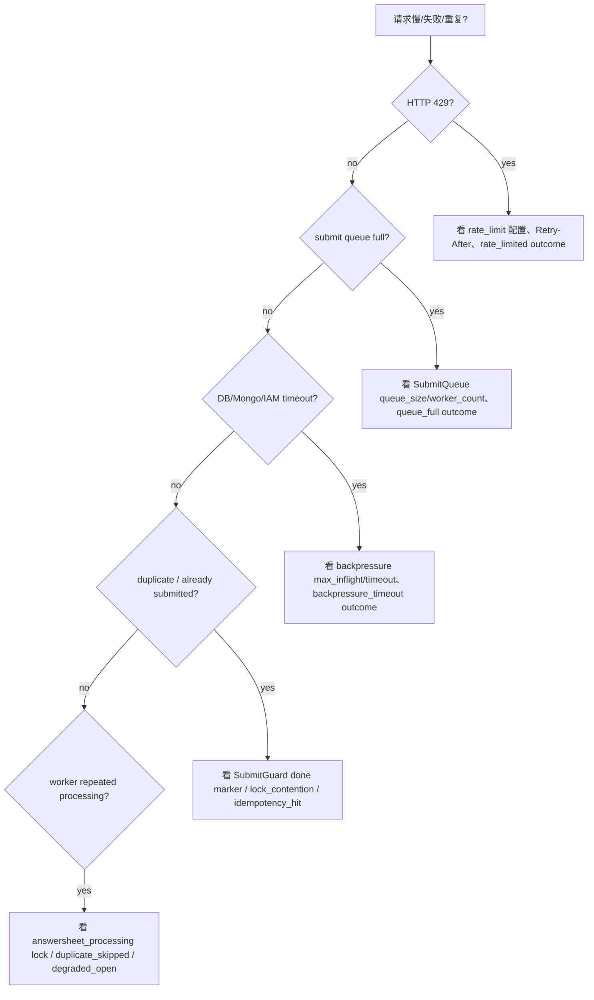
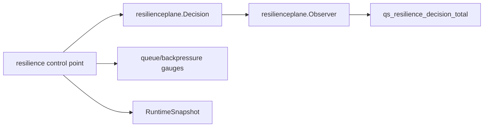

# Resilience 观测、降级与排障

**本文回答**：遇到 `429`、队列满、下游等待超时、重复提交、worker 重复处理时，应该从哪些 outcome 和源码开始查。

## 30 秒结论

| outcome | 说明 |
| ------- | ---- |
| `rate_limited` | HTTP 入口被限流 |
| `degraded_open` | Redis limiter 或 duplicate gate 失败后放行 |
| `queue_full` | SubmitQueue channel 已满 |
| `backpressure_timeout` | 等下游槽位超时 |
| `lock_contention` | Redis lease 被其他实例持有 |
| `idempotency_hit` | SubmitGuard 命中 done marker |
| `duplicate_skipped` | worker best-effort gate 跳过重复事件 |
| `queue_status_cleaned` | SubmitQueue 状态 TTL 清理了过期 request status |

## 排障决策树



## 观测模型



`resilienceplane.Subject` 只允许 bounded labels：`component / scope / resource / strategy`。不要把 user ID、request ID、lock key、error message 放入 label。

关键保护点优先通过构造参数或 package-local hooks 注入 `resilienceplane.Observer`；默认生产路径仍使用 Prometheus observer。完整能力与 outcome 对照见 [07-能力矩阵](./07-能力矩阵.md)。

## Prometheus 指标

| 指标 | 说明 | 主要 labels |
| ---- | ---- | ----------- |
| `qs_resilience_decision_total` | 所有保护决策 outcome counter | `kind/component/scope/resource/strategy/outcome` |
| `qs_resilience_queue_depth` | SubmitQueue 当前 channel depth | `component/scope/resource/strategy` |
| `qs_resilience_queue_status_total` | SubmitQueue 当前状态计数 snapshot | `component/scope/status` |
| `qs_resilience_backpressure_inflight` | Backpressure 当前占用槽位 | `component/scope/resource/strategy` |
| `qs_resilience_backpressure_wait_duration_seconds` | 等待背压槽位耗时 histogram | `component/scope/resource/strategy/outcome` |

Recording rules 与告警位于 infra 仓库 `components/prometheus/rules/qs-resilience-plane.yml`，Grafana dashboard UID 固定为 `resilience-overview`、`resilience-ratelimit`、`resilience-submitqueue`、`resilience-backpressure`、`resilience-locks`。

## 只读状态入口

| 组件 | Endpoint | 展示内容 |
| ---- | -------- | -------- |
| apiserver | `GET /internal/v1/resilience/status` | REST rate limit、MySQL/Mongo/IAM backpressure、scheduler leader lock capability |
| collection-server | `GET /governance/resilience` | rate limit mode、SubmitQueue depth/status/TTL、SubmitGuard capability |
| worker | `GET /governance/resilience` | duplicate suppression 和 answersheet processing lock capability |

operating 平台聚合三进程 endpoint 作为“当前摘要”；Prometheus/Grafana 负责趋势和告警。endpoint 只返回 bounded capability/status，不返回 request ID、user ID、lock key，也不提供 Stop/Drain/Replay/Repair。

## PromQL 示例

```promql
sum by (component, scope, resource, outcome) (qs:resilience_rate_limit:rate5m)
qs:resilience_queue_depth:current
qs:resilience_queue_status:current{status="failed"}
qs:resilience_backpressure_inflight:current
qs:resilience_backpressure_wait:p95{outcome="backpressure_acquired"}
sum by (component, scope, outcome) (qs:resilience_lock:rate5m)
```

## Verify

```bash
go test ./internal/pkg/resilienceplane
go test ./internal/pkg/backpressure ./internal/collection-server/application/answersheet
python scripts/check_docs_hygiene.py
```
