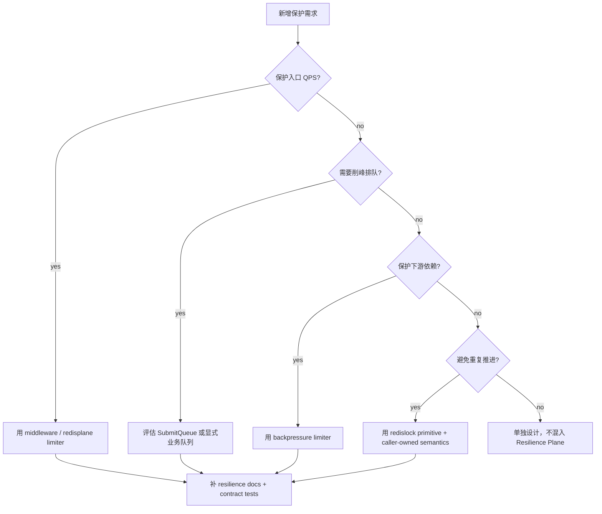

# 新增高并发治理能力 SOP

**本文回答**：新增限流、队列、背压、锁或降级策略时，应该如何决策、改哪些代码、补哪些测试和文档。

## 30 秒结论

新增能力前先回答两个问题：

1. 这是入口保护、依赖保护、重复抑制，还是降级策略？
2. 它改变外部行为吗？例如 HTTP status、重试、幂等、队列状态、Redis key。

## 决策树



## 代码步骤

1. 先补 contract test，锁住当前外部语义。
2. 如果新增观测，只通过 [`resilienceplane.Observer`](../../../internal/pkg/resilienceplane/) 上报 bounded outcome。
3. 如果新增 Redis lock spec，必须在 [`redislock.Specs`](../../../internal/pkg/redislock/spec.go) 写清 `Name / Description / DefaultTTL`。
4. 如果新增队列状态或降级分支，必须写明对 HTTP status、重试、状态查询的影响。
5. 如果要改 component-base primitive，先在 component-base 补 contract tests，再同步 qs-server 依赖版本。

## 测试清单

| 能力 | 必补测试 |
| ---- | -------- |
| Rate limit | `RateLimitDecision` allow/limited、Retry-After、Redis unavailable fallback |
| Queue | accepted、full、duplicate request_id、failed reuse、TTL cleanup |
| Backpressure | nil limiter、acquire、timeout、release |
| Redis lock | invalid spec、contention、wrong-token release、TTL expiry |
| Duplicate suppression | locked executes、contention skip、degraded continue |
| Docs | `scripts/check_docs_hygiene.py` |

## Verify

```bash
go test ./internal/pkg/resilienceplane ./internal/pkg/middleware ./internal/pkg/backpressure ./internal/pkg/redislock ./internal/pkg/redisplane
go test ./internal/collection-server/... ./internal/apiserver/... ./internal/worker/...
python scripts/check_docs_hygiene.py
```
