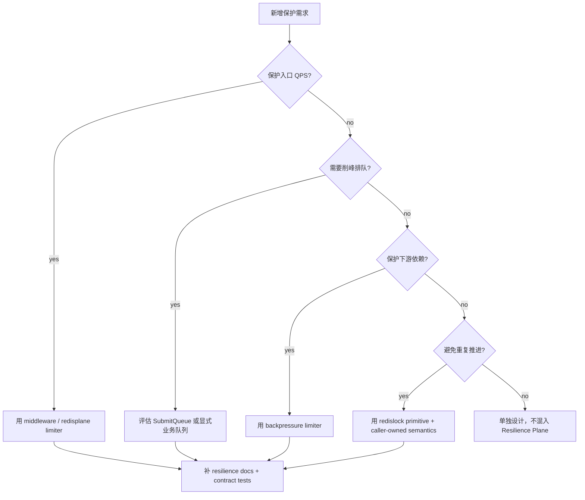

# 新增高并发治理能力 SOP

**本文回答**：新增限流、队列、背压、锁或降级策略时，应该如何决策、改哪些代码、补哪些测试和文档。

## 30 秒结论

新增能力前先回答两个问题：

1. 这是入口保护、依赖保护、重复抑制，还是降级策略？
2. 它改变外部行为吗？例如 HTTP status、重试、幂等、队列状态、Redis key。

## 决策树



## 代码步骤

1. 先补 contract test，锁住当前外部语义。
2. 补或复用模型 / adapter，例如 `RateLimitDecision`、`SubmitQueue`、`backpressure.Acquirer`、`redislock.Spec`、`IdempotencyGuard` 或 `DuplicateSuppressionGate`。
3. 如果新增观测，只通过 [`resilienceplane.Observer`](../../../internal/pkg/resilienceplane/) 上报 bounded outcome；label 必须保持 bounded。
4. 如果新增 Redis lock spec，必须在 [`redislock.Specs`](../../../internal/pkg/redislock/spec.go) 写清 `Name / Description / DefaultTTL`。
5. 如果新增队列状态或降级分支，必须写明对 HTTP status、重试、状态查询、Redis key 或进程退出语义的影响。
6. 如果要改 component-base primitive，先在 component-base 补 contract tests，再同步 qs-server 依赖版本；不要把 qs-server 业务 Resilience 语义上移到 component-base。
7. 如果新增保护能力，必须更新 [07-能力矩阵](./07-能力矩阵.md)，并更新对应深讲文档的代码锚点与测试锚点。

## 文档维护清单

新增保护点合入前必须确认：

| 项目 | 要求 |
| ---- | ---- |
| 模型 / Adapter | 能从文档回链到源码，例如 `internal/pkg/ratelimit` 或 `internal/pkg/backpressure` |
| Contract tests | 覆盖成功、拒绝、错误、降级或竞争路径 |
| Outcome | 使用 `resilienceplane` 受控枚举，不新增散落 Prometheus label |
| 深讲文档 | 对应 `01-05` 文档说明边界、时序和 Verify |
| 能力矩阵 | `07-能力矩阵.md` 增加或更新保护点、primitive、降级语义、测试锚点 |
| Hygiene | `python scripts/check_docs_hygiene.py` 和 `git diff --check` 通过 |

## 测试清单

| 能力 | 必补测试 |
| ---- | -------- |
| Rate limit | `RateLimitDecision` allow/limited、Retry-After、Redis unavailable fallback |
| Queue | accepted、full、duplicate request_id、failed reuse、TTL cleanup |
| Backpressure | nil limiter、acquire、timeout、release |
| Redis lock | invalid spec、contention、wrong-token release、TTL expiry |
| Duplicate suppression | locked executes、contention skip、degraded continue |
| Docs | `scripts/check_docs_hygiene.py` |

## Verify

```bash
go test ./internal/pkg/resilienceplane ./internal/pkg/middleware ./internal/pkg/backpressure ./internal/pkg/redislock ./internal/pkg/redisplane
go test ./internal/collection-server/... ./internal/apiserver/... ./internal/worker/...
python scripts/check_docs_hygiene.py
```
