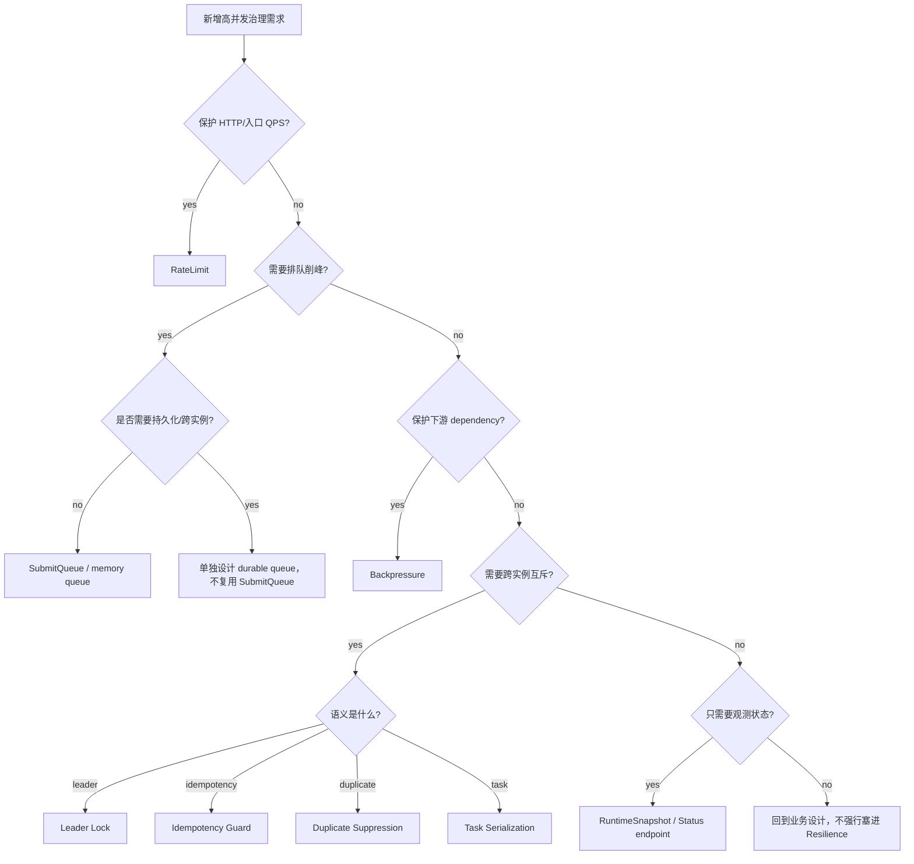

# 新增高并发治理能力 SOP

**本文回答**：在 qs-server 中新增限流、队列、背压、锁、幂等、重复抑制、降级策略或只读治理状态时，应该如何判断能力类型、外部行为、落代码位置、outcome、metrics、degraded 策略、测试和文档；避免 Resilience Plane 变成散点保护逻辑。

---

## 30 秒结论

新增高并发治理能力按这条顺序执行：

```text
识别保护问题
  -> 判断能力类型
  -> 明确外部行为
  -> 选择 primitive / adapter
  -> 定义 outcome + low-cardinality subject
  -> 定义 degraded 策略
  -> 定义 status snapshot
  -> 补测试
  -> 更新文档和能力矩阵
```

| 新增能力 | 首选入口 | 必须先回答 |
| -------- | -------- | ---------- |
| 入口限流 | `ratelimit` + `middleware.LimitWithLimiter` | 超限返回 429 还是其它语义？ |
| 提交削峰 | `SubmitQueue` 或独立业务队列设计 | 是否需要 durable queue？进程退出是否 drain？ |
| 下游背压 | `backpressure.Acquirer` | 保护哪个 dependency？maxInflight 和 timeout 如何定？ |
| 分布式锁 | `locklease.Specs` + 调用方语义 | contention 是 skip、busy、duplicate 还是 error？ |
| 幂等保护 | done marker + in-flight lock + 业务持久化幂等 | 完成结果在哪里存？失败如何恢复？ |
| 重复抑制 | package-local gate | 重复事件能否安全跳过？Redis 失败是否 degraded-open？ |
| 状态观测 | `resilienceplane.RuntimeSnapshot` | 是否只读？是否暴露高基数字段？ |
| 新 outcome | `resilienceplane.Outcome` | 是否 bounded？是否会污染指标？ |

一句话原则：

> **先定义语义，再选择 primitive；不要为了“看起来高并发”而新增保护点。**

---

## 1. 新增前先问 12 个问题

| 问题 | 为什么重要 |
| ---- | ---------- |
| 保护的是入口、队列、下游、锁、幂等还是重复事件？ | 决定能力类型 |
| 它改变外部行为吗？ | 影响 HTTP status、重试、状态查询 |
| 被拒绝时返回什么？ | 429 / error / skip / duplicate / accepted |
| Redis 或下游不可用时怎么办？ | degraded-open / fail-closed / skip |
| 这个能力是进程内还是跨实例？ | 决定 local / Redis / MQ / DB |
| 是否需要 durable 语义？ | SubmitQueue 不够，要重新设计 |
| 是否需要业务幂等兜底？ | lock 不能单独保证正确性 |
| 是否有低基数 outcome？ | 进入 Prometheus 前必须稳定 |
| 是否需要 status snapshot？ | operating/Grafana 需要看到状态 |
| 是否需要配置项？ | 运维容量调整需要配置 |
| 是否有明确测试边界？ | contention/degraded/timeout 都要测 |
| 文档和能力矩阵是否同步？ | 防漂移 |

如果这些问题答不清，不要先写代码。

---

## 2. 决策树



---

## 3. 外部行为变更门禁

新增能力前必须确认是否改变外部行为。

### 3.1 可能改变的行为

| 行为 | 示例 |
| ---- | ---- |
| HTTP status | 200 -> 202、200 -> 429、500 -> 503 |
| Retry 语义 | 是否返回 Retry-After |
| 幂等语义 | 相同 key 返回已有结果 |
| 状态查询 | 是否新增 queued/processing/done |
| 错误码 | ResourceExhausted / TooManyRequests |
| 进程退出行为 | 是否 drain |
| Redis key | 是否新增 lock/done/version key |
| metrics labels | 是否新增 subject/outcome |
| SLA | 排队等待导致响应模型变化 |

### 3.2 外部行为改变必须补

- API 文档。
- handler tests。
- frontend/operating 约定。
- docs。
- 能力矩阵。
- 回滚策略。

---

## 4. 新增 RateLimit

### 4.1 适用场景

适合：

- HTTP 入口 QPS 保护。
- 全局请求速率控制。
- per user/IP/org 入口保护。
- 长轮询入口保护。
- 公开接口防突发。

不适合：

- 下游 DB 慢。
- 重复提交。
- 后台任务串行。
- 幂等。
- 业务权限。

### 4.2 实施步骤

1. 定义 scope。
2. 定义 resource：global / user / request。
3. 定义 strategy：local / local_key / redis。
4. 定义 RatePerSecond / Burst。
5. 选择 LocalLimiter / KeyedLocalLimiter / DistributedLimiter。
6. 使用 `LimitWithLimiter` 或已有 route helper。
7. 明确 Redis backend 不可用是否 degraded-open。
8. 确认返回 429 + Retry-After。
9. 补 middleware/router tests。
10. 更新文档和能力矩阵。

### 4.3 必测项

| 测试 | 必须 |
| ---- | ---- |
| allowed | ☐ |
| rate_limited | ☐ |
| Retry-After >= 1 | ☐ |
| keyFn 生效 | ☐ |
| limiter nil 行为 | ☐ |
| Redis backend error / degraded_open | ☐ |
| resilience outcome | ☐ |

---

## 5. 新增 Queue / 削峰能力

### 5.1 先判断是否能用 SubmitQueue

SubmitQueue 只适合：

- collection-server 本进程。
- 前台答卷提交削峰。
- 内存队列。
- 202 + request_id。
- 允许进程退出不 drain。
- 后端有 durable submit 兜底。

如果需求需要：

- 跨实例共享队列。
- 持久化任务。
- Ack/Nack。
- retry。
- DLQ。
- 进程重启恢复。
- visibility timeout。

不要复用 SubmitQueue，要单独设计 MQ/DB queue。

### 5.2 新增内存队列步骤

1. 定义业务入口和状态机。
2. 定义 queue capacity。
3. 定义 worker count。
4. 定义 status TTL。
5. 定义满队行为。
6. 定义进程退出边界。
7. 接入 resilience outcome。
8. 增加 QueueSnapshot。
9. 补 handler/status tests。
10. 更新文档。

### 5.3 必须写清生命周期

文档必须明确：

```text
是否 process_memory_no_drain
是否有 Stop/Drain/Close
是否跨实例共享状态
是否持久化恢复
```

不要让调用方误以为内存队列是 MQ。

---

## 6. 新增 Backpressure

### 6.1 适用场景

适合保护：

- MySQL。
- MongoDB。
- IAM gRPC。
- 第三方 SDK。
- 关键内部 gRPC。
- 高成本 read model 查询。
- 批处理重建。

不适合：

- 入口 QPS。
- 业务权限。
- 幂等。
- 长任务调度。
- exact once。

### 6.2 实施步骤

1. 定义 dependency name。
2. 增加配置项：enabled/maxInflight/timeoutMs。
3. 在 process/resource bootstrap 构建 limiter。
4. 加入 container runtime options。
5. 显式注入 infra adapter。
6. 在操作前 `Acquire(ctx)`。
7. `defer release()`。
8. 增加 BackpressureSnapshot。
9. 补 acquired/timeout/released tests。
10. 更新文档和能力矩阵。

### 6.3 必须写清

- timeout 是等待槽位超时。
- 不限制下游执行时长。
- nil limiter 是 no-op。
- maxInflight 不是 DB 连接池大小。
- 慢 SQL/IAM 慢仍要单独排查。

---

## 7. 新增 LockLease 场景

### 7.1 先判断语义

必须先判断：

| 类型 | 语义 |
| ---- | ---- |
| leader | 多实例只一个执行 |
| idempotency | 完成结果复用 + 进行中抑制 |
| duplicate_suppression | 重复事件跳过 |
| task_serialization | 同一任务/窗口串行 |
| mutual_exclusion | 短临界区排他 |

不同语义不能混用。

### 7.2 实施步骤

1. 判断是否已有 LockSpec 可复用。
2. 如需新增，在 `locklease.Specs` 增加 Spec。
3. 定义 name、description、default TTL。
4. 定义 raw key 格式。
5. 使用 `AcquireSpec / ReleaseSpec`。
6. 明确 contention 行为。
7. 明确 Redis error 行为。
8. 明确 DB/业务幂等兜底。
9. 接入 resilience outcome。
10. 补 tests/docs。

### 7.3 必测项

| 测试 | 必须 |
| ---- | ---- |
| acquired | ☐ |
| contention | ☐ |
| release | ☐ |
| release wrong token | ☐ |
| acquire error | ☐ |
| TTL 合理性 | ☐ |
| degraded 策略 | ☐ |

---

## 8. 新增 Idempotency Guard

### 8.1 适用场景

适合：

- 同一个业务 key 重复提交。
- 已完成结果需要复用。
- 进行中请求需要返回 busy。
- 结果可通过 done marker 保存短 TTL。
- 后端有 durable 幂等兜底。

### 8.2 实施步骤

1. 定义幂等 key 来源。
2. 定义 done marker key。
3. 定义 done marker TTL。
4. 定义 in-flight lock key。
5. Begin：先查 done，再抢 lock。
6. Complete：写 done，再 release。
7. Abort：release，不写 done。
8. 明确 Redis error 策略。
9. 明确已有结果返回结构。
10. 补 tests/docs。

### 8.3 不要只靠 Redis

必须有持久化兜底：

- DB unique。
- Mongo idempotency collection。
- 状态机。
- durable submit。
- outbox event_id。

---

## 9. 新增 Duplicate Suppression

### 9.1 适用场景

适合：

- MQ at-least-once 重投。
- 多 worker 并发处理同一事件。
- 同一业务 ID 的重复副作用可安全跳过。
- 下游有幂等兜底。

### 9.2 实施步骤

1. 确认重复来源。
2. 定义 lock key。
3. 选择 LockSpec。
4. contention -> duplicate_skipped 还是 error。
5. Redis error -> degraded-open 还是 fail-closed。
6. 明确 handler 返回 nil/error 对 Ack/Nack 的影响。
7. 下游幂等验证。
8. 补 tests/docs。

### 9.3 特别注意

如果 duplicate gate 返回 nil，消息通常会 Ack。

必须确认：

```text
另一个 worker 正在处理，或者重复事件可安全丢弃
```

否则会造成漏处理。

---

## 10. 新增 Degraded 策略

### 10.1 先分类

| 策略 | 含义 | 适用 |
| ---- | ---- | ---- |
| degraded-open | 保护点不可用但放行 | 主链路可用性优先 |
| fail-closed | 保护点不可用则拒绝 | 安全/一致性优先 |
| skip | 当前 tick/任务不执行 | scheduler/background |
| fallback-local | 分布式能力降级到本地能力 | Redis limiter |
| no-op | 能力关闭时跳过 | 可选观测/缓存 |

### 10.2 必须写进文档

每个 degraded 策略必须说明：

- 为什么这样选。
- 风险是什么。
- 由什么兜底。
- 如何观测。
- 持续多久需要告警。

---

## 11. 新增 RuntimeSnapshot / Status

### 11.1 适用场景

新增能力如果有当前状态，应进入 RuntimeSnapshot。

例如：

- queue depth。
- queue capacity。
- status counts。
- backpressure in-flight。
- limiter configured/degraded。
- lock capability。
- idempotency capability。
- duplicate suppression capability。

### 11.2 状态接口原则

必须：

- 只读。
- bounded。
- 不返回 requestID 列表。
- 不返回 userID。
- 不返回 raw lock key。
- 不返回 raw Redis key。
- 不提供 destructive action。

### 11.3 禁止顺手加操作

不要在 status endpoint 里顺手加：

- release lock。
- drain queue。
- delete status。
- retry failed。
- replay event。
- repair data。
- dynamic config。

这些需要独立治理设计。

---

## 12. 新增 Outcome

### 12.1 什么时候新增

只有现有 outcome 无法表达新决策时才新增。

新增前先看是否可复用：

- allowed。
- rate_limited。
- degraded_open。
- queue_full。
- backpressure_timeout。
- lock_contention。
- duplicate_skipped。
- idempotency_hit。

### 12.2 新增步骤

1. 在 `resilienceplane.Outcome` 增加枚举。
2. 更新 tests。
3. 更新 05-观测降级与排障。
4. 更新 07-能力矩阵。
5. 更新 dashboards/alerts。
6. 确认 outcome 名称低基数、稳定、非业务 ID。

---

## 13. Observability 要求

### 13.1 Decision

每个保护点都应上报：

```text
resilienceplane.Observe(ctx, observer, kind, subject, outcome)
```

subject 必须是低基数：

```text
component
scope
resource
strategy
```

### 13.2 Metrics

如果是 queue：

- queue_depth。
- queue_status_total。

如果是 backpressure：

- in_flight。
- wait_duration。

如果只是 decision：

- qs_resilience_decision_total。

### 13.3 不允许

禁止把以下内容放入 metrics label：

- userID。
- requestID。
- lockKey。
- answerSheetID。
- raw URL。
- raw error。
- client IP。
- token。

---

## 14. 测试矩阵

| 能力 | 必测路径 |
| ---- | -------- |
| RateLimit | allow、limited、Retry-After、degraded-open |
| Queue | accepted、full、duplicate、failed、TTL cleanup、snapshot |
| Backpressure | nil limiter、acquire、timeout、release、snapshot |
| Leader | acquired executes、contention skip、acquire error、release error |
| Idempotency | done hit、lock acquired、contention、complete、abort、Redis error |
| Duplicate | lock acquired executes、contention skip、degraded-open |
| Status | bounded snapshot、ready/degraded、no high-cardinality fields |
| Metrics | labels bounded、outcome 正确 |
| Docs | docs hygiene、能力矩阵更新 |

---

## 15. 文档同步矩阵

| 变更 | 至少同步 |
| ---- | -------- |
| 新限流 | [01-RateLimit入口限流.md](./01-RateLimit入口限流.md) |
| 新队列/削峰 | [02-SubmitQueue提交削峰.md](./02-SubmitQueue提交削峰.md) |
| 新背压 | [03-Backpressure下游背压.md](./03-Backpressure下游背压.md) |
| 新锁/幂等/去重 | [04-LockLease幂等与重复抑制.md](./04-LockLease幂等与重复抑制.md) |
| 新 outcome/metrics/degraded | [05-观测降级与排障.md](./05-观测降级与排障.md) |
| 新保护点 | [07-能力矩阵.md](./07-能力矩阵.md) |
| 新 REST 行为 | 接口与运维文档 |
| 新 Redis lock/family | `../redis/` 对应文档 |
| 新业务幂等 | 对应业务模块文档 |

---

## 16. 合并前检查清单

| 检查项 | 是否完成 |
| ------ | -------- |
| 已识别能力类型 | ☐ |
| 已明确外部行为是否变化 | ☐ |
| 已明确拒绝/失败响应 | ☐ |
| 已明确 degraded 策略 | ☐ |
| 已明确是否跨实例 | ☐ |
| 已明确是否 durable | ☐ |
| 已明确业务幂等兜底 | ☐ |
| 已定义 ProtectionKind / Outcome / Subject | ☐ |
| metrics label 无高基数字段 | ☐ |
| 已补 RuntimeSnapshot，如需要 | ☐ |
| 已补 tests | ☐ |
| 已更新深讲文档 | ☐ |
| 已更新能力矩阵 | ☐ |

---

## 17. 反模式

| 反模式 | 后果 |
| ------ | ---- |
| 用 Redis lock 代替 DB 唯一约束 | 仍会重复写 |
| 把 SubmitQueue 当 MQ | 重启丢任务 |
| Backpressure timeout 当 DB timeout | 排错方向错误 |
| Lock contention 一律报错 | 多实例正常竞争被误判 |
| degraded-open 不告警 | 保护点长期失效不可见 |
| metrics label 放 userID/requestID | Prometheus 高基数爆炸 |
| 状态接口返回 raw lock key | 安全和高基数风险 |
| 顺手加 release lock API | 破坏性操作缺乏治理 |
| 新增 outcome 不更新矩阵 | 文档漂移 |
| 把 component-base primitive 扩成业务框架 | 复用层污染业务语义 |

---

## 18. Verify 命令

基础：

```bash
go test ./internal/pkg/resilienceplane
go test ./internal/pkg/middleware
go test ./internal/pkg/backpressure
go test ./internal/pkg/locklease
```

Collection：

```bash
go test ./internal/collection-server/application/answersheet
go test ./internal/collection-server/infra/redisops
go test ./internal/collection-server/transport/rest/handler
```

Apiserver：

```bash
go test ./internal/apiserver/runtime/scheduler
go test ./internal/apiserver/process
go test ./internal/apiserver/container
```

Worker：

```bash
go test ./internal/worker/handlers
```

Docs：

```bash
make docs-hygiene
git diff --check
```

---

## 19. 代码锚点

- Resilience model：[../../../internal/pkg/resilienceplane/model.go](../../../internal/pkg/resilienceplane/model.go)
- Resilience status：[../../../internal/pkg/resilienceplane/status.go](../../../internal/pkg/resilienceplane/status.go)
- Resilience metrics：[../../../internal/pkg/resilienceplane/prometheus.go](../../../internal/pkg/resilienceplane/prometheus.go)
- RateLimit middleware：[../../../internal/pkg/middleware/limit.go](../../../internal/pkg/middleware/limit.go)
- SubmitQueue：[../../../internal/collection-server/application/answersheet/submit_queue.go](../../../internal/collection-server/application/answersheet/submit_queue.go)
- Backpressure limiter：[../../../internal/pkg/backpressure/limiter.go](../../../internal/pkg/backpressure/limiter.go)
- LockLease：[../../../internal/pkg/locklease/](../../../internal/pkg/locklease/)
- SubmitGuard：[../../../internal/collection-server/infra/redisops/submit_guard.go](../../../internal/collection-server/infra/redisops/submit_guard.go)
- Worker duplicate gate：[../../../internal/worker/handlers/answersheet_handler.go](../../../internal/worker/handlers/answersheet_handler.go)

---

## 20. 下一跳

| 目标 | 文档 |
| ---- | ---- |
| 能力矩阵 | [07-能力矩阵.md](./07-能力矩阵.md) |
| 观测降级排障 | [05-观测降级与排障.md](./05-观测降级与排障.md) |
| RateLimit 入口限流 | [01-RateLimit入口限流.md](./01-RateLimit入口限流.md) |
| SubmitQueue 提交削峰 | [02-SubmitQueue提交削峰.md](./02-SubmitQueue提交削峰.md) |
| Backpressure 下游背压 | [03-Backpressure下游背压.md](./03-Backpressure下游背压.md) |
| LockLease 幂等与重复抑制 | [04-LockLease幂等与重复抑制.md](./04-LockLease幂等与重复抑制.md) |
