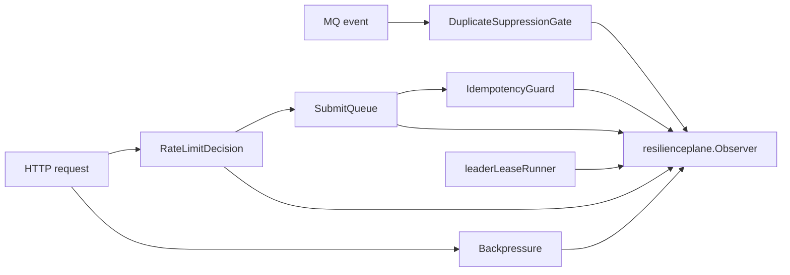

# Resilience Plane 能力矩阵

**本文回答**：当前高并发治理能力分别保护什么、使用什么模型和 primitive、失败时如何降级、应该看哪些 outcome 和测试。

## 30 秒结论

| 能力 | 保护点 | 模型 / Adapter | Primitive | 降级或失败语义 | 关键 outcome / status | 测试锚点 |
| ---- | ------ | -------------- | --------- | -------------- | --------------------- | -------- |
| Rate Limit | HTTP 入口突发流量 | [`ratelimit.RateLimitDecision`](../../../internal/pkg/ratelimit/model.go) + Gin adapter | local token bucket / Redis token bucket | collection Redis limiter fail-open；apiserver 保持本地限流 | `allowed` / `rate_limited` / `degraded_open` | [`internal/pkg/ratelimit`](../../../internal/pkg/ratelimit/) |
| SubmitQueue | collection 答卷提交削峰 | [`SubmitQueue`](../../../internal/collection-server/application/answersheet/submit_queue.go) | memory channel + worker goroutine | 队列满返回 `ErrQueueFull`；无 shutdown/drain；不跨实例恢复 | `queue_accepted` / `queue_full` / `queue_processing` / `queue_done` / `queue_failed` / `queue_status_cleaned`；`qs_resilience_queue_depth` | [`answersheet`](../../../internal/collection-server/application/answersheet/) |
| Backpressure | apiserver 下游 MySQL/Mongo/IAM | [`backpressure.Acquirer`](../../../internal/pkg/backpressure/limiter.go) | bounded semaphore | nil limiter no-op；等待槽位超时返回 error；不限制下游执行时长 | `backpressure_acquired` / `backpressure_timeout` / `backpressure_released`；`in_flight` / wait p95 | [`internal/pkg/backpressure`](../../../internal/pkg/backpressure/) |
| Scheduler Leader Lock | 多实例 scheduler 单 leader | package-local `leaderLeaseRunner` | [`redislock.Manager`](../../../internal/pkg/redislock/) | 抢不到锁跳过本轮；释放失败只记录日志 | `lock_acquired` / `lock_contention` / `lock_released` / `lock_error` | [`runtime/scheduler`](../../../internal/apiserver/runtime/scheduler/) |
| Submit Idempotency | collection 跨实例提交幂等 | [`IdempotencyGuard`](../../../internal/collection-server/application/answersheet/submission_service.go) + [`SubmitGuard`](../../../internal/collection-server/infra/redisops/submit_guard.go) | Redis lease + done marker | done marker 命中返回已有 ID；锁竞争返回 ResourceExhausted；Redis 不可用 fail-open | `lock_acquired` / `lock_contention` / `idempotency_hit` / `degraded_open` | [`redisops`](../../../internal/collection-server/infra/redisops/) |
| Worker Duplicate Suppression | worker 重复消费同一答卷事件 | [`DuplicateSuppressionGate`](../../../internal/worker/handlers/answersheet_handler.go) | Redis lease | Redis 不可用 degraded-continue；锁竞争 skip | `duplicate_skipped` / `degraded_open` | [`worker/handlers`](../../../internal/worker/handlers/) |
| MQ Consumer Backpressure | worker 消费并发 | component-base NSQ `MaxInFlight` | MQ consumer primitive | 不保证 exactly-once；业务侧通过幂等和重复抑制控制风险 | 事件系统 outcome，不归入 `resilienceplane` | [`worker/integration/messaging`](../../../internal/worker/integration/messaging/) |

## 只读状态与 Dashboard

| 能力 | 当前状态来源 | 历史趋势 |
| ---- | ------------ | -------- |
| Rate Limit | apiserver / collection `RuntimeSnapshot.rate_limits` | Grafana `resilience-ratelimit` |
| SubmitQueue | collection `RuntimeSnapshot.queues` | Grafana `resilience-submitqueue` |
| Backpressure | apiserver `RuntimeSnapshot.backpressure` | Grafana `resilience-backpressure` |
| Redis Lock / 幂等 / 重复抑制 | 三进程 `RuntimeSnapshot.locks/idempotency/duplicate_suppression` | Grafana `resilience-locks` |
| 全局摘要 | operating `/operations/resilience-governance` 聚合三进程 endpoint | Grafana `resilience-overview` |

## 总图



## 稳定边界

- `resilienceplane` 只承接 bounded outcome 和 observer，不实现限流、队列、背压或锁。
- component-base 只提供 Redis lease、messaging Ack/Nack、NSQ `MaxInFlight` 等 primitive，不拥有 qs-server 业务 Resilience 语义。
- SubmitQueue 是本进程 memory channel；它没有 durable queue、cross-instance status、shutdown drain 能力。
- 三类 Redis lock 语义保持分离：leader lock、idempotency guard、best-effort duplicate suppression。

## Verify

```bash
go test ./internal/pkg/ratelimit ./internal/pkg/resilienceplane ./internal/pkg/backpressure ./internal/pkg/redislock ./internal/pkg/redisplane
go test ./internal/collection-server/application/answersheet ./internal/collection-server/infra/redisops ./internal/worker/handlers ./internal/apiserver/runtime/scheduler
```
