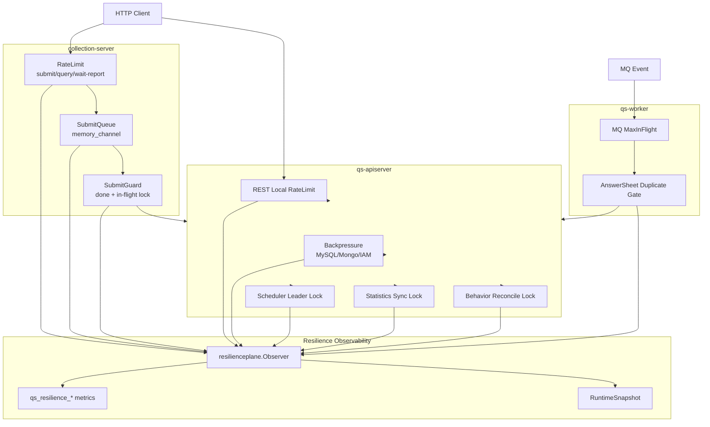

# Resilience Plane 能力矩阵

**本文回答**：qs-server 当前所有高并发治理保护点分别保护什么、运行在哪个进程、使用什么 primitive、拒绝或竞争时如何表现、Redis/下游异常时如何降级、应该观察哪些 outcome / metrics / status，以及后续新增能力时如何避免语义混淆。

---

## 30 秒结论

| 能力 | 进程 | 保护点 | Primitive / Adapter | 失败或竞争语义 | 核心 outcome | 深讲文档 |
| ---- | ---- | ------ | ------------------- | -------------- | ------------ | -------- |
| RateLimit | apiserver / collection-server | HTTP 入口 QPS | local token bucket / Redis token bucket + Gin middleware | 超限返回 429；Redis limiter 可 degraded-open | `allowed` / `rate_limited` / `degraded_open` | [01-RateLimit入口限流.md](./01-RateLimit入口限流.md) |
| SubmitQueue | collection-server | 答卷提交削峰 | memory channel + worker pool | 满队返回 `ErrQueueFull` / HTTP 429；进程退出不 drain | `queue_accepted` / `queue_full` / `queue_done` / `queue_failed` | [02-SubmitQueue提交削峰.md](./02-SubmitQueue提交削峰.md) |
| Backpressure | apiserver | MySQL/Mongo/IAM in-flight | bounded semaphore via `backpressure.Acquirer` | 等槽位超时返回 error；nil limiter no-op | `backpressure_acquired` / `backpressure_timeout` / `backpressure_released` | [03-Backpressure下游背压.md](./03-Backpressure下游背压.md) |
| Scheduler Leader Lock | apiserver | 多实例 scheduler 单 leader | `locklease.Manager` + leader runner | 抢不到锁 skip 本轮；release 失败只记录 | `lock_acquired` / `lock_contention` / `lock_released` / `lock_error` | [04-LockLease幂等与重复抑制.md](./04-LockLease幂等与重复抑制.md) |
| Statistics Sync Lock | apiserver | 统计同步任务串行化 | `locklease.Specs.StatisticsSync` | 同一 org/window 任务 busy/skip | `lock_acquired` / `lock_contention` / `lock_error` | [04-LockLease幂等与重复抑制.md](./04-LockLease幂等与重复抑制.md) |
| Behavior Reconcile Lock | apiserver | pending behavior reconcile 串行化 | `locklease.Specs.BehaviorPendingReconcile` | 抢不到通常 skip，下轮再跑 | `lock_acquired` / `lock_contention` / `lock_error` | [04-LockLease幂等与重复抑制.md](./04-LockLease幂等与重复抑制.md) |
| SubmitGuard | collection-server | 跨实例提交幂等 / 进行中抑制 | done marker + in-flight Redis lease | done 命中复用结果；lock contention 表示进行中 | `idempotency_hit` / `lock_acquired` / `lock_contention` / `degraded_open` | [04-LockLease幂等与重复抑制.md](./04-LockLease幂等与重复抑制.md) |
| Worker Duplicate Suppression | worker | 重复 `answersheet.submitted` 处理抑制 | Redis lease gate | contention 时跳过并 Ack；Redis 异常 degraded-open | `duplicate_skipped` / `degraded_open` | [04-LockLease幂等与重复抑制.md](./04-LockLease幂等与重复抑制.md) |
| MQ Consumer Concurrency | worker | MQ 消费并发 | NSQ MaxInFlight / worker concurrency | 只控制消费并发，不保证 exactly-once | 事件系统 outcome，不主要归入 resilienceplane | `../event/03-Worker消费与AckNack.md` |
| Runtime Status | 三进程 | 当前保护能力只读状态 | `resilienceplane.RuntimeSnapshot` | 只展示，不调参、不 drain、不 release | ready/degraded snapshot | [05-观测降级与排障.md](./05-观测降级与排障.md) |

一句话概括：

> **能力矩阵的价值是防止混淆：RateLimit 挡入口，SubmitQueue 削峰，Backpressure 保护下游，LockLease 做短期协调，幂等和重复抑制由调用方定义业务语义。**

---

## 1. 能力总图



---

## 2. 按进程归属

### 2.1 collection-server

| 能力 | 主要目标 | 说明 |
| ---- | -------- | ---- |
| Redis / local RateLimit | submit/query/wait-report 入口 | global + user/ip 双层限流 |
| SubmitQueue | 答卷提交削峰 | 进程内有界队列，202 + request_id |
| SubmitGuard | 跨实例提交幂等保护 | done marker + in-flight lock |
| Resilience Status | 当前状态只读快照 | `/governance/resilience` |

collection-server 的核心职责是：

```text
把用户提交入口削峰，避免突发流量直接打穿 apiserver。
```

### 2.2 qs-apiserver

| 能力 | 主要目标 | 说明 |
| ---- | -------- | ---- |
| Local RateLimit | REST 基础入口保护 | 当前不默认使用 distributed limiter |
| Backpressure | MySQL/Mongo/IAM | 限制下游 in-flight |
| Scheduler Leader Lock | plan/statistics/behavior scheduler | 多实例只一个执行 tick |
| Statistics Sync Lock | org/window/task 级同步串行 | 防重复 rebuild |
| Behavior Reconcile Lock | pending behavior reconcile | 防多实例重复处理 |
| Resilience Status | 当前状态只读快照 | `/internal/v1/resilience/status` |

apiserver 的核心职责是：

```text
保护主业务写模型、数据库、外部依赖和后台调度边界。
```

### 2.3 qs-worker

| 能力 | 主要目标 | 说明 |
| ---- | -------- | ---- |
| MQ MaxInFlight | 消费并发 | 来自 MQ provider / worker concurrency |
| Duplicate Suppression | answersheet submitted 重复处理 | Redis lock best-effort |
| Resilience Status | 当前状态只读快照 | `/governance/resilience` 或 metrics |

worker 的核心职责是：

```text
控制事件消费并发，降低重复事件导致的重复副作用。
```

---

## 3. 按 ProtectionKind 横向对比

| ProtectionKind | 代表能力 | 问题类型 | 典型拒绝/竞争结果 |
| -------------- | -------- | -------- | ---------------- |
| `rate_limit` | HTTP limiter | 请求太多 | 429 / Retry-After |
| `queue` | SubmitQueue | 突发提交削峰 | queue full / accepted / status |
| `backpressure` | MySQL/Mongo/IAM limiter | 下游 in-flight 太多 | wait timeout |
| `lock` | scheduler/statistics/reconcile lock | 多实例互斥 | contention skip / error |
| `idempotency` | SubmitGuard | 同 key 提交完成或进行中 | done result / in progress |
| `duplicate_suppression` | worker answersheet gate | 重复事件 | duplicate skipped / degraded-open |

---

## 4. Outcome 对照矩阵

| Outcome | 主要能力 | 正常/异常判断 | 下一步 |
| ------- | -------- | ------------- | ------ |
| `allowed` | RateLimit | 正常 | 无 |
| `rate_limited` | RateLimit | 保护生效 | 看 QPS/Burst/Retry-After |
| `degraded_open` | RateLimit / SubmitGuard / Worker gate | 风险信号 | 看 Redis/backend/lock manager |
| `queue_accepted` | SubmitQueue | 正常 | 看后续 processing/done |
| `queue_full` | SubmitQueue | 高压信号 | 看 queue depth、worker、下游 |
| `queue_duplicate` | SubmitQueue | 通常正常 | 看 requestID 重复提交 |
| `queue_processing` | SubmitQueue | 正常 | 若长期卡住查 submitWithGuard |
| `queue_done` | SubmitQueue | 正常 | 无 |
| `queue_failed` | SubmitQueue | 失败信号 | 查 gRPC/payload/IAM/guard |
| `queue_status_cleaned` | SubmitQueue | 正常清理或轮询过慢 | 看 status TTL |
| `backpressure_acquired` | Backpressure | 正常 | 若请求慢，查下游执行 |
| `backpressure_timeout` | Backpressure | 高压信号 | 查 in_flight/max/downstream |
| `backpressure_released` | Backpressure | 正常 | 无 |
| `lock_acquired` | Lock/Idempotency | 正常 | 无 |
| `lock_contention` | Lock/Idempotency | 取决于场景 | leader 正常 skip；submit 表示进行中 |
| `lock_released` | Lock | 正常 | 无 |
| `lock_error` | Lock/Idempotency | 异常 | 查 Redis/namespace/token |
| `lock_degraded` | Lock | 异常 | 查 lock_lease family |
| `idempotency_hit` | SubmitGuard | 通常正常 | 复用已有 answerSheetID |
| `duplicate_skipped` | Worker gate | 通常正常 | 查 MQ 重投/并发 |

---

## 5. Primitive 对照

| Primitive | 使用方 | 能力边界 |
| --------- | ------ | -------- |
| Local token bucket | apiserver / collection fallback | 单进程 QPS 限流 |
| Redis token bucket | collection-server | 多实例共享入口限流 |
| Memory channel | SubmitQueue | 进程内削峰，不 durable |
| Worker goroutine pool | SubmitQueue | 控制后台提交并发 |
| Bounded semaphore | Backpressure | 控制下游 in-flight |
| Redis lease | LockLease / SubmitGuard / worker gate | 短期互斥，不 exactly-once |
| Done marker | SubmitGuard | 短期完成结果复用 |
| MQ MaxInFlight | worker | 消费并发，不处理幂等 |
| RuntimeSnapshot | 三进程 | 只读状态，不治理操作 |

---

## 6. Degraded / 失败语义矩阵

| 能力 | 故障类型 | 当前策略 | 风险 |
| ---- | -------- | -------- | ---- |
| Redis RateLimit | Redis backend 不可用 | degraded-open，放行 | 入口可能短暂超限 |
| Local RateLimit | limiter nil | 通常 limited 或直接放行，依 adapter | 配置错误影响入口 |
| SubmitQueue | queue nil | 返回错误 | 提交不可受理 |
| SubmitQueue | channel full | 返回 ErrQueueFull / 429 | 用户需重试 |
| SubmitQueue | process exit | 不 drain | 未处理 job 丢失 |
| Backpressure | limiter nil | no-op | 失去下游保护 |
| Backpressure | wait timeout | 返回 error | 请求失败但保护下游 |
| Leader Lock | contention | skip tick | 当前实例不执行本轮 |
| Leader Lock | acquire error | runner error 或 skip | 后台任务可能暂停 |
| SubmitGuard | done lookup error | 返回 error | 无法确认已完成 |
| SubmitGuard | lockMgr nil | degraded-open | 跨实例进行中抑制弱化 |
| Worker Gate | lock unavailable | degraded-open | 可能重复处理 |
| Worker Gate | contention | duplicate skipped | 若另一个 worker 失败可能依赖后续重投/幂等 |

---

## 7. 状态入口矩阵

| 能力 | RuntimeSnapshot 字段 | 关键字段 |
| ---- | ------------------- | -------- |
| RateLimit | `rate_limits` | name/kind/strategy/configured/degraded |
| SubmitQueue | `queues` | depth/capacity/status_counts/status_ttl_seconds/lifecycle_boundary |
| Backpressure | `backpressure` | dependency/max_inflight/in_flight/timeout_millis/degraded |
| Lock | `locks` | name/kind/strategy/configured/degraded/reason |
| Idempotency | `idempotency` | name/kind/strategy/configured/degraded |
| DuplicateSuppression | `duplicate_suppression` | name/kind/strategy/configured/degraded |

### 7.1 Ready 规则

`FinalizeRuntimeSnapshot` 会统计 capability_count 和 degraded_count。

只要 degraded_count > 0：

```text
summary.ready = false
```

但 ready=false 不代表业务完全不可用。它表示至少一个 resilience 保护点处于 degraded 状态。

---

## 8. Metrics 矩阵

| 能力 | 指标 | 用途 |
| ---- | ---- | ---- |
| 所有保护点 | `qs_resilience_decision_total` | outcome counter |
| SubmitQueue | `qs_resilience_queue_depth` | 当前队列深度 |
| SubmitQueue | `qs_resilience_queue_status_total` | 当前状态数量 |
| Backpressure | `qs_resilience_backpressure_inflight` | 当前占用槽位 |
| Backpressure | `qs_resilience_backpressure_wait_duration_seconds` | 等待槽位耗时 |

### 8.1 低基数 labels

允许：

```text
component
kind
scope
resource
strategy
outcome
status
```

禁止：

```text
requestID
userID
IP
answerSheetID
assessmentID
lockKey
cacheKey
raw error
```

---

## 9. 能力边界矩阵

| 能力 | 它不是 |
| ---- | ------ |
| RateLimit | 不是权限，不是幂等，不是下游保护 |
| SubmitQueue | 不是 MQ，不是 durable queue，不跨实例共享状态 |
| Backpressure | 不是 QPS 限流，不是 SQL timeout，不是连接池 |
| LockLease | 不是 exactly-once，不是 DB transaction，不是 fencing |
| SubmitGuard | 不是最终业务幂等，只是 collection 层保护 |
| DuplicateSuppression | 不是消息去重存储，不保证事件只处理一次 |
| MQ MaxInFlight | 不是 Resilience 幂等，只控制消费并发 |
| RuntimeSnapshot | 不是治理操作接口，只读 |

---

## 10. 保护链路矩阵

### 10.1 答卷提交链路

```text
RateLimit
  -> SubmitQueue
  -> SubmitGuard
  -> apiserver gRPC
  -> Mongo durable submit
  -> Event outbox
  -> Worker DuplicateSuppression
```

| 阶段 | 保护点 | 失败语义 |
| ---- | ------ | -------- |
| HTTP 入口 | RateLimit | 429 |
| 本地削峰 | SubmitQueue | queue full 429 |
| 跨实例提交 | SubmitGuard | already submitted / in progress |
| apiserver 持久化 | durable submit | 业务错误 / idempotency |
| 事件消费 | DuplicateSuppression | duplicate skipped / degraded-open |

### 10.2 Statistics 同步链路

```text
Scheduler leader lock
  -> StatisticsSync lock
  -> transaction
  -> backpressure MySQL
```

| 阶段 | 保护点 | 失败语义 |
| ---- | ------ | -------- |
| 多实例调度 | Leader lock | contention skip |
| 单任务串行 | StatisticsSync lock | busy/skip |
| DB 写入 | Backpressure + transaction | timeout/error |

### 10.3 Worker 消费链路

```text
MQ MaxInFlight
  -> event handler
  -> duplicate suppression
  -> internal gRPC
  -> apiserver idempotency / DB constraint
```

| 阶段 | 保护点 | 失败语义 |
| ---- | ------ | -------- |
| MQ 消费 | MaxInFlight | 控制并发 |
| 重复事件 | DuplicateSuppression | skip or degraded-open |
| 业务创建 | apiserver 幂等 | already exists / no-op |

---

## 11. 测试锚点矩阵

| 能力 | 必测路径 | 代码锚点 |
| ---- | -------- | -------- |
| RateLimit | allowed / limited / Retry-After / degraded-open | `internal/pkg/ratelimit`、`internal/pkg/middleware` |
| SubmitQueue | accepted / full / duplicate / failed / TTL cleanup / snapshot | `internal/collection-server/application/answersheet` |
| Backpressure | nil limiter / acquire / timeout / release / snapshot | `internal/pkg/backpressure` |
| Leader Lock | acquired executes / contention skip / acquire error / release error | `internal/apiserver/runtime/scheduler` |
| SubmitGuard | done hit / acquired / contention / complete / abort / Redis error | `internal/collection-server/infra/redisops` |
| Worker Gate | locked executes / contention skip / degraded continue | `internal/worker/handlers` |
| RuntimeSnapshot | degraded count / ready / bounded status | `internal/pkg/resilienceplane` |
| Metrics | low-cardinality labels / outcome mapping | `internal/pkg/resilienceplane` |

---

## 12. 新增能力落位矩阵

| 新需求 | 应落位 | 不应落位 |
| ------ | ------ | -------- |
| 限制某接口 QPS | RateLimit | Backpressure |
| 接住突发提交 | SubmitQueue 或独立 durable queue | RateLimit 盲目调大 |
| 控制 DB 并发 | Backpressure | HTTP limiter |
| 防多实例重复调度 | Leader Lock | SubmitQueue |
| 防重复提交 | Idempotency Guard + durable 幂等 | 只靠 RateLimit |
| 防 MQ 重复事件副作用 | DuplicateSuppression + 业务幂等 | 只靠 MQ MaxInFlight |
| 暴露当前保护状态 | RuntimeSnapshot | Prometheus label 塞业务 ID |
| 需要重试/回放/修复 | 单独治理 SOP | status endpoint 顺手加 action |

---

## 13. Operating / Grafana 分工

| 系统 | 职责 |
| ---- | ---- |
| Operating | 聚合三进程当前 bounded snapshot，展示只读摘要 |
| Grafana | 展示历史趋势、P95、告警和 dashboard |
| Prometheus | 存储 metrics |
| Resilience endpoint | 返回当前状态，不执行操作 |
| Docs | 解释语义、边界和 SOP |

当前不提供：

- 动态调参。
- queue drain。
- release lock。
- retry failed submit。
- replay event。
- repair data。

---

## 14. 稳定边界

1. `resilienceplane` 只承接 vocabulary、observer、metrics、status，不实现具体治理 primitive。
2. component-base 只提供 token bucket、lease、messaging primitive，不承接 qs-server 业务语义。
3. SubmitQueue 是进程内 memory channel，不是 MQ。
4. LockLease 是短期 lease，不是 exactly-once。
5. Backpressure 只限制等待槽位，不限制下游执行耗时。
6. RateLimit 只保护入口，不做权限和幂等。
7. RuntimeSnapshot 只读，不提供破坏性操作。
8. 所有 metrics label 必须低基数。

---

## 15. 常见误用

| 误用 | 正确做法 |
| ---- | -------- |
| 用 RateLimit 防重复提交 | 用 requestID/idempotency key/SubmitGuard/durable submit |
| 用 SubmitQueue 当 MQ | 使用 event/MQ 或重新设计 durable queue |
| 用 Backpressure 控制 HTTP QPS | 用 RateLimit |
| 用 Redis lock 保证唯一写入 | 用 DB unique/status/idempotency collection |
| 把 contention 当故障 | 先判断 leader/duplicate 是否正常竞争 |
| degraded-open 后不告警 | 持续 degraded-open 必须告警 |
| status endpoint 加 release lock | 单独治理 SOP |
| metrics 加 userID | 放日志，不放 label |

---

## 16. Verify

```bash
go test ./internal/pkg/ratelimit
go test ./internal/pkg/middleware
go test ./internal/pkg/resilienceplane
go test ./internal/pkg/backpressure
go test ./internal/pkg/locklease
go test ./internal/collection-server/application/answersheet
go test ./internal/collection-server/infra/redisops
go test ./internal/worker/handlers
go test ./internal/apiserver/runtime/scheduler
```

如果修改文档：

```bash
make docs-hygiene
git diff --check
```

---

## 17. 下一跳

| 目标 | 文档 |
| ---- | ---- |
| 新增高并发治理能力 | [06-新增高并发治理能力SOP.md](./06-新增高并发治理能力SOP.md) |
| 观测降级排障 | [05-观测降级与排障.md](./05-观测降级与排障.md) |
| RateLimit | [01-RateLimit入口限流.md](./01-RateLimit入口限流.md) |
| SubmitQueue | [02-SubmitQueue提交削峰.md](./02-SubmitQueue提交削峰.md) |
| Backpressure | [03-Backpressure下游背压.md](./03-Backpressure下游背压.md) |
| LockLease | [04-LockLease幂等与重复抑制.md](./04-LockLease幂等与重复抑制.md) |
| 回看整体架构 | [00-整体架构.md](./00-整体架构.md) |
