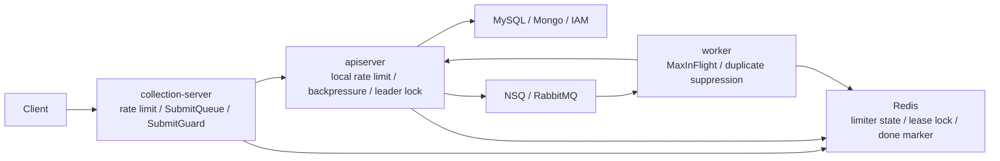

# Resilience Plane 文档中心

**本文回答**：`qs-server` 的限流、队列、背压、Redis lock、幂等、重复抑制和降级应该从哪里开始读；哪些文档是当前真值层；新增高并发治理能力时应该补哪些源码和测试。

## 30 秒结论

| 维度 | 当前答案 |
| ---- | -------- |
| 真值入口 | 代码与配置优先；本文是 Resilience Plane 文档地图 |
| 核心模型 | [`internal/pkg/resilienceplane`](../../../internal/pkg/resilienceplane/) 只定义 outcome vocabulary 和 observer，不实现业务逻辑 |
| 入口保护 | HTTP rate limit + collection `SubmitQueue` |
| 依赖保护 | apiserver MySQL / Mongo / IAM in-flight backpressure，显式注入到 repo/client |
| 重复抑制 | Redis lease primitive + caller-owned `leader/idempotency/duplicate` semantics |
| 降级边界 | collection Redis limiter fail-open；worker duplicate gate degraded-continue |
| 可视化 | Prometheus/Grafana 看趋势；operating 通过三进程只读 status endpoint 看当前摘要 |
| 维护模式 | 新增保护点必须按 `模型 -> contract test -> docs -> hygiene` 闭环维护 |

## 阅读顺序

1. [00-整体架构](./00-整体架构.md)：先建立 Resilience Plane 总图。
2. [01-RateLimit入口限流](./01-RateLimit入口限流.md)：理解本地与 Redis token bucket。
3. [02-SubmitQueue提交削峰](./02-SubmitQueue提交削峰.md)：理解 collection 进程内队列。
4. [03-Backpressure下游背压](./03-Backpressure下游背压.md)：理解 MySQL/Mongo/IAM 并发保护。
5. [04-RedisLock幂等与重复抑制](./04-RedisLock幂等与重复抑制.md)：区分 leader、idempotency、best-effort gate。
6. [05-观测降级与排障](./05-观测降级与排障.md)：按 outcome 排障。
7. [06-新增高并发治理能力SOP](./06-新增高并发治理能力SOP.md)：新增能力的测试与文档清单。
8. [07-能力矩阵](./07-能力矩阵.md)：横向核对每个能力的模型、primitive、outcome 和测试。

## 当前只读入口

| 入口 | 用途 | 行为边界 |
| ---- | ---- | -------- |
| `GET /internal/v1/resilience/status` | apiserver 当前限流、背压、scheduler lock capability snapshot | internal admin 只读；不提供调参或 lock release |
| `GET /governance/resilience` on collection-server | collection rate limit、SubmitQueue、SubmitGuard snapshot | 只读；不提供 queue drain |
| `GET /governance/resilience` on worker metrics server | worker duplicate suppression 与 Redis lock capability snapshot | 只读；不提供 retry 或 skip 修复 |
| Grafana `resilience-*` dashboards | `qs_resilience_*` 时序趋势和告警 | 不直接承载治理动作 |

## 维护模式

Resilience Plane 当前进入稳定维护态。新增或调整保护点时，先判断它属于入口保护、提交削峰、依赖保护、重复抑制还是降级策略，再按 [06-新增高并发治理能力SOP](./06-新增高并发治理能力SOP.md) 补齐模型 / adapter、contract tests、bounded outcome 和文档锚点。

如果能力会改变 HTTP status、`Retry-After`、SubmitQueue 状态、Redis key、LockSpec、component-base primitive 归属或降级语义，必须先单独设计，不要只在局部代码里顺手修改。新增能力最终必须回填 [07-能力矩阵](./07-能力矩阵.md)。

## 主图

## Verify

- `go test ./internal/pkg/resilienceplane ./internal/pkg/middleware ./internal/pkg/backpressure`
- `go test ./internal/pkg/redislock ./internal/pkg/redisplane`
- `go test ./internal/collection-server/application/answersheet ./internal/collection-server/infra/redisops`
- `go test ./internal/worker/handlers ./internal/apiserver/runtime/scheduler`
