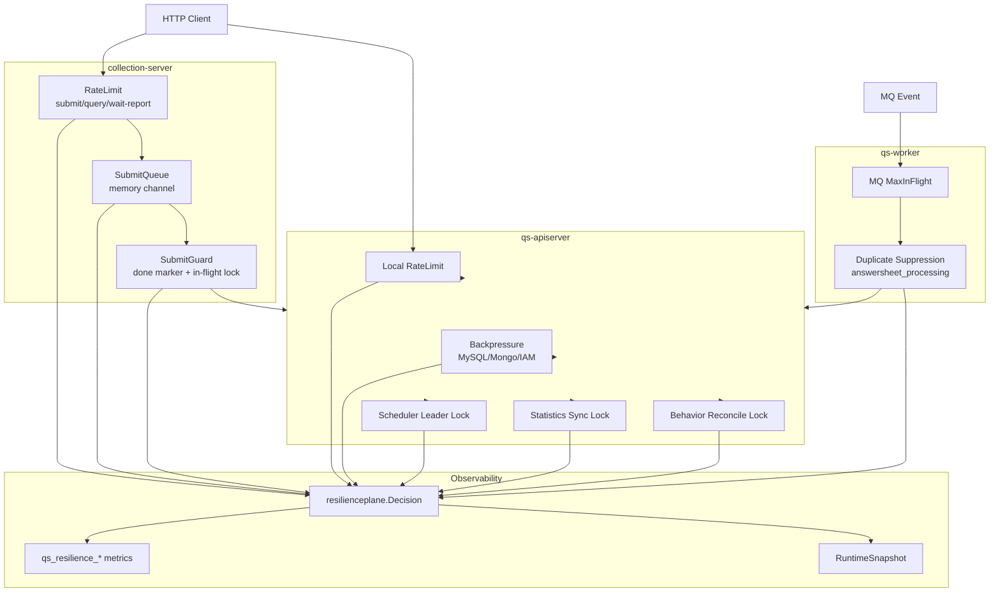

# Resilience Plane 阅读地图

**本文回答**：`resilience/` 子目录这一组文档应该如何阅读；qs-server 的高并发治理能力负责什么、不负责什么；RateLimit、SubmitQueue、Backpressure、LockLease、Idempotency、Duplicate Suppression、Observability、SOP 和能力矩阵分别应该去哪里看。

---

## 30 秒结论

| 维度 | 结论 |
| ---- | ---- |
| 模块定位 | `resilience/` 是 qs-server 的**高并发保护与降级文档组**，解释入口限流、提交削峰、下游背压、锁租约、幂等、重复抑制、观测和排障 |
| 核心模型 | `internal/pkg/resilienceplane` 只定义 ProtectionKind、Outcome、Subject、Observer、RuntimeSnapshot，不实现具体限流/队列/锁/背压 |
| 入口保护 | RateLimit 负责 HTTP 入口 QPS，超限返回 429 + Retry-After |
| 提交削峰 | SubmitQueue 负责 collection-server 进程内答卷提交削峰，返回 202 + request_id |
| 下游保护 | Backpressure 负责 MySQL/Mongo/IAM in-flight protection |
| 短期协调 | LockLease 负责 leader、task serialization、idempotency in-flight、duplicate suppression 的短期租约 primitive |
| 幂等边界 | SubmitGuard 负责 collection 层 done marker + in-flight lock；业务持久化幂等仍由 apiserver durable submit / DB 约束兜底 |
| 观测排障 | 通过 outcome、metrics、RuntimeSnapshot 定位 rate limit、queue、backpressure、lock、idempotency、duplicate suppression |
| 操作边界 | 当前状态入口只读，不提供动态调参、queue drain、lock release、retry、repair |
| 推荐读法 | 先读整体架构，再读 RateLimit / SubmitQueue / Backpressure / LockLease，最后读观测排障、SOP、能力矩阵 |

一句话概括：

> **Resilience Plane 的目标不是让所有请求都成功，而是在高并发下用可解释、可观测、可降级的方式保护系统边界。**

---

## 1. Resilience Plane 负责什么

Resilience Plane 负责 qs-server 的高并发保护能力：

```text
HTTP 入口限流
collection 提交削峰
下游 in-flight 保护
scheduler leader lock
statistics sync lock
collection submit idempotency
worker duplicate suppression
bounded outcome vocabulary
Prometheus metrics
RuntimeSnapshot 只读状态
degraded 策略
```

它要回答：

```text
请求为什么被 429？
队列为什么满？
下游为什么等待槽位超时？
抢不到锁是正常竞争还是异常？
重复提交应该复用结果还是返回进行中？
worker 重复事件为什么被跳过？
Redis 锁异常时为什么有的路径继续，有的路径失败？
metrics 里应该看哪个 outcome？
```

---

## 2. Resilience Plane 不负责什么

| 不属于 Resilience Plane 的内容 | 应归属 |
| ------------------------------ | ------ |
| 业务权限判断 | Security / AuthN / AuthZ |
| 业务主事实持久化 | MySQL / Mongo / Data Access |
| 事件可靠出站 | Event Outbox |
| MQ 消息协议和 Ack/Nack | Event System |
| 缓存预热和 hotset | Redis Governance |
| SQL/Mongo 查询优化 | Data Access / DB tuning |
| 历史数据修复 | Backfill / Repair SOP |
| 动态调参和破坏性治理动作 | 独立运维 SOP |
| exactly-once 保证 | 业务幂等 + DB 约束 + 状态机 |

一句话边界：

```text
Resilience 负责保护边界；
业务模块负责业务正确性；
Data Access 负责持久化事实；
Event System 负责异步可靠出站。
```

---

## 3. 本目录文档地图

```text
resilience/
├── README.md
├── 00-整体架构.md
├── 01-RateLimit入口限流.md
├── 02-SubmitQueue提交削峰.md
├── 03-Backpressure下游背压.md
├── 04-LockLease幂等与重复抑制.md
├── 05-观测降级与排障.md
├── 06-新增高并发治理能力SOP.md
└── 07-能力矩阵.md
```

| 顺序 | 文档 | 先回答什么 |
| ---- | ---- | ---------- |
| 1 | [00-整体架构.md](./00-整体架构.md) | Resilience Plane 总图、三进程职责、ProtectionKind/Outcome/Status 总边界 |
| 2 | [01-RateLimit入口限流.md](./01-RateLimit入口限流.md) | HTTP/local/Redis limiter、429、Retry-After、degraded-open |
| 3 | [02-SubmitQueue提交削峰.md](./02-SubmitQueue提交削峰.md) | collection-server SubmitQueue、bounded channel、worker pool、202 + polling |
| 4 | [03-Backpressure下游背压.md](./03-Backpressure下游背压.md) | MySQL/Mongo/IAM in-flight protection、Acquire/Release/Timeout |
| 5 | [04-LockLease幂等与重复抑制.md](./04-LockLease幂等与重复抑制.md) | locklease、leader、idempotency、duplicate suppression |
| 6 | [05-观测降级与排障.md](./05-观测降级与排障.md) | outcome、metrics、RuntimeSnapshot、degraded 排障 |
| 7 | [06-新增高并发治理能力SOP.md](./06-新增高并发治理能力SOP.md) | 新保护点增加流程、测试矩阵、文档同步 |
| 8 | [07-能力矩阵.md](./07-能力矩阵.md) | 所有保护点横向对比、primitive、失败语义、状态入口 |

---

## 4. 推荐阅读路径

### 4.1 第一次理解 Resilience Plane

按顺序读：

```text
00-整体架构
  -> 01-RateLimit入口限流
  -> 02-SubmitQueue提交削峰
  -> 03-Backpressure下游背压
  -> 04-LockLease幂等与重复抑制
```

读完后应能回答：

1. Resilience Plane 为什么不等于限流？
2. RateLimit 和 Backpressure 的区别是什么？
3. SubmitQueue 为什么不是 MQ？
4. LockLease 为什么不是 exactly-once？
5. Idempotency 和 Duplicate Suppression 有什么区别？
6. Redis 异常时为什么有些地方 degraded-open，有些地方 fail/skip？

### 4.2 要排查线上问题

先读：

```text
05-观测降级与排障
  -> 07-能力矩阵
```

按这条线查：

```text
outcome
  -> protection kind
  -> component/scope/resource/strategy
  -> metrics/status
  -> 对应深讲文档
```

### 4.3 要新增保护能力

先读：

```text
06-新增高并发治理能力SOP
  -> 07-能力矩阵
```

再根据类型跳转：

| 新增类型 | 继续读 |
| -------- | ------ |
| 新入口限流 | [01-RateLimit入口限流.md](./01-RateLimit入口限流.md) |
| 新队列削峰 | [02-SubmitQueue提交削峰.md](./02-SubmitQueue提交削峰.md) |
| 新下游背压 | [03-Backpressure下游背压.md](./03-Backpressure下游背压.md) |
| 新锁/幂等/去重 | [04-LockLease幂等与重复抑制.md](./04-LockLease幂等与重复抑制.md) |
| 新 outcome/metrics/status | [05-观测降级与排障.md](./05-观测降级与排障.md) |

---

## 5. Resilience Plane 主图



---

## 6. 三进程职责

| 进程 | Resilience 职责 | 不承担 |
| ---- | --------------- | ------ |
| collection-server | Redis/local RateLimit、SubmitQueue、SubmitGuard、submit status、resilience status | 不做业务主事实持久化，不做 durable queue |
| qs-apiserver | REST local RateLimit、MySQL/Mongo/IAM Backpressure、scheduler leader、statistics sync lock、behavior reconcile lock | 不做 SubmitQueue，不做 worker MQ 消费 |
| qs-worker | MQ MaxInFlight、answersheet duplicate suppression、worker status/metrics | 不保证 exactly-once，不直接承担主写模型 |

### 6.1 collection-server

核心目标：

```text
把用户入口流量削峰，避免直接打穿 apiserver。
```

### 6.2 qs-apiserver

核心目标：

```text
保护主写模型、数据库、IAM、后台任务和内部一致性边界。
```

### 6.3 qs-worker

核心目标：

```text
控制事件消费并发，并降低重复投递造成的重复副作用。
```

---

## 7. ProtectionKind 快速索引

| Kind | 代表能力 | 常见 outcome |
| ---- | -------- | ------------ |
| `rate_limit` | HTTP limiter | `allowed` / `rate_limited` / `degraded_open` |
| `queue` | SubmitQueue | `queue_accepted` / `queue_full` / `queue_done` / `queue_failed` |
| `backpressure` | MySQL/Mongo/IAM limiter | `backpressure_acquired` / `backpressure_timeout` / `backpressure_released` |
| `lock` | scheduler/statistics lock | `lock_acquired` / `lock_contention` / `lock_error` |
| `idempotency` | SubmitGuard | `idempotency_hit` / `lock_acquired` / `lock_contention` |
| `duplicate_suppression` | worker gate | `duplicate_skipped` / `degraded_open` |

---

## 8. Outcome 快速判断

| Outcome | 说明 | 是否一定是异常 |
| ------- | ---- | -------------- |
| `rate_limited` | 入口被限流 | 否，可能是保护生效 |
| `queue_full` | SubmitQueue 满 | 是高压信号 |
| `backpressure_timeout` | 等下游槽位超时 | 是高压信号 |
| `lock_contention` | 锁被占用 | 不一定，leader 下通常正常 |
| `idempotency_hit` | 命中完成结果 | 通常正常 |
| `duplicate_skipped` | 重复事件被跳过 | 通常正常 |
| `degraded_open` | 保护点异常但放行 | 风险信号，需要关注 |
| `lock_error` | 锁操作失败 | 异常 |
| `queue_failed` | 提交任务失败 | 异常或业务失败 |

---

## 9. Metrics 快速索引

| 指标 | 用途 |
| ---- | ---- |
| `qs_resilience_decision_total` | 所有保护点 outcome counter |
| `qs_resilience_queue_depth` | SubmitQueue 当前 depth |
| `qs_resilience_queue_status_total` | SubmitQueue queued/processing/done/failed 当前数量 |
| `qs_resilience_backpressure_inflight` | MySQL/Mongo/IAM 当前 in-flight |
| `qs_resilience_backpressure_wait_duration_seconds` | 等待下游槽位耗时 |

### 9.1 低基数标签

允许：

```text
component
kind
scope
resource
strategy
outcome
status
```

禁止：

```text
userID
requestID
answerSheetID
assessmentID
lockKey
clientIP
raw URL
raw error
token
```

---

## 10. 状态入口

| 组件 | Endpoint | 展示内容 | 边界 |
| ---- | -------- | -------- | ---- |
| apiserver | `GET /internal/v1/resilience/status` | rate limits、MySQL/Mongo/IAM backpressure、scheduler lock 等 | 只读 |
| collection-server | `GET /governance/resilience` | rate limit、SubmitQueue、SubmitGuard | 只读 |
| worker | `GET /governance/resilience` | duplicate suppression、answersheet processing lock | 只读 |
| Grafana | `resilience-*` dashboards | 历史趋势、告警、P95 | 不执行治理动作 |

当前不提供：

- 动态调参。
- queue drain。
- release lock。
- retry failed submit。
- replay event。
- repair data。

---

## 11. 能力选择速查

| 需求 | 应选 | 不应选 |
| ---- | ---- | ------ |
| 限制接口 QPS | RateLimit | Backpressure |
| 接住答卷提交突发峰值 | SubmitQueue | 只调大 RateLimit |
| 控制 MySQL/Mongo/IAM 并发 | Backpressure | HTTP limiter |
| 多实例只跑一个 scheduler | Leader Lock | SubmitQueue |
| 同 key 提交复用结果 | Idempotency Guard | 只靠 Redis lock |
| MQ 重复事件跳过 | Duplicate Suppression | RateLimit |
| 查看保护状态 | RuntimeSnapshot | 直接查 Redis raw key |
| 需要 durable queue | Event/MQ/DB queue 单独设计 | SubmitQueue |
| 需要业务唯一性 | DB unique / 状态机 / idempotency collection | Redis Lock |

---

## 12. Degraded 速查

| 能力 | Degraded 策略 |
| ---- | ------------- |
| Redis RateLimit | degraded-open，放行 |
| SubmitQueue disabled | 返回错误 |
| SubmitQueue full | 返回 429 |
| Backpressure disabled | no-op，status degraded |
| Backpressure timeout | 返回错误 |
| Leader lock unavailable | runner error 或 skip |
| SubmitGuard done lookup error | 返回错误 |
| SubmitGuard lockMgr nil | degraded-open |
| Worker duplicate gate unavailable | degraded-open，继续处理 |
| Hot status endpoint degraded | 只读展示 |

### 12.1 关键提醒

`degraded_open` 不代表“系统安全”，它代表：

```text
保护点异常，但为了可用性选择放行
```

持续出现必须排查。

---

## 13. 维护原则

### 13.1 先定义语义，再选 primitive

不要先写 Redis lock。先判断：

```text
leader?
idempotency?
duplicate suppression?
task serialization?
```

### 13.2 不把 Resilience 抽成大框架

不同能力的拒绝语义不同，不能用一个抽象吞掉差异。

### 13.3 不用 Redis lock 替代业务幂等

Redis lock 只能降低并发冲突，最终正确性依赖：

- DB unique。
- 状态机。
- idempotency collection。
- durable submit。
- outbox/checkpoint。

### 13.4 状态接口只读

状态接口不提供 release/drain/retry/repair。破坏性动作必须独立设计权限、审计和 SOP。

### 13.5 metrics label 必须低基数

业务 ID 进日志，不进 Prometheus label。

---

## 14. 常见误区

### 14.1 “Resilience 就是限流”

错误。限流只是入口保护，Resilience 还包括队列、背压、锁、幂等、重复抑制和降级。

### 14.2 “SubmitQueue 是 MQ”

不是。它是 collection-server 进程内 memory channel，不 durable、不跨实例、不 drain。

### 14.3 “Backpressure timeout 是 DB timeout”

不是。它是等待槽位超时。

### 14.4 “lock_contention 是故障”

不一定。leader lock contention 是多实例下正常 skip。

### 14.5 “degraded-open 可以忽略”

不能。它表示保护点失效但放行，风险转移给后续链路。

### 14.6 “状态接口可以顺手加调参”

不建议。调参是治理动作，不是只读 status。

---

## 15. 排障入口

| 现象 | 优先文档 |
| ---- | -------- |
| HTTP 429 | [01-RateLimit入口限流.md](./01-RateLimit入口限流.md) |
| POST submit 返回 queue full | [02-SubmitQueue提交削峰.md](./02-SubmitQueue提交削峰.md) |
| submit-status 长期 processing | [02-SubmitQueue提交削峰.md](./02-SubmitQueue提交削峰.md) |
| MySQL/Mongo/IAM timeout | [03-Backpressure下游背压.md](./03-Backpressure下游背压.md) |
| submit already in progress | [04-LockLease幂等与重复抑制.md](./04-LockLease幂等与重复抑制.md) |
| worker duplicate skipped | [04-LockLease幂等与重复抑制.md](./04-LockLease幂等与重复抑制.md) |
| scheduler 不执行 | [04-LockLease幂等与重复抑制.md](./04-LockLease幂等与重复抑制.md) |
| outcome 不知道怎么解释 | [05-观测降级与排障.md](./05-观测降级与排障.md) |
| 要新增保护点 | [06-新增高并发治理能力SOP.md](./06-新增高并发治理能力SOP.md) |
| 横向查保护能力 | [07-能力矩阵.md](./07-能力矩阵.md) |

---

## 16. 代码锚点

### Vocabulary / Status / Metrics

- Resilience model：[../../../internal/pkg/resilienceplane/model.go](../../../internal/pkg/resilienceplane/model.go)
- Resilience status：[../../../internal/pkg/resilienceplane/status.go](../../../internal/pkg/resilienceplane/status.go)
- Resilience metrics：[../../../internal/pkg/resilienceplane/prometheus.go](../../../internal/pkg/resilienceplane/prometheus.go)

### RateLimit

- RateLimit model：[../../../internal/pkg/ratelimit/model.go](../../../internal/pkg/ratelimit/model.go)
- HTTP middleware：[../../../internal/pkg/middleware/limit.go](../../../internal/pkg/middleware/limit.go)
- Redis limiter adapter：[../../../internal/pkg/ratelimit/redisadapter/](../../../internal/pkg/ratelimit/redisadapter/)

### Queue / Backpressure / Lock

- SubmitQueue：[../../../internal/collection-server/application/answersheet/submit_queue.go](../../../internal/collection-server/application/answersheet/submit_queue.go)
- SubmitQueue worker pool：[../../../internal/collection-server/application/answersheet/submit_queue_worker_pool.go](../../../internal/collection-server/application/answersheet/submit_queue_worker_pool.go)
- Backpressure limiter：[../../../internal/pkg/backpressure/limiter.go](../../../internal/pkg/backpressure/limiter.go)
- LockLease：[../../../internal/pkg/locklease/](../../../internal/pkg/locklease/)
- SubmitGuard：[../../../internal/collection-server/infra/redisops/submit_guard.go](../../../internal/collection-server/infra/redisops/submit_guard.go)
- Worker duplicate gate：[../../../internal/worker/handlers/answersheet_handler.go](../../../internal/worker/handlers/answersheet_handler.go)
- Scheduler leader lock：[../../../internal/apiserver/runtime/scheduler/leader_lock.go](../../../internal/apiserver/runtime/scheduler/leader_lock.go)

---

## 17. Verify

Foundation：

```bash
go test ./internal/pkg/resilienceplane
go test ./internal/pkg/middleware
go test ./internal/pkg/backpressure
go test ./internal/pkg/locklease
```

Collection：

```bash
go test ./internal/collection-server/application/answersheet
go test ./internal/collection-server/infra/redisops
go test ./internal/collection-server/transport/rest/handler
```

Apiserver / Worker：

```bash
go test ./internal/apiserver/runtime/scheduler
go test ./internal/apiserver/process
go test ./internal/worker/handlers
```

Docs：

```bash
make docs-hygiene
git diff --check
```

---

## 18. 下一跳

| 目标 | 文档 |
| ---- | ---- |
| 整体架构 | [00-整体架构.md](./00-整体架构.md) |
| RateLimit | [01-RateLimit入口限流.md](./01-RateLimit入口限流.md) |
| SubmitQueue | [02-SubmitQueue提交削峰.md](./02-SubmitQueue提交削峰.md) |
| Backpressure | [03-Backpressure下游背压.md](./03-Backpressure下游背压.md) |
| LockLease / 幂等 / 重复抑制 | [04-LockLease幂等与重复抑制.md](./04-LockLease幂等与重复抑制.md) |
| 观测降级排障 | [05-观测降级与排障.md](./05-观测降级与排障.md) |
| 新增高并发治理能力 | [06-新增高并发治理能力SOP.md](./06-新增高并发治理能力SOP.md) |
| 能力矩阵 | [07-能力矩阵.md](./07-能力矩阵.md) |
| 回到基础设施总入口 | [../README.md](../README.md) |
