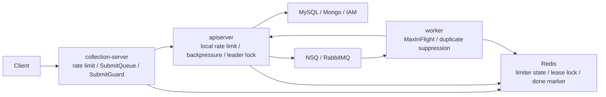

# Resilience Plane 文档中心

**本文回答**：`qs-server` 的限流、队列、背压、Redis lock、幂等、重复抑制和降级应该从哪里开始读；哪些文档是当前真值层；新增高并发治理能力时应该补哪些源码和测试。

## 30 秒结论

| 维度 | 当前答案 |
| ---- | -------- |
| 真值入口 | 代码与配置优先；本文是 Resilience Plane 文档地图 |
| 核心模型 | [`internal/pkg/resilienceplane`](../../../internal/pkg/resilienceplane/) 只定义 outcome vocabulary 和 observer，不实现业务逻辑 |
| 入口保护 | HTTP rate limit + collection `SubmitQueue` |
| 依赖保护 | apiserver MySQL / Mongo / IAM in-flight backpressure |
| 重复抑制 | Redis lease primitive + caller-owned semantics |
| 降级边界 | collection Redis limiter fail-open；worker duplicate gate degraded-continue |

## 阅读顺序

1. [00-整体架构](./00-整体架构.md)：先建立 Resilience Plane 总图。
2. [01-RateLimit入口限流](./01-RateLimit入口限流.md)：理解本地与 Redis token bucket。
3. [02-SubmitQueue提交削峰](./02-SubmitQueue提交削峰.md)：理解 collection 进程内队列。
4. [03-Backpressure下游背压](./03-Backpressure下游背压.md)：理解 MySQL/Mongo/IAM 并发保护。
5. [04-RedisLock幂等与重复抑制](./04-RedisLock幂等与重复抑制.md)：区分 leader、idempotency、best-effort gate。
6. [05-观测降级与排障](./05-观测降级与排障.md)：按 outcome 排障。
7. [06-新增高并发治理能力SOP](./06-新增高并发治理能力SOP.md)：新增能力的测试与文档清单。

## 主图

## Verify

- `go test ./internal/pkg/resilienceplane ./internal/pkg/middleware ./internal/pkg/backpressure`
- `go test ./internal/pkg/redislock ./internal/pkg/redisplane`
- `go test ./internal/collection-server/application/answersheet ./internal/collection-server/infra/redisops`
- `go test ./internal/worker/handlers ./internal/apiserver/runtime/scheduler`
