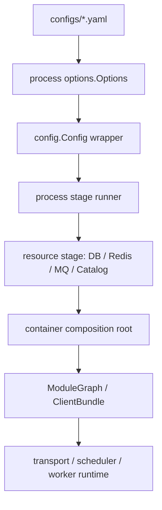
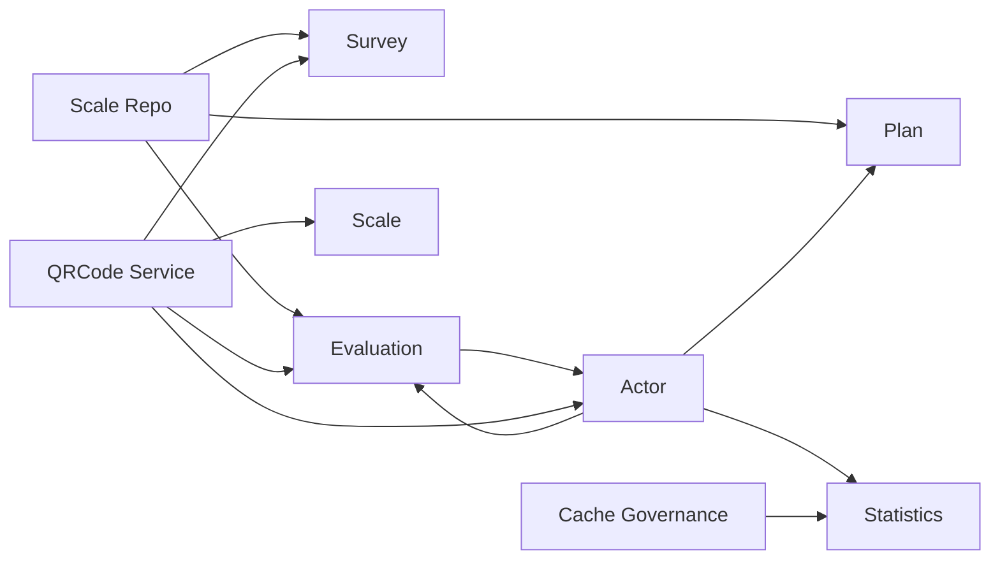
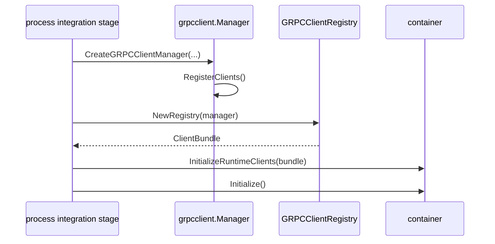
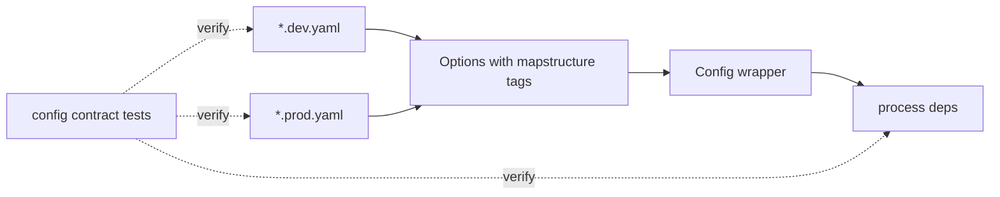

# Composition Graph 与 Config Options

**本文回答**：三进程如何把配置、基础设施、业务模块和 runtime client 组合起来；为什么 apiserver 需要 `ModuleGraph/PostWire`，collection / worker 为什么用 `ClientBundle`，以及新增配置项如何证明已经从 YAML 接到 process deps。

---

## 30 秒结论

`qs-server` 当前把组合职责分成两条线：

| 线 | 解决什么问题 | 当前真值锚点 |
| -- | ------------ | ------------ |
| Composition Graph | 把跨模块依赖从隐式 setter 收口成显式图 | [`module_graph.go`](../../../internal/apiserver/container/module_graph.go)、container architecture tests |
| Config & Options Plane | 证明 `yaml -> Options -> Config -> process deps` 没有断链 | [`internal/pkg/configcontract`](../../../internal/pkg/configcontract) |

外部行为保持不变：启动顺序、REST/gRPC/MQ、Redis family、IAM、Resilience 配置都不因本层重构改变。

---

## 整体图



### 设计意图

- `process` 负责阶段编排：资源、container、integration、transport/runtime。
- `container` 负责组合对象图：业务模块、runtime client、横切能力。
- 业务模块不直接读 YAML，也不直接创建 Redis/MQ/gRPC runtime。
- 配置项只有走到 `process deps` 或 container deps，才算真正接线。

---

## apiserver ModuleGraph

apiserver 的模块数量多，且存在少量天然后置依赖。当前把这类依赖集中到 `ModuleGraph`：



### 当前边界

| 依赖 | 当前处理 |
| ---- | -------- |
| `Actor.TesteeAccess -> Evaluation / Plan / Statistics` | 已迁入 constructor deps |
| `ScaleRepo -> Evaluation / Plan` | 已是 constructor deps |
| `ScaleRepo -> Survey` | 保留 PostWire，因为 Survey 初始化早于 Scale |
| `Evaluation services -> Actor` | 保留 PostWire，因为 Actor 先于 Evaluation 初始化 |
| `QRCode -> 多模块` | 保留 PostWire，因为 QRCode 是 late infra/application capability |
| `CacheGovernance -> Statistics` | 已作为 statistics deps 接入，cache governance binding 仍在 warmup stage |

### 为什么不是全部 constructor 注入

全部 constructor 注入会迫使模块初始化顺序重排，容易引入循环依赖。当前选择是：

- 无循环、无 late infra 的依赖迁入 constructor。
- 仍受初始化顺序约束的依赖集中在 `ModuleGraph`。
- architecture test 禁止新的跨模块 setter 散落回 `bootstrap_*.go`。

---

## collection / worker ClientBundle

collection-server 和 worker 的 setter 不是业务模块依赖，而是 gRPC runtime client 注入。当前统一为 bundle：



这样做的原因：

- container 一次性接收 runtime client graph，避免多个 setter 表达同一个阶段。
- registry 只负责从 manager 取 client，不直接修改 container。
- 后续新增 client 必须更新 bundle、registry、container tests，而不是随手加 setter。

---

## Config & Options Plane



### 当前统一点

| 进程 | Config 形态 |
| ---- | ----------- |
| apiserver | `Config{*options.Options}` |
| collection-server | `Config{*options.Options}` |
| worker | `Config{*options.Options}`，旧 mirror 字段已收口为类型别名兼容 |

### contract tests 覆盖

`internal/pkg/configcontract` 会验证：

- dev/prod YAML 可解析到 Options。
- `Complete()` 与 `Validate()` 链路可执行。
- Redis runtime families 可追踪。
- Event catalog path 可追踪。
- Resilience / IAM / metrics / governance 关键配置存在并保持默认语义。

---

## 维护门禁

新增模块依赖：

1. 优先放进 constructor deps。
2. 如果必须后置注入，只能进入 `ModuleGraph`。
3. 同步更新 composition architecture test allowlist 和 wiring test。

新增 runtime client：

1. 更新对应 `ClientBundle`。
2. 更新 registry 的 bundle 构造。
3. 不新增 per-client setter。

新增配置项：

1. 增加 Options 字段和 yaml 示例。
2. 证明 Config wrapper 能携带该字段。
3. 在 process/container deps 中接线。
4. 更新 config contract tests 与本文档。

---

## 代码与测试锚点

| 能力 | 锚点 |
| ---- | ---- |
| apiserver ModuleGraph | [`internal/apiserver/container/module_graph.go`](../../../internal/apiserver/container/module_graph.go) |
| apiserver setter architecture test | [`internal/apiserver/container/composition_architecture_test.go`](../../../internal/apiserver/container/composition_architecture_test.go) |
| collection ClientBundle | [`internal/collection-server/container/container.go`](../../../internal/collection-server/container/container.go) |
| worker ClientBundle | [`internal/worker/container/container.go`](../../../internal/worker/container/container.go) |
| 三进程 config contract | [`internal/pkg/configcontract/config_contract_test.go`](../../../internal/pkg/configcontract/config_contract_test.go) |

Verify：

```bash
GOTOOLCHAIN=local /Users/yangshujie/.gvm/gos/go1.25.9/bin/go test ./internal/apiserver/container ./internal/collection-server/container ./internal/worker/container ./internal/pkg/configcontract
```

