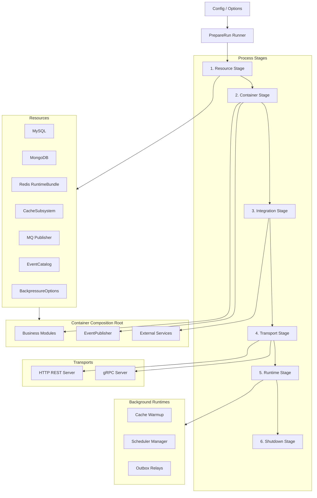

# Runtime Composition Plane 整体架构

**本文回答**：qs-server 的基础设施 runtime composition 如何从配置进入启动阶段，如何初始化 DB / Redis / MQ / EventCatalog / Backpressure，如何创建 Container、外部集成、HTTP/gRPC transports、后台 runtime，最后如何注册关闭逻辑。

---

## 30 秒结论

| 阶段 | 负责 |
| ---- | ---- |
| Config / Options | 把 YAML/flags/options 转成进程 config |
| Resource Stage | 初始化 MySQL/Mongo、Redis runtime、CacheSubsystem、MQ publisher、EventCatalog、Backpressure、ContainerOptions |
| Container Stage | 创建 Container，注入 IAMModule，初始化业务模块和基础设施服务 |
| Integration Stage | 初始化 WeChat/OSS/Notification 等外部集成，启动 IAM authz version sync |
| Transport Stage | 构建 HTTP/gRPC server，注册 REST routes 和 gRPC services |
| Runtime Stage | 启动 cache warmup、scheduler manager、outbox relay loop |
| Shutdown Stage | 注册 shutdown callback，统一关闭 runtime hooks、container、subscriber、DB、HTTP、gRPC |

一句话概括：

> **Runtime Composition Plane 是进程内的组合根流水线，把“配置”和“资源”转成可运行的 HTTP/gRPC 服务与后台任务。**

---

## 1. 总图



---

## 2. 核心分层

| 层 | 代表代码 | 说明 |
| -- | -------- | ---- |
| Process | `internal/apiserver/process` | stage pipeline、resource bootstrap、transport bootstrap、runtime bootstrap、lifecycle |
| Container | `internal/apiserver/container` | composition root，负责模块装配与依赖持有 |
| Assembler | `internal/apiserver/container/assembler` | 各业务模块构造 |
| Transport | `internal/apiserver/transport/rest` / `grpc` | 接收 Container deps 并注册路由/服务 |
| Runtime Subsystems | Redis/Event/Resilience/Security/Integrations | 各子系统自己的组合根或 adapter |

---

## 3. Runtime 不深讲的内容

Runtime 文档只解释“如何装配”，不重复每个子系统内部设计。

| 子系统 | 深讲入口 |
| ------ | -------- |
| Redis RuntimeBundle / CacheSubsystem | `../redis/` |
| EventCatalog / Publisher / Outbox | `../event/` |
| Backpressure / Lock / Queue | `../resilience/` |
| AuthzSnapshot / ServiceIdentity | `../security/` |
| WeChat / OSS / Notification | `../integrations/` |
| MySQL/Mongo repository | `../data-access/` |

---

## 4. 核心数据流

```text
configs/*.yaml / flags
  -> options.Options
  -> config.Config
  -> process.resourceStageDeps
  -> resourceOutput
  -> container.ContainerOptions
  -> container.Container
  -> RESTDeps / GRPCDeps / ServerRuntimeDeps
  -> HTTP/gRPC/background runtime
```

---

## 5. 设计原则

1. **启动阶段要可定位失败点**：stage 有 Name，prepare 失败时输出 failedStage。
2. **资源准备与模块构造分离**：DB/Redis/MQ 在 Resource Stage，业务模块在 Container Stage。
3. **Container 只做组合根**：不承载业务规则。
4. **外部客户端独立 integration stage**：WeChat/OSS/authz sync 等在 Container 初始化后装配。
5. **Transport 只注册接口**：不创建业务依赖。
6. **后台任务必须可关闭**：scheduler/relay loop 需要 shutdown hook。
7. **post-wire 不是万能补丁**：构造函数依赖仍是默认优先。

---

## 6. 当前主实现事实

apiserver `PrepareRun` 通过 `processruntime.Runner` 执行六个 stage：

```text
prepare resources
initialize container
initialize integrations
initialize transports
start background runtimes
register shutdown callback
```

最终构造 `preparedServer`，其中持有：

- startShutdown。
- httpServer。
- grpcServer。

Run 阶段再用 RunGroup 同时运行 HTTP 和 gRPC。

---

## 7. 设计取舍

| 设计 | 收益 | 代价 |
| ---- | ---- | ---- |
| stage pipeline | 启动顺序清楚，可测试 | 文件较多 |
| resource/container 分离 | 资源与业务模块边界清楚 | ContainerOptions 要显式传递 |
| integration stage 单独存在 | 外部集成不污染 container 初始化 | 需要理解 stage 顺序 |
| runtime stage 异步 warmup | 不阻断服务启动 | warmup 失败只 warning |
| shutdown callback 汇总 | 关闭顺序集中 | 需要每个 runtime 注册 hook |
| post-wire seam 保留 | 解决少数 late-bound 依赖 | 易被滥用，需文档约束 |

---

## 8. 常见误区

### 8.1 “runtime 目录讲三进程协作”

不是。三进程业务协作在 `01-运行时/`，这里讲进程内部装配。

### 8.2 “Container 是服务定位器，哪里都能拿依赖”

不应这样用。Container 是 composition root，不应该泄漏到 domain/application 内部。

### 8.3 “post-wire 可以解决所有依赖循环”

不应该。大多数依赖应构造期注入；post-wire 是少数 late-bound seam。

### 8.4 “资源不可用就一定启动失败”

不一定。MQ publisher 创建失败会 fallback logging mode；Redis cache unavailable 可能 degraded；DB 初始化失败通常失败。

---

## 9. 排障入口

| 现象 | 优先看 |
| ---- | ------ |
| 启动失败并打印 stage | 对应 ProcessStage 文档 |
| DB 初始化失败 | ResourceBootstrap |
| Redis runtime degraded | Redis runtime 文档 |
| MQ publisher fallback | ResourceBootstrap / Event |
| REST route 缺失 | TransportStage / Container RESTDeps |
| gRPC 服务缺失 | TransportStage / Container GRPCDeps |
| 后台任务没启动 | RuntimeStage |
| 关闭不干净 | Lifecycle |

---

## 10. 代码锚点

- Prepare runner：[../../../internal/apiserver/process/runner.go](../../../internal/apiserver/process/runner.go)
- Resource bootstrap：[../../../internal/apiserver/process/resource_bootstrap.go](../../../internal/apiserver/process/resource_bootstrap.go)
- Container bootstrap：[../../../internal/apiserver/process/container_bootstrap.go](../../../internal/apiserver/process/container_bootstrap.go)
- Transport bootstrap：[../../../internal/apiserver/process/transport_bootstrap.go](../../../internal/apiserver/process/transport_bootstrap.go)
- Runtime bootstrap：[../../../internal/apiserver/process/runtime_bootstrap.go](../../../internal/apiserver/process/runtime_bootstrap.go)
- Lifecycle：[../../../internal/apiserver/process/lifecycle.go](../../../internal/apiserver/process/lifecycle.go)
- Container root：[../../../internal/apiserver/container/root.go](../../../internal/apiserver/container/root.go)

---

## 11. Verify

```bash
go test ./internal/apiserver/process
go test ./internal/apiserver/container
```
