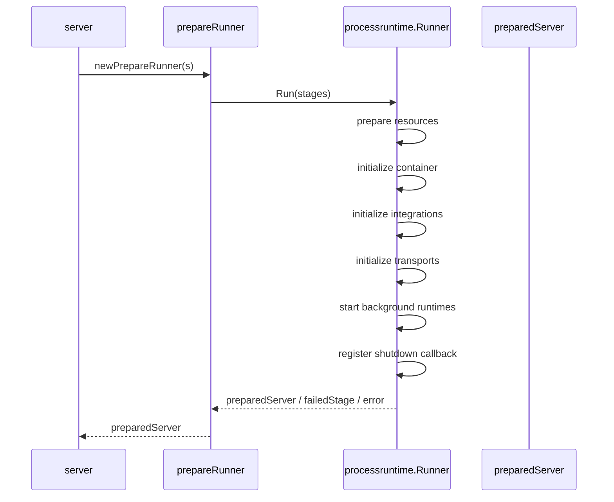

# ProcessStage 与启动流水线

**本文回答**：apiserver `PrepareRun` 如何按 stage 准备进程运行；每个 stage 的输入输出是什么；失败时如何定位；`preparedServer` 如何最终同时启动 HTTP 和 gRPC。

---

## 30 秒结论

| Stage | Name | 输出 |
| ----- | ---- | ---- |
| resourceStage | `prepare resources` | `resourceOutput`：DB/Redis/cache/MQ/EventCatalog/ContainerOptions |
| containerStage | `initialize container` | `containerOutput`：Container |
| integrationStage | `initialize integrations` | `integrationOutput`：authz version subscriber 等 |
| transportStage | `initialize transports` | `transportOutput`：HTTP server、gRPC server |
| runtimeStage | `start background runtimes` | `runtimeOutput`：scheduler/relay lifecycle hooks |
| shutdownStage | `register shutdown callback` | 注册全局 shutdown callback |

一句话概括：

> **ProcessStage 把复杂启动过程拆成可命名、可测试、可失败定位的流水线。**

---

## 1. PrepareRun 主流程



---

## 2. prepareState

`prepareState` 聚合每个阶段的输出：

| 字段 | 说明 |
| ---- | ---- |
| resources | resource stage 输出 |
| container | container stage 输出 |
| integration | integration stage 输出 |
| transport | transport stage 输出 |
| runtime | runtime stage 输出 |

stage 间只通过 state 传递，不通过包级全局变量。

---

## 3. Stage 列表

`newPrepareRunner` 固定 stage 顺序：

```go
resourceStage
containerStage
integrationStage
transportStage
runtimeStage
shutdownStage
```

这个顺序不能随意调整。

原因：

- container 需要 resources。
- integrations 需要 container。
- transport 需要 container deps。
- runtime 需要 resources/container。
- shutdown 需要收集所有前面阶段的生命周期对象。

---

## 4. Resource Stage

Name：

```text
prepare resources
```

动作：

```text
prepareResources(s.server.buildResourceStageDeps())
```

负责：

- 初始化数据库。
- 构建 Redis runtime。
- 构建 CacheSubsystem。
- 创建 MQ publisher。
- 加载 EventCatalog。
- 构建 BackpressureOptions。
- 构建 ContainerOptions。

失败时通常是 DB、event catalog 或资源配置问题。

---

## 5. Container Stage

Name：

```text
initialize container
```

动作：

```text
s.server.initializeContainer(state.resources)
```

负责：

- 创建 Container。
- 创建 IAMModule。
- 调 Container.Initialize。
- 初始化业务模块。

失败时通常是 IAM module、module constructor 或 repository/module wiring 问题。

---

## 6. Integration Stage

Name：

```text
initialize integrations
```

动作：

```text
s.server.initializeIntegrations(state.container)
```

负责：

- 初始化 WeChat / QRCode / Notification 等集成服务。
- 启动 IAM authz version sync subscriber。

失败时通常是外部集成初始化问题；authz sync subscriber 创建失败当前以 warning 降级为 nil。

---

## 7. Transport Stage

Name：

```text
initialize transports
```

动作：

```text
s.server.initializeTransports(state.container)
```

负责：

- 构建 HTTP GenericAPIServer。
- 构建 gRPC Server。
- 注册 REST routes。
- 注册 gRPC services。

失败时通常是 serving config、gRPC config、route/service registration 问题。

---

## 8. Runtime Stage

Name：

```text
start background runtimes
```

动作：

```text
runRuntimeStage(...)
```

负责：

- 打印架构初始化日志。
- 异步启动 cache warmup。
- 启动 scheduler manager。
- 启动 outbox relay loop。
- 将后台 runtime 的 stop hook 放入 runtime lifecycle。

注意：runtimeStage 当前 `Run` 返回 nil，不把 warmup/relay 运行期错误提升为 PrepareRun 失败。

---

## 9. Shutdown Stage

Name：

```text
register shutdown callback
```

动作：

```text
registerShutdownCallback(buildLifecycleDeps(...))
```

负责把所有生命周期对象收集成 `processLifecycleDeps`，并注册到 graceful shutdown manager。

---

## 10. preparedServer

PrepareRun 成功后构造：

| 字段 | 来源 |
| ---- | ---- |
| startShutdown | `server.gs.Start` |
| httpServer | `state.transport.httpServer` |
| grpcServer | `state.transport.grpcServer` |

Run 时：

1. 启动 shutdown manager。
2. 通过 `processruntime.RunGroup` 同时运行 HTTP 和 gRPC。
3. 任一服务返回错误则 RunGroup 返回错误。

---

## 11. 失败定位

`processruntime.Runner` 会返回 failedStage。

`PrepareRun` 失败时调用：

```text
fatalPrepareRun(failedStage, err)
```

日志包含：

- component=apiserver。
- action=failedStage。
- error。

这使启动失败可以直接定位到 stage。

---

## 12. 设计原则

1. stage Name 必须稳定可读。
2. stage 之间通过 state 传递。
3. 启动顺序必须符合依赖方向。
4. stage 内部可继续拆 deps struct，方便测试。
5. 运行期后台任务错误不要混入启动阶段，除非确实应阻断启动。
6. 新增 stage 必须说明输入、输出、失败语义和 shutdown 关系。

---

## 13. 常见误区

### 13.1 “PrepareRun 会启动 HTTP/gRPC”

不会。PrepareRun 只是准备 preparedServer；真正启动在 `preparedServer.Run()`。

### 13.2 “runtimeStage 失败会阻断启动”

当前 runtimeStage 本身返回 nil。warmup/relay 等后台错误主要记录日志。

### 13.3 “integrationStage 应该在 containerStage 前”

不应。很多 integration 依赖 container 输出的模块/服务。

### 13.4 “shutdownStage 会立即关闭资源”

不会。它只注册 callback，真正关闭发生在进程收到 shutdown 时。

---

## 14. 修改指南

### 14.1 新增 Stage

必须：

1. 定义 stage struct。
2. 实现 Name。
3. 实现 Run。
4. 明确输入 state。
5. 明确输出 state。
6. 插入正确顺序。
7. 补 runner tests。
8. 更新文档。

### 14.2 修改 Stage 顺序

必须重新检查：

- resources 是否已准备。
- container 是否已初始化。
- integrations 是否依赖 container。
- transports 是否依赖 container deps。
- runtime 是否依赖 transport。
- shutdown 是否能收集全部 lifecycle。

---

## 15. Verify

```bash
go test ./internal/apiserver/process
```
