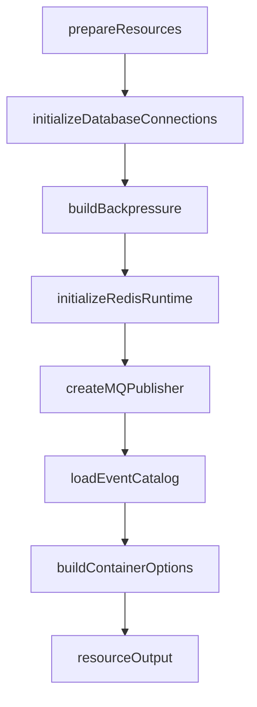

# ResourceBootstrap 资源装配

**本文回答**：Resource Stage 如何初始化 MySQL、Mongo、Redis RuntimeBundle、CacheSubsystem、MQ Publisher、EventCatalog、Backpressure，并生成 ContainerOptions；哪些资源启动失败会中断启动，哪些会降级。

---

## 30 秒结论

| 资源 | 装配点 | 失败语义 |
| ---- | ------ | -------- |
| MySQL/Mongo | DatabaseManager.Initialize / GetMySQLDB / GetMongoDB | 初始化失败会导致 Resource Stage 失败 |
| Redis cache client | DatabaseManager.GetRedisClient | 获取失败记录 warning，redisCache 可为 nil |
| Redis RuntimeBundle | cacheplane bootstrap BuildRuntime | 生成 family handles、status、lock manager |
| CacheSubsystem | cachebootstrap.NewSubsystemFromRuntime | apiserver cache/governance 组合根 |
| MQ Publisher | MessagingOptions.NewPublisher | 失败 warning，fallback logging mode |
| EventCatalog | `configs/events.yaml` | 加载失败会导致 Resource Stage 失败 |
| BackpressureOptions | config.Backpressure | MySQL/Mongo/IAM limiter 显式传入 Container |
| ContainerOptions | buildContainerOptions | 将资源输出转换为 Container 输入 |

一句话概括：

> **ResourceBootstrap 是基础设施资源到 ContainerOptions 的转换层，负责把外部资源准备好，但不初始化业务模块。**

---

## 1. Resource Stage 输入输出

输入：

```text
resourceStageDeps
```

输出：

```text
resourceOutput
```

主要包含：

- resourceHandles。
- messagingOutput。
- cacheRuntimeOutput。
- containerBootstrapInput。

---

## 2. 装配流程



---

## 3. Database 初始化

`initializeDatabaseConnections`：

1. 如果 initialize nil，返回 nil。
2. 调 `dbManager.Initialize()`。
3. 调 `getMySQL()`。
4. 调 `getMongo()`。
5. 返回 mysqlDB / mongoDB。

数据库初始化失败会直接返回 error，导致 PrepareRun 在 `prepare resources` 失败。

---

## 4. Redis Runtime 装配

`buildRedisRuntimeDeps` 提供：

| 依赖 | 说明 |
| ---- | ---- |
| getClient | 取 Redis client |
| buildRuntime | 构建 cacheplane RuntimeBundle |
| buildSubsystem | 基于 RuntimeBundle 构建 CacheSubsystem |

### 4.1 BuildRuntime

参数：

```text
Component=apiserver
RuntimeOptions=config.RedisRuntime
Resolver=dbManager
LockName=lock_lease
```

这会构建：

- Runtime。
- family handles。
- FamilyStatusRegistry。
- LockManager。

### 4.2 CacheSubsystem

`cachebootstrap.NewSubsystemFromRuntime(runtimeBundle, cacheOptions)` 生成 cache subsystem，供 Container 使用。

### 4.3 Redis client 获取失败

如果 `GetRedisClient` 返回错误：

- 记录 warning：Cache Redis not available。
- redisCache 可能为 nil。
- 后续 Redis runtime/family status 负责表达 degraded。

---

## 5. MQ Publisher 装配

`buildMQPublisherDeps` 从 MessagingOptions 读取：

- enabled。
- provider。
- newPublisher。
- fallbackMode。

`createMQPublisher`：

| 情况 | 行为 |
| ---- | ---- |
| messaging disabled | 返回 nil + fallback mode |
| newPublisher nil | 返回 nil + fallback mode |
| newPublisher error | warning，返回 nil + fallback mode |
| success | 返回 publisher + `PublishModeMQ` |

这说明 MQ publisher 创建失败不一定阻断启动，而是 fallback 到 logging mode。

---

## 6. EventCatalog 装配

默认加载：

```text
configs/events.yaml
```

流程：

```text
eventcatalog.Load
  -> eventcatalog.NewCatalog
```

EventCatalog 加载失败会导致 Resource Stage 失败。

原因：

- 事件契约 catalog 被 publisher/outbox topic resolver 共享。
- 如果契约不可加载，事件路径语义不确定。

---

## 7. BackpressureOptions 装配

`buildBackpressureOptions` 根据 config.Backpressure 构建：

| 依赖 | Limiter |
| ---- | ------- |
| MySQL | `newDependencyBackpressureLimiter("mysql", ...)` |
| Mongo | `newDependencyBackpressureLimiter("mongo", ...)` |
| IAM | `newDependencyBackpressureLimiter("iam", ...)` |

最终进入：

```go
container.BackpressureOptions{
  MySQL,
  Mongo,
  IAM,
}
```

这些 limiter 会显式注入 repository/client，不使用包级全局变量。

---

## 8. ContainerOptions 构建

`buildContainerOptions` 将资源输出转换为 ContainerOptions：

| 字段 | 来源 |
| ---- | ---- |
| MQPublisher | mqPublisher |
| PublisherMode | publishMode |
| EventCatalog | eventCatalog |
| Cache | buildContainerCacheOptions |
| CacheSubsystem | cacheSubsystem |
| Backpressure | backpressureOptions |
| PlanEntryBaseURL | config.Plan.EntryBaseURL |
| StatisticsRepairWindowDays | config.StatisticsSync.RepairWindowDays |

---

## 9. 降级与失败语义

| 资源 | 失败是否阻断启动 | 说明 |
| ---- | ---------------- | ---- |
| DB Initialize | 是 | 主数据存储不可用 |
| MySQL/Mongo get | 是 | container 需要 DB |
| Redis client get | 否，warning | cache/lock 可 degraded |
| Redis RuntimeBundle | 通常不直接阻断 | family status 表达 |
| MQ Publisher | 否，fallback logging | 事件可 logging/nop |
| EventCatalog | 是 | 事件契约不可用 |
| Backpressure | 否 | 未配置则 nil/no-op |
| CacheSubsystem | 通常不阻断 | cache 可 disabled/degraded |

---

## 10. 常见误区

### 10.1 “ResourceBootstrap 会初始化业务模块”

不会。业务模块在 Container Stage 初始化。

### 10.2 “Redis 不可用就一定启动失败”

不一定。Redis cache client 获取失败只 warning，具体能力 degraded。

### 10.3 “MQ publisher 创建失败会阻断启动”

当前不会，fallback 到 publishModeFromEnv 的 logging/nop 等模式。

### 10.4 “Backpressure 是全局开关”

不是。MySQL/Mongo/IAM 分别构建 limiter。

---

## 11. 修改指南

### 11.1 新增资源

必须：

1. 扩展 resourceStageDeps。
2. 在 buildResourceStageDeps 构造依赖。
3. 在 prepareResources 中装配。
4. 明确失败是否阻断启动。
5. 如果传入 container，扩展 ContainerOptions。
6. 补 process tests。
7. 更新文档。

### 11.2 新增 fallback 行为

必须写清：

- 何时 fallback。
- fallback 到什么模式。
- 是否可观测。
- 是否需要告警。
- 是否影响业务正确性。

---

## 12. Verify

```bash
go test ./internal/apiserver/process
```
